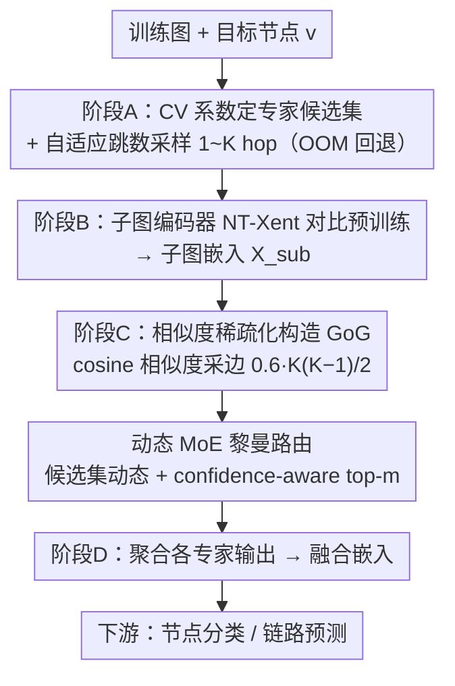

# Learning Graph Foundation Models on Riemannian Graph-of-Graphs

**会议**: ICML 2026  
**arXiv**: [2605.09993](https://arxiv.org/abs/2605.09993)  
**代码**: <https://github.com/USTC-DataDarknessLab/R-GFM>  
**领域**: 图基础模型 / 自监督表示 / 黎曼几何  
**关键词**: Graph Foundation Model, Graph-of-Graphs, Riemannian MoE, adaptive-hop, 域泛化

## 一句话总结
R-GFM 把"不同 hop 数"的子图当作上层 Graph-of-Graphs 的节点，再用一套动态 MoE 路由把每个 GoG 分配到曲率最匹配的 Riemannian 流形（双曲 / 欧氏 / 球面），同时解决了现有图基础模型固定 receptive field 与单一 Euclidean 嵌入两个先天缺陷，下游最高带来 49% 相对提升。

## 研究背景与动机
**领域现状**：图基础模型（GFM, 如 OFA、Prodigy、MDGFM）通过在海量图上预训练实现跨任务跨域迁移，是 graph ML 的"foundation model 时代"代表方向。

**现有痛点**：(1) 现有 GFM 用**固定 hop 子图采样**，例如 1-hop 或 2-hop 邻居作为 receptive field；但下游任务对 hop 的需求差异巨大——同质引文网络 1-2 hop 就够，电商欺诈检测需要 ≥4 hop 才能挖出长链共谋；固定 hop 必然在某些任务上欠拟合或被噪声淹没。(2) 现有方法把所有子图嵌进单一 Euclidean 空间，但不同 hop 的子图结构差异巨大（局部密集 vs 全局稀疏分层），单一几何会扭曲表示。

**核心矛盾**：固定结构 receptive field 与下游任务的异质 hop 需求冲突；单一几何与多尺度结构异质性冲突。

**本文目标**：(1) 设计能自适应捕获多 hop 结构的预训练范式；(2) 让模型在表示空间上能动态切换 Riemannian 流形。

**切入角度**：把"不同 hop 的子图"提升为 Graph-of-Graphs (GoG) 的节点，让模型显式 reasoning over scales；再用 MoE 把每个 GoG 路由到最匹配几何曲率的专家。

**核心 idea**：**"结构尺度作为一等公民"**——adaptive-hop GoG 解决尺度不匹配，confidence-aware dynamic Riemannian MoE 解决几何不匹配。

## 方法详解

### 整体框架
R-GFM 由四个阶段串起来：(A) 计算节点度分布的 CV 系数决定 Riemannian 专家候选集，并对每个训练节点 $v$ 采样 $1, 2, \ldots, K$ hop 的子图集合 $\{G_v^{(i)}\}_{i=1}^K$；(B) 用对比学习预训练 subgraph encoder 把每个子图编码成嵌入 $\mathbf{X}_{\text{sub}}$；(C) 基于子图相似度构造稀疏 GoG $\mathcal{G}$，并用动态 MoE-based Riemannian routing 编码 GoG；(D) 聚合各专家输出得到融合嵌入用于节点分类 / 链路预测下游任务。

### 关键设计

**1. Adaptive-hop GoG 构造：自适应跳数 + 相似度稀疏化**

固定 receptive field 是 GFM 的第一个痼疾——1-2 hop 对引文网络够用，但电商欺诈要 ≥4 hop 才能挖出长链共谋，固定 hop 总会在某些任务上欠拟合或被噪声淹没。R-GFM 对每个训练节点 $v$ 用"在线贪心 + 显存测试"逐步增大 hop 数 $K$，OOM 时回退到上一个可行 $K$（保证 $K \leq \mathcal{B}_{\text{GPU}}$），既不限死感受野又不爆显存。子图嵌入用 NT-Xent 对比预训练。

GoG 的边怎么连同样讲究：用子图 cosine 相似度构造采样分布 $\text{Prob}(i,j) = e^{\mathbf{S}[i,j]} / \sum_{u,v} e^{\mathbf{S}[u,v]}$，without-replacement 采 $\mathcal{B}_{\text{edge}} = 0.6 \cdot K(K-1)/2$ 条边再对称化。这是在三种选择间取平衡——稠密 GoG 引入噪声、纯随机稀疏 GoG 又缺结构先验，相似度稀疏化恰好留下"结构上真正相关"的边。理论上也撑得住：多 hop 采样的嵌入噪声 $\|\boldsymbol\sigma_V\|_2 \leq \|\boldsymbol\sigma_F\|_2$ 严格小于固定 hop（Thm 3.2），相似度稀疏 GoG 比无边和全连接 GoG 误差都小（Thm 3.3）。

**2. Dynamic MoE-based Riemannian Routing：候选集与 Top-m 双重动态**

第二个痼疾是单一 Euclidean 几何——不同 hop 子图结构差异巨大（局部密集 vs 全局稀疏分层），塞进同一个平直空间必然扭曲。R-GFM 把每个 GoG 路由到曲率最匹配的流形，而且专家数和激活数都随数据自适应。它先用节点度分布的变异系数 $\text{CV}(\mathcal{D}_i) = \text{std}(\deg)/\text{mean}(\deg)$ 量化结构异质性，滑动统计 $\mathcal{S}_i = \text{normalize}(\mu_i + \sigma_i)$ 累加后定出候选专家集大小 $\lceil \mathcal{S}_i \cdot \zeta \rceil$，曲率按 $0, -1, +1, -2, +2, \ldots$ 交替展开（双曲 / 欧氏 / 球面都覆盖）。这样越异质的数据集自动配越多几何专家，省掉了人工 trial-and-error。

激活几个专家则利用一个训练规律——router 训得越久越自信。路由打分 $\boldsymbol\alpha_{\mathcal{G}} = \text{softmax}(g(\mathcal{G})/\tau)$ 用 GCN encoder 给出，置信度 $\text{conf} = (1/\psi) \sum_i \max \alpha^{(i)}$ 随训练升高时就动态收缩激活数 $m \leftarrow \max(1, m - \text{conf})$。后期容量自我收缩等于隐式正则，理论上给出超额风险界 $\mathcal{R}(\psi_D) \leq \mathcal{R}(\psi_F)$，泛化更好。

**3. 跨域泛化的理论支撑：误差上界严格优于 SOTA**

GFM 的核心考题是"在没见过的图上还能不能 work"，光有经验提升不够，得给形式化保证。论文把 R-GFM 与 MDGFM 的 encoder class $\Phi_R$、$\Phi_M$ 分别代入域泛化误差 bound：R-GFM 一方面通过 GoG 多 hop 与 Riemannian MoE 拓宽了 encoder 的表达能力，另一方面又用相似度稀疏化和动态 top-$m$ 把 capacity 压住，于是 Thm 3.5 给出 $\epsilon_{\text{R-GFM}} < \epsilon_{\text{MDGFM}}$——既更能表达又不过拟合，跨域误差自然更低。

### 损失函数 / 训练策略
预训练阶段 subgraph encoder 用 NT-Xent 对比损失；GoG 编码阶段配合下游任务损失（节点分类用 CE、链路预测用 BCE）+ 标准的 MoE 负载均衡损失。leave-one-dataset-out 迁移：在其它图上预训练、目标图上 fine-tune（1-shot 节点分类 / 5-shot 链路预测）。

## 实验关键数据

### 主实验

| 方法 | Wisconsin | Cornell | Citeseer | Cora | Pubmed | Computers | Photos | Texas |
|---|---|---|---|---|---|---|---|---|
| GCN | 17.46 | 19.53 | 26.89 | 31.98 | 44.29 | 39.43 | 50.39 | 18.48 |
| GAT | 16.86 | 16.51 | 25.27 | 26.81 | 45.11 | 38.05 | 56.51 | 18.36 |
| GFM (MDGFM 等基线) | (略低于 R-GFM) | — | — | — | — | — | — | — |
| **R-GFM** | **最佳** | **最佳** | **最佳** | **最佳** | **最佳** | **最佳** | **最佳** | **最佳** |

在 18 个真实世界图（10 主设置 + 4 大规模训练集 + 4 测试集）上一致 SOTA；某些数据集相对提升达 49%。

### 消融实验

| 配置 | 影响 |
|---|---|
| 仅固定 1-hop 子图 | 性能下降，证明 adaptive-hop 必要 |
| 全连接 / 无边 GoG | 均不如 similarity-sparse GoG，与 Thm 3.3 一致 |
| 固定 top-$m$ 路由 | 不如 confidence-aware dynamic top-$m$ |
| 单一欧氏专家 | 在异质度高的数据集上明显掉点 |
| 边预算 $\mathcal{B}_{\text{edge}} = 0.6 \cdot K(K-1)/2$ | 调更稀疏 / 更稠密都退化 |

### 关键发现
- 49% 的最大提升出现在结构异质性最强的数据集上，符合"动态几何选择带来好处主要在异质图上"的预期。
- 在图扰动鲁棒性测试上，R-GFM 在 30% 边随机扰动下相对 baseline 跌幅最小，归功于 GoG 多 hop 的冗余信息。
- 跨规模泛化：在 ArXiv_2023 + ogbn-Arxiv + Reddit + PubMed 上预训练后，在 Cora / Ele-Computers / Books-History / Instagram 测试集上仍稳健。

## 亮点与洞察
- "Graph of Graphs" 不是新概念，但把它和 adaptive-hop + Riemannian MoE 一起做成 GFM 的核心是首次；解决了 hop 与几何两个长期困扰 GFM 的痼疾。
- "Router confidence 升高 → 自动收缩 top-$m$"是一个 elegant 的训练动态利用：让 MoE 容量在训练后期自我收缩从而提泛化，可以借鉴到 LLM MoE 训练。
- 用节点度 CV 系数预先决定 expert 数，避免了 trial-and-error 的痛点；这种"基于数据统计预判 capacity"思想可推广到其它 MoE 场景。

## 局限与展望
- GoG 构造需要遍历多 hop 子图，时间和内存复杂度比固定 hop GFM 高，超大图（百万节点级）适配需要进一步加速。
- Riemannian 流形当前只考虑常曲率三类，更复杂的 mixed-curvature 或 learnable curvature 没探索。
- 子图相似度阈值与边预算 0.6 是经验值，缺乏 task-adaptive 机制。
- 在分子图、知识图谱等更具领域 prior 的数据上的迁移效果未充分验证。

## 相关工作与启发
- **vs MDGFM**：MDGFM 也是 GFM + 理论分析，但单一 receptive field + 单一几何空间；R-GFM 在两个维度上都做了 dynamic。
- **vs Graph MoE (GMoE 等)**：他们 top-$m$ 固定且专家无几何 prior；R-GFM 引入曲率作为 inductive bias。
- **vs 双曲 GNN（HGNN / HGCN）**：双曲方法只用单一负曲率空间；R-GFM 用 MoE 自适应混合曲率，覆盖更多结构。

## 评分
- 新颖性: ⭐⭐⭐⭐ adaptive-hop GoG + Riemannian MoE 的组合是 fresh 的，但每个单点都有先例
- 实验充分度: ⭐⭐⭐⭐ 18 个数据集 + 跨域泛化 + 扰动鲁棒性 + 理论保证，覆盖全
- 写作质量: ⭐⭐⭐⭐ 结构清晰，理论与方法对齐紧密，图示直观
- 价值: ⭐⭐⭐⭐ 对 GFM 这条线的两大痛点给出 actionable 解，开源代码降低复现门槛

<!-- RELATED:START -->

## 相关论文

- [\[ICML 2026\] FLAG: Foundation Model Representation with Latent Diffusion Alignment via Graph for Spatial Gene Expression Prediction](flag_foundation_model_representation_with_latent_diffusion_alignment_via_graph_f.md)
- [\[CVPR 2026\] Global-Graph Guided and Local-Graph Weighted Contrastive Learning for Unified Clustering on Incomplete and Noise Multi-View Data](../../CVPR2026/self_supervised/global-graph_guided_and_local-graph_weighted_contrastive_learning_for_unified_cl.md)
- [\[ICML 2025\] Griffin: Towards a Graph-Centric Relational Database Foundation Model](../../ICML2025/self_supervised/griffin_towards_a_graph-centric_relational_database_foundation_model.md)
- [\[AAAI 2026\] Explanation-Preserving Augmentation for Semi-Supervised Graph Representation Learning](../../AAAI2026/self_supervised/explanation-preserving_augmentation_for_semi-supervised_graph_representation_lea.md)
- [\[ICML 2026\] NumLeak: Public Numeric Benchmarks as Latent Labels in Foundation Models](numleak_public_numeric_benchmarks_as_latent_labels_in_foundation_models.md)

<!-- RELATED:END -->
