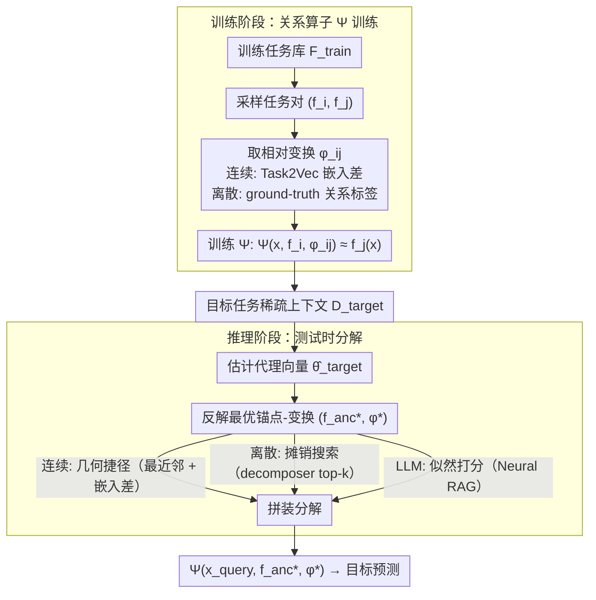

# Learning to Extrapolate to New Tasks: A Relational Approach to Task Extrapolation

**会议**: ICML 2026  
**arXiv**: [2605.30132](https://arxiv.org/abs/2605.30132)  
**代码**: 论文提及 GitHub repository（具体链接未在正文给出）  
**领域**: 元学习 / 任务外推 / 自监督表示  
**关键词**: 任务外推, 转导学习, 锚点-变换分解, Task2Vec, 关系算子

## 一句话总结
本文提出 Relational Task Extrapolator (RTE)，把"训练支撑集之外的新任务"重新解释为"已知锚点任务 + 已见过的任务间变换"的组合问题，并训练一个关系算子 $\Psi$ 在测试时拼装这对锚点-变换以预测未知任务的输出。

## 研究背景与动机

**领域现状**：现代学习系统在"插值"（测试任务落在训练分布支撑内）上几乎无所不能，主要靠数据规模和模型规模驱动；基础模型的成功也基本是把训练分布堆得足够大。

**现有痛点**：一旦目标任务的"任务参数"跳出训练支撑——例如训练只见过初速 $v\in[30,60]$ 的炮弹轨迹，测试要预测 $v=65$ 的目标——归纳式模型会在边界饱和，输出沿训练支撑外推就僵死。这种失败在大模型上同样存在（Vafa et al. 2025 报告 LLM 学到的是"启发式"，物理常数一变就崩）。

**核心矛盾**：归纳学习要求"测试样本来自训练分布"，但很多现实问题需要外推；纯归纳学习不可能识别支撑外的真实机制（无数假设都能拟合训练数据，却在外推区任意分歧），所以问题在数学上是 ill-posed，必须注入额外的结构假设。

**本文目标**：找到一种结构假设，让外推从 ill-posed 变成可解；同时这种假设要足够通用，覆盖三类典型外推：参数外推（连续）、长度外推（递归）和组合外推（组合）。

**切入角度**：作者借鉴 Vapnik 的 transduction 思想——不要去学全局函数 $f$，而是学"已知点 $f(x')$ 怎么平移到 $f(x)$"的算子。本文把它从输入空间提升到任务空间：不再学单个任务的全局解，而是学"任务到任务的变换"。

**核心 idea**：任意未见任务 $f_{\theta^*}$ 都可分解为 $f_{\theta^*} = s_\phi(f_{\theta_{anc}})$，其中 $f_{\theta_{anc}}$ 是训练里见过的锚点，$\phi$ 是训练里见过的相对变换；这样支撑外（OOS）的难题被降级为支撑内组合新颖（OOC）的较易问题。

## 方法详解

### 整体框架

RTE 把任务外推拆成两阶段。**训练阶段**：从训练任务库 $\mathcal{F}_{train}$ 里反复采样任务对 $(f_i, f_j)$，并取其相对变换 $\phi_{ij}$，训练一个关系算子 $\Psi$ 使得 $\Psi(x, f_i, \phi_{ij}) \approx f_j(x)$。**推理阶段**：给一个目标任务的少量上下文 $D_{target}$，先估计它在任务嵌入空间中的代理向量 $\hat\theta_{target}$，再找一个最佳锚点 $f_{anc}^*$ 和变换 $\phi^*$，最后用 $\Psi(x_{query}, f_{anc}^*, \phi^*)$ 出预测。整个 pipeline 既适用于纯函数预测（MLP 作为 $\Psi$），也适用于序列预测（LLM 作为 $\Psi$，通过 LoRA 微调）。贯穿两阶段的底层结构都是同一个「锚点 + 变换」分解：训练时 $\Psi$ 吃 $(f_i, \phi_{ij})$，推理时把目标拆回 $(f_{anc}^*, \phi^*)$。

### 关键设计

**1. 锚点-变换分解：把支撑外任务拆成"已见锚点 + 已见变换"**

直接去学边界外的 $f$ 是 ill-posed——无数假设都能拟合训练数据却在外推区任意分歧。RTE 注入的结构假设是：目标任务 $f_{\theta^*}$ 可以写成 $f_{\theta^*}(x) = \Psi(x, f_{anc}, \phi)$，其中锚点 $f_{anc} \in \mathcal{F}_{train}$、变换 $\phi \in \Phi_{train}$ 都是训练里见过的成分。三类外推被统一到同一接口：连续参数外推时 $\phi = \Delta\theta = \theta_{target} - \theta_{anc}$ 是差分算子（如初速从 60 推到 65）；长度递归外推时 $\phi$ 是把复杂度 $L-1$ 推到 $L$ 的扩展步（如多项式从 8 阶到 9 阶新增的高阶系数 $c_9$）；组合外推时 $\phi$ 是另一个原语（如 $\sin\circ x^2$ 的外层 $\sin$）。

这一步的价值在于把问题降级：只要假设"任务流形被一族结构化变换连接"，支撑外（OOS）的难题就变成支撑内组合新颖（OOC）的较易问题——目标任务由两个支撑内成分拼出来，模型不必凭空外推。

**2. 关系算子 $\Psi$ 的训练：把任务关系当一阶对象学**

有了分解假设，就训练一个参数化算子 $\Psi$ 把（查询输入, 锚点任务, 变换）映射到目标预测，目标是 $\min \mathbb{E}_{f_i, f_j}[\mathcal{L}(f_j(x), \Psi(x, f_i, \phi_{ij}))]$。训练数据来自任务库里反复采样的任务对 $(f_i, f_j)$ 及其相对变换 $\phi_{ij}$：连续 regime 下 $\phi_{ij}$ 直接取 Task2Vec 嵌入差 $\hat\theta_j - \hat\theta_i$；离散（长度/组合）regime 下假设训练可拿到 ground-truth 关系标签（如 $f_j = f_i \circ g$ 时把 $g$ 当 $\phi_{ij}$）。

这样 $\Psi$ 只需学"给定变换如何改造已知任务的输出"，不用同时学任务流形和变换机制（后者才是 ill-posed 的根）。把任务关系显式建成一阶对象，让模型学到"机制"而非"启发式"——这正是 RTE 区别于 MAML/Reptile 的地方：后者假设新任务落在训练分布的局部邻域，前者明确针对支撑外推。

**3. 测试时分解：几何捷径 vs 摊销搜索**

测试时只给目标任务的稀疏上下文 $D_{target}$，要反解出最优 $(f_{anc}^*, \phi^*) = \arg\min_{f, \phi} \sum_{(x,y)\in D_{target}} \mathcal{L}(y, \Psi(x, f, \phi))$。RTE 按 regime 走三条路：连续 regime 任务流形几何良好，用 Task2Vec 估出 $\hat\theta_{target}$、最近邻取锚点、相减得变换，一次 lookup 解决；离散组合 regime 的流形是组合爆炸的，训一个 decomposer $g_\psi$ 给出 top-$k$ 候选对，再在 $\mathcal{C}_k$ 上做小规模搜索，把空间压到 $O(k)$；LLM 场景无法直接算 proxy embedding，就用模型在 $D_{target}$ 上的负对数似然当打分器对候选暴力搜索（作者称之为 "Neural RAG"）。三条路的共性是用合适的代理把"反解分解"这个难题变成可执行的检索或最小化。

### 损失函数 / 训练策略

函数预测场景下 $\Psi$ 是 MLP，损失用 MSE。LLM 场景下 $\Psi$ 是 LoRA 微调的 Qwen / Mistral，把 (锚点 demo, 变换描述 $\phi$, 查询输入) 格式化成 prompt $P$，最小化 $\mathcal{L}_{SFT} = -\sum_t \log p_\theta(y_t | P, y_{<t})$。变换 $\phi$ 可以是自然语言指令、离散控制 token 或学习到的 embedding，看 regime 而定。

## 实验关键数据

### 主实验

| 数据集 / 任务 | 指标 | 本文 RTE | 主要 Baseline | 提升 |
|--------|------|------|----------|------|
| Quadratic 参数外推 (F2) | MSE | $\mathbf{7.33\times 10^2}$ | T2V Inductive $1.20\times 10^5$ | 约 160× 降低 |
| Tri-Trend 参数外推 (F2) | MSE | $\mathbf{0.048}$ | Inductive 0.46 | 约 10× 降低 |
| 9 阶多项式长度外推 | MSE | $\mathbf{0.371}$ | Naive Baseline 0.575 | -35% |
| 组合外推（聚合） | MSE | $\mathbf{0.287}$ | Naive Baseline 0.389 | -26% |
| Sparse Parity $|S|=6$（Qwen+LoRA） | Acc | $\mathbf{66.07\%}$ | 标准 SFT 52.86% | +13.2pp |
| CodeIO 组合外推 | Exact Match | $\mathbf{45.3\%}$ | Few-Shot 19.8% / CoT+Maj@16 30.2% | +15.1pp / +25.5pp |

可以看到，归纳基线在所有外推 regime 都"边界饱和"——多项式拟合不出边界外的曲率、周期函数预测不出正确频率，CodeIO 上即使加 CoT+多数投票也只到 30%；RTE 在结构上把外推降级为 OOC 后稳定显著领先。

### 消融 / 分析实验

| 配置 | 关键指标 | 说明 |
|------|---------|------|
| RTE (full) | Cubic MSE 1.53 | 完整模型，锚点选自 Task2Vec 最近邻 |
| Inductive Oracle | Cubic MSE 3.24 | 即使给归纳模型 ground-truth 参数也外推不出来，说明关键在"关系"而非"已知参数" |
| Transductive Oracle | Cubic MSE 0.96 | 给 RTE ground-truth 锚点和变换的上限 |
| CodeIO Oracle | 76.0% | 给 LLM ground-truth 原语分解的上限，仍有 ~31pp 空间 |
| Sparse Parity Oracle | 100.0% | 给 LLM 已知 parent 后完美求解，说明剩余 gap 来自分解推断不准 |

### 关键发现

- 关系外推的"上限"很高（oracle 在所有 regime 都接近完美）但"搜索"是瓶颈：CodeIO 上 RTE 拿到 45.3% 而 oracle 76.0%，差距来自 decomposer 偶尔挑错原语；长度外推上 Naive→RTE→Oracle 也呈现同样的"分解准确度递增"曲线。
- 归纳学习失败具有结构性：作者特别指出在周期函数（Sin-Trend / Tri-Trend）上，归纳模型受 spectral bias 困扰拟合不出正确频率，而 RTE 直接从锚点继承波形结构，只需学一个线性 shift，因此完全绕过了这个问题。
- 即便锚点选得不完全正确，RTE 仍能给出比 baseline 显著更优的预测（Composition 实验里 RTE 选错了原语却依然把 MSE 从 0.39 拉到 0.29），暗示结构约束本身就是强先验。
- LLM 场景下 RTE 的优势远超 CoT + 多数投票，说明"显式给出锚点输出 + 变换参数"比"让模型自己 reason"更有效——这暗示 RTE 的 prompt 模板本身就是一种结构化推理脚手架。

## 亮点与洞察

- 把 transduction 从"输入空间"提升到"任务空间"，思路简单但概念跨度大：单点 transduction (Netanyahu et al. 2023) 只在同一函数上做平移，RTE 跨函数做平移，要求任务流形可由结构化变换连接，但只要这个假设成立，外推就立刻从 ill-posed 变成可解。
- Task2Vec + nearest-neighbor 锚点选择 + 嵌入差作为变换，这套"几何捷径"在连续参数 regime 下既高效又有理论支撑（Fisher Information 嵌入近似保结构），是一个可直接复用到任意可微元学习场景的轻量级 trick。
- LLM 场景下用 "Likelihood as Score" 做候选打分，本质上把外推变成了 retrieval + verification，完全免训新模块；这个 pattern 可以迁移到其它需要"在已知工具集合上拼装组合"的任务，比如 tool-use agent、program synthesis、code completion。
- Sparse Parity 实验里 RTE 把 $|S|=6$ 准确率从 52.86% 拉到 66.07%，说明对于需要"递归扩展"的逻辑任务，把推理过程做成"已知子任务 + 一次结构性扩展"比让 LLM 一次性吐出答案更可靠——这对 reasoning model 设计有借鉴意义。

## 局限与展望

- **结构假设强**：必须假设目标任务可以分解成训练里见过的锚点 + 变换，否则方法不适用；作者明确说 RTE 不是 universal black-box，对完全外星的任务无效。
- **离散 regime 需要关系元标签**：训练时需要 ground-truth 的任务关系（例如知道 $f_j = f_i \circ g$），现实数据里这种标签往往不存在；附录给了 self-labeling 的初步方案但尚未充分验证。
- **测试时计算开销**：策略 B 要做候选搜索，比一次前向昂贵；多步外推（链式组合）会让搜索空间和误差累积同时爆炸，论文只演示了浅链。
- **任务嵌入对预训练敏感**：Task2Vec 用 Fisher 信息矩阵，需要预训练模型质量足够好；few-shot ($k<10$) 时嵌入估计的稳定性也是潜在问题，论文承认在 LLM 场景下 proxy embedding 不稳定才不得不用 likelihood 搜索。
- **可改进方向**：把变换 $\phi$ 学成连续可微的潜变量（替代离散候选搜索），或者引入 Bayesian optimization / evolutionary search 替代暴力枚举；也可考虑用 SSL pretext task 给离散关系自监督打标签，绕开 meta-label 需求。

## 相关工作与启发

- **vs MAML / Reptile**：他们学一个利于快速适应的初始化，假设新任务在训练分布的局部邻域；RTE 显式建模任务间变换，针对的是"训练支撑外"的真正外推，定位差异明确。
- **vs Netanyahu et al. (2023)**：对方在输入空间做 transduction（同一个函数上"已知点+偏移"），RTE 把同样的思想搬到函数/任务层级，需要解决"任务没有自然索引"的难题（用 Task2Vec 解决）。
- **vs Pfister & Bühlmann (2024) 等统计外推**：对方依赖 directional derivatives / 因果机制等数学约束做外推；RTE 完全靠"关系结构 + 学到的变换算子"，机制不同但都属于"通过结构假设让外推变 well-posed"的大思路。
- **vs Vafa et al. (2025) world model 系列**：他们关心模型是否学到"机制"而非"启发式"，RTE 把"机制"显式编码到关系算子里，是一种构造性的 world model 设计。

## 评分
- 新颖性: ⭐⭐⭐⭐⭐ 把单点 transduction 升级到任务级 transduction，并统一了三类外推 regime，定位很清晰。
- 实验充分度: ⭐⭐⭐⭐ 覆盖合成函数、polynomial、parity、CodeIO 等多个任务，oracle 上限对照清楚；但缺真实科学数据（如物理外推）的实测。
- 写作质量: ⭐⭐⭐⭐ 概念框架推得干净，公式和算法表清晰；少量段落对 assumption 的解释较抽象。
- 价值: ⭐⭐⭐⭐ 给 OOD/extrapolation 研究提供了一条可执行的工程路径，prompt-as-decomposition 这一招对 LLM reasoning 也有借鉴意义。

<!-- RELATED:START -->

## 相关论文

- [\[CVPR 2026\] CHEEM: Continual Learning by Reuse, New, Adapt and Skip -- A Hierarchical Exploration-Exploitation Approach](../../CVPR2026/self_supervised/cheem_continual_learning_by_reuse_new_adapt_and_skip_--_a_hierarchical_explorati.md)
- [\[ICML 2026\] Scaling Continual Learning to 300+ Tasks with Bi-Level Routing Mixture-of-Experts](scaling_continual_learning_to_300_tasks_with_bi-level_routing_mixture-of-experts.md)
- [\[CVPR 2026\] An Optimal Transport-driven Approach for Cultivating Latent Space in Online Incremental Learning](../../CVPR2026/self_supervised/an_optimal_transport_driven_approach_for_cultivating_latent_space_in_online_incr.md)
- [\[NeurIPS 2025\] A Joint Learning Approach to Hardware Caching and Prefetching](../../NeurIPS2025/self_supervised/a_joint_learning_approach_to_hardware_caching_and_prefetching.md)
- [\[ICML 2025\] Griffin: Towards a Graph-Centric Relational Database Foundation Model](../../ICML2025/self_supervised/griffin_towards_a_graph-centric_relational_database_foundation_model.md)

<!-- RELATED:END -->
