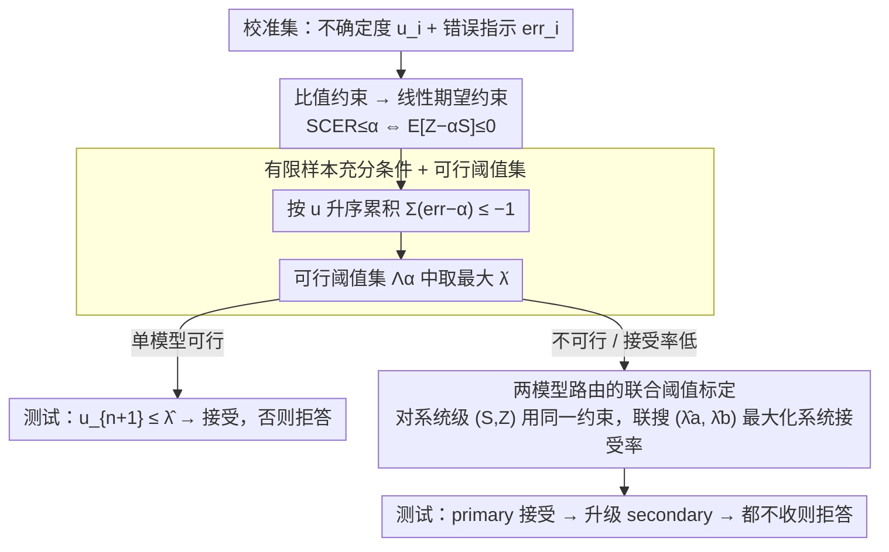

# LEC: Linear Expectation Constraints for Selection-Conditioned Risk Control in Selective Prediction and Routing Systems

**会议**: ICML 2026  
**arXiv**: [2512.01556](https://arxiv.org/abs/2512.01556)  
**代码**: 论文 Figure 1 caption 标注 "Code is available here"（开源链接未在正文给出）  
**领域**: AI 安全 / 选择性预测 / 不确定性量化  
**关键词**: 选择性预测, 风险控制, 共形预测, 模型路由, 不确定性量化

## 一句话总结
针对大模型 selective prediction 中"UCB 风险界过于保守、能用阈值很少"这个老问题，作者把"接受后错误率 ≤ α"重写成一条关于选择/错误两个 0-1 指示函数的**线性期望约束**，由此推出一个只依赖校准集的有限样本充分条件（Eq. 5），既保持有限样本严格保证又显著比 UCB 紧，同时把同一套框架自然推广到两模型路由系统并联合标定两个阈值，在 CommonsenseQA / TriviaQA / ScienceQA / MM-Vet v2 上 power 普涨、TriviaQA 上比 Clopper-Pearson UCB 多接受 9.5% 样本。

## 研究背景与动机

**领域现状**：LLM/LVLM 越来越多被嵌入到决策管线，但它们会产生幻觉、会在错答上给出高自信，因此需要对"接受 / 拒答 / 升级"这套行为做统计意义上的保证。Split conformal prediction（SCP）能把启发式的 uncertainty score 转成有覆盖率保证的预测集，但**集合型输出**对下游决策不直接 actionable——里面常含不可靠候选，反而引发偏置决策。

**现有痛点**：研究者转向"点预测 + 选择性接受"的 selective prediction 范式：当不确定度 $u \le \lambda$ 时才接受。问题是怎么标定 $\lambda$ 来保证"接受样本的错误率 ≤ α"。当前主流是基于置信区间的 UCB 方法——COIN 用 Hoeffding 不等式 UCB-HFD，Trust of Escalate 用 Clopper-Pearson 精确 UCB（UCB-CLP）。这些方法**统计有效但极度保守**：它们对经验风险做最坏情形的尾部控制，导致实际接受率远低于风险预算允许的水平，甚至在低 α（如 0.05）下根本找不到可行阈值。

**核心矛盾**：UCB 类方法控制的是"经验风险的上界"，而我们真正想控制的是"选择后条件错误率 $\mathrm{SCER}(\lambda) = \Pr(\mathrm{err}=1 \mid S(\lambda)=1)$"这个比值。把"比值约束"硬塞进"上界约束"必然带来过度保守的 padding。

**本文目标**：(1) 找到一种既能保留有限样本保证、又比 UCB 紧的阈值标定公式；(2) 把同一套保证从单模型推广到两模型路由（primary → secondary → abstain）系统，并实现**系统级**而非"分头"的风险控制。

**切入角度**：作者关键的观察是——比值约束 $\mathbb{E}[Z]/\mathbb{E}[S] \le \alpha$（其中 $Z = S \cdot \mathrm{err}$ 是"接受且错"的联合指示，$S$ 是接受指示），当 $\mathbb{E}[S] > 0$ 时等价于**一条线性约束** $\mathbb{E}[Z - \alpha S] \le 0$。这条线性约束的好处是：它只关心一个随机变量 $Z-\alpha S$ 的期望非正，不需要对 $Z$ 和 $S$ 分别做尾部控制，因此天然比"先 UCB 风险再除接受率"紧。

**核心 idea**：把 selective prediction 从"对不确定度排序"重新框架成"对线性期望约束求阈值"，并在 exchangeability 假设下用 leave-one-out 修正得到一个干净的"差和 ≤ −1"的有限样本充分条件——这一条不等式同时给出单模型和路由系统的标定规则。

## 方法详解

### 整体框架
单模型 LEC 接受 4 步：(1) 模型 $\mathcal{G}^{(a)}$ 在校准集 $\mathcal{D}_{\mathrm{cal}}=\{(u_i^{(a)},\mathrm{err}_i^{(a)})\}_{i=1}^n$ 上跑出不确定度 $u_i$ 和错误指示 $\mathrm{err}_i$；(2) 把候选阈值 $\lambda$ 对应的接受样本计数 $k(\lambda)=\#\{i: u_i \le \lambda\}$ 代入有限样本充分条件 $\sum_{j=1}^{k(\lambda)}(\mathrm{err}_{(j)} - \alpha) \le -1$（按 $u_i$ 升序）；(3) 取所有可行 $\lambda$ 中**最大**的那个作为 $\hat{\lambda}$，最大化测试期接受率；(4) 测试时新样本 $u_{n+1} \le \hat{\lambda}$ 才接受，否则拒答。两模型路由把同一原理推广到 $(\lambda^{(a)}, \lambda^{(b)})$ 联合搜索，再以系统级接受率最大化挑出最优对。

### 关键设计

**1. 从比值约束到线性期望约束：把条件概率目标改写成一条线性不等式**

我们真正想控制的是"接受样本里错的比例" $\Pr(\mathrm{err}=1 \mid S(\lambda)=1) \le \alpha$，本质是个条件概率（比值）约束。LEC 第一步把它等价改写：定义联合指示 $Z(\lambda) = S(\lambda) \cdot \mathrm{err}$（接受且错才为 1），则 $\mathrm{SCER}(\lambda) = \mathbb{E}[Z(\lambda)] / \mathbb{E}[S(\lambda)]$，在 $\mathbb{E}[S(\lambda)] > 0$ 时有 $\mathrm{SCER}(\lambda) \le \alpha \Leftrightarrow \mathbb{E}[Z(\lambda) - \alpha S(\lambda)] \le 0$。直观上 $Z - \alpha S$ 是"单样本对接受错误数的边际贡献减去 α 倍的边际接受"，它的期望非正就等价于接受错误率不超过 α。

这一步看似朴素，却是 LEC 比 UCB 紧的根源。UCB-CLP / UCB-HFD 是先对分子 $\mathbb{E}[Z]$ 单独做上界、再除以分母 $\mathbb{E}[S]$ 的下界，相当于两个保守界叠加；LEC 只对一个组合量 $Z - \alpha S$ 判断期望非正，从源头上把"双重保守"压成了"一次判断"。

**2. 有限样本充分条件 + 可行阈值集：只用校准集就能验证的"差和 ≤ −1"**

线性约束 $\mathbb{E}[Z - \alpha S] \le 0$ 是期望，需要翻译成校准集上可执行的判据。把校准样本按不确定度 $u_i$ 升序排成 $u_{(1)} \le \dots \le u_{(n)}$ 及对应 $\mathrm{err}_{(j)}$，阈值 $\lambda$ 接受的样本数记 $k(\lambda) = \#\{i: u_i \le \lambda\}$。作者用 distribution-free 校准里标准的 leave-one-out 修正证明（Appendix A.1），在 exchangeability 下充分条件就是一条干净的不等式：

$$\sum_{j=1}^{k(\lambda)} (\mathrm{err}_{(j)} - \alpha) \le -1$$

可行阈值集 $\Lambda_\alpha = \{\lambda: \text{上式成立}\}$，标定取其中最大的 $\hat{\lambda} = \sup \Lambda_\alpha$ 以最大化接受率；若 $\Lambda_\alpha = \varnothing$ 就声明该 α 不可行、全拒答。Theorem 3.1 保证用这样的 $\hat{\lambda}$ 新样本满足 $\Pr(\mathrm{err}_{n+1}=1 \mid u_{n+1} \le \hat{\lambda}) \le \alpha$。它和 UCB 的本质区别在于：这里直接用校准集上 $Z - \alpha S$ 的累积和，再用 −1 作 leave-one-out 修正替代 Hoeffding/Clopper-Pearson 的最坏情形尾界，既保住有限样本严格性又不浪费风险预算。

**3. 两模型路由的联合阈值标定：保证系统级而非分头的 SCER**

当单模型在某 α 下不可行或接受率太低，自然想把不确定输入升级到第二个模型，但难点是要保证整个系统的错误率而不是两个模型各自达标。LEC 定义 $S^{(b)}(\lambda^{(a)}, \lambda^{(b)}) = \mathbf{1}\{u^{(a)} > \lambda^{(a)} \land u^{(b)} \le \lambda^{(b)}\}$（仅 primary 拒、secondary 收时为 1），系统接受 $S = S^{(a)} + S^{(b)}$、系统接受错误 $Z = S^{(a)} \mathrm{err}^{(a)} + S^{(b)} \mathrm{err}^{(b)}$。同一套线性等价性给出系统约束 $\mathbb{E}[Z - \alpha S] \le 0$，有限样本充分条件仍是 $\sum_{i=1}^n (Z_i - \alpha S_i) \le -1$，在可行集上选使经验接受率最大的 $(\hat{\lambda}^{(a)}, \hat{\lambda}^{(b)})$，Theorem 3.2 保证系统级 SCER ≤ α，并可推广到 $K$ 模型链。

为什么必须联合标定？因为若对两个模型各自独立调 $\lambda^{(a)}$、$\lambda^{(b)}$（naive LEC），secondary 看到的是 primary 拒掉之后的子总体，分布已偏离 exchangeability，系统级保证随之失效（Figure 6 实证了越线）。联合标定是路由系统拿到有效系统级保证的唯一正确路径。

### 损失函数 / 训练策略
LEC 是**纯校准 / 后处理方法**，不涉及任何梯度训练；只需要：(1) 一个已训练好的模型 $\mathcal{G}$；(2) 一个 scalar 不确定度函数 $\mathcal{U}$（默认闭式 QA/VQA 用 predictive entropy PE，开放式用 black-box semantic entropy SE，也支持 EigV / Deg / Ecc / SELF 等替代）；(3) 一个标注好的校准集；(4) 一个 admission function $A$（默认用 sentence similarity 阈值 0.6，也支持 bi-entailment 和 LLM-as-a-Judge）。计算开销主要是对 $\lambda$ 候选做扫描（每个 candidate $\mathcal{O}(n)$ 即可）。

## 实验关键数据

### 主实验

TriviaQA 数据集上 8 个 LLM 的 Power（被接受的正确样本比例，越大越好）随风险等级 α 变化对比。LEC 在所有 α 上都不输 UCB-CLP，在 α=0.05 / 0.1 这种"低风险预算"挑战场景下优势最明显（mean over 500 splits）：

| α | OpenChat-3.5 UCB-CLP | OpenChat-3.5 LEC | Qwen2.5-14B UCB-CLP | Qwen2.5-14B LEC | LLaMA-3.1-8B UCB-CLP | LLaMA-3.1-8B LEC | LLaMA-3.1-70B UCB-CLP | LLaMA-3.1-70B LEC |
|------|-----|-----|-----|-----|-----|-----|-----|-----|
| 0.05 | 0.6684 | **0.7230** | 0.6240 | **0.7193** | 0.7143 | **0.7538** | 0.9935 | **0.9996** |
| 0.10 | 0.9294 | **0.9521** | 0.9987 | **1.0000** | 0.9396 | **0.9612** | 1.0 | 1.0 |
| 0.15 | 1.0 | 1.0 | 1.0 | 1.0 | 1.0 | 1.0 | 1.0 | 1.0 |

UCB-HFD（Hoeffding 变体）在 α=0.05 下对多个模型（Qwen2.5-3B / 7B / 14B、Vicuna-7B、LLaMA-3.1-8B 之外的多个低 α）直接返回"无可行阈值"，进一步说明 UCB 在低 α 区的脆弱性。

### 消融实验

CommonsenseQA 两模型路由（Qwen2.5-3B 作为 primary、LLaMA-3.1-8B 作为 secondary）下，被系统接受的"正确样本数"对比：

| α | Qwen2.5-3B 单模型 | LLaMA-3.1-8B 单模型 | LEC-Routing (Qwen2.5-3B & LLaMA-3.1-8B) |
|------|--------|---------|----------|
| 0.05 | 965  | 1579 | **1610** |
| 0.10 | 2569 | 2357 | **2663** |
| 0.15 | 3174 | 2890 | 3174+（系统级风险仍合规） |

文中给出更直观的覆盖率数字：α=0.05 时单用 Qwen2.5-3B 接受率仅 20.3%，LEC-Routing 把这个数字推到 33.9%（17.44% 由 Qwen2.5-3B 接，16.46% 升级到 LLaMA-3.1-8B），绝对增益 13.6%。同时 Figure 6 显示 LEC-Routing 的经验 SCER 始终贴近但不超过 α 线，而 UCB-HFD/CLP-Routing 全程明显在 α 线以下（过度保守），"naive LEC"（两个模型独立 LEC）则会直接突破 α 线，证明**联合标定的必要性**。

### 关键发现
- **统计有效性稳定达标**：8 个 LLM × 多个 α × 500 次随机 split，LEC 的平均经验 SCER 几乎贴着 α 线（OpenChat-3.5 α=0.05 实测 0.0497）但**不超过**——验证 Theorem 3.1 不是"渐进"而是有限样本严格成立。
- **比 UCB 紧但仍 valid**：TriviaQA α=0.05 + Qwen2.5-3B 上 LEC 经验 SCER 0.0987，UCB-CLP 仅 0.0878，UCB-HFD 直接 infeasible——LEC 把"风险预算"花到了 α 边界，多接受样本但没破规。
- **TriviaQA + Qwen2.5-14B α=0.05 多接 9.5% 样本**：相对 UCB-CLP 这种已经是最紧 UCB 的方法，LEC 还能再榨出近 10% 的可接受样本。
- **路由的联合 vs naive 标定差异显著**：把单模型 LEC 简单复用到两模型分头标定会让系统级 SCER 越线，而联合标定 LEC-Routing 既 valid 又把覆盖率拉高。
- **跨 UQ / split / black-box 鲁棒**：在 SE/EigV/Deg/Ecc/SELF 不同 UQ、不同 calibration-test split 比例、不同采样数（10 个候选）下，LEC 仍稳定优于 UCB 类基线。

## 亮点与洞察
- **"比值约束 → 线性期望约束"是论文的灵魂**：这一步等价改写看起来朴素，但它把后续所有有限样本论证从"两次保守界叠加"压成"一次差和不等式"，是 LEC 比 UCB 紧的根本来源。
- **"$\sum (\mathrm{err}_{(j)} - \alpha) \le -1$"形式优美且可执行**：直接对升序后的累积差和扫描可行 $k$，实现复杂度 $\mathcal{O}(n)$，工程上比 SCP 的 quantile 算法或 Clopper-Pearson 反查更简洁。
- **路由系统级 SCER 控制的"统一性"很优雅**：单模型和两模型的"线性期望约束 + leave-one-out 修正"是同一个数学对象，只是 $(S, Z)$ 的定义换了一下，可以无痛扩展到 $K$ 模型链。
- **黑盒友好**：不依赖 logits、不依赖训练，只要拿到 uncertainty score 和正确性标签就能跑——这意味着对 GPT-4 / Gemini 这种闭源 API 也直接可用，落地门槛极低。

## 局限与展望
- **依赖 exchangeability**：所有保证基于校准集和测试集 exchangeable，若发生分布漂移（用户提问随时间变化、模型版本升级）保证立即失效；可以接 weighted conformal 或 online conformal 改进。
- **依赖标注好的 admission function $A$**：用 sentence similarity 0.6 阈值作为 ground-truth alignment 判定，在 open-ended 任务中本身有噪声；当 $A$ 自身错误时 SCER 控制的是"对噪声 $A$ 的 SCER"，不是真正的"语义正确率"。
- **校准集容量与 α 的 trade-off**：低 α（如 0.01）下 $\sum (\mathrm{err}_{(j)} - \alpha) \le -1$ 极难满足，需要更大校准集；论文没给最小校准集规模的理论刻画。
- **路由阈值搜索复杂度**：两模型联合阈值搜索是 $\mathcal{O}(n^2)$，$K$ 模型则是 $\mathcal{O}(n^K)$ 嵌套搜索；对长链路由需要近似或剪枝。
- **UCB 真的就被打死了吗**：UCB 在样本极少（$n < 50$）或风险极小（α < 0.01）的极端区或许仍有理论优势，本文未刻画这些边界场景。

## 相关工作与启发
- **vs COIN (UCB-HFD)** [Wang et al. 2026]：COIN 用 Hoeffding 不等式构造系统风险的 UCB 求阈值，本文显示 Hoeffding 在低 α 上极易 infeasible；LEC 等价地不用 UCB 而是用 leave-one-out 线性约束。
- **vs UCB-CLP / Trust of Escalate** [Jung et al. 2025]：Clopper-Pearson 是最紧的 UCB，但仍是"先 UCB 风险再约束"的两步保守；LEC 把两步合并到一个差和不等式中，TriviaQA 上稳定优于 UCB-CLP。
- **vs Conformal Alignment / Labeling** [Gui et al. 2024; Huang et al. 2025]：那一脉做的是 multiple-testing 框架下的 false discovery 控制，本文是单点接受决策的 SCER 控制，前者关心"接受集中错的比例"，后者关心"接受的边际错误率"——指向类似目标但数学形式不同。
- **vs SCP（split conformal prediction）**：SCP 输出预测集（保证含真值的概率 ≥ 1-α），LEC 输出点预测 + 接受/拒答（保证接受样本中错的概率 ≤ α），后者对下游决策更可执行。
- **启发**：linear expectation constraint 这条改写思路可以迁移到其他"比值约束"场景，比如 fairness 中的 demographic parity（也是 $\mathbb{E}[\text{decision} \cdot \text{group}] / \mathbb{E}[\text{group}]$ 形式）、agent 系统中的"工具调用错误率"控制等。

## 评分
- 新颖性: ⭐⭐⭐⭐ "比值 → 线性期望"的改写思路+leave-one-out 修正的组合是新的，相对 UCB 类是清晰的范式升级；但底层还是 split conformal 思想的变体。
- 实验充分度: ⭐⭐⭐⭐⭐ 4 个 benchmark × 8 LLM/4 LVLM × 6 UQ × 2 alignment × 多 α × 500 splits，几乎把可能的扰动维度都覆盖了。
- 写作质量: ⭐⭐⭐⭐ 单模型 → 路由 → $K$ 模型的递进非常清楚，公式严密；指示变量符号略多读起来需要耐心。
- 价值: ⭐⭐⭐⭐⭐ 后处理方法、黑盒可用、严格有限样本保证、还能直接路由——对 LLM 实际部署中的"何时信、何时升级、何时拒"决策有非常实用的价值。

<!-- RELATED:START -->

## 相关论文

- [\[ICML 2026\] Scaling Continual Learning to 300+ Tasks with Bi-Level Routing Mixture-of-Experts](scaling_continual_learning_to_300_tasks_with_bi-level_routing_mixture-of-experts.md)
- [\[ICML 2026\] NITP: Next Implicit Token Prediction for LLM Pre-training](nitp_next_implicit_token_prediction_for_llm_pre-training.md)
- [\[CVPR 2026\] Representation Learning for Spatiotemporal Physical Systems](../../CVPR2026/self_supervised/representation_learning_for_spatiotemporal_physica.md)
- [\[ICML 2026\] FLAG: Foundation Model Representation with Latent Diffusion Alignment via Graph for Spatial Gene Expression Prediction](flag_foundation_model_representation_with_latent_diffusion_alignment_via_graph_f.md)
- [\[ICML 2025\] A Bayesian Model Selection Criterion for Selecting Pretraining Checkpoints](../../ICML2025/self_supervised/a_bayesian_model_selection_criterion_for_selecting_pretraining_checkpoints.md)

<!-- RELATED:END -->
