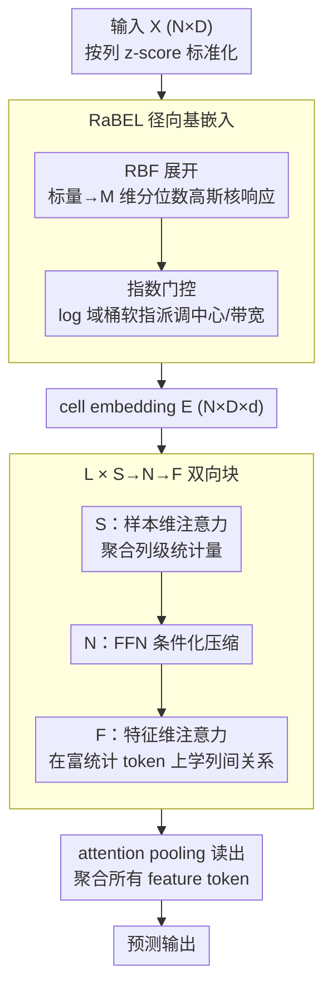

# LimiX-2M: Mitigating Low-Rank Collapse and Attention Bottlenecks in Tabular Foundation Models

**会议**: ICML 2026  
**arXiv**: [2606.04485](https://arxiv.org/abs/2606.04485)  
**代码**: https://github.com/limix-ldm-ai/LimiX  
**领域**: 表格基础模型 / Transformer 架构 / 数值嵌入  
**关键词**: 表格基础模型, RBF 嵌入, 低秩坍缩, 双向注意力, 表格 ICL

## 一句话总结
针对 TabPFN-v2 等表格基础模型在浅层出现严重低秩坍缩、且最后一层 sample-attention 对预测信号贡献微弱的两个病灶，作者提出用径向基函数把每个标量扩展成一组局部响应（RaBEL）来打开"值方向"的自由度，并把双向注意力块从 F→S→N 重排成 S→N→F 以确保所有注意力路径都汇入读出，仅用 2M 参数就在主流表格 benchmark 上稳定胜过 7M 的 TabPFN-v2 和 27M 的 TabICL。

## 研究背景与动机

**领域现状**：TabPFN / TabPFN-v2 / TabICL / LimiX 这类表格基础模型（Tabular Foundation Models, TFMs）通过在合成任务上预训练 Transformer，把表格学习重写为"上下文内推理"，在多个中小规模 benchmark 上把长期统治者梯度提升树（XGBoost、LightGBM、CatBoost）逼到了第二梯队。其标准做法是：对每个数值格 $x_{i,j}$ 用一个 $1\times p$ 的线性层投到隐空间，再叠加列 ID / 位置嵌入。

**现有痛点**：作者在 OpenML-CC18 上对 TabPFN-v2 每层的隐状态做 SVD，发现极其严重的低秩坍缩——12 层 36 个模块的 192 维隐空间中，常常只需要 5–10 个奇异分量就能保留 95% 能量。在原始 192 维输入上做截断 SVD，把秩压到 50（约 25%）AUC 几乎不掉，压到 20 仍能保持有竞争力的 AUC（0.8985 vs 0.9177）。这说明大部分隐空间被浪费了。

**核心矛盾**：作者证明（Proposition 3.1）了一个清晰结论——纯线性嵌入+列 ID 下，给定 $n$ 个标量 $x_1,\dots,x_n\in\mathbb{R}$，嵌入矩阵的秩**至多为 2**；经过单头自注意力后秩仍至多为 2，多头注意力的秩也只能涨到 $H+1$。列 ID / 位置编码可以"区分列"但**不能增加每个标量进入模型的有效自由度**。同时，主流双向块按 F→S→N（feature-attention → sample-attention → FFN）排序，导致第一层 feature-attention 必须在没有任何列级统计量的情况下用原始值做跨列融合；更糟的是预测时只读 target token，最后一层的 sample-attention 路径几乎不影响读出，浪费了大量计算。

**本文目标**：(1) 让嵌入层在"值方向"引入足够非线性，把浅层有效秩抬起来；(2) 重排注意力顺序，使每一次注意力计算都对最终预测有贡献。

**切入角度**：RBF 这种经典局部核展开天然具备"在不同值域有不同响应"的性质，等价于一组以分位数为中心的高斯核基，把单标量映成 $M$ 维向量后再做共享线性投影，就把"标量进入模型的自由度"从 1 拉到 $M$；而把 sample-attention 放到块的前面，可以先聚合列级统计量再做 feature-attention，更接近"先统计再交互"的自然计算顺序。

**核心 idea**：用 RaBEL（径向基嵌入层）做"前置非线性"打破值瓶颈 + 用 S→N→F 重排把"读出对齐"——两者联手把 2M 参数模型推到 7M TabPFN-v2 之上。

## 方法详解

### 整体框架
输入 $X\in\mathbb{R}^{N\times D}$（$N$ 样本、$D$ 列），首先按列做 $z$-score 标准化得到 $\tilde{x}_{i,j}$，然后 RaBEL 把每个标量 $\tilde{x}_{i,j}$ 展开成 $M$ 维 RBF 响应再线性投到 $d$ 维隐空间，形成 cell embedding 张量 $E\in\mathbb{R}^{N\times D\times d}$。这张张量送入 $L$ 个**重排后的双向注意力块** S→N→F：每块先做样本维注意力（聚合列级统计量）→ FFN（条件化压缩）→ 特征维注意力（在更好的条件下学列间关系）。最后用 attention pooling 把所有 feature token 聚合成预测向量，使每一次注意力都"看得见"读出端的梯度。

### 关键设计

**1. RaBEL：径向基嵌入层 + 指数门控，把"值方向"自由度从 1 提到 $M$**

病灶很清楚——Prop 3.1 证明纯线性嵌入 + 列 ID 下，$n$ 个标量的嵌入矩阵秩至多为 2，过单头自注意力后仍至多 2、多头也只到 $H+1$；列 ID 能区分列却增加不了每个标量进入模型的自由度。RaBEL 用径向基核打破这个瓶颈：对每列 $j$ 选 $M$ 个中心 $\{c_{j,m}\}$（经验分位数初始化）和带宽 $\{\sigma_{j,m}\}$（IQR 初始化、端到端学），算 $\kappa_{j,m}=\exp(-(x_{i,j}-c_{j,m})^2 / (2\sigma_{j,m}^2))$，把响应向量 $\phi_j(x_{i,j})=[\kappa_{j,1},\dots,\kappa_{j,M}]$ 经共享投影 $W_{\mathrm{rbf}}\in\mathbb{R}^{d\times M}$ 和 LayerNorm 映到 $\mathbb{R}^d$。RBF 的局部性意味着不同值域有不同的激活模式，等于在第一层就把"分段趋势 / 局部周期 / 量化 / 重尾 / 异方差"这些表格常见非线性结构先解纠缠，省得后面堆很多层去事后挖曲率。

真实表还跨数量级、异方差，所以再加一道指数门控：取 $\ell_{i,j}=\log_\beta(|x_{i,j}|+\tau)$ 用温度核软指派到指数桶 $\mathcal{B}$ 得 scale context $z^{\exp}_{i,j}$，再用小 MLP 输出两个正标量门 $(\gamma^c_{i,j},\gamma^\sigma_{i,j})$ 同时缩放所有中心和带宽。这让模型在不同数量级下自动调 bump 宽度，避免 RBF 在大值域变成"全 0"或在小值域过度平滑，做到尺度等变 + 异方差鲁棒。

**2. S→N→F：重排双向注意力块，让每条注意力路径都汇入读出**

标准 TabPFN 风格的 F→S→N 排序有两个病：第一层 feature-attention 必须用原始未条件化的值跨列融合，加剧低秩坍缩；而预测时只读 target token，末层的 sample-attention 几乎不影响读出，等于白算。LimiX-2M 把顺序倒成 S→N→F——先沿样本维做注意力（等价于在每列内部聚合"均值、出现率、缺失模式"等列级统计量），再用 FFN 对这些统计信号条件化压缩，最后才在已富含列级摘要的 token 上做跨列交互。读出端也不再只取 target token，而是对所有 feature token 做 attention pooling，让每条注意力路径都有梯度信号汇入。

这个"先统计 → 再交互"的次序更贴合表格数据的自然依赖结构。合成 DAG 数据上的可视化（Fig 2）很说明问题：F→S→N 的 feature attention 被自注意力主导（几乎只看自己），而 S→N→F 能把注意力分给 target 的真实因果父节点（如 Node 0）——而且整个重排不引入任何新参数。

**3. 2M 参数 + 同款训练配方的三角对照：把架构贡献从工程贡献里剥出来**

tabular FM 圈最常见的质疑是"涨点其实来自训练数据 / 时长 / 超参 tuning"。作者用一组对照堵死这个口子：造一个 2M 参数的"Linear-SNF baseline"，与 LimiX-2M 共享完全相同的 SNF 层序、训练数据、训练超参，唯一差别是嵌入层用普通 Linear 而非 RaBEL；同时把 RaBEL 分别接到 MLP 主干和纯 Transformer 主干上。这样 Linear-SNF / RaBEL-MLP / RaBEL-SNF 三个点逐项消融，就能把 RaBEL 和 S→N→F 的架构贡献从训练配方里彻底分离，证明涨点真来自这两处改动。

### 损失函数 / 训练策略
继承 LimiX/TabPFN-v2 的"在合成生成的表格任务上做掩码预测预训练"范式，损失沿用原配方；本文不动训练目标，只动嵌入层和块内顺序。RaBEL 中心 / 带宽 / 指数桶嵌入 / 门控 MLP 全部端到端学习。

## 实验关键数据

### 主实验

在 BCCO-CLS / BCCO-REG 等表格 benchmark 上对 2M 参数 Transformer 主干换不同嵌入：

| Benchmark | 指标 | Transformer+MLP | Transformer+Periodic | Transformer+PLE | Transformer+RaBEL |
|-----------|------|-----------------|----------------------|-----------------|-------------------|
| BCCO-CLS  | AUC ↑ | 83.52 | 83.88 | 84.66 | **85.04** |
| BCCO-CLS  | Acc ↑ | 76.82 | 77.80 | 77.68 | **77.99** |
| BCCO-CLS  | F1 ↑  | 66.57 | 68.65 | 67.74 | **69.01** |
| BCCO-REG  | $R^2$ ↑ | 0.7731 | 0.6859 | 0.7410 | **0.7792** |
| BCCO-REG  | RMSE ↓ | 0.4043 | 0.4321 | 0.4216 | **0.3964** |

在 11 个聚合 benchmark（OpenML-CC18 / TabZilla / TabArena-CLS-REG / PFN-CLS-REG / TALENT-CLS-REG / CTR23 等）上的平均排名（值越小越好），LimiX-2M 在多数列上拿到红字最佳或蓝字次佳，超越了 GBDT 三巨头（CatBoost / LightGBM / XGBoost）、深度表格模型（FT-Transformer / ExcelFormer / SAINT / TabTransformer 等），以及参数量更大的 TabPFN-v2（7M）和 TabICL（27M）。

### 消融实验

LimiX-2M vs 同训练配方下的 2M SNF baseline（仅嵌入层不同）的浅层秩对比：

| 配置 | Numerical Rank | Rank@99% | Rank@95% |
|------|----------------|----------|----------|
| 2M Baseline（Linear 嵌入 + SNF） | 58.41 | 13.94 | 6.73 |
| **LimiX-2M（RaBEL + SNF）** | **78.62** (+34.6%) | **25.35** (+82.0%) | **12.31** (+83.2%) |

RaBEL 在 MLP 主干上的横向对比（13 个数据集，Metric1 上）也显示 MLP-RaBEL 在 9/13 数据集上是第一名，明显超过 MLP-MLP / MLP-PLE / MLP-Periodic。

### 关键发现
- **RaBEL 直接抬秩**：相同 SNF 架构 + 相同训练配方下，仅把 Linear 换成 RaBEL，浅层 Rank@95% 翻了将近 1 倍（6.73→12.31），证明 Prop 3.1 的"值瓶颈"诊断是真实病灶。
- **S→N→F 改的是"注意力指向"而不是"算力"**：在合成 DAG 数据上，F→S→N 几乎完全是自注意力（attention 集中在对角线），而 S→N→F 能把高注意分给 target 的真实因果父节点——这解释了为什么没有引入任何新参数也能涨点。
- **TabPFN-v2 严重过参**：把它的 192 维隐空间截到 50 维（25%）AUC 只从 0.9177 掉到 0.9143，截到 20 维（10%）仍有 0.8985。这从反方向佐证了"参数不是瓶颈，嵌入才是"。
- **2M 打 7M / 27M**：在 11 个聚合 benchmark 上 LimiX-2M 整体优于 TabPFN-v2（7M）和 TabICL（27M），同时训推开销都更低，说明价值在于"找到瓶颈"而不是"加大模型"。

## 亮点与洞察
- **从理论到诊断到方法一条线**：Prop 3.1 给出"线性嵌入秩 ≤ 2"的刚性上界，SVD 实测复现这个上界，然后用 RBF 展开把"标量自由度"从 1 抬到 $M$，三步逻辑环环相扣，是少见的"找到病再开方"的论文。
- **指数门控的尺度等变性**：把幅值（log 域指数桶）和"幅值内的模式"（RBF 响应）解耦，乘以 $\beta$ 只是把 $\ell$ 平移 1，门控 MLP 自动调整 RBF bank——这是把"单位与数量级敏感性"这个表格学习老大难问题用一个轻量模块吃掉。
- **重排不加参数**：S→N→F 不引入任何新模块或新参数，只是换了块内三个组件的顺序 + 把读出从 target token 改成 attention pooling，但合成 DAG 上能学到因果指向——这个"几乎免费的架构红利"非常值得搬到其他 in-context learning 场景。

## 局限与展望
- **只验证到 2M 参数**：实验集中在 2M 这个量级，没有把 RaBEL+SNF 推到 16M / 70M 看 scaling 曲线是否仍优于 TabPFN-v2 / TabICL 的同尺寸版本——可能 RaBEL 的红利在大模型上会被掩盖。
- **类别列处理较简单**：RaBEL 只针对数值列做 RBF 展开，类别列退化为标准 entity embedding；对混合类型严重的表格（很多金融 / 医疗 dataset）这块还有空间，比如用 RBF 思路做类别频率 / TF-IDF 风格的局部基。
- **RBF 超参的列级偏置**：中心初始化用经验分位数、带宽用 IQR，对于多峰或重尾极端列可能不够 expressive；可以考虑混合 RBF + Periodic 来兼顾局部性和全局周期结构。
- **S→N→F 是否在变长 / 流式表格上成立未验证**：本文的 in-context 假设固定上下文，对真实在线表格预测场景的延迟和漂移没有讨论。

## 相关工作与启发
- **vs FT-Transformer / TabTransformer**：他们都是"线性投影 + 列 ID 嵌入"的标准配方，本文给出了这个配方秩上界 ≤ 2 的硬证明，并用 RBF 系统性地把它打破。
- **vs Periodic / PLE**（Gorishniy et al. 2022）：Periodic 用随机傅里叶特征（全局周期），PLE 把值域分桶做分段线性，本文 RaBEL 用局部 RBF，三者各有强项；RaBEL 在 BCCO-REG 的 RMSE（0.3964）明显好于 Periodic（0.4321）和 PLE（0.4216），说明局部核在大多数表格上比全局周期更对路。
- **vs TabPFN-v2 / TabICL**：本文显式吸收了 TabPFN-v2 的 in-context 推理框架和 TabICL 的双向注意力思路，但把后者的 F→S→N 顺序倒过来 + 改读出，相当于在不动训练数据和目标的前提下做了一次"架构 minimal patch"，2M 打 7M 和 27M 的对比非常说明问题。
- **vs SAINT / VIME / MET**：这些方法靠跨样本注意力 + 自监督预训练改善表格学习，本文 SNF 中的 S 阶段刚好把"跨样本统计"放在了正确位置——可以视作 SAINT row-attention 思想在 in-context FM 框架下的"正确摆放方式"。

## 评分
- 新颖性: ⭐⭐⭐⭐ Prop 3.1 的秩上界证明 + RaBEL 的局部核展开 + S→N→F 重排三者组合首次出现，单一组件都有先例但组合 + 理论诊断有原创性。
- 实验充分度: ⭐⭐⭐⭐⭐ 11 个聚合 benchmark + 三角消融 + 合成 DAG 可视化 + 浅层秩定量对比，几乎把能想到的对照都做了。
- 写作质量: ⭐⭐⭐⭐ 思路链条清晰、公式严谨、可视化到位；偶尔术语堆叠（FSN / SNF / RaBEL / 指数门控）需要读两遍。
- 价值: ⭐⭐⭐⭐⭐ 2M 打 7M / 27M 同时降训推开销，对表格 FM 圈是非常实用的"找到瓶颈型"贡献，且 RaBEL 可以即插即用。

<!-- RELATED:START -->

## 相关论文

- [\[ICML 2026\] Mitigating Label Shift in Tabular In-Context Learning via Test-Time Posterior Adjustment](mitigating_label_shift_in_tabular_in-context_learning_via_test-time_posterior_ad.md)
- [\[AAAI 2026\] Robust Tabular Foundation Models](../../AAAI2026/self_supervised/robust_tabular_foundation_models.md)
- [\[ICML 2026\] From Zero to Hero: Advancing Zero-Shot Foundation Models for Tabular Outlier Detection](from_zero_to_hero_advancing_zero-shot_foundation_models_for_tabular_outlier_dete.md)
- [\[NeurIPS 2025\] Mitra: Mixed Synthetic Priors for Enhancing Tabular Foundation Models](../../NeurIPS2025/self_supervised/mitra_mixed_synthetic_priors_for_enhancing_tabular_foundation_models.md)
- [\[ICML 2026\] The Geometry of Projection Heads: Conditioning, Invariance and Collapse](the_geometry_of_projection_heads_conditioning_invariance_and_collapse.md)

<!-- RELATED:END -->
