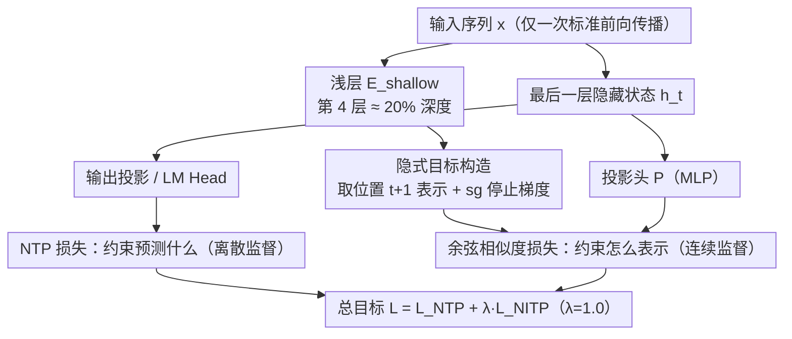

# NITP: Next Implicit Token Prediction for LLM Pre-training

**会议**: ICML 2026  
**arXiv**: [2605.24956](https://arxiv.org/abs/2605.24956)  
**代码**: 待确认  
**领域**: LLM 预训练 / 表示学习  
**关键词**: NTP 表示退化, 隐式目标, 浅层监督, 余弦相似度

## 一句话总结
NITP 通过用**浅层表示作为隐式目标**为最后隐藏状态提供连续的表示空间监督——补充标准 NTP 防止隐藏表示退化为低维各向异性配置，在 9B MoE 上 MMLU-Pro 提升 5.7%、推理任务普遍提升 4-6%，额外计算开销仅 ~2%。

## 研究背景与动机

**领域现状**：标准下一 token 预测（NTP）是 LLM 预训练的主流范式。NTP 本质上是在输出 logit 空间提供离散、独热的监督。

**现有痛点**：虽然梯度通过输出投影反向传播到隐藏状态，但 NTP 目标主要沿目标 logit 方向约束表示，在潜在空间留下大量弱约束的自由度。这导致**表示退化**——基于似然的训练会将学到的表示压缩到狭窄的各向异性圆锥体内，严重限制表达能力并与下游性能下降有关。

**核心矛盾**：NTP 定义了"预测什么"，但没有约束"如何表示"；隐藏状态可以采用多种几何不同的配置，但实际中会陷入表示退化——牺牲语义丰富性而获得判别效率。

**本文目标**：解决 NTP 在隐藏表示几何上的盲区，通过显式的表示级监督引导隐藏状态保持结构化、语义丰富的配置。

**切入角度**：不在离散 token 空间中工作，而是在连续表示空间中进行监督——让模型预测下一 token 的隐式语义表示（用模型自身的浅层表示作为自监督目标）。浅层之所以合适，是因为保留了丰富的词汇和局部语义细节。

**核心 idea**：NITP = NTP（离散监督）+ NITP（连续表示空间监督）；用浅层的下一 token 表示作为隐式目标，通过余弦相似度损失强制最后隐藏状态与之对齐，参数高效（隐式目标来自已计算的中间激活，无需额外前向传播）。

## 方法详解

### 整体框架
NITP 想补上标准 NTP 的一块短板：NTP 只在输出 logit 空间给监督，对"隐藏状态长成什么几何形状"几乎不管，于是隐藏表示容易退化到一个狭窄的各向异性圆锥里。NITP 的做法是在预训练时给最后一层隐藏状态再加一路连续的、表示空间的监督——让它去预测"下一个 token 的隐式语义表示"。

整条 pipeline 仍然只走一次标准前向传播：先用模型自己的浅层（如第 4 层）算出位置 $t+1$ 的表示 $z_{t+1}$ 并停止梯度，把它当作隐式目标；再从最后一层隐藏状态 $h_t$ 经一个投影头 $\mathcal{P}$ 去对齐这个目标。两路监督联合优化，$\mathcal{L}_{\text{NTP}}$ 管"预测什么"，$\mathcal{L}_{\text{NITP}} = 1 - \frac{\mathcal{P}(h_t)^\top z_{t+1}}{\|\mathcal{P}(h_t)\|_2 \cdot \|z_{t+1}\|_2}$ 管"怎么表示"，总目标为 $\mathcal{L}_{\text{total}} = \mathcal{L}_{\text{NTP}} + \lambda \mathcal{L}_{\text{NITP}}$（$\lambda = 1.0$ 最鲁棒）。

### 关键设计

**1. 隐式目标构造：用浅层自身表示当下一 token 的"语义锚"**

NTP 的梯度虽然能传回隐藏状态，但约束主要沿目标 logit 方向，潜在空间里留了大量弱约束的自由度，表示就在这些方向上塌成低维各向异性配置。NITP 不去离散 token 空间补监督，而是直接在连续表示空间里立一个目标：取模型自身浅层（第 4 层，约 20% 深度）在位置 $t+1$ 的表示 $z_{t+1} = \text{sg}[E_{\text{shallow}}(x_{\leq t+1})^{(t+1)}]$ 作为隐式目标。选浅层是因为浅层保留了最丰富的词汇和局部语义细节，逼着深层表示必须维持足够表达能力才能预测它。

这一步为什么能阻止退化，可以从 Hessian 看清楚：NTP 对 $h_t$ 的约束本质是它与目标 token embedding 的点积，对应 Hessian 秩亏，允许表示在零空间里随意漂移；NITP 的余弦对齐相当于把目标放到一个超球面上，其 Hessian 近似 $H_{\text{NITP}}(h) \approx \frac{1}{r^2} P_{\perp u}$（切空间投影），在所有正交方向上注入严格正曲率，等于把那些原本自由漂移的方向都"撑"成结构化几何。

**2. 余弦相似度损失：在表示空间对齐，绕开层间尺度失配**

预测状态和隐式目标都是高维向量，关键是用什么度量去拉近它们。NITP 选余弦相似度——$\mathcal{P}(\cdot)$ 是个简单 MLP 投影头，余弦在 $[-1,1]$ 上对称且对尺度不敏感。消融里它比 MSE、Smooth-$\ell_1$、KL 都稳：MSE 的二次惩罚会放大浅层与深层之间天然存在的尺度失配，训练中出现梯度尖峰甚至临时发散；KL 把向量硬当概率分布处理，引入额外几何扭曲。只有余弦这种"只看方向不看长度"的度量，才匹配"我要的是语义对齐而非数值复刻"这个目标。

**3. 停止梯度 + 完全自监督：约 2% 开销，不依赖任何外部数据或编码器**

隐式目标 $z_{t+1}$ 用 $\text{sg}[\cdot]$ 停止梯度，梯度只流向最后一层和投影头，不会回传到浅层——浅层因此能当一个稳定不动的"语义锚"（浅层本来也收敛更快）。整个监督信号由模型自己的中间激活生成，无需外部数据、无需额外前向传播，所以额外 FLOPs 只有约 2%，同时避开了引入第二个模型/外部分布带来的偏移和不稳定。

## 实验关键数据

### 主实验

| 模型 | 方法 | MMLU | MMLU-Pro | C3 | CommonsenseQA | 平均提升 |
|------|------|------|---------|-----|---------|---------|
| 1.9B MoE (0.3B active) | NTP | 31.05 | 7.14 | 32.21 | 25.38 | — |
| 1.9B MoE | NITP | 31.68 | 7.47 | 29.69 | 26.61 | +0.8 |
| 3B MoE | NTP | 34.60 | 11.00 | 39.06 | 34.15 | — |
| 3B MoE | NITP | 37.37 | 12.29 | 44.38 | 37.92 | +2.1 |
| **9B MoE** | **NTP** | 43.71 | 15.29 | 56.65 | 45.70 | — |
| **9B MoE** | **NITP** | **46.14** | **21.00** | **63.01** | **49.96** | **+2.7** |

9B 上 MMLU-Pro 绝对提升 5.7%；阅读理解和常识推理分别增长 6.4% 和 4.3%。

### 消融实验

| 配置 | MMLU | MMLU-Pro | CommonsenseQA | BBH | 平均 |
|------|------|---------|----------|-----|------|
| 基线 NTP | 34.60 | 11.00 | 34.15 | 21.92 | 25.42 |
| **浅层（L₄）** | **37.37** | **12.29** | **37.92** | **26.14** | **28.43** |
| 中层（L₈） | 35.33 | 11.57 | 34.72 | 22.07 | 25.92 |
| 深层（L₁₄） | 35.79 | 10.43 | 38.90 | 23.25 | 27.09 |
| 当前位置 t→t | 33.09 | 8.14 | 29.15 | 20.96 | 22.84 |
| MSE 损失 | 32.77 | 10.29 | 30.38 | 21.55 | 23.75 |
| 余弦正则（无预测） | 34.45 | 10.14 | 33.25 | 22.29 | 25.03 |

### 关键发现
- **浅层选择的必要性**：使用浅层表示（~20% 模型深度）比中层 / 深层都好——浅层保留更丰富的词汇和局部语义。
- **时间结构至关重要**：预测下一 token 隐式表示（$t \to t+1$）比当前位置对齐（$t \to t$）性能高 5.6 个百分点。
- **损失函数的稳定性差异**：MSE 会导致梯度尖峰和临时发散；只有余弦相似度完全稳定且性能最好。
- **正则化不等于预测**：通用余弦正则化虽约束表示几何但不提升性能——收益来自"预测对齐的"语义监督。
- **计算效率**：额外 FLOPs 仅 ~2%；$\lambda = 1.0$ 最鲁棒。

## 亮点与洞察
- **诊断表示退化的根本原因**：通过有效秩和余弦相似度可视化清晰展示 NTP 如何导致表示向低维各向异性配置漂移；理论分析用 Hessian 谱解释根本机制。
- **自监督隐式目标的巧妙设计**：浅层表示作为"语义锚"既不需要外部数据或模型，又因为浅层语义信息最丰富而成为理想监督信号。
- **通用性和可迁移性**：NITP 在 MoE 和稠密模型、0.5B 到 9B 参数范围、多种评估基准上都有效。
- **最小计算开销下的显著收益**：~2% 额外训练 FLOPs 代价下获得 5%+ 的知识理解提升和 6%+ 的推理能力提升。

## 局限与展望
- NITP 引入额外超参数（目标层、NITP 权重 $\lambda$），不同模型上的稳定性需进一步验证。
- 当前位置对齐完全失效的解释有待深化。
- 对于更大规模模型（> 100B）、不同架构、多模态模型的适用性需要验证。
- 隐式目标的浅层选择（第 4 层）可能对不同模型深度不是最优的。

## 相关工作与启发
- **vs 多 token 预测（MTP）**：MTP 在离散 token 空间扩展预测范围，NITP 在表示空间做监督，两者可互补。
- **vs 层蒸馏**：蒸馏对齐两个不同模型的表示，NITP 在同一模型内用浅层指导深层，避免外部分布偏移。
- **vs 自监督对比学习（BYOL）**：对比学习鼓励不同视角间的一致性，NITP 聚焦于时间维度的预测。
- **启发**：表示级别监督可以是解决 LLM 预训练目标不完全性的方向。

## 评分
- 新颖性: ⭐⭐⭐⭐⭐  用浅层隐式目标补充 NTP、从 Hessian 角度理论解释表示退化——想法简洁但深刻。
- 实验充分度: ⭐⭐⭐⭐⭐  多个模型规模、两种架构、丰富消融、理论分析与经验验证相结合。
- 写作质量: ⭐⭐⭐⭐  逻辑清晰，理论部分稍显抽象但重点突出。
- 价值: ⭐⭐⭐⭐⭐  直接改进 LLM 预训练效率和性能，2% 额外成本获 5%+ 收益，工业应用价值大。

<!-- RELATED:START -->

## 相关论文

- [\[CVPR 2026\] Chain-of-Models Pre-Training: Rethinking Training Acceleration of Vision Foundation Models](../../CVPR2026/self_supervised/com_pt_chain_of_models_pretraining.md)
- [\[ICLR 2026\] SNAP-UQ: Self-supervised Next-Activation Prediction for Single-Pass Uncertainty](../../ICLR2026/self_supervised/snap-uq_self-supervised_next-activation_prediction_for_single-pass_uncertainty_i.md)
- [\[CVPR 2026\] Reading Your Actions: Learning Generalizable Action Representations via Pre-training AEMG](../../CVPR2026/self_supervised/reading_your_actions_learning_generalizable_action_representations_via_pre-train.md)
- [\[ECCV 2024\] Efficient Image Pre-Training with Siamese Cropped Masked Autoencoders](../../ECCV2024/self_supervised/efficient_image_pre-training_with_siamese_cropped_masked_autoencoders.md)
- [\[AAAI 2026\] Towards LLM-Empowered Knowledge Tracing via LLM-Student Hierarchical Behavior Alignment in Hyperbolic Space](../../AAAI2026/self_supervised/towards_llm-empowered_knowledge_tracing_via_llm-student_hierarchical_behavior_al.md)

<!-- RELATED:END -->
