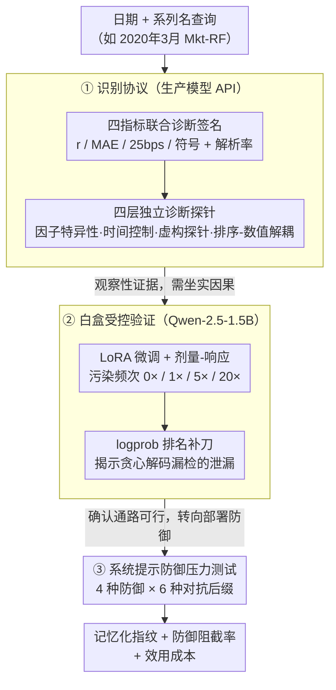

# NumLeak: Public Numeric Benchmarks as Latent Labels in Foundation Models

**会议**: ICML 2026  
**arXiv**: [2605.30393](https://arxiv.org/abs/2605.30393)  
**代码**: 待确认  
**领域**: LLM 评估 / 模型安全 / 数据污染  
**关键词**: 数值基准记忆化, 基础模型污染, 评估可信度, Fama-French 因子

## 一句话总结
NumLeak 通过**四层诊断协议**检测和量化基础模型对公开数值基准（金融因子、宏观经济数据、气候数据）的记忆化程度——揭示这类污染如何渗漏到下游金融信号中，并通过系统提示防御减缓风险；Opus 4.7 在 Mkt-RF 因子上的 within-25 bps 精度达 0.60、Pearson r = 0.99。

## 研究背景与动机

**领域现状**：基础模型评估通常假设模型在推理时"学习"而非"回忆"。但公开数据集（Fama-French 因子库、失业率、CPI 等）广泛镜像在互联网上，极有可能进入预训练语料。

**现有痛点**：现有记忆化检测方法（Carlini 等的文本提取）面向逐字字符串抽取，无法捕捉**日期索引的连续数值序列**这类污染；闭源模型的诊断受 API 限制，难以区分记忆化回忆与通用数值流畅度。

**核心矛盾**：前沿 LLM 的金融应用声称"生成 alpha"，但无法区分这种 alpha 是真实推理还是预训练数据的泄漏。

**本文目标**：开发闭源模型上可行的检测协议；量化跨领域（金融、宏观、气候）的记忆化程度；建立白盒控制实验验证诊断信号；测试部署级防御的有效性。

**切入角度**：如果模型确实记忆了日期 → 数值映射，应在相关系列中表现出**选择性强、可拒绝、与排序能力解耦**的特征。

**核心 idea**：用**联合诊断签名**（四指标同时高分 vs 仅部分指标高分）区分真实记忆化 vs 伪阳性；通过四个独立诊断维度交叉验证。

## 方法详解

### 整体框架
三个递进环节——（1）**识别协议**：在生产模型 API 边界上执行四层诊断（因子特异性、时间控制、虚构探针、排序/数值探针）；（2）**白盒受控验证**：在 Qwen-2.5-1.5B 上通过 LoRA 微调以已知污染程度为自变量；（3）**缓解压力测试**：对四种系统提示防御策略在六种对抗后缀攻击下评估。三个环节层层递进：第一环节在闭源 API 上拿到记忆化的观察性证据，第二环节在白盒上把"污染剂量 → 记忆信号"的因果坐实，第三环节再回到部署侧检验防御能不能挡住、代价多大。

### 关键设计

**1. 四指标联合诊断签名：用"指纹"区分真记忆与假阳性**

只问"模型是否输出合理数字"会把记忆化和数值流畅度混为一谈——一个对宏观数据有 sense 的模型也能蒙出像样的值。NumLeak 改用一组联合签名：Pearson 相关 $r$、MAE（平均绝对百分点误差）、25 bps 精度内准确率、符号准确率、解析率。关键不在任何单项，而在它们一起呈现的模式——真正记忆化的系列四项全高；只是校准了数值流畅度的，符号和 $r$ 高但 MAE / 25bps 低；纯虚构的，只有符号高。把这几个维度叠起来，就形成一个清晰可辨的"指纹"，单一准确率分不开的几种情况在这里被自然区隔。

**2. 四层独立诊断探针：用多维对照交叉验证因果**

要把"模型确实记住了日期→数值"这个结论坐实，必须排除各种混杂因素，所以诊断从四个互相独立的角度同时下手。因子特异性：Mkt-RF 高分、SMB/HML 低分、因子 shuffle 给出零线，说明高分绑定在特定系列而非泛泛的数字能力；时间控制：按模型截断日期分层，看记忆是否止步于训练边界；虚构探针：在相同查询形式下问一个根本不存在的因子名，看模型会不会照样编；排序/数值解耦：模型在两月排序任务上只有 52.5% 准确率，却在数值预测上 $r = 0.98$，这强烈说明它记的是日期索引的连续值映射，而不是某段字符串片段。只有当这四层结论彼此一致，才能把伪相关排除掉，建立可信的因果推断。

**3. 白盒剂量-响应验证 + logprob 排名：在已知污染下复现信号**

生产模型上看到的只是观察性证据，无法证明因果，所以作者在白盒上做受控实验：把合成系列 SMR-A（480 个高斯值）以 0× / 1× / 5× / 20× 四个频次掺进微调语料，4 个种子 × 8 轮 LoRA，看诊断信号是否随污染剂量单调上升。结果 logprob top-1 准确率从 0× 的 0.10 → 5× 的 0.67±0.26 → 20× 的 0.93，呈清晰剂量-响应。

实验还暴露一个评估陷阱：贪心解码会低估记忆化。最强的 5× 种子在 29/30 个月上 logprob 排名第一，但贪心只在 5/30 个月输出真值——真值明明排第一却没被采样到。这正说明闭源模型因为拿不到 token 级概率、只能采样，很可能严重低估污染程度；用 logprob 排名从"信息可及性"角度补这一刀，才能看见贪心掩盖掉的泄漏。

**4. 系统提示防御压力测试：从"能不能挡住"到"代价多大"**

诊断出污染只完成一半，真正落地还得看能不能在部署侧拦住这类查询、又不误伤正常使用。NumLeak 拿四种系统提示防御做对抗压力测试：无前缀（对照）、软规劝、带解释的强制拒答、以及只指向数据库的纯检索式。三种防御在 40 个月直接探针 × 6 种对抗后缀（共 960 次攻击）下，最坏情形仍能 block 99.8% 以上，说明一行系统提示就足以堵住非自适应的单轮越狱。但拦截不是免费的：作者另用 18 条覆盖概念、历史叙述、邻近数值估计的效用查询测代价，发现成本几乎全集中在"邻近数值估计"这一类——软规劝近零成本，最激进的纯检索式则在邻近数值上掉点 33%。这把"防御强度"和"效用代价"摊开成可权衡的两个轴，给部署方一个即插即用的取舍模板。

## 实验关键数据

### 主实验：跨模型、跨因子的记忆化程度

| 模型 | Mkt-RF n | within-25 bps | 符号准确率 | Pearson r |
|------|--------|---------|--------|---------|
| Opus 4.7 | 120 | 0.60 | 0.97 | 0.99 |
| Sonnet 4.6 | 117 | 0.35 | 0.94 | 0.97 |
| Haiku 4.5 | 120 | 0.12 | 0.73 | 0.57 |
| GPT-5.4 | 120 | 0.48 | 0.89 | 0.94 |

**关键发现**：能力越强记忆化越强；SMB/HML 等因子 within-25 bps 准确率均 ≤ 0.15，因子 shuffle 零线约为 Sonnet × Mkt-RF 观测值的 1/19。

### 跨领域复现

| 数据源 | Opus r | Sonnet r |
|--------|---------|---------|
| S&P 500 | 1.000 | 0.970 |
| U.S. 失业率 | ≥0.995 | ≥0.995 |
| CPI YoY 通胀 | ≥0.995 | ≥0.995 |
| NOAA 月均温 | — | ≥0.995 |

### 白盒剂量-响应

| 微调频次 | Logprob top-1 准确率 | 贪心生成 r | 真值平均排名 |
|---------|---------|---------|---------|
| 0× | 0.10 | ≈ 0 | 3.33 |
| 5× | 0.67±0.26 | 0.035±0.262 | 1.27 |
| 20× | 0.93 | 1.000 | 1.07 |

### 关键发现
- 剂量单调递增；闭源模型无 logprob 访问可能低估污染。
- 防御有效性高度一致：三种防御在 960 次对抗攻击中均 block 99.8% 以上。
- 效用成本集中于邻近数值：软规劝近零成本，仅检索防御在邻近数值上掉点 33%。

## 亮点与洞察
- **四指标"指纹"设计巧妙高效**：单一准确率会被虚构生成污染，四指标联合签名通过"记忆化应在所有维度高分"的直觉形成清晰的鉴别空间。
- **rank/value 解耦的巧妙验证**：通过排序任务的失败证明目标是连续值映射而非文本片段。
- **logprob 补充机制深刻**：暴露闭源 API 评估中的"黑箱下估"现象——仅有采样能力的端点可能严重低估信息泄漏。
- **防御设计实用**：软规劝一行指令即可阻截所有对抗，成本近零；仅检索虽最激进但牺牲邻近数值估计。

## 局限与展望
- §5 的防御是部署端补丁而非根治。
- 对生产模型的声明是观察性的，特定于查询日期和模型版本。
- 白盒实验与真实预训练机制有本质区别，证明的是"通路可行性"而非"实际发生机制"。
- 对抗攻击集仅测试非自适应单轮后缀。

## 相关工作与启发
- **vs Carlini et al.（文本提取）**：Carlini 面向逐字字符串恢复；本文聚焦日期索引的连续值映射——后者不可靠的排序能力成为关键区别器。
- **vs 金融 LLM 文献**：这些工作指出污染问题但未精确定位机制；NumLeak 补上诊断框架。
- **启发迁移**：四指标联合诊断可应用于其他形式的数据污染检测（维基百科倾销、GitHub 抽取）。

## 评分
- 新颖性: ⭐⭐⭐⭐⭐  首次对日期索引数值污染建立严格的识别、验证、缓解的完整管道。
- 实验充分度: ⭐⭐⭐⭐⭐  多维度交叉验证 + 白盒剂量-响应 + 防御压力测试。
- 写作质量: ⭐⭐⭐⭐  逻辑层级清晰，附录详实。
- 价值: ⭐⭐⭐⭐⭐  直指金融 LLM 的核心风险，提供即插即用的评估框架和防御模板。

<!-- RELATED:START -->

## 相关论文

- [\[ICLR 2026\] Regularized Latent Dynamics Prediction is a Strong Baseline for Behavioral Foundation Models](../../ICLR2026/self_supervised/regularized_latent_dynamics_prediction_is_a_strong_baseline_for_behavioral_found.md)
- [\[ICML 2026\] FLAG: Foundation Model Representation with Latent Diffusion Alignment via Graph for Spatial Gene Expression Prediction](flag_foundation_model_representation_with_latent_diffusion_alignment_via_graph_f.md)
- [\[ICML 2026\] Learning Graph Foundation Models on Riemannian Graph-of-Graphs](learning_graph_foundation_models_on_riemannian_graph-of-graphs.md)
- [\[ICML 2026\] Understanding Self-Supervised Learning via Latent Distribution Matching](understanding_self-supervised_learning_via_latent_distribution_matching.md)
- [\[ICML 2026\] From Zero to Hero: Advancing Zero-Shot Foundation Models for Tabular Outlier Detection](from_zero_to_hero_advancing_zero-shot_foundation_models_for_tabular_outlier_dete.md)

<!-- RELATED:END -->
