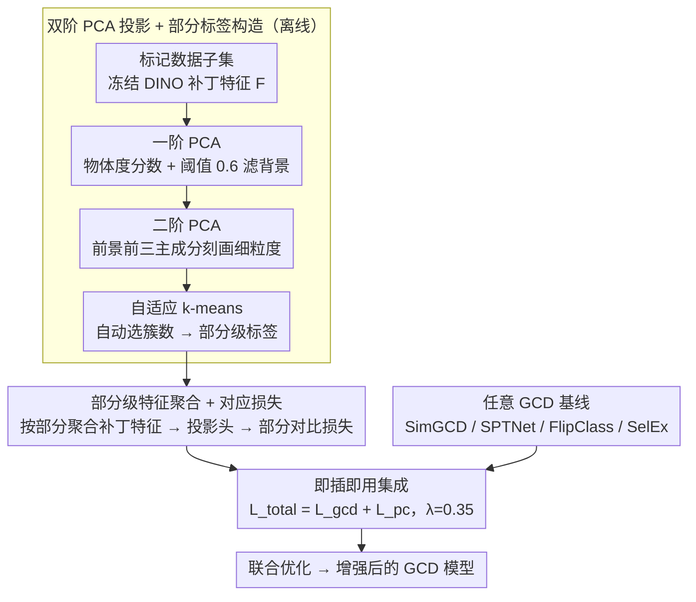

# PartCo: Part-Level Correspondence Priors Enhance Category Discovery

**会议**: ICML 2026  
**arXiv**: [2509.22769](https://arxiv.org/abs/2509.22769)  
**代码**: 待确认  
**领域**: 自监督学习 / 开放世界视觉  
**关键词**: 类别发现, 部分级对应, ViT 特征, 部分级对比学习

## 一句话总结
PartCo 通过显式利用 Vision Transformer 的补丁令牌中蕴含的**部分级特征对应关系**，引入一个**即插即用**的框架来增强广义类别发现——在 CUB / Stanford-Cars / ImageNet-100 等多个基准上将 SimGCD / SPTNet / FlipClass 等基线提升 2-10%。

## 研究背景与动机

**领域现状**：广义类别发现（GCD）旨在利用少量已标记的已知类别样本，在未标记数据中同时识别已知类别和新颖类别。

**现有痛点**：现有 GCD 方法主要依赖于全局图像表示（如 Transformer 的 [CLS]），捕捉全局语义信息但抽象掉细粒度的部分级信息——导致在区分高度相似的类别时表现不佳。

**核心矛盾**：ViT 模型中的补丁令牌包含丰富的部分级语义信息，但直接使用面临三大挑战——（1）缺乏显式的部分级语义标签；（2）前景-背景噪声的混淆；（3）物体跨样本间的尺度和方向变化。

**本文目标**：从 ViT 的补丁令牌中自动提取部分级对应标签，并将其作为监督信号指导特征学习。

**切入角度**：自监督基础模型（特别是 DINOv2）的补丁令牌特征天然包含部分级对应信息——与其让模型从零学习部分，不如显式构造部分级标签来指导特征对齐。

**核心 idea**：通过双阶 PCA 投影从冻结的 DINO 模型补丁令牌中提取物体区域和细粒度特征，再用 k-means 聚类生成部分级标签，随后设计配套的对比损失函数。

## 方法详解

### 整体框架
两阶段——**离线阶段**：使用冻结的预训练 DINO 模型在已标记数据子集上进行两步 PCA 投影自动生成部分级对应标签；**训练阶段**：基于部分级标签聚合 ViT 补丁特征，引入部分级对应损失函数与 GCD 基线损失函数联合优化。

### 关键设计

**1. 双阶 PCA 投影 + 部分标签构造：从冻结 ViT 里自动挖出物体部分**

GCD 难在区分高度相似的类，而 [CLS] 这种全局表示把细粒度部分信息抽象掉了。补丁令牌里其实藏着丰富的部分级语义，但直接用有三个拦路虎：没有部分级标签、前背景噪声混淆、跨样本尺度方向变化。PartCo 用两步 PCA 把这些部分自动提取成标签。第一阶 PCA 对所有补丁特征 $\mathbf{F} \in \mathbb{R}^{M \times N \times d}$ 求最大方差方向 $\mathbf{w}_{\text{obj}}$，算物体度分数 $\mathbf{F}_{\text{obj}} = \mathbf{F} \cdot \mathbf{w}_{\text{obj}}$，再用阈值 $\tau_{\text{obj}} = 0.6$ 生成前景掩码 $\mathbf{M}$，先把背景噪声滤掉；第二阶 PCA 只对掩码后的特征 $\mathbf{F} \odot \mathbf{M}$ 提前三主成分得 $\mathbf{F}_{\text{fg}}$，刻画前景内部的细粒度结构。最后自适应 k-means 通过最大化"簇中心距离 × 簇大小均衡性"自动选簇数。

这一步的关键是借冻结基础模型（尤其 DINOv2）补丁特征里天然的部分级对应，不用任何人工标注。粒度还能按数据集自适应——细粒度数据集用一阶就够，通用数据集才上二阶补更多细节。

**2. 部分级特征聚合 + 对应损失：让相同部分跨样本对齐**

有了部分标签，就把补丁特征按部分分组聚合：对每个部分类别 $c$ 求平均得 $\mathbf{f}_c$，过部分投影头 $\psi_p$ 投到对比空间 $\mathbf{h}_c = \psi_p(\mathbf{f}_c)$。监督部分对比损失为

$$\mathcal{L}_{\text{pc}}^{\text{sup}} = \frac{1}{|B_l|} \sum_i \frac{1}{|\mathcal{C}|} \sum_c \frac{1}{|\mathbb{N}_i^c|} \sum_q -\log \frac{\exp(\mathbf{h}_c \cdot \mathbf{h}_q / \tau_r)}{\sum_{j \notin \mathbb{N}_i^c} \exp(\mathbf{h}_c \cdot \mathbf{h}_j / \tau_r)}$$

让同一部分类内紧聚、不同部分类间分离；无标注数据用伪标签替代真标签走同样的损失。这个显式的部分级约束迫使模型学到跨样本的部分对应关系，从而捕捉到仅靠全局特征看不见的细微视觉结构差异——这正是区分相似类所缺的信号。

**3. 即插即用集成：只在损失层叠一项，任何 GCD 基线都能用**

PartCo 不改原方法的任何管道，只在损失函数上加一项：总损失 $\mathcal{L}_{\text{total}} = \mathcal{L}_{\text{gcd}} + \mathcal{L}_{\text{pc}}$，平衡因子 $\lambda_b = 0.35$（实验验证为最优且鲁棒）。因为部分级约束是作为额外监督叠加的，SimGCD、SPTNet、FlipClass、SelEx 等不同范式的基线都能直接受益，无需为每个方法重新设计。

## 实验关键数据

### 主实验

| 方法 | 数据集 | All ACC | Old ACC | New ACC | 相比基线提升 |
|------|--------|---------|---------|---------|------------|
| SimGCD | CUB | 71.5% | 78.1% | 68.3% | 基线 |
| **PartCo-SimGCD** | CUB | **81.1%** | 82.4% | 80.5% | **+9.6%** |
| SPTNet | CUB | 76.3% | 79.5% | 74.6% | 基线 |
| **PartCo-SPTNet** | CUB | **82.6%** | 82.3% | 81.8% | **+6.3%** |
| FlipClass | CUB | 79.3% | 80.7% | 78.5% | 基线 |
| **PartCo-FlipClass** | CUB | **85.2%** | 86.3% | 84.7% | **+5.9%** |
| SelEx | CUB | 87.4% | 85.1% | 88.5% | 基线 |
| **PartCo-SelEx** | CUB | **90.6%** | 84.5% | 93.2% | **+3.2%** |

**SSB 细粒度基准平均结果**（DINOv2）：SimGCD 69.0% → 78.8% (+9.8%)；SPTNet 72.2% → 80.4% (+8.2%)；FlipClass 76.1% → 80.9% (+4.8%)；SelEx 83.1% → 85.5% (+2.4%)。

### 消融实验

| 配置 | CUB All | Stanford-Cars All | 说明 |
|------|---------|------------------|------|
| 无部分级约束（基线） | 71.5% | 71.5% | 原始基线 |
| 仅一阶标签 | 79.3% | 76.9% | 适合细粒度 |
| 仅二阶标签 | 73.1% | 71.8% | 在细粒度上过度分割 |
| 一阶 + 二阶结合 | 77.2% | 75.6% | 混合方案 |
| **完整 PartCo** | **81.1%** | **78.9%** | 自适应最优 |

### 关键发现
- 一阶标签在细粒度数据集上表现最佳；二阶标签在通用数据集（ImageNet-100）上优于一阶。
- 投影维度 $d' = 128$ 最优，更高维度反而过拟合。
- 无监督部分损失的加入显著提升性能（+2.1%）——对未标记数据的约束很关键。
- 平衡因子 $\lambda_b = 0.35$ 鲁棒性最强。

## 亮点与洞察
- **巧妙的自监督信号构造**：通过冻结基础模型的先天结构（补丁令牌）直接获取部分级对应标签，无需额外标注；相比 SPTNet 逐像素学习提示，PCA + 聚类方式更稳定高效。
- **通用且轻量的增强机制**：PartCo 作为独立模块可与任意 GCD 方法组合；在 SimGCD / SPTNet / FlipClass / SelEx 等不同范式上都有收益。
- **数据集自适应的粒度选择**：通过一 / 二阶标签的自动切换优雅地处理细粒度和通用数据集的异质性。

## 局限与展望
- 离线标签构造成本：部分标签需提前构建（5-180 分钟因数据集大小不同）。
- 阈值和簇数选择的启发式：仍依赖预设阈值 $\tau_{\text{obj}} = 0.6$、k-means 初始化等。
- 部分语义的有限性：提出的部分标签是纯视觉聚类结果，未必对应真实语义部分。
- 改进：引入弱语义先验引导 PCA 投影；设计在线动态更新机制；在 3D 物体发现、视频帧序列等扩展。

## 相关工作与启发
- **vs SPTNet**：都关注部分级信息，但 SPTNet 是学习像素级提示掩码需要监督反向传播；PartCo 直接从冻结模型提取对应标签更稳定。
- **vs HypCD**：HypCD 通过双曲空间改变几何度量；PartCo 通过显式部分结构注入视觉归纳偏置。
- **vs 自监督部分发现方法**：PartCo 利用已冻结 DINO 的隐性部分知识——大规模自监督预训练已充分学会视觉结构。

## 评分
- 新颖性: ⭐⭐⭐⭐  部分级对应标签的自动构造巧妙，与现有 GCD 方法的集成方式优雅。
- 实验充分度: ⭐⭐⭐⭐⭐  覆盖细粒度和通用数据集 + 多个基线 + 多骨干（DINOv2/v3/CLIP） + 详细消融。
- 写作质量: ⭐⭐⭐⭐  结构清晰、逻辑递进顺畅。
- 价值: ⭐⭐⭐⭐⭐  在 GCD 这一开放世界视觉的重要问题上，贡献了简单有效的增强机制，有潜力成为标准组件。

<!-- RELATED:START -->

## 相关论文

- [\[CVPR 2026\] Decouple Your Discovery and Memory in Continual Generalized Category Discovery](../../CVPR2026/self_supervised/decouple_your_discovery_and_memory_in_continual_generalized_category_discovery.md)
- [\[CVPR 2025\] Hyperbolic Category Discovery](../../CVPR2025/self_supervised/hyperbolic_category_discovery.md)
- [\[ICML 2026\] Scaling Continual Learning to 300+ Tasks with Bi-Level Routing Mixture-of-Experts](scaling_continual_learning_to_300_tasks_with_bi-level_routing_mixture-of-experts.md)
- [\[CVPR 2026\] OmniGCD: Abstracting Generalized Category Discovery for Modality Agnosticism](../../CVPR2026/self_supervised/omnigcd_abstracting_generalized_category_discovery_for_modality_agnosticism.md)
- [\[AAAI 2026\] GOAL: Geometrically Optimal Alignment for Continual Generalized Category Discovery](../../AAAI2026/self_supervised/goal_geometrically_optimal_alignment_for_continual_generalized_category_discover.md)

<!-- RELATED:END -->
