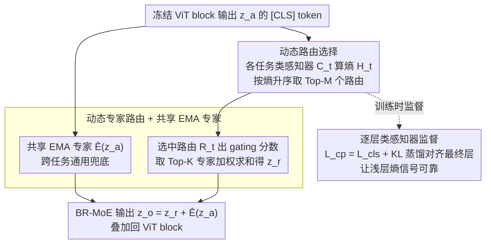

# Scaling Continual Learning to 300+ Tasks with Bi-Level Routing Mixture-of-Experts

**会议**: ICML 2026  
**arXiv**: [2602.03473](https://arxiv.org/abs/2602.03473)  
**代码**: https://github.com/LMMMEng/CaRE (有)  
**领域**: 持续学习 / 类增量学习 / MoE / 参数高效微调  
**关键词**: 类增量学习、Bi-Level Routing、Mixture-of-Experts、长任务序列、OmniBenchmark-1K

## 一句话总结
作者提出 CaRE：在 ViT 每个 block 里塞一个 **两级路由 MoE (BR-MoE)** ——先靠"类感知器"按熵选 Top-M 个相关任务路由，再由这些路由各自激活 Top-K 任务专家并叠加一个共享 EMA 专家，于是哪怕任务序列拉到 300+ 也能既保留旧知识又持续吸纳新类，并把"长序列 CIL"这块此前没人正经做的空白填上（顺便发布了 1000 类的 OmniBenchmark-1K 基准）。

## 研究背景与动机

**领域现状**：基于预训练模型 (PTM) 的类增量学习 (CIL) 是近年最火的方向，主流分两路——prompt-based (L2P、DualPrompt、CODA-Prompt) 和 adapter-based (EASE、APER、SEMA、MOS、TUNA、MIN)。后者通常给每个任务训一个 task-specific adapter，推理时挑合适的激活。

**现有痛点**：(1) 单个 adapter 只对它训练的那几类有判别力——任务序列一长，跨任务相关类 (例如不同任务都有动物子类) 的鉴别变差；(2) 现有方法要么用"所有历史 adapter 全局聚合"这种粗粒度做法，要么用单一 adapter，无法精细从相关历史任务里捞补充知识；(3) 现有 CIL 几乎清一色在 5–20 个任务上评估，超长序列（百级别）下大量方法直接崩盘——但学术界根本没有能撑住 100+ 任务的 benchmark，CIFAR-100 拆 100 个任务每个就只剩 1 类，ImageNet 又跟 PTM 训练集重叠。

**核心矛盾**：要做"既判别又综合"的特征表示，必须 (a) 知道当前样本可能来自哪些任务，(b) 把这些任务的 adapter 知识在每一层细粒度地融合，(c) 同时保留一份"跨任务通用"的共享知识。但每个特性单独看都已经被部分方法做过——真正缺的是把它们组成一个 **可在每层做"先选路由再选专家"两级决策** 的统一架构。

**本文目标**：(i) 设计一个可在每层做细粒度跨任务知识检索的 PEFT 模块；(ii) 让它能扩展到 300+ 任务；(iii) 配套一个真正考验长序列扩展性的基准。

**切入角度**：作者把 MoE 的 router 思路拆成两级——粗 (按任务) + 细 (按 adapter 专家)，并用"任务专属分类头的熵"作为"我有多确定这个样本属于该任务"的信号。这个观察很关键：低熵 = 高置信度 = 任务相关，比"任务 ID 直接预测"鲁棒得多。

**核心 idea**：在 ViT 每个 block 注入 **(类感知器 $C_t$, 路由 $R_t$, 专家 $E_t$) 三元组**，每来一个新任务就加一组；推理时按熵选 Top-M 路由，每个路由再按 gating 选 Top-K 专家，配上一个 EMA 维护的共享专家做兜底——用 bi-level routing 取代"全局聚合 / 单 adapter"的二极管设计。

## 方法详解

### 整体框架
backbone 是冻结的 ViT-B/16（ImageNet-21K 预训练），每个 Transformer block 替换成 $z_a = \text{MHSA}(\text{Norm}_1(z)) + z$，$z_f = \text{FFN}(\text{Norm}_2(z_a)) + z_a$，$z' = \text{BR-MoE}(z_a) + z_f$。增量学习每来一个新任务 $t$：(1) 在每个 block 的 BR-MoE 里加一个新三元组 $(C_t, R_t, E_t)$；(2) 训练时只更新当前层的新三元组以及共享专家 $\bar{E}$（其他参数全部冻结）；(3) 推理时按 bi-level 流程动态聚合各层输出。最终分类用拼接式角度 margin 头 $W_t = [w^1, \dots, w^t]$，类 logits 用余弦相似度 $\cos(\theta_i^j) = \frac{w_j^t \cdot \phi^t(x_i^t)}{\|w_j^t\| \|\phi^t(x_i^t)\|}$，配缩放因子 $\tau = 20$。每个 block 内 BR-MoE 的工作流如下图：先做第一级路由选择，再做第二级专家路由并叠加共享专家，逐层类感知器监督则在训练时保证浅层熵信号可靠。

### 关键设计

**1. 动态路由选择：按"分类头的熵"挑出 Top-M 个最相关的历史任务**

任务序列一长，单个 task-specific adapter 只对它训过的那几类有判别力，跨任务相关类就分不清；而"全局聚合所有历史 adapter"又把相关性稀释掉。BR-MoE 的第一级路由先解决"该听哪些任务的"。它把 $z_a$ 的 [CLS] token 喂给每个任务的类感知器 $C_t = \rho^t \in \mathbb{R}^{d \times |G^t|}$，得到任务 $t$ 内的类分布 $s_t = \text{Softmax}(C_t(z_a^{[CLS]}))$，再算它的熵 $\mathcal{H}_t = -\sum_j s_t^{(j)} \log s_t^{(j)}$，按熵升序取 Top-M 个对应路由 $R_t$。

用熵而不是直接预测任务 ID，是这级路由最关键的一点：低熵代表"这个分类头对当前输入很有把握"，意味着输入大概率属于该任务的类。相比硬训一个全局任务分类器再 argmax（很容易选错、且对训练-推理分布漂移敏感），用各任务自身分类头的置信度做相关性度量要鲁棒得多，而且可以在每一层独立做这个局部决策。训练时强制把最新任务路由 $R_T$ 始终纳入以保证新任务能学进去，推理时则全部按熵动态选。

**2. 动态专家路由 + 共享 EMA 专家：路由内部再细选 Top-K adapter，并留一份跨任务兜底知识**

光选到任务还不够细——每个任务内部还得再挑"最该激活的几个 adapter"，并且要有一份所有任务都能用的通用知识，免得某些样本被所有 task-specific adapter 都"摸不着"。被选中的路由 $R_t$ 是个 $\eta^t \in \mathbb{R}^{d \times t}$ 的线性层加 softmax，对 $z_a^{[CLS]}$ 产生 $t$ 个 gating 分数，取 Top-K 重新归一化得到 $\{a_i\}$，对应 adapter $E_i$ 的输出按这个分数加权求和。以 M=2、K=2 为例，$z_1 = a_2 E_2(z_a) + a_t E_t(z_a)$、$z_2 = b_{T-1} E_{T-1}(z_a) + b_T E_T(z_a)$，合起来 $z_r = z_1 + z_2$。

在此之上再叠一个共享专家 $\bar{E}$：第一个任务上完整训练，之后用 EMA $\delta_s \leftarrow \mu \delta_s + (1 - \mu)\delta_t$（$\mu = 0.999$）维护，BR-MoE 最终输出 $z_o = z_r + \bar{E}(z_a)$。默认 M=2、K=3，常规 adapter 用 16 维 bottleneck，共享 adapter 用 64 维。这个共享专家承担跨任务通用先验的角色——尤其在长序列后期，新任务样本可能跟所有历史 adapter 都不太匹配，此时它提供基础特征避免崩盘（思路借自 DeepSeek-MoE 的共享专家）。

**3. 逐层类感知器监督：用 KL 蒸馏让浅层也产生靠谱的熵信号**

BR-MoE 在每个 block 都独立做路由决策，前提是 $C_t$ 在该层算出的熵能反映任务相关性；可浅层特征语义弱，熵就没意义，路由会被误导。为此在每层 $C_t$ 上加监督 $\mathcal{L}_{cp}^\ell = \mathcal{L}_{cls}^\ell + \mathcal{L}_{KL}^\ell$：$\mathcal{L}_{cls}^\ell$ 是该层的角度 margin 分类损失，$\mathcal{L}_{KL}^\ell$ 让浅层分布 $s_t$ 去对齐最终层 softmax 输出 $p_t$，鼓励浅层类感知器模仿深层的高语义分布。总目标 $\mathcal{L} = \mathcal{L}_{cls} + \lambda \frac{1}{L}\sum_\ell \mathcal{L}_{cp}^\ell$（$\lambda = 1$）。这样每层的熵信号都被对齐到最终决策，bi-level routing 在浅层才真正有用。

### 损失函数 / 训练策略
新任务 $t$ 到来时冻结历史所有参数，只训当前层的 $(C_t, R_t, E_t)$ 以及共享专家 $\bar{E}$。优化器 SGD（momentum=0.9, weight decay=5e-4），batch=16，每任务 20 epochs，lr=0.01 cosine 退火。每层强制 $R_T$ 始终激活以防冷启动。

## 实验关键数据

### 主实验
新提出的 OmniBenchmark-1K (1000 类 / 19 万图 / 21 视觉领域) 长序列对比，指标 $\bar{\mathcal{A}}$（平均精度） / $\mathcal{A}_B$（最后精度）：

| 方法 | 100 tasks (B0 Inc10) $\mathcal{A}_B$ | 200 tasks (B0 Inc5) $\mathcal{A}_B$ | 151 tasks (B100 Inc6) $\mathcal{A}_B$ | 301 tasks (B100 Inc3) $\mathcal{A}_B$ |
|---|---|---|---|---|
| L2P | 48.87 | 45.25 | 10.49 | 9.03 |
| DualPrompt | 49.45 | 45.62 | 12.90 | 9.30 |
| APER-Adapter | 62.24 | 61.53 | 62.99 | 62.99 |
| TUNA | 60.04 | 59.14 | 62.77 | 62.21 |
| MOS | 64.27 | 63.51 | 65.20 | 64.37 |
| MIN | 63.60 | 62.50 | 60.33 | 59.63 |
| **CaRE** | **68.27** | **67.46** | **69.01** | **68.51** |

可以看出在最长序列 301 任务上 CaRE 比 MOS 高 4 个点，比 prompt-based 方法（已经崩到 9% 准确率）拉开几十个点的差距。短序列 CIL（CIFAR-100/ObjectNet/ImageNet-R/-A/VTAB 5-20 任务）上 CaRE 仍然多数 SOTA，比如 ImageNet-A 20 任务的 $\mathcal{A}_B$ = 59.91 比 TUNA 高 1.2 个点。

### 消融实验

| 配置 | 关键指标变化（OmniBenchmark-1K） | 说明 |
|---|---|---|
| Full CaRE | 67.46 | 完整模型 |
| 单 router (M=1) | 明显下降 | 验证"激活多个路由"的必要性 |
| 不要共享专家 | 下降 | EMA 共享专家承担跨任务通用知识，去掉后所有样本只能落到 task-specific adapter 上 |
| 用单一任务分类器替代熵选 router | 下降 | 验证用熵代替"硬任务 ID 预测"更鲁棒 |
| 去掉中间层 KL 监督 | 下降 | 浅层熵信号不准，bi-level routing 失效 |

### 关键发现
- **bi-level routing > single routing**：单层 router 选 Top-M 任务，再每个任务内挑 Top-K 专家，效果远好于"直接对所有 adapter 做一次 gating"。
- **熵 > 任务 ID 预测**：熵综合反映了"分类头对样本的整体不确定性"，比硬 argmax 更稳。
- **共享专家是兜底**：尤其在长序列后期，新任务样本可能跟所有历史 adapter 都不太匹配，此时 EMA 共享专家提供基础特征，避免崩盘。
- **MIN/SEMA/MoAL 等方法在短序列上跟 CaRE 接近，但 100+ 任务时严重退化**——长序列才是 PTM-based CIL 的真正试金石。

## 亮点与洞察
- **把 MoE 的 routing 思想分层做**：粗-细两级 router，每级都有明确语义（任务级 / 专家级）；这种"先按任务大类聚类，再在类内做专家选择"的思路天然契合长序列 CIL，并且很容易迁移到其他需要"在大库里挑相关项目再细粒度组合"的场景（比如检索增强生成里先选文档集再选 chunk）。
- **熵作为路由信号**：把每个任务专属分类头的熵当作"输入相关性度量"，避免直接训"全局任务分类器"的脆弱性——这种用"任务模型的自信度"代替"显式 task ID"的设计非常巧妙，可以借鉴到其他模块化系统。
- **OmniBenchmark-1K 是真贡献**：CL 社区长期缺一个真正能压垮所有方法的长序列基准，这个 1000 类、21 领域、PTM 训练集无泄漏的数据集填了缺口，之后会成为长序列 CIL 的标准评测。
- **每层独立做局部决策**：不同深度的特征抽象层次不同，BR-MoE 让每层根据自己看到的特征独立选 router/expert，比"在最终输出上做一次全局聚合"更有针对性。

## 局限与展望
- 每来一个新任务都加一组 $(C_t, R_t, E_t)$，参数线性增长。在 301 任务下，每层就有 301 个 adapter——总参数不算大但推理时即便只激活 Top-K 也要遍历所有 $C_t$ 算熵，**计算复杂度随任务数线性增长**。
- 没讨论任务边界模糊（task-free CL）的情况——CaRE 假设每个 task 有明确边界、可以训独立三元组，对流式无边界场景需要额外的任务检测机制。
- 共享专家 EMA $\mu = 0.999$ 固定，没自适应；在任务分布剧烈变化时 EMA 可能跟不上。
- 没探讨任务遗忘的形式化分析，例如哪些类最容易被遗忘、对应的 adapter 在 routing 中权重的演化等。
- 主要在 ViT 上验证，对 CNN 或 LLM-style decoder 的迁移性未知。

## 相关工作与启发
- **vs MOS / TUNA / MIN**：这些 SOTA adapter-based 方法都在短-中序列上表现强但长序列退化；CaRE 的核心差异在 bi-level routing 让 router 选择和 expert 选择解耦，所以扩展到 300+ 任务依然平稳。
- **vs MoE-Adapter / SEMA**：MoE-Adapter 也用 router + expert，但只有单层 routing；SEMA 是自动决定加不加新 adapter。CaRE 的两级路由 + 共享专家组合提供更细粒度的知识检索。
- **vs DeepSeek-MoE**：共享专家的设计直接借鉴自 DeepSeek-MoE，但被搬到了 CIL 场景，EMA 维护是新的工程细节。
- **vs prompt-based (L2P/DualPrompt)**：在长序列上 prompt-based 完全崩盘（300 任务只能保留 9% 准确率），说明 prompt pool 本身在百级任务上信息容量不够，adapter+MoE 是更合适的路线。

## 评分
- 新颖性: ⭐⭐⭐⭐ Bi-level routing + 熵选 router + 共享 EMA 专家的组合在 CIL 是新的；单看每个组件都有先例，胜在工程整合 + 长序列场景填空。
- 实验充分度: ⭐⭐⭐⭐⭐ 横跨 4 个长序列设置（100/151/200/301 任务）+ 4 个经典 CIL 数据集，新出 OmniBenchmark-1K 也很有说服力。
- 写作质量: ⭐⭐⭐⭐ 动机讲得清晰，bi-level 流程图解直观；公式略密但都跟得上。
- 价值: ⭐⭐⭐⭐⭐ 第一个把 PTM-based CIL 推到 300+ 任务并能持续涨点的工作，加上 OmniBenchmark-1K 的发布，对长序列 CL 社区是双重贡献。

<!-- RELATED:START -->

## 相关论文

- [\[NeurIPS 2025\] Soft Task-Aware Routing of Experts for Equivariant Representation Learning](../../NeurIPS2025/self_supervised/soft_task-aware_routing_of_experts_for_equivariant_representation_learning.md)
- [\[ICML 2026\] Learning to Extrapolate to New Tasks: A Relational Approach to Task Extrapolation](learning_to_extrapolate_to_new_tasks_a_relational_approach_to_task_extrapolation.md)
- [\[ICML 2026\] PartCo: Part-Level Correspondence Priors Enhance Category Discovery](partco_part-level_correspondence_priors_enhance_category_discovery.md)
- [\[CVPR 2026\] Is Parameter Isolation Better for Prompt-Based Continual Learning?](../../CVPR2026/self_supervised/is_parameter_isolation_better_for_prompt-based_continual_learning.md)
- [\[ICML 2026\] LEC: Linear Expectation Constraints for Selection-Conditioned Risk Control in Selective Prediction and Routing Systems](lec_linear_expectation_constraints_for_selection-conditioned_risk_control_in_sel.md)

<!-- RELATED:END -->
