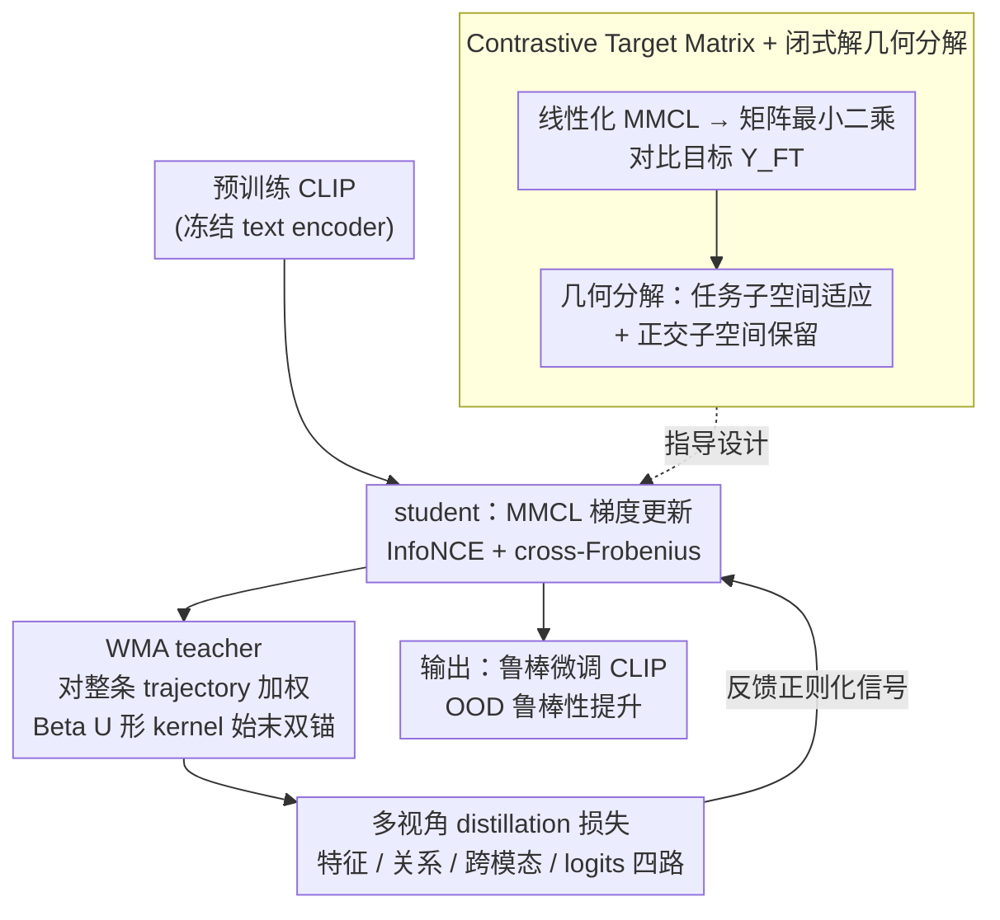

# TRACER: 用 WMA teacher + 几何分解证明的鲁棒多模态微调

**会议**: ICML 2026  
**arXiv**: [2605.29380](https://arxiv.org/abs/2605.29380)  
**代码**: https://github.com/HesamAsad/TRACER  
**领域**: CLIP 微调 / 鲁棒性 / 自蒸馏  
**关键词**: CLIP 微调, OOD 鲁棒性, 自蒸馏, EMA teacher, WMA teacher

## 一句话总结
TRACER 用闭式解理论把对比微调的几何分解为"任务子空间"+"正交保留"两部分，证明 EMA teacher 会坍缩失去正则化力，提出 Weighted Moving Average (WMA) teacher 保持 finite-horizon 持续约束力且对任务子空间无偏收敛；在 CLIP ViT-B/16 上 ImageNet 分布偏移平均提升至 64.07% vs CaRot 62.54%。

## 研究背景与动机

**领域现状**：CLIP 类多模态模型的零样本迁移很强，但下游微调常伤害 OOD 鲁棒性（catastrophic forgetting）。已有缓解方法分四类——LP-FT（先线性头后全微调）、FLYP（复用预训练 text encoder 当 head）、WiSE-FT/Model Stock（权重插值）、L2-SP/自蒸馏（regularization）。

**现有痛点**：(1) 多数方法是经验设计，缺乏对"forgetting 发生在哪、为什么"的理论解释；(2) 自蒸馏方法多用 EMA teacher，但 EMA teacher 会逐渐跟 student 一致，teacher-student gap 收敛到 0 → 正则化力消失——恰好是 OOD 鲁棒性最脆弱的训练后期。

**核心矛盾**：要保 OOD 鲁棒性就得有持续的正则化锚点；EMA 锚点会自动 collapse 到 student；静态 teacher（fixed at 初始权重）虽不 collapse 但引入"anchor bias"，无法收敛到任务最优。

**本文目标**：(1) 给对比微调一个 closed-form 解析框架，说清楚每种 finetuning strategy 的几何行为；(2) 设计一个 teacher 既能保持持续正则化力又能 bias-free 收敛到任务最优。

**切入角度**：用 linearized analysis（image encoder 当线性投影）+ 引入 contrastive target matrix $\mathbf{Y}_{\mathrm{FT}} = \mathbf{W}_T^0 \mathbf{X}_T (n \mathbf{I}_n - \mathbf{J}_n)$ 把对比 loss 等价到 matrix least-squares，从而得到所有 finetuning strategy 的闭式解，几何上分解成"任务子空间内的变化"vs"正交子空间内的保留"。

**核心 idea**：把 teacher 从 EMA 换成 WMA（Weighted Moving Average over the whole student trajectory，with Beta(0.5, 0.5) U-shape kernel），证明 WMA teacher 在任务子空间内收敛到 minimum-norm 任务解、在正交子空间内保留预训练知识，且 finite-horizon 内 teacher-student gap 不消失。

## 方法详解

### 整体框架

TRACER loss = $\mathcal{L}_{\mathrm{MMCL}} + \lambda_{\mathrm{SD}} \mathcal{L}_{\mathrm{SD-WMA}}$。前者是 standard CLIP InfoNCE + cross-Frobenius regularizer，后者是从 WMA teacher 蒸馏出来的多视角损失（feature distillation + contrastive relational distillation + interactive contrastive learning + cross-knowledge distillation）。

每个 training step：(1) student 用 MMCL gradient 更新；(2) WMA teacher 用 $\mathbf{W}_{\mathrm{Teacher}}^t = (1-\omega_t) \mathbf{W}_{\mathrm{Teacher}}^{t-1} + \omega_t \mathbf{W}_I^t$ 更新，$\omega_t = \kappa(\tau_t) / \sum_j \kappa(\tau_j)$ 是基于 Beta(0.5, 0.5) kernel 的权重；(3) teacher 给 student 反馈四种 distillation 信号。

### 关键设计

**1. Contrastive Target Matrix + 闭式解几何分解：看清 forgetting 到底发生在哪**

"自蒸馏为什么能保鲁棒"以前只有经验答案，本文先把对比微调的非线性优化压成一个能解析的形式。定义 $\mathbf{Y}_{\mathrm{FT}} = \mathbf{W}_T^0 \mathbf{X}_T (n \mathbf{I}_n - \mathbf{J}_n)$（冻结 text encoder 加中心化对比算子），证明线性化后的 MMCL loss 等价于矩阵最小二乘 $\min_{\mathbf{W}_I} \frac{1}{2} \|\mathbf{W}_I \mathbf{X}_I - \mathbf{Y}_{\mathrm{FT}}\|_F^2$。Theorem 3.2 随之给出各策略的闭式解，几何含义一目了然：Direct FT 解为 $\mathbf{W}_I^0 (I - \mathcal{P}_I) + \mathbf{Y}_{\mathrm{FT}} \mathbf{X}_I^\top (\mathbf{X}_I \mathbf{X}_I^\top)^+$（正交子空间保留、任务子空间替换）；L2-SP 把所有方向揉成一个 blend（无结构化分解）；Static SD 则是 $\mathbf{W}_I^0 (I - \frac{1}{1+\lambda} \mathcal{P}_I) + \frac{1}{1+\lambda} \mathbf{Y}_{\mathrm{FT}} \mathbf{X}_I^\top (\mathbf{X}_I \mathbf{X}_I^\top)^+$（正交保留 + 任务子空间凸组合）。

这套分解直接揭示了 forgetting 的物理位置：SD 在结构上既保住正交子空间的预训练知识、又只在任务子空间适应新任务，而 L2 把所有方向都混在一起，等于让 catastrophic forgetting 蔓延到本该保留的正交子空间。这就是"该用 SD 而非 L2"的理论依据。

**2. WMA teacher：U 形 kernel 同时治好 EMA collapse 和 static anchor bias**

自蒸馏要持续起作用，teacher 必须既不塌缩又不带偏。EMA teacher 的更新权重是常数 $\omega_t = 1-\alpha$，teacher 会指数地追上 student，训练后期 gap 收敛到 0、正则化力消失——偏偏这是 OOD 最脆弱的阶段；static teacher 锚死在初始权重（$\omega_t = 0$）虽不塌缩，却永远偏向 init、收不到任务最优。WMA 改成对 student 整条 trajectory 做加权平均，kernel $\kappa(\tau)$ 用 Beta(0.5, 0.5) 的 U 形——初始 checkpoint（保鲁棒先验）和末期 checkpoint（保任务适应）都拿到非零权重，$\tau_k = (k + 0.5) / (T + 1) \in (0, 1)$ 严格落在端点内避免 Beta 发散。

在线递推 $\omega_t = \kappa(\tau_t) / \sum_{j=0}^t \kappa(\tau_j)$，teacher 更新为 $\mathbf{W}_{\mathrm{Teacher}}^t = (1 - \omega_t) \mathbf{W}_{\mathrm{Teacher}}^{t-1} + \omega_t \mathbf{W}_I^t$。Theorem 3.4 证明 student 在任务子空间内收敛到 minimum-norm 任务解 $\mathbf{W}_{\mathrm{FT}}^\star \mathcal{P}_I$ 同时保留正交分量——"始末双锚"让 finite-horizon 内 teacher-student gap 保持有意义的大小，而 trajectory-weighted 平均又保证无偏收敛，理论和设计严丝合缝。

**3. 多视角 distillation 损失：从四个层级保留预训练知识**

单一蒸馏（如只对齐 feature）容易让 student 在某个表征维度上过拟合 teacher，把"保留预训练知识"窄化成"复刻某层激活"。$\mathcal{L}_{\mathrm{SD-WMA}}$ 因此从四个层级一起拉：Feature Distillation 直接对齐 student/teacher embedding，Contrastive Relational Distillation 匹配 batch 内 similarity 分布，Interactive Contrastive Learning 做跨模态 student-teacher 对齐，Cross Knowledge Distillation 对齐跨模态 logits。这四路恰好覆盖"特征 / 关系 / 跨模态 / logits"四个层级，把"保留旧知识"的多重含义都纳进来；消融显示去掉任一路 ID/OOD 都会掉点。

### 一个例子：MNIST → ColoredMNIST 上的遗忘对比
为了让"几何分解 → 遗忘率"这条理论预测看得见，作者搭了一个可控玩具实验。先在 MNIST 上预训练一个多模态对比模型，再到 ColoredMNIST（数字 0-4 有 95% 概率是红色、5-9 有 95% 概率是蓝色，制造伪相关）上微调，观察微调后原 MNIST 任务掉了多少。结果完全按闭式解的几何排序展开：Direct FT 学会了新任务，但 MNIST 准确率从 96.8% 暴跌到 59.0%（遗忘 37.9%）；L2 Reg 遗忘 13.6%；Static SD 遗忘 1.8%；换上 WMA 的 Dynamic SD 几乎不忘，仅 0.1%。这条 37.9% → 13.6% → 1.8% → 0.1% 的链条，和 Theorem 3.2 里各策略"正交子空间保得有多干净"的排序一一对应。

## 实验关键数据

### 主实验：CLIP ViT-B/16 在 ImageNet + 分布偏移

| 方法 | IN | IN-V2 | IN-R | IN-A | IN-S | ObjNet | 平均 |
|------|-----|-------|------|------|------|--------|------|
| ZS (zero-shot) | 68.33 | 61.93 | 77.71 | 49.95 | 48.26 | 54.17 | 58.39 |
| LP-FT | 82.44 | 72.74 | 72.81 | 49.28 | 50.31 | 54.42 | 59.91 |
| FLYP | 82.72 | 72.76 | 71.32 | 48.49 | 49.87 | 54.83 | 59.45 |
| Lipsum-FT | 83.32 | 73.57 | 75.93 | 49.87 | 51.43 | 54.35 | 61.03 |
| CaRot | 83.15 | 74.08 | 77.74 | 51.57 | 52.68 | 56.63 | 62.54 |
| **TRACER** | 82.76 | **74.14** | **79.33** | **54.92** | **53.69** | **58.26** | **64.07** |

TRACER 在所有 5 个 OOD benchmark 上都领先，平均 64.07% vs CaRot 62.54%（+1.53）；ID（ImageNet）上略低 82.76 vs CaRot 83.15（trade-off in favor of OOD），但与其他方法的差距 < 0.5 可接受。IN-A（adversarial natural examples）上 TRACER 54.92 vs CaRot 51.57（+3.35）是最大改善，验证 WMA teacher 对极端 OOD 的鲁棒性。

### 与更多 baseline 对比（ImageNet 5 列）

| 方法 | IN | IN-V2 | IN-R | IN-A | IN-S | 平均 shifts |
|------|-----|-------|------|------|------|-----|
| Direct FT | 82.83 | 72.57 | 68.53 | 39.23 | 47.97 | 57.08 |
| L2-SP | 82.87 | 72.63 | 68.77 | 39.73 | 48.23 | 57.34 |
| Static SD | 82.07 | 73.13 | 72.87 | 42.33 | 49.87 | 59.55 |
| LP-FT | 82.14 | 72.09 | 70.44 | 46.32 | 48.65 | 59.38 |
| FLYP | 82.72 | 72.76 | 71.32 | 48.49 | 49.87 | 60.61 |
| CAR-FT | 83.27 | 74.03 | 75.37 | 49.53 | 52.97 | 62.98 |
| Lipsum-FT | 83.33 | 73.57 | 75.93 | 49.87 | 51.43 | 62.70 |
| Model Stock | **84.07** | 74.83 | 71.77 | 51.23 | 51.77 | 62.40 |
| ARF | 82.73 | 72.77 | 75.63 | 50.27 | 51.83 | 62.63 |
| CaRot | 83.15 | 74.08 | 77.74 | 51.57 | 52.68 | 62.98 |
| **TRACER** | 82.76 | 74.14 | **79.33** | **54.92** | **53.69** | **64.07** |

跟广泛 baseline 比 TRACER OOD 平均最强；ID 仅次于 Model Stock 但 Model Stock 在 IN-A 上掉 (51.23) 而 TRACER 涨 (54.92)。

### 关键发现

- **WMA teacher 解决 EMA collapse**：训练后期 EMA teacher-student gap → 0，TRACER 用 WMA 保持 gap，OOD 性能稳定提升而非衰退。
- **几何分解理论的实证支持**：Direct FT 在 IN-A 掉到 39.23 vs ZS 49.95，说明 forgetting 不只在 IN 上发生而是在更难 OOD 上更严重；TRACER 反而把 IN-A 推到 54.92，证明 trajectory-weighted teacher 真的保住了 robustness。
- **任务子空间 + 正交子空间分解**：从 SD 的闭式解看，只要 $\lambda > 0$ 任务子空间内就 bias toward $\mathbf{W}_I^0$，导致欠拟合；WMA teacher 通过动态 anchor 让任务子空间收敛到 minimum-norm 解，"既不偏 init 也不过拟合"。
- **ColoredMNIST toy 实验完美匹配理论**：forgetting rate Direct (37.9%) > L2 (13.6%) > Static SD (1.8%) > Dynamic SD (0.1%) 跟闭式解的几何排序一致——是理论 → 实证 → 设计的优雅闭环。
- **Lipsum-FT、CaRot 都强但 TRACER 仍 +1-2**：与最近 SOTA 的对比说明 WMA teacher 不是 marginal trick，而是结构性改进。

## 亮点与洞察

- **从 linearized analysis 看清 finetuning 的几何本质**：把对比 loss 转成 matrix least-squares 后，每种 strategy 的闭式解一目了然，是 finetuning theory 的扎实贡献。
- **EMA collapse 问题被严肃讨论**：以前自蒸馏文献默认用 EMA 没意识到 finite-horizon 失效；本文明确指出并量化 anchor 失效，是 awareness 上的进步。
- **WMA + U-shape kernel 是优雅设计**：U-shape Beta(0.5, 0.5) 让"始末双锚"，凸 kernel（如 mean）做不到"既保 init 又保 task"的双重要求。
- **Bias-free convergence 的数学保证**：Theorem 3.4 证明任务子空间内收敛到 minimum-norm 解，这是 static SD 永远做不到的（永远偏 init）。
- **Toy + ImageNet + 多 baseline 三层验证**：从 controllable toy 到 industrial ImageNet 到多 backbone（Appendix B），实验严密，对 reviewer 几乎无槽点。
- **Multi-view distillation 不是堆叠**：四视角 loss 跟"保留预训练知识的多重含义"对应，每个 component ablation 都有掉点，证明设计合理。

## 局限与展望

- **理论建立在 linearized image encoder 上**：实际 CLIP 是非线性 transformer，闭式解只是 first-order approximation，超过 1-2 epoch 后理论预测精度下降——本文用 toy + 实证补强但严格意义未保证。
- **WMA 计算成本略高**：要存 teacher 的 running average + kernel weight，相比 EMA 多一倍 weight 计算，对 8B+ 模型可能有内存压力（虽然 TRACER 在 CLIP ViT-L 上验证可行）。
- **Beta(0.5, 0.5) 不是搜出来的最优**：U-shape kernel 形状是经验选择，其他 endpoint-aware kernel（如 arcsine）的对比在 Appendix 简短讨论但不充分。
- **只在 CLIP 上验证**：DINO、BLIP-2、SigLIP 等其他多模态对比模型上是否有效未知。
- **ID 性能略输 Model Stock**：trade-off 偏 OOD 时 ID 会让位；实际部署需考虑这个 ID-OOD trade-off curve。

## 相关工作与启发

- **vs CaRot (Oh et al. 2024)**：CaRot 也用 SD 但 teacher 是 EMA，本文证明 EMA 会 collapse；TRACER 在 CaRot 基础上换 WMA teacher 是直接升级，OOD +1.53 平均。
- **vs LP-FT / FLYP**：他们解决"初始化偏移"问题，TRACER 解决"training dynamics 偏移"，两者正交可组合。
- **vs WiSE-FT / Model Stock**：这些是 post-hoc weight averaging，不需要重新训；TRACER 是训练时 in-loop regularization，得到的 weight 不需要 averaging。两条 path 都有效但 TRACER 不需要存两份 weight。
- **vs Mean Teacher (Tarvainen & Valpola 2017)**：经典的 EMA teacher 工作，本文是其 finite-horizon 的"修正"。
- **vs L2-SP**：L2-SP 在所有维度 blend，本文证明这个 blend 在几何上不合理；TRACER 用 SD 的几何分解替代。
- **启发**：对 self-distillation/EMA teacher 类工作都可以 revisit 是否有 collapse 问题，WMA 是个通用 fix；linearized analysis + closed-form 是分析 finetuning 行为的强力工具。

## 评分

- 新颖性: ⭐⭐⭐⭐⭐ 理论侧 contrastive target matrix + closed-form decomposition 是新工具，方法侧 WMA teacher + bias-free convergence 证明是新贡献。
- 实验充分度: ⭐⭐⭐⭐⭐ Toy 验证理论 + 多 CLIP backbone + 5 OOD benchmark + 14+ baseline + 4 维度 ablation，几乎无空白。
- 写作质量: ⭐⭐⭐⭐⭐ Theory → method → toy → main 的叙述链非常工整，公式严密且 intuition 明确，Figure 2 几何可视化对理论理解帮助大。
- 价值: ⭐⭐⭐⭐⭐ 对 CLIP 微调实践直接可用（+1.5 OOD），且 WMA teacher 思想可推广到其他 SSL/distillation 场景；开源代码降低门槛。

<!-- RELATED:START -->

## 相关论文

- [\[ACL 2025\] WhiSPA: Semantically and Psychologically Aligned Whisper with Self-Supervised Contrastive and Student-Teacher Learning](../../ACL2025/self_supervised/whispa_semantically_and_psychologically_aligned_whisper_with_self-supervised_con.md)
- [\[ICML 2026\] Understanding Self-Supervised Learning via Latent Distribution Matching](understanding_self-supervised_learning_via_latent_distribution_matching.md)
- [\[ICML 2026\] The Geometry of Projection Heads: Conditioning, Invariance and Collapse](the_geometry_of_projection_heads_conditioning_invariance_and_collapse.md)
- [\[ICML 2026\] NumLeak: Public Numeric Benchmarks as Latent Labels in Foundation Models](numleak_public_numeric_benchmarks_as_latent_labels_in_foundation_models.md)
- [\[ICML 2026\] NITP: Next Implicit Token Prediction for LLM Pre-training](nitp_next_implicit_token_prediction_for_llm_pre-training.md)

<!-- RELATED:END -->
