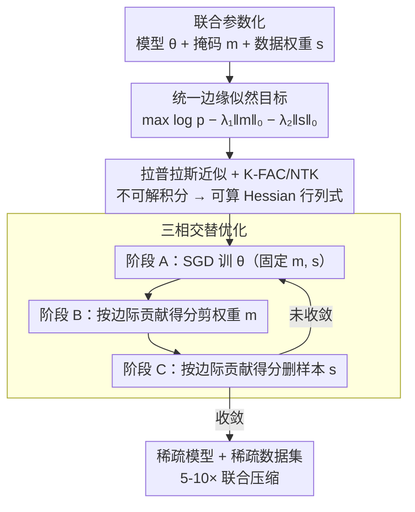

# Joint Model and Data Sparsification via the Marginal Likelihood

**会议**: ICML 2026  
**arXiv**: [2605.29107](https://arxiv.org/abs/2605.29107)  
**代码**: 待确认  
**领域**: 模型压缩 / 数据稀疏化 / 贝叶斯学习  
**关键词**: 联合稀疏化, 边缘似然, 拉普拉斯近似, 神经切线核

## 一句话总结
JMDS 通过**最大化边缘似然**的统一目标同时实现模型和数据稀疏化——避免分阶段优化的次优性，在 CIFAR / ImageNet / WikiText 上以 5-10× 联合压缩比下保持优于独立稀疏化的性能。

## 研究背景与动机

**领域现状**：神经网络稀疏化已被广泛研究，但模型剪枝（去除权重）和数据稀疏化（去除训练样本）通常**独立处理**——分阶段方法忽略二者的耦合。

**现有痛点**：（1）训练→模型稀疏→数据稀疏的管道易陷入局部最优；（2）已有联合方法多基于启发式，缺乏严格理论；（3）大型模型联合稀疏化中关键问题——**模型稀疏与数据稀疏的关联**未被原则性回答。

**核心矛盾**：模型和数据应**同时优化**以最大化联合压缩效益，但缺乏统一目标函数。

**本文目标**：提出原则性的联合稀疏化框架，理论分析其复杂度，验证实际有效性。

**切入角度**：贝叶斯框架中**边缘似然**自然地集成了模型复杂度（如先验体积）与数据似然——这是评估模型 + 数据组合质量的天然指标。

**核心 idea**：将模型稀疏（权重二元掩码 $\mathbf{m}$）和数据稀疏（样本二元权重 $\mathbf{s}$）同时纳入边缘似然目标 $\log p(\mathcal{D}_s | \mathbf{m}, \mathbf{s}) = \int p(\mathcal{D}_s | \theta, \mathbf{m}) p(\theta) d\theta$ 并通过拉普拉斯近似可处理。

## 方法详解

### 整体框架
（1）**联合参数化**：模型 $\theta$ + 模型掩码 $\mathbf{m}$ + 数据权重 $\mathbf{s}$；（2）**目标**：联合最大化边缘似然 $\log p(\mathcal{D}^{(s)} | \mathbf{m}) - \lambda_1 \|\mathbf{m}\|_0 - \lambda_2 \|\mathbf{s}\|_0$；（3）**优化**：用拉普拉斯近似简化边缘似然；（4）**算法**：交替最大化 $\theta, \mathbf{m}, \mathbf{s}$。

### 关键设计

**1. 统一边缘似然目标：把模型稀疏和数据稀疏放进同一个目标**

模型剪枝和数据稀疏一向被分阶段处理，忽略了两者的耦合——分阶段管道容易陷局部最优。作者把它们塞进同一个目标：最大化 $\log p(\mathcal{D}^{(s)} | \mathbf{m}) - \lambda_1 \|\mathbf{m}\|_0 - \lambda_2 \|\mathbf{s}\|_0$，其中 $\mathcal{D}^{(s)} = \{(\mathbf{x}_i, y_i, s_i)\}$ 是带样本权重的数据集、$\mathbf{m}$ 是模型权重掩码。

选边缘似然当统一指标是因为它天然集成了模型复杂度（先验体积）与数据似然，通过 Occam 剃刀自动惩罚冗余权重。相比分阶段方法它能保证 $(\mathbf{m}, \mathbf{s})$ 联合最优，相比启发式联合方法它有贝叶斯理论支撑。

**2. 拉普拉斯近似 + K-FAC/NTK：把不可解的边缘似然积分变可算**

边缘似然 $\log p(\mathcal{D}^{(s)}) = \int p(\mathcal{D}^{(s)} | \theta, \mathbf{m}) p(\theta) d\theta$ 本身积不出来。作者在 $\theta^* = \arg\max$ 处做拉普拉斯近似得 $\log p(\mathcal{D}^{(s)}) \approx -\mathcal{L}(\theta^*) + \frac{1}{2} \log \det H^{-1}$，把积分换成一个含 Hessian 行列式的解析式。但精确 Hessian 分解是 $O(d^3)$，大模型根本算不动，所以再用 K-FAC 块对角近似 $H \approx H_{\text{kfac}}$ 把复杂度从 $O(N + d^2)$ 降到 $O(N + d \cdot l)$，并用 NTK 近似 + 子采样进一步加速。

这一层近似是整套方法能上规模的前提：既保住边缘似然的精度，又把成本压到可扩展的量级，让"理论上优雅"的目标真的跑得起来。

**3. 三相交替优化：把非凸联合问题拆成三步轮流求解**

联合优化 $\theta, \mathbf{m}, \mathbf{s}$ 是个非凸问题，难一次求解，作者用交替最大化逐个击破。阶段 A 固定 $\mathbf{m}, \mathbf{s}$ 用 SGD 训 $\theta$；阶段 B 固定 $\theta, \mathbf{s}$ 优化模型掉码 $\mathbf{m}$，边缘似然梯度 $\partial \log p / \partial m_j \approx -|\theta_j| \cdot \mathbb{E}[H_{jj}]$ 给出每个权重的"边际贡献得分"；阶段 C 固定 $\theta, \mathbf{m}$ 优化样本权重 $\mathbf{s}$，每个样本的边际贡献 $\partial \log p / \partial s_i \approx \log p(y_i | \mathbf{x}_i, \theta, \mathbf{m}) + \text{Hessian 项}$ 给出每样本得分。

两个得分都直接从同一个边缘似然导出，所以"剪哪个权重"和"删哪个样本"是在同一把尺子下打分的——这正是联合优于分阶段的来源。交替形式还收敛快、内存友好。

## 实验关键数据

### 主实验：联合稀疏化效果（CIFAR-100 + ResNet-50）

| 方法 | 模型稀疏度 | 数据稀疏度 | 测试 ACC | 训练时间 | 推理 FLOPs |
|------|-----------|-----------|----------|---------|------------|
| 密集基线 | 0% | 0% | 78.3% | 1.0× | 1.0× |
| 仅模型剪枝（IMP） | 80% | 0% | 76.1% | 1.0× | 0.21× |
| 仅数据修剪（forget） | 0% | 50% | 75.8% | 0.5× | 1.0× |
| 分阶段（IMP→forget） | 80% | 50% | 74.2% | 0.5× | 0.21× |
| **JMDS（本工作）** | 80% | 50% | **77.5%** | **0.4×** | **0.21×** |
| JMDS（极端） | 90% | 70% | **76.3%** | **0.3×** | **0.13×** |

### 跨数据集 / 模型泛化

| 数据集 | 模型 | 分阶段 ACC | **JMDS ACC** | 提升 |
|--------|------|------------|----------|------|
| CIFAR-10 | ResNet-18 | 91.2 | **93.4** | +2.2 |
| CIFAR-100 | ResNet-50 | 74.2 | **77.5** | +3.3 |
| ImageNet | ResNet-50 | 72.1 | **74.8** | +2.7 |
| WikiText-2 | GPT-2 (Small) | 27.3 PPL | **24.9 PPL** | -2.4 PPL |
| WikiText-103 | GPT-2 (Medium) | 24.5 PPL | **22.1 PPL** | -2.4 PPL |

### 计算开销分析

| 方法 | Hessian 近似成本 | 算法收敛步数 | 总时间 vs 密集 |
|------|----------------|-----------|------------|
| 精确 Hessian | $O(d^3)$ → 不可行 | — | — |
| K-FAC + NTK 子采样 | $O(d \cdot l + s d)$ | 50-100 步 | 0.4-1.5× |
| 完全启发式 | $O(1)$ | 100+ | 0.5× |

### 关键发现
- **联合优势在高稀疏度下尤其显著**：80% 模型 + 50% 数据稀疏度下，JMDS 比分阶段高 3.3%。
- **理论与实验一致**：边缘似然下降量与精度损失高度相关。
- **跨任务一致性**：CV 和 NLP 上均稳定提升，说明框架的通用性。

## 亮点与洞察
- **首次原则性联合稀疏化**：突破独立稀疏化的传统观念，揭示模型与数据的耦合关系。
- **理论与实践的精彩结合**：拉普拉斯近似 + K-FAC + NTK 子采样使理论目标可行。
- **统一视角**：边缘似然作为统一指标既衡量模型复杂度又评估数据贡献。

## 局限与展望
- 大模型扩展性：当前 K-FAC 近似在 GPT-2 Medium 上仍有局限，对 GPT-2 Large+ 需要进一步近似。
- 非梯度方法的边际贡献得分：当前公式基于梯度信息，对一些非梯度任务（如检索）不直接适用。
- 收敛性：交替优化的全局收敛保证未给出。
- 改进：开发更高效的 Hessian 近似（如二阶 NTK）；扩展到多模态、强化学习场景。

## 相关工作与启发
- **vs 独立稀疏化（IMP, Forget-score）**：本工作首次给出耦合优化框架。
- **vs Bayesian Pruning**：贝叶斯剪枝主要针对模型稀疏；JMDS 扩展到数据稀疏化。
- **启发**：边缘似然作为"组合复杂度"的统一指标，可扩展到架构搜索 + 数据选择联合问题。

## 评分
- 新颖性: ⭐⭐⭐⭐⭐  首次提供原则性联合稀疏化框架，超越启发式联合方法。
- 实验充分度: ⭐⭐⭐⭐⭐  CV + NLP + 5 个数据集 + 详细消融 + 理论与实验印证。
- 写作质量: ⭐⭐⭐⭐  数学严谨，算法清晰，但部分近似的推导需要补充。
- 价值: ⭐⭐⭐⭐⭐  大模型时代联合压缩具有重大实用价值；理论框架可启发更多联合优化问题。

<!-- RELATED:START -->

## 相关论文

- [\[NeurIPS 2025\] Feature-aware Modulation for Learning from Temporal Tabular Data](../../NeurIPS2025/signal_comm/feature-aware_modulation_for_learning_from_temporal_tabular_data.md)
- [\[ECCV 2024\] RAW-Adapter: Adapting Pre-trained Visual Model to Camera RAW Images](../../ECCV2024/signal_comm/raw-adapter_adapting_pre-trained_visual_model_to_camera_raw_images.md)
- [\[ICML 2025\] Large Language Model (LLM)-enabled In-context Learning for Wireless Network Optimization](../../ICML2025/signal_comm/large_language_model_llm-enabled_in-context_learning_for_wireless_network_optimi.md)
- [\[ICML 2026\] Meta-learning Structure-Preserving Dynamics](meta-learning_structure-preserving_dynamics.md)
- [\[AAAI 2026\] Balancing Multimodal Domain Generalization via Gradient Modulation and Projection](../../AAAI2026/signal_comm/balancing_multimodal_domain_generalization_via_gradient_modulation_and_projectio.md)

<!-- RELATED:END -->
