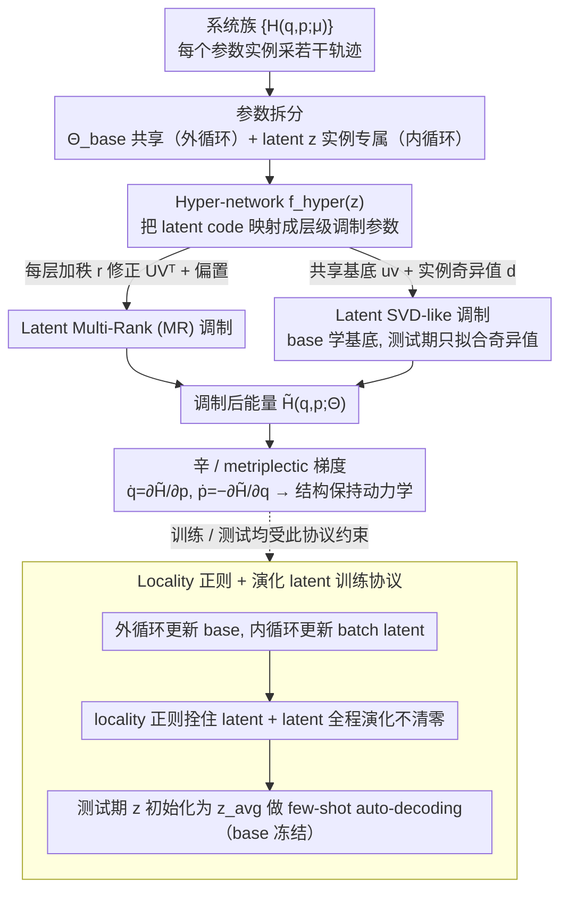

# Meta-learning Structure-Preserving Dynamics

**会议**: ICML 2026  
**arXiv**: [2508.11205](https://arxiv.org/abs/2508.11205)  
**代码**: 无  
**领域**: 科学机器学习 / 元学习 / 结构保持神经网络  
**关键词**: Hamiltonian NN, GENERIC, 调制元学习, 低秩适配, SVD modulation

## 一句话总结
把 modulation-based 元学习（hyper-network 把 latent code $\bm{z}^{(k)}$ 映射成层级调制参数）系统性地引入 Hamiltonian / GENERIC 神经网络，提出两种新颖调制——latent multi-rank (MR) 与 latent SVD-like 调制，让一个共享网络在不知道系统参数 $\bm{\mu}$ 的情况下少样本适配整族新参数实例，同时严格保持能量守恒 / 耗散结构。

## 研究背景与动机

**领域现状**：结构保持神经网络（HNN, LNN, port-Hamiltonian NN, GENERIC/metriplectic NN）把守恒律、辛结构、耗散律硬编码进架构，可以在已知参数 $\bm{\mu}$ 的动力系统上得到物理保真的预测。

**现有痛点**：这些模型几乎都是「按参数实例训一个」的——参数稍变就要重新训练，many-query 场景（如不同质量的钟摆族、不同刚度的振子族）成本爆炸；少数已有的元学习扩展（Lee 2021、Song 2024）走 MAML / ANIL 路线，要做 inner-loop 高维参数更新，不稳定也不省。

**核心矛盾**：HNN 类模型只需要学一个标量势 $\mathcal{H}_\Theta(\bm{q}, \bm{p})$ 就能给出整套动力学，权重对参数 $\bm{\mu}$ 的依赖天然低维；可现有元学习方法用 full gradient 更新所有 $\Theta$，浪费了这个低维结构。

**本文目标**：(1) 系统比较各种 modulation 策略在 Hamiltonian / GENERIC 框架下的表现；(2) 设计更具表达力但仍参数高效的新调制方式；(3) 保证调制后仍严格保持守恒 / 耗散结构。

**切入角度**：借鉴 INR / NeRF 里 latent modulation 的思路（Dupont 2022 的 CODA）——把每个系统压成低维 latent code $\bm{z}^{(k)}$，再用 hyper-network $\bm{f}_\text{hyper}(\bm{z}^{(k)}; \bm\phi)$ 生成各层的微小修正参数，base 权重所有任务共享。

**核心 idea**：「base 共享 + 实例 latent + 层级低秩调制」可以用极少 trainable 参数捕捉「参数 $\bm{\mu}$ 的低维主流形」，并通过 SVD-like 分解进一步在 base 阶段就学好正交基底，把测试期适配压成对几个奇异值标量的更新。

## 方法详解

### 整体框架
输入是一族 Hamiltonian / GENERIC 系统 $\{\mathcal{H}^{(k)}(\bm{q}, \bm{p}) = \mathcal{H}(\bm{q}, \bm{p}; \bm{\mu}^{(k)})\}_{k=1}^{n_\mu}$，每个系统随机采若干轨迹。模型参数拆为 $\Theta^{(k)} = \Theta_\text{base} \cup \Theta_\text{indv}^{(k)}$：base 由 meta-gradient 在外循环更新，individual 是每个系统专属的 latent code $\bm{z}^{(k)}$ 在内循环更新。Hyper-network 把 $\bm{z}^{(k)}$ 映射为各层的低秩 / 偏置修正参数。最终 $\tilde{\mathcal{H}}(\bm{q}, \bm{p}; \Theta^{(k)})$ 是带 latent 条件的能量函数，仍通过 $\dot{\bm q} = \partial \tilde{\mathcal H} / \partial \bm p,\ \dot{\bm p} = -\partial \tilde{\mathcal H} / \partial \bm q$ 给出动力学，故结构保持性继承自 base 架构。

### 关键设计

**1. Latent Multi-Rank (MR) 调制：给每层权重加一个由 latent code 生成的低秩修正**

HNN 类模型只学一个标量势就给出整套动力学，权重对参数 $\bm{\mu}$ 的依赖天然低维，可现有元学习却用 full gradient 更新所有 $\Theta$，浪费了这个结构。MR 的做法是给 MLP 每层权重 $\bm{W}^{(\ell)}$ 加一个秩 $r$ 的实例化修正 $\bm{U}^{(\ell,k)} \bm{V}^{(\ell,k)\top}$ 和一个偏置修正 $\bm{s}^{(\ell,k)}$，全由 hyper-network 从 latent code $\bm{z}^{(k)}$ 生成，于是每层更新为 $\bm{h} \mapsto \sigma\left((\bm{W}^{(\ell)} + \bm{U}^{(\ell,k)} \bm{V}^{(\ell,k)\top}) \bm{h} + \bm{b}^{(\ell)} + \bm{s}^{(\ell,k)}\right)$，其中 $\bm{U}, \bm{V} \in \mathbb{R}^{w_\ell \times r}$。$r=1$ 退化为 rank-one（RO，一种极简 LoRA-like 调制），$r=5$ 给出 MR(5)。

为什么低秩够用？Proposition 3.1 给了干净的理由：若 $\partial_{\bm\mu} \bm{f}$ 局部秩 $\le r$，则只需 $r$ 维调制就能捕捉所有局部参数变化。MR 直接吃下这个事实，把表达力放进 LoRA 式低秩矩阵里，参数量远小于改整个权重。

**2. Latent SVD-like 调制（论文最优方案）：把低秩修正拆成共享基底 + 实例奇异值**

MR 每次都要 hyper-network 重生成一对秩 $r$ 因子 $\bm{U}, \bm{V}$，hyper-network 仍不小。SVD-like 更进一步因式分解：每层写成 $\bm{h} \mapsto \sigma\left((\bm{W}^{(\ell)} + \sum_{i=1}^r d_i^{(\ell,k)} \bm{u}_i^{(\ell)} \bm{v}_i^{(\ell)\top}) \bm{h} + \bm{b}^{(\ell)} + \bm{s}^{(\ell,k)}\right)$，其中 $\bm{u}_i^{(\ell)}, \bm{v}_i^{(\ell)}$ 是 base 参数（meta-gradient 更新），只有奇异值 $d_i^{(\ell,k)}$ 和偏置 $\bm{s}^{(\ell,k)}$ 由 hyper-network 从 $\bm{z}^{(k)}$ 给出；并用 $\|\bm{U}^\top \bm{U} - \bm{I}\|_F$、$\|\bm{V}^\top \bm{V} - \bm{I}\|_F$ 软正交惩罚 + ReLU 激活保证奇异值非负。

这样 base 阶段就把"跨系统不变的调制方向"学进 $\bm{u}_i, \bm{v}_i$，测试期只需拟合几个奇异值标量就能适配新参数实例——hyper-network 极小、test-time gradient 极少，正好对应 INR 里"先学共享基再拟合个体系数"的成功模式。

**3. Locality 正则 + 演化 latent code 训练协议：把实例调制拴在 base 附近且让 latent 持续进化**

要让调制稳定，得防两件事：实例参数偏离共享 base 太远，以及训练初期 latent 乱跳。作者在 loss 里加 $\lambda_z \|\bm{z}\|_2 + \lambda_\phi \|\bm\phi\|_2$ 把实例化更新拴在 base 附近；测试期 latent 初始化为训练 latent 的 Euclidean 均值 $\bm{z}_\text{avg} = \tfrac{1}{n_\mu^\text{train}} \sum_k \bm{z}_\text{train}^{(k)}$，再做 few-shot auto-decoding。

更关键的是不在每个 epoch 把 latent 清零，而让 $\bm{z}^{(k)}$ 在整个训练过程持续演化。Dupont 2022 的清零式初始化会让 base 反复被推向"能对任意 latent 微调"的位置、丧失训练信号；持续演化让 base 与平均 latent 共同进化，测试初始化也直接落在"已经学过的参数邻域"，明显更稳。

### 损失函数 / 训练策略
Hamiltonian 系统用 symplecticity loss $\mathcal{L}_\text{symp} = \|\dot{\bm q} - \partial_{\bm p} \tilde{\mathcal H}_\Theta\|_2^2 + \|\dot{\bm p} + \partial_{\bm q} \tilde{\mathcal H}_\Theta\|_2^2$；GENERIC 系统用对应的 metriplectic loss。外循环 $N_\text{out}$ 次更新 base $\Theta_\text{base}$，内循环 $N_\text{in}$ 次更新当前 batch 的 latent；测试用 Algorithm 2 做 $N_\text{test}$-shot latent fit（base 冻结）。

## 实验关键数据

### 主实验
三类能量守恒系统（Duffing、mass-spring、pendulum）+ 一类耗散系统（DNO），每个系统采 80 个参数实例（70 训练 / 10 测试），每实例 10 条轨迹。指标：$\epsilon_\text{field}$（相对 $\ell^2$ 误差 on uniform grid，可视为 OOD 指标）、$\epsilon_\text{traj}$（test 轨迹相对误差）、SSIM。

| 系统 | 方法 | $\epsilon_\text{field}$ ($\times 10^{-2}$) | $\epsilon_\text{traj}$ ($\times 10^{-2}$) |
|------|------|--------------------------------------------|-------------------------------------------|
| Pendulum | Scratch | 83.35 | 79.84 |
| Pendulum | MAML | 99.13 | 52.37 |
| Pendulum | Reptile | 88.72 | 75.73 |
| Pendulum | FW (CODA) | 8.23 | 10.65 |
| Pendulum | Shift | 9.76 | 12.88 |
| Pendulum | RO (MR-1) | 6.47 | 8.27 |
| Pendulum | **SVD(5)** | **4.62** | **5.33** |
| Mass Spring | FW | 1.60 | 1.31 |
| Mass Spring | **SVD(5)** | **1.51** | **1.12** |
| Duffing | FW | 10.30 | 2.78 |
| Duffing | **SVD(5)** | **10.03** | **2.30** |

### 消融实验

| 配置 | Pendulum $\epsilon_\text{field}$ | 备注 |
|------|----------------------------------|------|
| 多领域联训（Duffing + spring + pendulum 共享 base） | SVD(5) 仍最优 | 验证调制可跨「不同动力学家族」 |
| 不同 shot 数测试期适配 | SVD 在 1-shot ~ 300-shot 区间一致最优 | 少样本适配能力突出 |
| Locality 权重 $\lambda_\phi \in \{10^{-2..-4}\}$, $\lambda_z \in \{10^{-1..-3}\}$ | SVD 方差最小 | 对正则强度鲁棒 |
| 测试 latent 初始化（zero vs $\bm z_\text{avg}$） | $\bm z_\text{avg}$ 始终更优 | 验证演化-latent 协议 |
| 耗散 DNO 系统 | SVD(3) $\epsilon_\text{traj} = 0.142$，Reptile / ANIL NaN / 发散 | 模仿性扩展到 GENERIC 仍稳 |

### 关键发现
- modulation-based 方法（FW / Shift / MR / RO / SVD）整体比 MAML / Reptile / ANIL 等 optimization-based 方法把误差降低约 65%，说明在结构保持网络这类「权重对参数依赖天然低维」的场景里，调制比 inner-gradient 更高效。
- SVD(5) 不只是误差最低，hyper-network 体积也明显小于 FW（FW 必须输出整个 $\bm{U}\bm{V}^\top$；SVD 只输出 $r$ 个标量），是「accuracy / params」帕累托最优。
- ANIL / Reptile 在耗散 DNO 上直接 NaN 或发散，反映 inner-loop 优化在含 entropy generation 的动力学上极不稳定；调制方法因为不动主权重，反而稳。
- 多领域联训实验里同一 base 网络同时拟合 Duffing / spring / pendulum，靠 latent 切换即可适配——说明调制提供的不只是参数微调，而是「动力学家族切换」的表达能力。

## 亮点与洞察
- 「base = 跨任务不变 + latent = 任务特异」这种切分配上 SVD 分解，相当于在 INR 的 latent modulation 思路上做了「可解释化」——奇异值的大小直接告诉你某条主方向对当前参数实例的重要性。
- Proposition 3.1 给低秩调制提供了非常干净的理论 justification：参数空间的局部秩决定了所需的调制维度，与 INR 经验性的「低维 latent 够用」严格挂钩。
- 把 modulation 与 Hamiltonian / GENERIC 自然组合：调制只改变 $\mathcal{H}_\Theta$ 的标量值，不会破坏 symplectic 结构或 metriplectic 结构，是「结构保持 + 元学习」少见的真正可证组合。
- 演化-latent 训练协议是个看似小、实则关键的改动：让 base 永远跟随真实使用的 latent 进化，避免「base 适应 0-latent、test latent 远离 0」的分布漂移。

## 局限与展望
- 实验系统都是低维玩具（pendulum / spring / Duffing / DNO），最大维度仍 $\le 4$；对 PDE / 高维多体系统（如分子动力学）能否扩展尚未证实。
- 调制只施加在 MLP 层级，没有探索更通用的架构（Transformer、Graph NN）；如果 base 是 GNN，hyper-network 设计可能复杂得多。
- SVD 的奇异值非负约束依赖 ReLU 激活 + 软正交惩罚，并不能在训练早期保证基底真的正交，调试敏感性未充分讨论。
- 与时间步长 / 积分器选择的交互没有系统性分析——symplectic integrator + 调制能否给出 long-horizon stability 仍开放。

## 相关工作与启发
- **vs MAML / Reptile / ANIL**：本文把 inner-loop 高维梯度更新换成 latent code 的低维 auto-decoding，避免二阶梯度 / 不稳定 inner-gradient，在 HNN / GNN 上误差降 65%。
- **vs CODA / FW（Kirchmeyer 2022）**：FW 同样是 modulation-based，但对所有层的 $\bm{W}, \bm{b}$ 都做修正，hyper-network 巨大；MR / SVD 通过低秩 + 共享基底大幅减参，仍超过 FW。
- **vs Shift modulation（Dupont 2022）**：Shift 只调节偏置，太弱；SVD-like 既保留偏置又加共享秩 $r$ 矩阵，表达更强且参数仍小。
- **vs LoRA**：LoRA 是 task-agnostic 的低秩微调；本文 MR 实际是 task-conditioned LoRA + hyper-network，从 fine-tune 升级成 meta-learning。

## 评分
- 新颖性: ⭐⭐⭐ 把 LoRA / SVD 风格调制迁移到结构保持元学习上，方法干净但属于「合理组合」而非全新范式。
- 实验充分度: ⭐⭐⭐ 跑了 3 个 Hamiltonian + 1 个 GENERIC 系统、6 个 baseline、多领域联训、不同 shot 数、locality 扫描，但系统维度偏低。
- 写作质量: ⭐⭐⭐⭐ 公式与算法块清晰，命题 3.1 给低秩选择提供严谨依据。
- 价值: ⭐⭐⭐⭐ 给 many-query SciML 场景提供了简单可复用的元学习模板，特别适合参数化 ODE / Hamiltonian 仿真。

<!-- RELATED:START -->

## 相关论文

- [\[ICML 2025\] Deep Electromagnetic Structure Design Under Limited Evaluation Budgets](../../ICML2025/signal_comm/deep_electromagnetic_structure_design_under_limited_evaluation_budgets.md)
- [\[ICCV 2025\] Boosting Multimodal Learning via Disentangled Gradient Learning](../../ICCV2025/signal_comm/boosting_multimodal_learning_via_disentangled_gradient_learning.md)
- [\[CVPR 2026\] Dual-Imbalance Continual Learning for Real-World Food Recognition](../../CVPR2026/signal_comm/dual-imbalance_continual_learning_for_real-world_food_recognition.md)
- [\[AAAI 2026\] Task Aware Modulation Using Representation Learning for Upscaling of Terrestrial Carbon Fluxes](../../AAAI2026/signal_comm/task_aware_modulation_using_representation_learning_for_upsaling_of_terrestrial_.md)
- [\[NeurIPS 2025\] Feature-aware Modulation for Learning from Temporal Tabular Data](../../NeurIPS2025/signal_comm/feature-aware_modulation_for_learning_from_temporal_tabular_data.md)

<!-- RELATED:END -->
