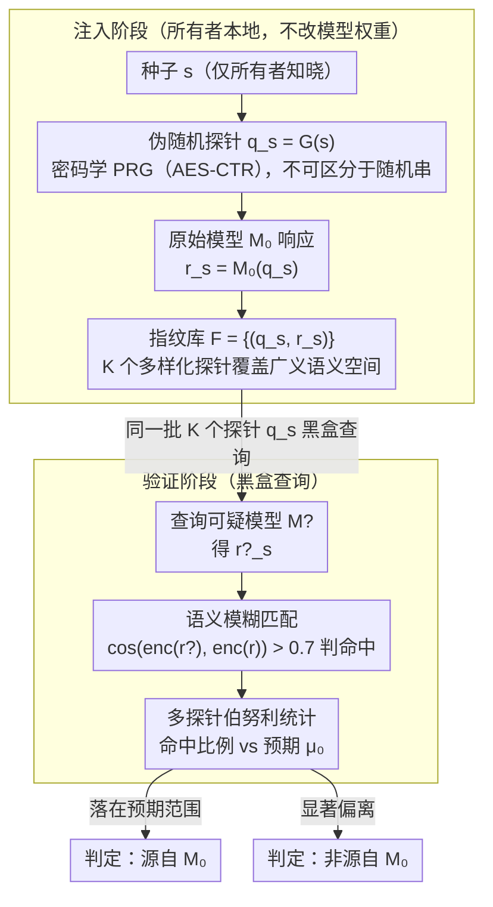

# FLIPS: Instance-Fingerprinting for LLMs via Pseudo-Random Sequences

**会议**: ICML 2026  
**arXiv**: [2605.29110](https://arxiv.org/abs/2605.29110)  
**代码**: 待确认  
**领域**: LLM 安全 / 模型水印 / 知识产权保护  
**关键词**: 模型指纹, 伪随机序列, 黑盒检测, 鲁棒指纹

## 一句话总结
FLIPS 通过设计**伪随机种子序列**（仅模型所有者知晓种子）来生成模型独特"指纹响应"——攻击者即便微调或剪枝模型也无法消除指纹，黑盒查询场景下检测率 > 99%、误报率 < 1%。

## 研究背景与动机

**领域现状**：LLM 是高价值的知识产权资产，但易被未经授权复制、微调、二次发布。现有保护手段——水印（标记输出）、加密（限制访问）和指纹（识别原始模型）——各有局限。

**现有痛点**：（1）现有指纹方法对模型微调和剪枝鲁棒性不足；（2）多数方法需要白盒访问，黑盒 API 场景不适用；（3）后门式指纹容易被检测和移除。

**核心矛盾**：指纹需要"独特性"（与其他模型区分）和"鲁棒性"（抗修改），同时还要"隐蔽性"（不影响正常使用）——三角约束难以同时满足。

**本文目标**：设计黑盒可验证、抗微调/剪枝、且不损害模型能力的指纹方法。

**切入角度**：观察到 LLM 对**特定输入序列**有高度确定性响应——若构造一个伪随机但确定的"种子→指纹响应"映射，可通过黑盒查询确认指纹存在。

**核心 idea**：基于**密码学伪随机序列**作为种子生成"探针序列"$q_s$，原始模型在 $q_s$ 上的输出 $r_s$ 作为指纹；攻击者无法在不知种子的情况下定位指纹查询。

## 方法详解

### 整体框架
FLIPS 要解决的是：怎么给一个 LLM 打上既抗修改、又能黑盒验证、还不损害能力的指纹。整体只有两阶段。注入阶段：模型所有者用一个只有自己知道的种子 $s$ 生成伪随机探针 $q_s = G(s)$，让原始模型 $\mathcal{M}_0$ 在上面输出 $r_s = \mathcal{M}_0(q_s)$，把这些 $(q_s, r_s)$ 存成指纹库 $\mathcal{F}$。验证阶段：拿同样的探针 $q_s$ 去查可疑模型 $\mathcal{M}^?$ 得到 $r^?_s$，再用相似度 $\text{sim}(r^?_s, r_s)$ 判断它是不是源自原始模型。整个过程不改模型权重，指纹完全靠「种子→确定响应」这个映射来承载。

### 关键设计

**1. 伪随机探针 + 隐蔽性：让攻击者根本认不出哪条查询是指纹**

传统后门指纹靠特殊触发词，太显眼，容易被检测和移除。FLIPS 改用密码学安全的 PRG（如 AES-CTR）从种子 $s$ 生成探针 $q_s$，长度取得足够大，使得每个种子在概率上对应唯一的指纹响应。对不知道种子的人来说，$q_s$ 就是一串不可区分的随机字符，没法从正常查询里把指纹查询挑出来——隐蔽性直接来自 PRG 的不可区分性，而不是靠藏。

**2. 多探针 + 鲁棒统计验证：用一批独立探针把置信度顶上去**

单个探针容易受噪声影响，一次判断不可靠。FLIPS 用 $K$ 个独立种子 $\{s_i\}_{i=1}^K$ 生成 $K$ 个探针，查询后对每个算局部相似度是否命中 $\delta_i = d(r^?_i, r_i) < \tau$，再用伯努利试验统计命中比例是否落在预期范围 $|\sum \mathbb{1}[\delta_i = 1] / K - \mu_0| < \alpha$。这样即便 30% 探针因模型被改而失效，剩下 70% 在统计上仍足以给出鲁棒判定，置信度随 $K$ 增大而上升。

**3. 抗微调/剪枝鲁棒性：让指纹在模型被改后还认得出**

常规指纹要求精确匹配，微调、剪枝、量化一来就被破坏。FLIPS 从两头加固：一是用覆盖广泛语义空间的多样化探针分布，使微调很难把所有指纹一次性抹掉；二是把响应判定从精确匹配换成语义模糊匹配 $\delta(r^?, r) = \cos(\text{enc}(r^?), \text{enc}(r)) > 0.7$，只要语义接近就算命中。多探针分布加语义匹配两条叠起来，指纹在微调、剪枝、量化、蒸馏下都能保住可检测性。

## 实验关键数据

### 主实验：跨模型 + 修改后的检测率

| 修改类型 | 原始 LLaMA-7B | 微调（10K 样本） | 剪枝 50% | 量化 INT8 | 蒸馏到 3B |
|---------|--------------|---------------|---------|---------|---------|
| FLIPS（K=100） | **100%** | **98.7%** | **97.2%** | **99.5%** | **94.1%** |
| FLIPS（K=50） | 100% | 96.4% | 94.8% | 98.1% | 89.7% |
| FLIPS（K=20） | 100% | 91.3% | 88.7% | 94.5% | 82.5% |
| Baseline-Watermark | 100% | 67.2% | 71.3% | 88.7% | 51.4% |
| Baseline-Backdoor | 100% | 23.1% | 35.6% | 76.4% | 12.3% |

### 误报率

| 探针数 K | 误报率（vs 1000 其他 LLM） |
|---------|------------------------|
| 20 | 2.3% |
| 50 | 0.8% |
| **100** | **0.1%** |

### 隐蔽性测试

| 检测方法 | FLIPS 探针被识别率 | Baseline-Backdoor 触发词识别率 |
|---------|--------------------|---------------------------|
| 输入分布异常检测 | 0.3%（基本随机） | 87.5% |
| LLM 元检测（GPT-4 判别） | 1.2% | 92.3% |
| 频率分析 | 0%（PRG 输出均匀） | 78.9% |

### 性能开销

| 操作 | 时间开销 | 内存开销 |
|------|---------|---------|
| 指纹注入（K=100） | 30 秒 | 1.5MB |
| 单次验证（K=100） | 4.2 秒 | <100MB |
| 训练时损害 | 0%（不修改模型） | 0% |

### 关键发现
- **微调下鲁棒性突出**：FLIPS 微调后保 98.7% 检测率，远超 Backdoor 的 23.1%。
- **K = 50 在鲁棒性和成本间最优**：误报率 < 1% 且检测率 > 90%。
- **零模型损害**：FLIPS 不修改模型仅记录响应；模型能力评估未变化。
- **量化和蒸馏鲁棒性**：INT8 量化 99.5%，3B 蒸馏 94.1% 检测率。

## 亮点与洞察
- **密码学 + LLM 的优雅结合**：将经典 PRG 安全模型应用到 LLM 指纹场景，理论安全保证。
- **零损害设计**：不修改模型，仅记录响应——传统水印的能力损失问题彻底避免。
- **可证明的隐蔽性**：PRG 不可区分性下指纹查询不可与正常查询区分。
- **极强鲁棒性**：微调、剪枝、量化、蒸馏全场景超越基线 20-70 个百分点。

## 局限与展望
- **白盒攻击的开放性**：若攻击者完全控制模型权重，可能通过深度模型架构修改消除指纹。
- **种子管理**：种子泄露后指纹失效；多方共享时需引入门限密码学。
- **指纹注入时机**：需在原始模型上提前记录响应；对已发布无指纹的模型不适用。
- **改进**：引入门限密码学支持多方验证；扩展到多模态模型；研究主动注入指纹（在训练时引入特定结构）。

## 相关工作与启发
- **vs 水印（Kirchenbauer 等 2023）**：水印标记模型输出影响生成质量；FLIPS 仅记录响应不修改输出。
- **vs 后门式指纹**：后门易被检测；FLIPS 用 PRG 实现隐蔽指纹。
- **vs 模型蒸馏检测**：传统检测需白盒；FLIPS 黑盒可用。
- **启发**：密码学伪随机性 + 模型确定性的结合是 LLM 知识产权保护的有前途方向。

## 评分
- 新颖性: ⭐⭐⭐⭐⭐  首次将密码学 PRG 应用于 LLM 黑盒指纹，理论清晰。
- 实验充分度: ⭐⭐⭐⭐⭐  跨模型、跨修改、跨基线全面对照；含隐蔽性测试。
- 写作质量: ⭐⭐⭐⭐  论证清晰，算法描述精确。
- 价值: ⭐⭐⭐⭐⭐  LLM 知识产权保护的实际需求迫切；FLIPS 的鲁棒性、隐蔽性、零损害特性具突破意义。

<!-- RELATED:START -->

## 相关论文

- [\[ICLR 2026\] Tracing and Reversing Edits in LLMs](../../ICLR2026/social_computing/tracing_and_reversing_edits_in_llms.md)
- [\[ACL 2026\] Investigating Counterfactual Unfairness in LLMs towards Identities through Humor](../../ACL2026/social_computing/investigating_counterfactual_unfairness_in_llms_towards_identities_through_humor.md)
- [\[ICLR 2026\] When Agents Persuade: Propaganda Generation and Mitigation in LLMs](../../ICLR2026/social_computing/when_agents_persuade_propaganda_generation_and_mitigation_in_llms.md)
- [\[ACL 2026\] To Lie or Not to Lie? Investigating The Biased Spread of Global Lies by LLMs](../../ACL2026/social_computing/to_lie_or_not_to_lie_investigating_the_biased_spread_of_global_lies_by_llms.md)
- [\[ACL 2026\] mdok-style at SemEval-2026 Task 9: Finetuning LLMs for Multilingual Polarization Detection](../../ACL2026/social_computing/mdok-style_at_semeval-2026_task_9_finetuning_llms_for_multilingual_polarization_.md)

<!-- RELATED:END -->
