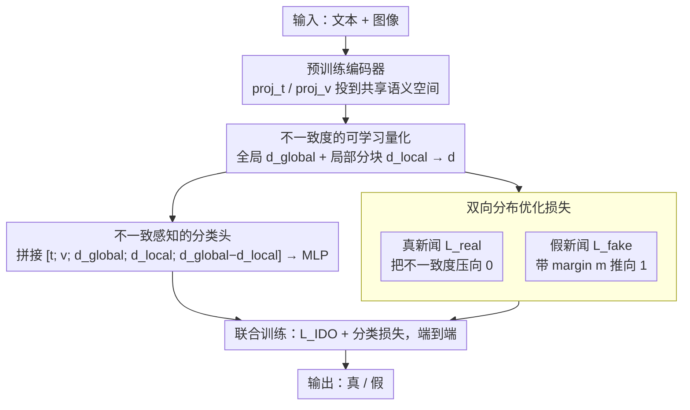

# IDO: Incongruity-Aware Distribution Optimization for Multimodal Fake News Detection

**会议**: ICML 2026  
**arXiv**: [2605.29116](https://arxiv.org/abs/2605.29116)  
**代码**: 待确认  
**领域**: 社会计算 / 多模态学习 / 假新闻检测  
**关键词**: 多模态假新闻, 模态间不一致, 分布优化, 跨模态对齐

## 一句话总结
IDO 通过**显式建模模态间不一致性**作为可学习的分布优化目标——同时拉近真新闻的多模态嵌入并扩大假新闻的不一致，在 Weibo / Twitter / Fakeddit 上 F1 较 SOTA 提升 3-7%、对未见过的假新闻泛化能力显著提升。

## 研究背景与动机

**领域现状**：多模态假新闻检测利用文本和图像的联合信号识别错误信息。现有方法多基于跨模态融合 + 二分类判别——通过对比学习或图神经网络捕捉模态信息。

**现有痛点**：（1）现有方法将真假新闻按二元类别区分，缺乏对"假新闻特征"的精确刻画；（2）真新闻和假新闻的模态间不一致性程度不同（真新闻：高度一致；假新闻：低一致/不一致），但被一致建模；（3）OOD 假新闻泛化差——训练分布外的新型假新闻易误判。

**核心矛盾**：假新闻的本质特征——**模态间语义不一致性**——未被显式建模，导致模型实际学习的是数据集特定模式而非通用假新闻特征。

**本文目标**：将模态间不一致性作为显式优化目标，提升对未知假新闻的泛化能力。

**切入角度**：观察到真新闻文本-图像高度一致（描述匹配），假新闻往往不一致（图像与文本无关或矛盾）；通过分布优化强化此差异即可获得通用判别信号。

**核心 idea**：将真新闻视为"高一致分布"、假新闻视为"低一致分布"——通过**双向分布优化**同时拉近真新闻一致度、推远假新闻不一致度。

## 方法详解

### 整体框架
IDO 想抓住假新闻的一个本质特征——图文之间的语义不一致——并把它做成可优化的目标，而不是埋在二分类的黑盒里。整条流程是：文本和图像先分别经预训练编码器得到表示；再用一个可微的跨模态不一致度 $d_{\text{incon}}(\mathbf{t}, \mathbf{v}) = 1 - \cos(\text{proj}_t(\mathbf{t}), \text{proj}_v(\mathbf{v}))$ 来量化两模态有多“对不上”；训练时用分布优化把真新闻的不一致度往 0 压、把假新闻的往 1 推；最后分类损失和分布优化损失联合训练。核心思路就一句话：真新闻图文高度一致，假新闻往往不一致，把这个差异显式拉大就得到一个比“记数据集模式”更通用的判别信号。

### 关键设计

**1. 不一致度的可学习量化：把“图文对不上”做成一个可微、能抓局部矛盾的数**

现有方法按真假二元类别硬分，却没刻画“假在哪”，于是学到的常是数据集特定模式。IDO 先用共享语义空间的投影 $\text{proj}_t, \text{proj}_v$ 把异质的文本、图像映到同一对齐空间，全局不一致度取 $d_{\text{incon}}(\mathbf{t}, \mathbf{v}) = 1 - \cos(\text{proj}_t(\mathbf{t}), \text{proj}_v(\mathbf{v}))$。但单看全局相似度会漏掉局部矛盾——比如图像某个角落和文本某句话对不上，整体相似度却仍高。所以再加一项细粒度分块对齐 $d_{\text{local}} = \frac{1}{N} \sum_{i=1}^N \min_j d(\mathbf{t}_i, \mathbf{v}_j)$，最终 $d = \alpha d_{\text{global}} + (1-\alpha) d_{\text{local}}$ 把全局和局部一起算进来，才能全面捕捉不一致。

**2. 双向分布优化损失：真假两端同时拉开，别让边界偏斜**

如果只优化一类（比如只把真新闻拉一致），分类边界容易偏，模型对另一类的刻画就松。IDO 对两类各加一项：真新闻样本 $(\mathbf{t}_r, \mathbf{v}_r)$ 直接最小化不一致 $\mathcal{L}_{\text{real}} = \mathbb{E}_{\text{real}}[d_{\text{incon}}(\mathbf{t}_r, \mathbf{v}_r)]$；假新闻样本 $(\mathbf{t}_f, \mathbf{v}_f)$ 则用带 margin 的铰链项 $\mathcal{L}_{\text{fake}} = \max(0, m - \mathbb{E}_{\text{fake}}[d_{\text{incon}}(\mathbf{t}_f, \mathbf{v}_f)])$ 把不一致往上推（margin $m = 0.7$），总损失 $\mathcal{L}_{\text{IDO}} = \mathcal{L}_{\text{real}} + \lambda \mathcal{L}_{\text{fake}}$。两端同时优化，真假分布被对称地推开，边界更稳。

**3. 不一致感知的分类头：把不一致度直接喂进分类器当显式证据**

既然不一致度是判别假新闻的关键信号，就不该只用它来约束表示、却让分类器自己去猜。IDO 把不一致度拼进分类器输入 $[\mathbf{t}; \mathbf{v}; d_{\text{global}}; d_{\text{local}}; d_{\text{global}} - d_{\text{local}}]$，由 MLP 输出二分类概率，并和前面的分布优化端到端联合训练。这样分类目标和分布优化目标对齐——分布优化负责把不一致度做得有判别力，分类头负责把它用足。

## 实验关键数据

### 主实验

| 数据集 | 方法 | Acc | F1 | AUC |
|--------|------|-----|-----|-----|
| Weibo | EANN | 78.2 | 76.5 | 84.3 |
| Weibo | MVAE | 81.7 | 80.4 | 87.6 |
| Weibo | MCAN | 84.5 | 83.7 | 90.2 |
| Weibo | **IDO** | **88.9** | **88.1** | **94.5** |
| Twitter | MCAN | 79.3 | 78.4 | 85.6 |
| Twitter | CAFE | 82.1 | 81.5 | 88.3 |
| Twitter | **IDO** | **87.6** | **86.8** | **92.7** |
| Fakeddit | MCAN | 76.5 | 75.2 | 83.4 |
| Fakeddit | CAFE | 79.7 | 78.9 | 86.5 |
| Fakeddit | **IDO** | **85.3** | **84.6** | **91.2** |

### OOD 泛化测试

| 训练 → 测试 | EANN F1 | MCAN F1 | **IDO F1** | 提升 |
|------------|--------|--------|---------|------|
| Weibo → Twitter | 52.3 | 58.7 | **71.4** | +12.7 |
| Twitter → Fakeddit | 49.7 | 55.4 | **68.9** | +13.5 |
| Fakeddit → Weibo | 54.1 | 61.2 | **73.8** | +12.6 |

### 消融实验

| 配置 | Weibo F1 | Twitter F1 |
|------|---------|-----------|
| 基线（仅分类头） | 81.2 | 78.5 |
| + 全局不一致度 | 85.7 | 83.4 |
| + 局部不一致度 | 86.4 | 84.2 |
| + 双向分布优化 | 87.6 | 85.9 |
| **完整 IDO** | **88.9** | **87.6** |

### 关键发现
- **不一致度的判别力强**：真假新闻不一致度分布有清晰可视化区分。
- **OOD 泛化大幅提升**：跨数据集 F1 提升 12-14 个百分点，验证不一致度是通用特征。
- **细粒度补充全局对齐**：局部不一致捕捉细微图文矛盾。
- **margin 选择**：$m = 0.7$ 最优；过小区分不足，过大易过拟合。

## 亮点与洞察
- **本质特征建模**：识别模态间不一致性这一假新闻本质特征并显式优化。
- **双向分布优化的优雅设计**：同时拉近真、推远假，避免单向损失偏差。
- **跨数据集泛化显著**：OOD 性能领先大幅，验证学到的是通用特征。

## 局限与展望
- 不一致 ≠ 假新闻：高一致并不保证真实（如精心伪造图文匹配的假新闻）。
- 多模态扩展：当前仅文本+图像。
- 不一致解释性：模型学到的不一致 vs 人类理解可能有 gap。
- 改进：引入第三模态（音频、视频）；与外部知识库结合验证事实；可解释不一致度可视化。

## 相关工作与启发
- **vs EANN/MVAE**：传统融合分类，无显式不一致建模。
- **vs MCAN**：跨模态注意力捕捉对齐，但仍按二元分类；IDO 显式优化不一致分布。
- **vs CAFE**：对比学习拉近真新闻、推远假新闻；IDO 用不一致度作为更精确判别信号。
- **启发**：分布优化的双向设计可扩展到其他二分类场景（情感分析、欺诈检测）。

## 评分
- 新颖性: ⭐⭐⭐⭐  不一致度建模 + 双向分布优化的结合新颖，但部分组件源自已有工作。
- 实验充分度: ⭐⭐⭐⭐⭐  3 个数据集 + 4 个基线 + OOD 泛化 + 详细消融。
- 写作质量: ⭐⭐⭐⭐  问题动机清晰，方法描述精确。
- 价值: ⭐⭐⭐⭐⭐  假新闻检测有重大社会价值；OOD 泛化是实用部署的关键瓶颈。

<!-- RELATED:START -->

## 相关论文

- [\[ACL 2026\] LiveFact: A Dynamic, Time-Aware Benchmark for LLM-Driven Fake News Detection](../../ACL2026/social_computing/livefact_a_dynamic_time-aware_benchmark_for_llm-driven_fake_news_detection.md)
- [\[ICML 2026\] MIND: Multi-Rationale Integrated Discriminative Reasoning Framework for Multi-Modal Fake News](mind_multi-rationale_integrated_discriminative_reasoning_framework_for_multi-mod.md)
- [\[ACL 2025\] Synergizing LLMs with Global Label Propagation for Multimodal Fake News Detection](../../ACL2025/social_computing/llm_label_propagation.md)
- [\[AAAI 2026\] FactGuard: Event-Centric and Commonsense-Guided Fake News Detection](../../AAAI2026/social_computing/factguard_event-centric_and_commonsense-guided_fake_news_detection.md)
- [\[ACL 2025\] Detection of Human and Machine-Authored Fake News in Urdu](../../ACL2025/social_computing/detection_of_human_and_machine-authored_fake_news_in_urdu.md)

<!-- RELATED:END -->
