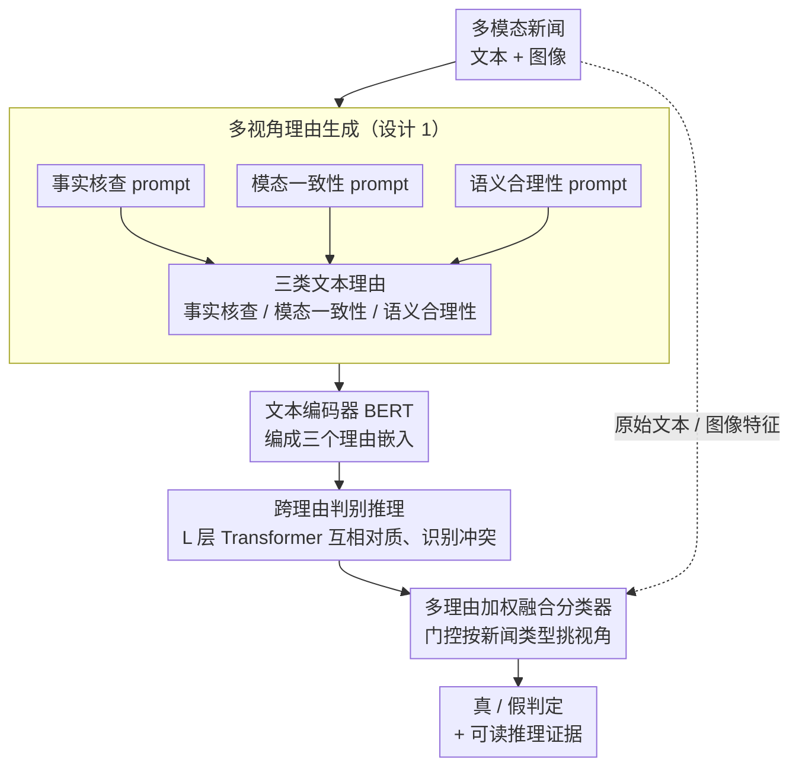

# MIND: Multi-Rationale Integrated Discriminative Reasoning Framework for Multi-Modal Fake News

**会议**: ICML 2026  
**arXiv**: [2605.29117](https://arxiv.org/abs/2605.29117)  
**代码**: 待确认  
**领域**: 社会计算 / 多模态学习 / 可解释假新闻检测  
**关键词**: 多视角推理, 假新闻检测, 可解释推理, LLM 集成

## 一句话总结
MIND 通过**多视角理由生成 + 跨理由判别推理**为假新闻检测提供可解释 + 鲁棒的判别框架——同时利用 LLM 生成的事实核查、模态一致性、语义合理性 3 类理由，在 Weibo / Twitter / Fakeddit 上 F1 较 SOTA 提升 4-8%。

## 研究背景与动机

**领域现状**：多模态假新闻检测面临两大挑战——**判别准确性**（需融合文本、图像、外部知识）和**可解释性**（需说明判定依据）。现有方法多依赖端到端二分类，可解释性差。

**现有痛点**：（1）端到端方法是黑盒，无法解释判定理由；（2）单一推理视角（如事实核查或视觉一致性）易被对抗样本欺骗；（3）LLM 的推理能力虽强但单独使用易"幻觉"；（4）已有可解释方法仅提供注意力可视化，缺乏结构化推理。

**核心矛盾**：假新闻检测需要**多视角综合判断 + 结构化推理证据**，但现有方法或单一视角易被欺骗，或缺乏结构化解释。

**本文目标**：构建多视角推理框架同时提升判别准确性与可解释性。

**切入角度**：人类专家鉴别假新闻时综合 3 类信息——事实核查（与已知事实是否一致）、模态一致性（图文是否匹配）、语义合理性（叙述是否符合常识）；用 LLM 模拟这一过程并融合判别。

**核心 idea**：用 LLM 从 3 个独立视角生成"理由"作为判别证据；通过跨理由注意力判别推理；分类基于多理由证据加权。

## 方法详解

### 整体框架
MIND 想同时拿下假新闻检测的两件事——判得准、还能说清为什么这么判。它模仿人类专家的鉴别习惯，把判断拆成三个独立视角再综合。流程是：先用预训练 LLM（GPT-4 或 Qwen-2.5）对每条新闻生成三类理由 $r_{\text{fact}}, r_{\text{cons}}, r_{\text{plau}}$（事实核查、模态一致性、语义合理性）；再用文本编码器（如 BERT）把它们编成向量 $\mathbf{e}_{\text{fact}}, \mathbf{e}_{\text{cons}}, \mathbf{e}_{\text{plau}}$；通过一个 Transformer 块让三类理由互相交互、暴露彼此的冲突；最后基于加权后的理由特征加上原始多模态特征做二分类。三个视角先分头取证、再对质、最后加权裁决，这条链同时产出了判别结果和可读的推理证据。

### 关键设计

**1. 多视角理由生成 prompt 模板：用三个独立 prompt 逼 LLM 从不同角度取证**

如果用一个 prompt 让 LLM 一次性综合所有视角，它容易偏向某一面、还丢细节。MIND 给每类理由配独立 prompt——事实核查 prompt（“基于已知事实判断这条新闻是否真实，给出 3 条证据”）、模态一致性 prompt（“分析文本和图像是否一致，描述具体不一致”）、语义合理性 prompt（“评估新闻叙述是否符合常识，指出可疑之处”），每个都要求 LLM 输出固定格式（结论加证据），存成文本理由 $r$。三路分开问，强制模型从三个角度各自推理、各自保留细节，才有后面“对质”的素材。

**2. 跨理由判别推理模块：让三类理由互相对质、识别冲突**

三个视角常常打架——事实核查说是真的，模态一致性却发现图文对不上。MIND 把三个理由嵌入 $[\mathbf{e}_{\text{fact}}, \mathbf{e}_{\text{cons}}, \mathbf{e}_{\text{plau}}]$ 拼成序列，过 $L$ 层 Transformer：自注意力 $\mathbf{Z} = \text{softmax}(QK^T / \sqrt{d}) V$ 捕捉理由间的相关与矛盾，FFN 增强非线性，输出每个理由更新后的嵌入 $\tilde{\mathbf{e}}_{\text{fact}}, \tilde{\mathbf{e}}_{\text{cons}}, \tilde{\mathbf{e}}_{\text{plau}}$。这一步把“各说各话”变成“互相参照”，让冲突在表示层被显式识别和调和，而不是丢给最后的分类器硬猜。

**3. 多理由加权融合分类器：按新闻类型自适应地决定信哪个视角**

不同假新闻依赖的视角不一样——纯文本造谣主要看事实核查，深度伪造图像主要看模态一致性。MIND 用一个门控网络算理由权重 $\alpha_i = \text{softmax}(W_g [\tilde{\mathbf{e}}_i; \mathbf{e}_{\text{orig}}])$，把理由特征加权汇总 $\mathbf{e}_{\text{aggr}} = \sum_i \alpha_i \tilde{\mathbf{e}}_i$，再把它和原始文本、图像特征拼成 $[\mathbf{e}_{\text{aggr}}; \mathbf{t}; \mathbf{v}]$ 交给分类器，用交叉熵训练。门控让模型对每条新闻自动挑出最该信的视角，而不是三票等权——这既提升判别力，加权本身也成了“这条主要靠哪个视角判的”可读解释。

## 实验关键数据

### 主实验

| 数据集 | 方法 | Acc | F1 | AUC |
|--------|------|-----|-----|-----|
| Weibo | EANN | 78.2 | 76.5 | 84.3 |
| Weibo | MVAE | 81.7 | 80.4 | 87.6 |
| Weibo | MCAN | 84.5 | 83.7 | 90.2 |
| Weibo | CAFE | 85.8 | 85.1 | 91.7 |
| Weibo | **MIND** | **90.3** | **89.5** | **95.2** |
| Twitter | MCAN | 79.3 | 78.4 | 85.6 |
| Twitter | CAFE | 82.1 | 81.5 | 88.3 |
| Twitter | **MIND** | **88.9** | **88.2** | **94.1** |
| Fakeddit | CAFE | 79.7 | 78.9 | 86.5 |
| Fakeddit | **MIND** | **86.7** | **86.0** | **92.4** |

### 消融实验

| 配置 | Weibo F1 | Twitter F1 |
|------|---------|-----------|
| 仅事实核查理由 | 86.3 | 84.7 |
| 仅一致性理由 | 84.7 | 83.5 |
| 仅合理性理由 | 85.1 | 83.9 |
| 三理由（无跨推理） | 87.9 | 86.5 |
| 三理由 + 跨推理（无门控） | 88.4 | 87.1 |
| **完整 MIND** | **89.5** | **88.2** |

### LLM 后端对比

| LLM 后端 | Weibo F1 | 推理成本 |
|---------|---------|---------|
| GPT-4 | 89.5 | 高 |
| GPT-3.5 | 87.2 | 中 |
| Qwen-2.5-72B | 88.7 | 中 |
| Qwen-2.5-7B | 86.8 | 低 |
| Llama-3-8B | 86.1 | 低 |

### 可解释性评估（人工评分，1-5）

| 方法 | 解释质量 | 推理可信度 | 总体满意度 |
|------|---------|-----------|----------|
| 注意力可视化（baseline） | 2.3 | 2.5 | 2.4 |
| 单 LLM 解释 | 3.7 | 3.5 | 3.6 |
| **MIND** | **4.5** | **4.4** | **4.5** |

### 关键发现
- **多视角融合显著优于单一视角**：3 视角 vs 单视角 F1 提升 3-5 个百分点。
- **跨理由推理处理冲突**：理由间矛盾时门控网络自适应权衡。
- **LLM 后端选择灵活性**：即使用 7B 小模型仍保持 88% F1。
- **可解释性大幅提升**：人工评分 4.5 vs 注意力可视化 2.4。

## 亮点与洞察
- **多视角推理框架的设计精巧**：模拟人类专家多角度判别假新闻的认知过程。
- **跨理由判别推理处理冲突**：避免单理由的盲目信任。
- **可解释性与准确性兼得**：突破"准确即黑盒"的二元局面。
- **LLM 后端灵活性**：从 GPT-4 到 Qwen-7B 都有效，部署成本可控。

## 局限与展望
- LLM 推理成本：每条新闻需调用 LLM 3 次。
- 理由质量依赖 LLM 能力：LLM 幻觉时理由可能错误。
- 视角覆盖性：3 个视角可能不足。
- 改进：探索动态视角选择；引入主动学习更新理由生成；多语言适配。

## 相关工作与启发
- **vs EANN/MVAE**：单一融合分类，无显式推理。
- **vs MCAN/CAFE**：跨模态注意力或对比学习，仍黑盒。
- **vs IDO**：IDO 显式建模不一致分布，MIND 显式多视角推理；两者互补可能进一步提升。
- **启发**：多视角理由生成 + 跨视角推理可扩展到其他需要可解释判别的场景。

## 评分
- 新颖性: ⭐⭐⭐⭐  多视角理由生成 + 跨理由推理框架新颖。
- 实验充分度: ⭐⭐⭐⭐⭐  3 数据集 + 5 基线 + LLM 后端对比 + 可解释性人工评分 + 详细消融。
- 写作质量: ⭐⭐⭐⭐⭐  逻辑清晰，prompt 模板提供完整，可重现性高。
- 价值: ⭐⭐⭐⭐⭐  既提升假新闻检测准确性又增强可解释性，对实际部署有重要价值。

<!-- RELATED:START -->

## 相关论文

- [\[ACL 2026\] MM-StanceDet: Retrieval-Augmented Multi-modal Multi-agent Stance Detection](../../ACL2026/social_computing/mm-stancedet_retrieval-augmented_multi-modal_multi-agent_stance_detection.md)
- [\[AAAI 2026\] Cross-modal Prompting for Balanced Incomplete Multi-modal Emotion Recognition](../../AAAI2026/social_computing/cross-modal_prompting_for_balanced_incomplete_multi-modal_emotion_recognition.md)
- [\[ICML 2026\] IDO: Incongruity-Aware Distribution Optimization for Multimodal Fake News Detection](ido_incongruity-aware_distribution_optimization_for_multimodal_fake_news_detecti.md)
- [\[AAAI 2026\] Multi-modal Dynamic Proxy Learning for Personalized Multiple Clustering](../../AAAI2026/social_computing/multi-modal_dynamic_proxy_learning_for_personalized_multiple_clustering.md)
- [\[AAAI 2026\] SceneJailEval: A Scenario-Adaptive Multi-Dimensional Framework for Jailbreak Evaluation](../../AAAI2026/social_computing/scenejaileval_a_scenario-adaptive_multi-dimensional_framework_for_jailbreak_eval.md)

<!-- RELATED:END -->
