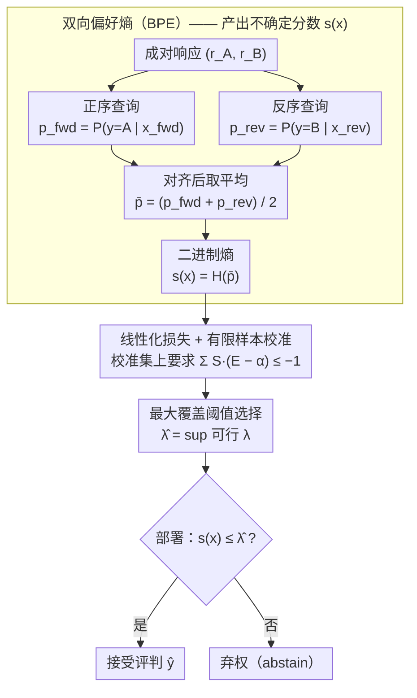

# SCOPE: Selective Conformal Optimized Pairwise LLM Judging

**会议**: ICML 2026  
**arXiv**: [2602.13110](https://arxiv.org/abs/2602.13110)  
**代码**: 待确认  
**领域**: LLM 评估 / 不确定性量化 / 保形预测  
**关键词**: LLM-as-Judge, 保形预测, 位置偏差, 虚假发现率控制, 双向偏好熵

## 一句话总结
SCOPE 通过**双向偏好熵（BPE）**消除 LLM 评判中的位置偏差，结合**保形风险控制**实现有限样本 FDR 控制——在保持高覆盖率的前提下提供统计有效的风险界保证（覆盖率 0.583 时 FDR 仅 0.099 vs Vanilla 1.000 但 FDR 0.198）。

## 研究背景与动机

**领域现状**：LLM 逐渐成为可扩展的评判工具，用于成对评估、强化学习和排行榜排名等任务。相比人类标注，LLM 评判成本低、速度快。

**现有痛点**：现有 LLM 评判方法存在三大问题——（1）**系统性偏差**：位置偏差、长度偏差、自偏好等导致评判不可靠；（2）**置信度不校准**：直接用模型概率作置信度代理，但易受偏差污染，高置信往往对应错误判断；（3）**缺乏统计保证**：即使平均校准看起来合理，也无法保证实际部署时的错误率控制。

**核心矛盾**：选择性预测可以解决"何时信任判断"的问题，但两大障碍阻挠其应用——（1）无法提供有限样本统计保证（阈值在验证集调好的可能在测试集违反）；（2）不确定信号被位置偏差等污染，高置信度常对应系统性错误。

**本文目标**：为成对 LLM 评判设计一个框架，既能提供有限样本 FDR（虚假发现率）控制保证，又能在实现保证的前提下最大化覆盖率。

**切入角度**：（1）引入**双向偏好熵（BPE）**——在两个响应顺序都查询模型，聚合概率而非离散投票，获得更纯净的不确定信号；（2）采用**保形风险控制**——基于线性化损失函数和有限样本校准，得出最大可行阈值，保证边际 FDR ≤ α。

**核心 idea**：不依赖启发式阈值或幼稚经验调参，而是通过对称的双向查询消除位置偏差，然后用可交换性假设下的保形理论得出具有分布无关保证的决策阈值。

## 方法详解

### 整体框架
SCOPE 要解决的是“什么时候该相信 LLM 评判、什么时候该弃权”，并且要给这个弃权决策一个有限样本的统计保证。整条流程分四步走：先对一组成对响应 $(r_A, r_B)$ 在正序和反序两个位置上各查询一次评判器，拿到两个概率；再把双向偏好平均后取二进制熵，作为这条判断的不确定分数；然后在一个有标注的校准集上，用线性化损失求出满足 FDR 约束的最大可行阈值 $\hat{\lambda}$；部署时只要不确定分数 ≤ $\hat{\lambda}$ 就接受评判，否则弃权。前两步（双向偏好熵）负责把不确定信号洗干净，后两步（线性化损失校准 + 最大覆盖阈值）负责把“接受/弃权”这条线画在数学上站得住的位置。

### 关键设计

**1. 双向偏好熵（BPE）：用对称查询洗掉位置偏差污染的“假自信”**

LLM 评判器有个老毛病——它会系统性偏向某个位置，普通的 softmax 置信度根本分不清“模型是真的确定”还是“只是被位置带着走”。BPE 的做法是让模型对同一对响应的两个顺序都表态：设正序下选 $r_A$ 的概率 $p_{\text{fwd}} = P_\theta(y = A \mid x_{\text{fwd}})$，反序下选 $r_A$（此时对应标签 $B$）的概率 $p_{\text{rev}} = P_\theta(y = B \mid x_{\text{rev}})$，若评判器可信且无位置偏差，两者应当接近。取平均 $\bar{p} = \frac{1}{2}(p_{\text{fwd}} + p_{\text{rev}})$，再算二进制熵 $s(x) = -[\bar{p} \log \bar{p} + (1 - \bar{p}) \log(1 - \bar{p})]$ 作为不确定分数。只有当两个顺序都给出同样的偏好时才算高置信，这等于用排列不变性强制了对称——比起离散投票，概率平均保留了连续信号，校准和判别都更细。

**2. 线性化损失 + 有限样本校准：把 FDR 约束变成能代数求解的条件**

经验风险比例在样本少时很不稳，没法直接拿来卡阈值。作者引入线性化损失 $L(x, \lambda) = S(x, \lambda) \cdot (E(x) - \alpha)$，其中 $S(x, \lambda)$ 是选择指示、$E(x)$ 是错误指示。关键观察是 $\mathbb{E}[L(x, \lambda)] \leq 0$ 恰好等价于 FDR ≤ α，于是把一个比例约束转成了线性约束，落到有限样本上就是充要条件 $\sum_{i=1}^n S(x_i, \lambda) \cdot (E(x_i) - \alpha) \leq -1$。右边那个 “−1” 是预留的安全预算，用来吸收单个测试样本的最坏情况，从而给出分布无关的边际保证。

**3. 最大覆盖阈值选择：在保证不被突破的前提下尽量多接受判断**

光有保证还不够，弃权太多就没实用价值。但这里的约束可行性不一定随 λ 单调——新增一个样本可能贡献 $-\alpha$（接受且判对）也可能贡献 $1-\alpha$（接受但判错），所以不能简单地二分搜索。算法直接取满足约束的最大可行阈值 $\hat{\lambda} = \sup\{\lambda : \sum_{i=1}^n S(x_i, \lambda) \cdot (E(x_i) - \alpha) \leq -1\}$，这样既守住了 FDR 保证，又把用户给的风险预算 α 用满，覆盖率最大化。

## 实验关键数据

### 不确定性估计质量对比

| 模型 | 方法 | ECE ↓ | AUROC | AUPRC |
|-----|------|-------|-------|-------|
| Qwen2.5-7B | 预测概率 | 0.239 | 0.658 | 0.824 |
| Qwen2.5-7B | 交换聚合 | 0.193 | 0.656 | 0.826 |
| Qwen2.5-7B | **BPE** | **0.143** | **0.685** | **0.855** |
| Qwen2.5-32B | **BPE** | **0.172** | **0.729** | **0.908** |
| Llama-3.1-70B | **BPE** | **0.145** | **0.744** | **0.894** |

### 风险控制与覆盖率（α = 0.10）

| 数据集 | 模型 | 方法 | 覆盖率 | 实际 FDR | 违反? |
|--------|-----|------|--------|---------|---------|
| MT-Bench | Qwen-7B | Vanilla | 1.000 | 0.269 | ❌ |
| MT-Bench | Qwen-7B | 启发式阈值 | 0.907 | 0.251 | ❌ |
| MT-Bench | Qwen-7B | **SCOPE** | **0.246** | **0.097** | ✅ |
| RewardBench | Qwen-32B | Vanilla | 1.000 | 0.120 | ❌ |
| RewardBench | Qwen-32B | **SCOPE** | **0.983** | **0.098** | ✅ |
| Chatbot Arena | Llama-70B | **SCOPE** | **0.583** | **0.099** | ✅ |

### 关键发现
- **BPE 的优势**：将两个概率平均后再计算熵获得更丰富的连续信号，明显优于离散投票——Qwen-7B 的 AUROC 从 0.656 提升至 0.685。
- **统计有效性**：Vanilla 覆盖率 100% 但 FDR 通常 0.2-0.27 远超 0.10 约束；SCOPE 在所有配置下都稳定满足约束。
- **模型规模与稳定性**：强模型（Llama-70B）在严格约束下仍维持较高覆盖（0.583 @ α = 0.10），弱模型（Qwen-7B）覆盖率显著下降（0.246）；但即使弱模型 SCOPE 也能保证 FDR 在预期范围内。

## 亮点与洞察
- **首个有限样本 FDR 保证的成对 LLM 评判框架**：BPE + 线性化损失的组合巧妙解决两个问题——前者消除偏差源，后者提供数学保证。
- **排列不变性的创意设计**：大多数消除位置偏差的方法采用离散投票，BPE 通过概率平均 + 熵运算实现排列不变——既保持简洁（仅两次前向），又获得连续信号。
- **无需重训练即可部署**：SCOPE 只依赖模型的 softmax 概率或 logits，作为现成层可作用于任何评判器（包括 API-only），降低部署成本。
- **线性化损失的巧妙转化**：将比例约束转化为线性约束，并通过"−1"预算吸收最坏情况——优雅的理论设计。

## 局限与展望
- 交换性假设在真实分布漂移时可能失效（提示词变化、策略模型行为变化）。
- BPE 需要两次前向，相比单次查询有 2 倍计算开销；完全黑盒 API（无概率访问）场景下不适用。
- 当前框架限于二分类成对判断，不支持多响应排序或基于评分表的评判。
- 在低覆盖率场景（α = 0.05 时 Qwen-7B 仅 2.4% 覆盖率），框架的实用性受限。

## 相关工作与启发
- **vs Swap-and-Aggregate**：都用双向查询消除位置偏差，但交换聚合用离散投票，BPE 用概率熵——BPE 信号连续、更细粒度。
- **vs Simulated Annotators**：通过 5 个虚拟人格 × 5 个少样本演示估计置信度；BPE 以仅两次前向达到更好的校准和判别能力。
- **vs 无保证的启发式选择**：阈值设为 $1 - \alpha$ 或验证集调参，无理论基础；SCOPE 线性化损失 + 有限样本校准原理上严格。
- **vs 保守型置信界**（Clopper-Pearson）：需要拒绝大量查询；SCOPE 通过更精细的设计在相同风险下实现 2.4 倍更高覆盖。

## 评分
- 新颖性: ⭐⭐⭐⭐⭐  首次将成对 LLM 评判与有限样本 FDR 控制结合，BPE 的排列不变设计也别具一格。
- 实验充分度: ⭐⭐⭐⭐  在三个主流基准 + 四种模型规模上均验证，统计鲁棒性高（1000 次随机分割）；跨域泛化验证不足。
- 写作质量: ⭐⭐⭐⭐⭐  逻辑清晰，动机循序渐进，符号定义精确。
- 价值: ⭐⭐⭐⭐⭐  针对 LLM-as-Judge 这一越来越重要的应用场景，提供首个可部署的有保证框架；对 RLHF、排行榜、自动评估等产业界应用意义重大。

<!-- RELATED:START -->

## 相关论文

- [\[ACL 2026\] Beyond the Crowd: LLM-Augmented Community Notes for Governing Health Misinformation](../../ACL2026/social_computing/beyond_the_crowd_llm-augmented_community_notes_for_governing_health_misinformati.md)
- [\[ICLR 2026\] SocialHarmBench: Revealing LLM Vulnerabilities to Socially Harmful Requests](../../ICLR2026/social_computing/socialharmbench_revealing_llm_vulnerabilities_to_socially_harmful_requests.md)
- [\[AAAI 2026\] Bias Association Discovery Framework for Open-Ended LLM Generations](../../AAAI2026/social_computing/bias_association_discovery_framework_for_open-ended_llm_generations.md)
- [\[ACL 2026\] Why Are We Moral? An LLM-based Agent Simulation Approach to Study Moral Evolution](../../ACL2026/social_computing/why_are_we_moral_an_llm-based_agent_simulation_approach_to_study_moral_evolution.md)
- [\[ACL 2026\] Justice in Judgment: Unveiling (Hidden) Bias in LLM-assisted Peer Reviews](../../ACL2026/social_computing/justice_in_judgment_unveiling_hidden_bias_in_llm-assisted_peer_reviews.md)

<!-- RELATED:END -->
