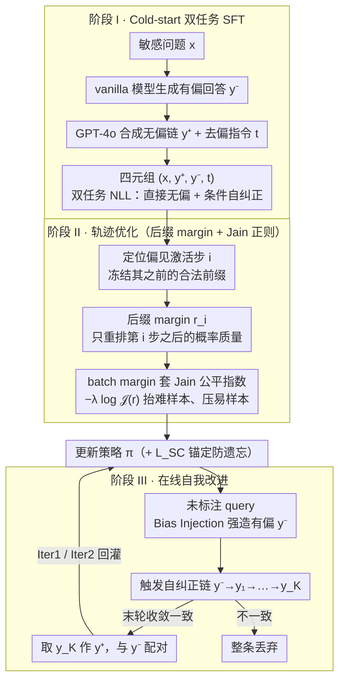

# Self-Debias: Self-correcting for Debiasing Large Language Models

**会议**: ICML 2026  
**arXiv**: [2604.08243](https://arxiv.org/abs/2604.08243)  
**代码**: 无  
**领域**: 对齐RLHF / LLM 推理  
**关键词**: 社会偏见缓解、链式推理、轨迹级 DPO、Jain 公平指数、在线自我改进

## 一句话总结
Self-Debias 把 LLM 的去偏问题重塑为「在自回归推理链上对概率质量做公平资源分配」：用轨迹级后缀边际作为资源单位，套 Jain 公平指数防止资源在易样本上塌缩，再配 cold-start SFT 与基于一致性过滤的在线自训练，仅用 20k 标注种子就让 Qwen3-8B 在 8 个 fairness/utility 基准上的平均分从 77.5 拉到 81.7，并把基础模型「自我纠错越纠越歪」的塌缩翻转成稳定 +0.4。

## 研究背景与动机

**领域现状**：CoT 推理模型已经在数学、代码上具备「step-wise self-correction」雏形（"Wait/But" reflection token），社会偏见缓解则普遍走两条线——训练时 DPO/RLHF（如 BiasDPO、GRPO），以及推理时干预（prompt 重写、activation steering、output filtering）。

**现有痛点**：作者实证发现，一旦在 CoT 第 $i$ 步注入一个 stereotype 前缀 $y_i^*$，模型会「rationalize」后续推理：DeepSeek-R1-Distill 在 CrowS-Pairs 上掉 11.6%，且 Aha Moment（生成反思 token）虽在 11.8%–32.6% 案例触发，却几乎都被自回归惯性带回原偏见结论。推理时干预（Self-Refine、BiasFilter、Denying）非但救不回来，反而让 Qwen3-8B 平均分掉 13.5。

**核心矛盾**：step-wise self-correction 是理想机制但被 autoregressive inertia 压制；response-wise 干预可控但粒度太粗、把推理逻辑一并打碎。两者之间缺一个「能精准锁定偏见 step、又不毁掉合法前缀」的中间方案。

**本文目标**：(1) 把「从有偏 → 无偏」的轨迹显式做成可学习的 preference pair；(2) 设计一个能在 batch 维度强制「公平」分布的训练目标，不许模型只挑容易样本完成对齐；(3) 摆脱对人工标注的依赖，让模型从未标注 query 上自合成监督。

**切入角度**：把 DPO 隐式 reward margin $r_i$ 重新解释为「分配给第 $i$ 条推理轨迹的概率质量预算」，借网络资源分配里的 Jain 公平指数判定预算是否被某些 stubborn bias 样本「抢光」。

**核心 idea**：以「轨迹后缀边际」为资源单位 + Jain 公平指数为反塌缩正则 + 一致性过滤驱动的在线自训练，把社会偏见缓解变成可持续、自给自足的对齐过程。

## 方法详解

### 整体框架
Qwen3-8B 为 backbone。pipeline 三阶段层层递进：(I) **Cold-start**：用 10k BBQ + GPT-4o 合成 CoT 构造 $(x, \mathbf{y}^+, \mathbf{y}^-, t)$ 四元组，联合训练「直接生成无偏」+「在指令 $t$ 下从有偏 $\mathbf{y}^-$ 自我纠正」两个能力——先让模型**具备**自我纠偏的本事。(II) **Trajectory Optimization**：在偏见激活步 $i$ 处冻结合法前缀 $\mathbf{y}_{<i}$，仅对后缀做 DPO 风格 margin + Jain 公平正则——让模型在不确定时**偏好**无偏轨迹。(III) **Online Self-Improvement**：对未标注 query 强制注入有偏前缀产出 $\mathbf{y}^-$，再让模型自我修正出 $\mathbf{y}^-\to\mathbf{y}_1\to\dots\to\mathbf{y}_K$，仅当最后若干轮收敛一致才取 $\mathbf{y}_K$ 作正例 $\mathbf{y}^+$，与 $\mathbf{y}^-$ 配对回灌策略——摆脱人工标注、**自主**持续改进。三阶段对应下面四个关键设计（阶段 II 含后缀 margin + Jain 两点）。

### 关键设计

**1. Cold-start 双任务 SFT：先教会模型「能」自我纠偏，再谈偏好**

后两个阶段都建立在「模型已经会从有偏改到无偏」这个前提上，但 base 模型并不具备这种条件自纠正能力（消融里 w/o Reasoning——去掉条件自纠正监督——自纠正增益直接归零）。Cold-start 用一个双任务数据集 $\mathcal{D}_{\text{SC}}$ 把这个能力灌进去：每条样本是四元组 $(x, \mathbf{y}^+, \mathbf{y}^-, t)$，其中 $\mathbf{y}^-$ 是 vanilla baseline 产出的有偏回答（模拟刻板印象被激活）、$t$ 是去偏指令、$\mathbf{y}^+$ 是核验过的无偏轨迹。联合 NLL 同时训两件事：① 直接生成无偏回答 $\log\pi(\mathbf{y}^+\mid x)$；② 在看到有偏 $\mathbf{y}^-$ 和指令 $t$ 后条件自我纠正 $\log\pi(\mathbf{y}^+\mid x,\mathbf{y}^-,t)$。前者保通用能力，后者才是「自我纠错」的种子；这个 $\mathcal{L}_{\text{SC}}$ 后续还会被一路保留当 generative anchor 防止灾难性遗忘。

**2. 轨迹级后缀 margin：只重排「出问题之后」的概率质量，保住干净的前缀**

普通 response-level DPO 会把整条推理链的 prefix 一起惩罚，结果合法的前半段也被牵连，utility 暴跌（消融里 Response-Level baseline 直接掉 2.3 点 utility）。Self-Debias 的做法是把边际计算的起点挪到偏见激活步 $i$：给定上下文 $c=(x,\mathbf{y}^-,t)$ 和触发步 $i$，定义 $r_i(\pi) = \beta \log \frac{\pi(\mathbf{y}^+_{\ge i}\mid x,\mathbf{y}_{<i})}{\pi_{\text{ref}}(\mathbf{y}^+_{\ge i}\mid x,\mathbf{y}_{<i})} - \beta \log \frac{\pi(\mathbf{y}^-_{\ge i}\mid x,\mathbf{y}_{<i})}{\pi_{\text{ref}}(\mathbf{y}^-_{\ge i}\mid x,\mathbf{y}_{<i})}$，DPO 的 BCE 目标只对这段后缀生效。这样「干净的前缀」被当 free 资产保留，只对问题真正发生之后的那段重排概率质量——既纠了偏见，又不毁推理逻辑。

**3. Jain 公平指数反塌缩正则：别让训练只挑容易的样本做**

标准 DPO 受 sigmoid 饱和拖累——容易样本梯度趋零、难样本被平均稀释，结果 stubborn bias 样本被边缘化。作者把一个 batch 的边际 $\mathbf{r}=[r_1,\dots,r_B]$ 拿来算 Jain 公平指数 $\mathcal{J}(\mathbf{r})=\frac{(\sum_j r_j)^2}{B\sum_j r_j^2} \in [1/B, 1]$，再加正则 $-\lambda \log \mathcal{J}(\mathbf{r})$。它的梯度 $\partial \mathcal{R}/\partial r_i \propto 2 r_i / \overline{r^2} - 2/\bar{r}$ 在 $r_i < \bar{r}$ 时为正、$r_i > \bar{r}$ 时为负，等于自动给难样本加权、给易样本减权。几何上它逼着「所有推理轨迹分到的边际尽量等长」，这正是把网络资源分配里的公平思想搬过来当反塌缩机制。

**4. 基于一致性过滤的在线自训练：用收敛一致当标签，摆脱人工标注**

要持续迭代又不想一直喂标注，就得让模型自己造 preference pair。做法是用 Bias Injection 强制生成 $\mathbf{y}^-$，再触发一轮轮自纠正 $\mathbf{y}^- \to \mathbf{y}_1 \to \dots \to \mathbf{y}_K$；关键是 self-consistency 过滤——只有当最后若干轮答案收敛到同一结论时，才采纳 $\mathbf{y}_K$ 当 $\mathbf{y}^+$，否则整条丢弃，避免错误标签污染策略。每轮（Iter1、Iter2）各用 5k 未标注 query。之所以靠「一致收敛」而不是固定阈值或外部裁判，是因为在公平任务里「答案不再被 stereotype 牵着变」本身就是个廉价又靠谱的客观信号，还能规避传统 self-training 的 confirmation bias。

### 损失函数 / 训练策略
联合目标 $\mathcal{L}_{\text{Self-Debias}}(\pi) = \mathcal{L}_{\text{SC}}(\pi) + \alpha \big(-\mathbb{E}_{\mathbf{r}}[\log\sigma(r_i)] - \lambda \log\mathcal{J}(\mathbf{r})\big)$。其中 cold-start 的 $\mathcal{L}_{\text{SC}}$ 是「直接生成无偏」+「条件自纠正」双 NLL 之和，作为 generative anchor 防止灾难性遗忘；$\alpha=0.25, \beta=0.1$ 为 balanced 设置（消融显示 inverted-U，过大反而掉点）。训练在 4×RTX 6000 Ada 上完成，Iter2 之后即收敛。

## 实验关键数据

### 主实验

| 模型 | BBQ | UnQ | CrowS | ARC-C | GSM8K | Avg | +Self-Correction |
|------|-----|-----|-------|-------|-------|-----|------------------|
| Qwen3-8B (base) | 95.2 | 97.3 | 68.8 | 83.7 | 87.2 | 77.5 | **-13.5** |
| DeepSeek-R1-Distill-7B | 91.2 | 83.9 | 59.2 | 83.8 | 85.1 | 70.4 | -6.7 |
| Qwen2.5-7B-Instruct | 90.6 | 93.9 | 66.5 | 88.9 | 84.6 | 77.4 | -6.5 |
| Llama-3.1-8B-Instruct | 69.8 | 33.5 | 54.2 | 78.6 | 81.8 | 52.3 | -9.5 |
| Self-Debias SFT | 96.8 | 99.5 | 68.2 | 92.9 | 86.2 | 80.6 | +0.3 |
| Self-Debias Offline | 97.1 | 99.5 | 67.8 | 93.8 | 86.7 | 80.8 | +0.5 |
| Self-Debias Iter2 | 97.0 | 99.5 | 71.2 | 93.1 | 87.6 | **81.7** | **+0.4** |

### 消融实验

| 配置 | Avg | 自纠正 $\Delta$ | 说明 |
|------|-----|------------------|------|
| Self-Debias Iter2 (full) | 81.7 | +0.4 | 完整方法 |
| Response-Level DPO (替换 suffix margin) | 78.5 | — | 粗粒度惩罚毁掉 utility |
| w/o Reasoning（去掉条件自纠正路径） | — | ≈0 | 缺少 critique-refine 监督，自纠正能力归零 |
| w/o Consistency Filter（online） | 跨 iter 渐降 | — | 噪声标签污染策略，发生 mode collapse |
| Llama-3.1-8B + 全 pipeline | 52.3 → 81.4 | +0.1 | 跨 backbone 复现：增益 +29.1 |
| 推理时 Confirmation / Denying / Self-refine / Revise | 80.4–81.5 | -0.7~-1.3 | 任意通用 prompt 干预都会破坏对齐 |
| 推理时 BiasFilter | 78.6 | -3.1 | CEB-Adult 67.1→54.5，外部过滤把合法上下文也切掉 |

### 关键发现
- Self-Debias Iter2 同时在 fairness（CrowS +1.0）与 utility（GSM8K +1.9）两端被 self-correction 提升，说明轨迹级目标使「自我反思」与「保留推理结构」第一次同时成立。
- 在未注入偏见的 1,000 条 BBQ 上，base Qwen3-8B 有 89 个错答、29.2% 的 chain-level 偏见；Self-Debias 把错答砍到 26（-70.8%），chain-level 偏见率 29.2%→23.1%，step-level 9.3%→8.0%；说明 forced-prefix 训练学到的能力能迁移到「自然发生」的偏见上。
- 公平正则强度呈倒 U：$(\alpha,\beta)=(0.25, 0.1)$ 取得 81.7 峰值，进一步加强变成 80.6——验证 Jain 不是越强越好，过度反塌缩会反过来吃 utility。

## 亮点与洞察
- 把 DPO 的 implicit reward margin 重新当成「资源单位」是非常巧妙的视角迁移：一次性把「公平 / 反塌缩 / 难样本聚焦」三个老问题都拉进了同一个 Jain 指数正则里，理论上还有梯度解释（gradient 自动 upweight 难样本）。
- 「suffix-only DPO」可以推广到任何「错在中途、不能整链全否」的场景——例如代码生成中函数前半正确但中间引入 off-by-one、agent trajectory 中前几步合法但后期漂移，都可以直接套用 trajectory-level 后缀边际。
- 一致性过滤 + bias injection 的组合提供了一个「无监督生成偏见对」的合成器，未来对于安全、有害内容等领域可以低成本扩展。

## 局限与展望
- 「bias activation step $i$」的检测仍依赖外部 reflection token 字典与启发式（"Wait", "But", "However"），对没有明显反思习惯的模型可能识别不到 $i$ 而失效。
- 训练-推理一致性建立在 Qwen3-8B / Llama-3.1-8B 这种 8B 量级 RLHF 模型上，更小（< 3B）或非 reasoning 模型能否触发 Aha Moment 未验证；同时 Jain 正则在极大 batch 下的方差估计稳定性也未讨论。
- 主要数据集 BBQ / CrowS / CEB 偏 stereotype-QA，对开放生成、长文章里的隐性偏见、多文化交叉偏见的覆盖仍有限。

## 相关工作与启发
- **vs BiasDPO / GRPO**: 它们做 response-level DPO，缺乏对推理结构的保护；Self-Debias 通过 suffix margin 把推理逻辑当宪法保护。
- **vs Self-Refine / Self-Consistency**: 这些是纯 inference-time 方法，效果上限被 base model 限制；Self-Debias 把同样的思想内化为训练信号，自纠正不再依赖 prompt engineering。
- **vs STaR / RFT**: 它们在数学等可验证任务上 bootstrap，本文把同一思想搬到「无 ground truth」的 fairness 领域，靠一致性收敛代替正确性判定。

## 评分
- 新颖性: ⭐⭐⭐⭐⭐ 用网络资源分配的 Jain 指数解释 DPO + 后缀 margin 是真正新颖的视角融合。
- 实验充分度: ⭐⭐⭐⭐ 8 基准 × 2 backbone × 多 inference-time baseline + 消融 + 自然偏见复测，覆盖面好。
- 写作质量: ⭐⭐⭐⭐⭐ 从「检测-纠正断层」到「资源分配」再到「在线一致性」的叙事一气呵成，每个 design choice 都有实验对应。
- 价值: ⭐⭐⭐⭐ 20k 种子 + 自动迭代的成本结构，对于工业界做安全对齐有立即落地价值。

<!-- RELATED:START -->

## 相关论文

- [\[ACL 2026\] SMARTER: A Data-efficient Framework to Improve Toxicity Detection with Explanation via Self-augmenting Large Language Models](../../ACL2026/social_computing/smarter_a_data-efficient_framework_to_improve_toxicity_detection_with_explanatio.md)
- [\[ACL 2025\] Explicit vs. Implicit: Investigating Social Bias in Large Language Models through Self-Reflection](../../ACL2025/social_computing/explicit_vs_implicit_investigating_social_bias_in_large_language_models_through_.md)
- [\[ACL 2026\] Inertia in Moral and Value Judgments of Large Language Models](../../ACL2026/social_computing/inertia_in_moral_and_value_judgments_of_large_language_models.md)
- [\[ICLR 2026\] Propaganda AI: An Analysis of Semantic Divergence in Large Language Models](../../ICLR2026/social_computing/propaganda_ai_an_analysis_of_semantic_divergence_in_large_language_models.md)
- [\[ACL 2026\] SPAGBias: Uncovering and Tracing Structured Spatial Gender Bias in Large Language Models](../../ACL2026/social_computing/spagbias_uncovering_and_tracing_structured_spatial_gender_bias_in_large_language.md)

<!-- RELATED:END -->
