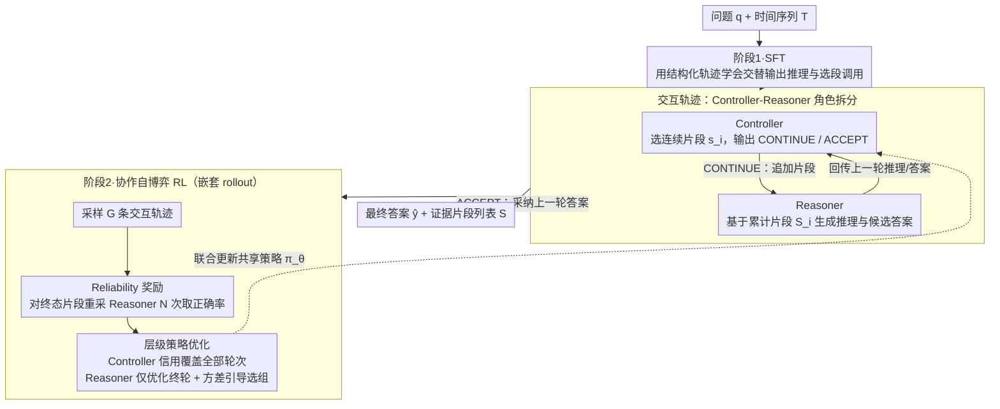

# Adaptive Time Series Reasoning via Segment Selection

**会议**: ICML 2026  
**arXiv**: [2602.18645](https://arxiv.org/abs/2602.18645)  
**代码**: https://github.com/mims-harvard/ARTIST  
**领域**: 时间序列
**关键词**: 时间序列推理, segment selection, controller-reasoner, self-play RL, 层级策略优化  

## 一句话总结
这篇论文提出 ARTIST，把时间序列问答变成“边推理边选择片段”的序贯决策问题，通过 controller-reasoner 架构和层级自博弈 RL，让模型只读取与问题相关的时间片段并提升推理准确率。

## 研究背景与动机
**领域现状**：时间序列任务正在从传统预测、分类、异常检测扩展到自然语言问答式推理。用户给出一个问题，模型需要从时间序列中定位相关区间、比较模式、解释变化，并输出答案。已有方法通常把整条时间序列序列化成文本、渲染成图像，或编码成 embedding 后一次性喂给 LLM。

**现有痛点**：一次性处理完整时间序列会把大量无关片段混进上下文。对于长序列或多步推理任务，真正有用的信息可能只在几个短区间，且会随着中间推理结论变化。固定视图无法实现“先看一段建立 baseline，再看另一段验证假设”的动态过程。

**核心矛盾**：模型需要主动选择要看的时间片段，但训练数据通常没有“这个问题该看哪些区间”的标注；同时，如果直接用 token-level RL 优化长推理轨迹，segment selection 的信用分配会被长文本输出稀释。

**本文目标**：让 LLM 在推理时把时间序列当作可交互资源：先选择一个片段，基于片段推理，再决定继续选择还是停止回答。训练时要分别优化“看哪里”和“怎么回答”。

**切入角度**：论文把一个模型用 role-specific prompt 分成 controller 和 reasoner。controller 负责选择 temporal segment 和停止条件；reasoner 只基于已选片段生成中间推理和答案。这样可以把证据获取和答案生成拆开，并给两个角色设计不同 reward。

**核心 idea**：用 controller-reasoner 协作自博弈，把时间序列推理训练成可解释的自适应片段选择过程。

## 方法详解
ARTIST 的核心是把时间序列推理形式化为一条交互轨迹。给定问题 $q$ 和时间序列 $T\in\mathbb{R}^{H\times V}$，controller 在第 $i$ 轮看到问题、完整序列、已选片段、上一轮 reasoner 的推理和答案，然后输出继续/接受决策。如果继续，它还要选择一个新的连续片段 $s_i=T_{t_{start}:t_{end}}$。reasoner 收到累计片段列表 $S_i$，生成本轮推理 trace 和候选答案。若 controller 选择 ACCEPT，则上一轮 reasoner 的答案成为最终输出。

### 整体框架
训练分两阶段。第一阶段是 SFT，用人工或自动构造的 structured traces 微调模型，让它学会交替输出自然语言推理和 segment-selection call。第二阶段是 RL，使用 collaborative self-play：同一个策略模型通过不同 prompt 扮演 controller 和 reasoner，生成多条交互轨迹，并用嵌套 rollout 计算两个角色的 reward。

在 RL 中，每个训练样本先采样 $G$ 条 Controller-Reasoner 交互轨迹。对每条轨迹的终态片段列表，再让 Reasoner 独立采样 $N$ 次（嵌套 rollout），估计“这些片段能否稳定支持正确答案”。Controller 的奖励主要来自 reliability（可靠性），即重复 Reasoner 采样下答案正确的比例；Reasoner 的奖励来自最终答案正确性与格式合规。最后把 Controller 的 advantage 传播到所有 Controller 决策 token，把 Reasoner 的 advantage 只传播到最终一轮 Reasoner 输出。

### 关键设计

**1. Controller-Reasoner 角色拆分：把“选证据”和“读证据答题”拆成两个可单独优化的角色。** 如果让单条长 chain-of-thought 同时负责挑片段和给答案，RL 只能看到最终对错，无法判断错误来自选错证据还是推理失误，信用分配被搅在一起。ARTIST 让同一个策略模型 $\pi_\theta$ 通过不同 role prompt 扮演两个角色：Controller 看到问题、完整序列、已选片段列表 $S_{i-1}$ 以及上一轮 Reasoner 的推理与答案，输出决策 $d_i\in\{\mathrm{CONTINUE},\mathrm{ACCEPT}\}$，若继续则再提议一个连续片段 $s_i=T_{t_{start}:t_{end}}$ 并追加进片段列表；Reasoner 只看问题和累计片段 $S_i$，生成推理 trace 与候选答案。两个角色共享参数但激活不同能力。证据获取与答案生成一旦分开，就能给两者各设奖励、各算 advantage，错误归因变得清晰。

**2. Reliability 可靠性奖励：让 Controller 追求“选到足以稳定答对的证据”，而非某一次侥幸答对。** LLM 生成有随机性，某组片段下 Reasoner 单次答对可能纯靠运气，用单次正确性奖励 Controller 会被噪声带偏。ARTIST 改用 reliability 作为 Controller 的主奖励：固定 Controller 选出的终态片段列表 $S$，让 Reasoner 独立重采样 $N$ 次，取答对比例 $D(q,S,y^*)=\frac{1}{N}\sum_{n}\mathbb{1}[\hat{y}^{(n)}=y^*]$。只有当一组片段能让 Reasoner 反复稳定答对时，Controller 才拿高分。这把 Controller 的目标从“让这次答对”扭成“选到信息足够的证据”，更贴近信息检索/工具使用的本质——消融里去掉它，平均准确率从 73.4% 暴跌到 52.0%，是所有模块中跌得最狠的。

**3. 层级策略优化 + 方差引导采样：把长轨迹的信用分配到正确的角色和正确的阶段。** 片段选择是跨多轮的长期决策（先看一段建立 baseline，再看另一段验证假设），不能只奖励最后一步；而 Reasoner 在片段固定后更像一次局部问答。ARTIST 用嵌套 rollout 把两者的信用分开：对每个样本先采 $G$ 条交互轨迹，Controller 拿轨迹级（trajectory-level）advantage、信用覆盖轨迹里所有交互轮次的决策 token；Reasoner 只在终态片段上优化最后一轮输出，避免被前面选段质量的方差干扰。为省显存又抓住有学习信号的组，再按各组 Reasoner 正确率方差 $r_\sigma^{(g)}$ 做 variance-guided sampling（$p(g)\propto r_\sigma^{(g)}$），优先更新结果差异更大的组。消融显示，去掉 trajectory-level objective 会让 Controller 变得 myopic、学不到多轮片段组合策略。

### 损失函数 / 训练策略
SFT 使用 LoRA 在结构化轨迹上训练。RL 阶段使用全参数 fine-tuning，并将 controller reward $R_{ctl}$ 与 reasoner reward $R_{rsn}$ 转化为 group-relative advantages 做联合策略更新。实现上，主模型是 Qwen3-4B，时间序列用 5 层 MLP 编码 patch-based 输入；评估中 reasoner temperature 为 0.7，controller temperature 为 1.0。论文主设置关注 univariate time series。

## 实验关键数据

### 主实验
主实验覆盖 6 个时间序列推理 benchmark：ETI、RCW、ECG-QA、Sleep-QA、TSQA、TRQA。下表摘取平均和代表数据集结果。

| 方法 | ETI Acc/F1 | RCW Acc/F1 | ECG-QA Acc/F1 | TSQA Acc/F1 | TRQA Acc/F1 | Avg Acc/F1 |
|--------|------|------|----------|------|------|------|
| OpenTSLM-4B + SFT | 82.69 / 82.66 | 65.49 / 38.29 | 69.50 / 41.00 | 47.50 / 35.81 | 76.25 / 69.36 | 62.80 / 47.68 |
| ITFormer-4B + SFT | 84.62 / 84.60 | 67.31 / 57.95 | 57.31 / 49.91 | 49.50 / 23.62 | 80.12 / 74.22 | 62.08 / 51.01 |
| ARTIST + SFT | 85.12 / 85.11 | 69.75 / 61.46 | 56.31 / 55.68 | 60.06 / 57.13 | 82.26 / 62.32 | 63.61 / 56.61 |
| ARTIST + SFT + RL | 87.03 / 87.10 | 77.00 / 50.00 | 69.81 / 52.67 | 62.00 / 58.66 | 83.06 / 78.02 | 69.26 / 57.61 |
| 相对最强基线提升 | +2.41 / +2.50 | +3.11 / +3.51 | +3.14 / +3.89 | +12.50 / +11.91 | +2.94 / +3.80 | +6.46 / +6.60 |

### 消融实验
消融在 ECG-QA 和 RCW 上报告 accuracy，直接检验核心模块。

| 配置 | ECG Acc | RCW Acc | Avg Acc | 说明 |
|------|---------|------|------|------|
| ARTIST | 69.81 | 77.00 | 73.41 | 完整 controller-reasoner + reliability + 层级 RL |
| Reasoner Only | 65.33 | 62.88 | 64.11 | 去掉 controller，处理静态输入，平均下降 9.30 |
| Controller-only RL | 60.81 | 68.13 | 64.47 | 冻结 reasoner，无法适应 controller 动态片段分布 |
| w/o Reliability Reward | 52.50 | 51.44 | 51.97 | 最大跌幅，说明单次正确性会误导片段选择 |
| w/o Trajectory-based Objective | 55.19 | 67.06 | 61.13 | myopic controller 学不到多轮片段组合策略 |
| w/o Variance-guided Sampling | 68.13 | 72.75 | 70.44 | 方差引导采样提供更有效的 reasoner 学习信号 |

### 关键发现
- ARTIST 平均准确率比每个数据集上的最强 baseline 提高 6.46 个百分点，说明动态片段选择不是只带来可解释性，也实实在在提升答案质量。
- RL 相比 SFT 继续提升平均准确率，从 63.61% 到 69.26%。这说明 segment selection 不能只靠示范学习，后训练中的可靠性 reward 能进一步优化“该看哪里”。
- 数据利用分析显示，更多覆盖不一定更好。Sleep-QA 和 TRQA 在使用约 30-50% 信号时准确率最高；接近全序列使用反而表现更差。
- 推理成本确实增加：例如 TRQA 上 ARTIST 每例 8 runs 约 1.68 分钟，高于 OpenTSLM/ITFormer 的 1.26/1.29 分钟；但长序列扩展到 12K 时耗时只从 1.880 增至 1.910 分钟，说明成本主要由选中片段和交互轮数决定。

## 亮点与洞察
- 这篇论文把时间序列推理从“怎么编码整条序列”转向“推理过程中该看哪一段”，问题定义很到位。很多真实问题确实需要先粗看、再局部放大、最后比较多个片段。
- Reliability reward 很关键。它把 controller 的目标从“让 reasoner 这次答对”改成“选择足以稳定答对的证据”，更接近信息检索/工具使用的本质。
- ARTIST 的 segment list 天然提供证据轨迹，便于审查答案依据。这对医疗、金融、环境监测等需要可解释定位的时间序列任务特别重要。

## 局限与展望
- 方法推理成本高于单 pass baseline，因为每个问题需要多轮 controller-reasoner 调用。虽然长序列扩展成本增长不大，但短序列或实时场景仍需考虑延迟。
- 主实验聚焦 univariate time series。多变量、异步采样、缺失值和跨变量因果关系会让 segment selection 更复杂。
- 片段选择是否总是可解释仍需谨慎。controller 选择的片段能提供证据线索，但不等价于严格因果解释。
- Sleep-QA 上 tokenized ARTIST 明显落后于 TimeMaster+RL，而 VLM backbone 版本能追上，说明输入模态和预训练先验仍是强影响因素。

## 相关工作与启发
- **vs ChatTS / OpenTSLM / ITFormer**: 这些方法重点是把时间序列编码给 LLM；ARTIST 重点是推理时动态选取片段，避免固定全局表示。
- **vs VL-Time / TimeMaster**: 视觉化方法利用图像先验处理时间序列；ARTIST 不依赖整图一次性理解，而是工具式选择片段。
- **vs Dynamic Visual Search**: 图像搜索通常有空间区域和显式目标，时间序列片段的意义依赖相对基线和前后比较，因此更需要多轮上下文感知选择。
- **vs 普通 self-play RL**: 许多 self-play 方法用 proposer/solver 的即时目标；ARTIST 的 controller 是长期片段策略，需要 trajectory-level objective。

## 评分
- 新颖性: ⭐⭐⭐⭐⭐ 把时间序列推理和 adaptive segment selection 结合得很自然，问题设定有拓展性。
- 实验充分度: ⭐⭐⭐⭐☆ 覆盖 6 个 benchmark 和多类 baseline，但多变量场景仍缺失。
- 写作质量: ⭐⭐⭐⭐☆ 方法框架清楚，附录实验较多，主线需要读者跟住 controller/reasoner 的 credit assignment。
- 价值: ⭐⭐⭐⭐⭐ 对长时间序列问答、医学监测和可解释 temporal reasoning 都有直接启发。

<!-- RELATED:START -->

## 相关论文

- [\[ICLR 2026\] Reasoning on Time-Series for Financial Technical Analysis](../../ICLR2026/time_series/reasoning_on_time-series_for_financial_technical_analysis.md)
- [\[ICML 2026\] PATRA: Pattern-Aware Alignment and Balanced Reasoning for Time Series Question Answering](patra_pattern-aware_alignment_and_balanced_reasoning_for_time_series_question_an.md)
- [\[ICLR 2026\] TimeOmni-1: Incentivizing Complex Reasoning with Time Series in Large Language Models](../../ICLR2026/time_series/timeomni-1_incentivizing_complex_reasoning_with_time_series_in_large_language_mo.md)
- [\[ICML 2026\] DistMatch: Adaptive Binning via Distribution Matching for Robust Sequential Conformal](distmatch_adaptive_binning_via_distribution_matching_for_robust_sequential_confo.md)
- [\[ICLR 2026\] SwiftTS: A Swift Selection Framework for Time Series Pre-trained Models via Multi-task Meta-Learning](../../ICLR2026/time_series/swiftts_a_swift_selection_framework_for_time_series_pre-trained_models_via_multi.md)

<!-- RELATED:END -->
