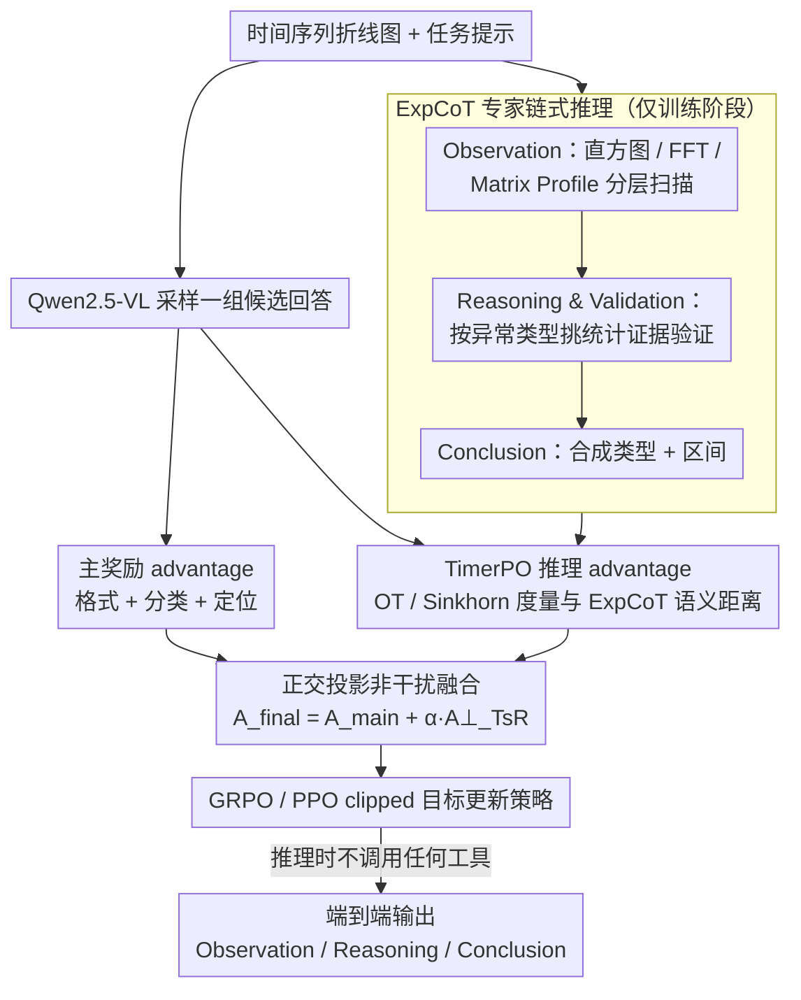

# AnomSeer: Reinforcing Multimodal LLMs to Reason for Time-Series Anomaly Detection

**会议**: ICML2026  
**arXiv**: [2602.08868](https://arxiv.org/abs/2602.08868)  
**代码**: https://github.com/jrzhang33/AnomSeer  
**领域**: 时间序列 / 多模态LLM / 异常检测  
**关键词**: 时间序列异常检测, 多模态大模型, 强化学习, 专家思维链, 最优传输  

## 一句话总结
AnomSeer 将经典时间序列异常检测的统计证据写成专家推理轨迹，并用 TimerPO 强化多模态大模型，使其在折线图输入上同时完成异常类型判断、区间定位和细粒度解释。

## 研究背景与动机
**领域现状**：时间序列异常检测过去主要依赖统计方法、传统机器学习或重构/预测式深度模型，目标通常是给出异常分数或异常区间。随着 LLM 和 MLLM 的发展，近期工作开始把时间序列渲染成折线图，再让多模态模型从图像和文本提示中判断异常，这样可以利用视觉模型对形状、趋势和局部波动的感知能力，也避免把长序列直接塞进文本上下文。

**现有痛点**：通用 MLLM 并没有内置时间序列先验。它们能看出非常明显的尖峰或大幅偏移，却容易把推理停留在“突然变化”“整体波动”这类粗粒度描述上，对频率漂移、轻微趋势变化、局部 shapelet 异常等细节不够敏感。普通 SFT 只模仿正确答案，普通 RL 又主要依赖分类和定位这类全局可验证奖励，都难以迫使模型学习可检验的时间序列分析过程。

**核心矛盾**：异常检测需要模型同时具备两种能力：一方面要保持 MLLM 的整体视觉理解和语言解释能力，另一方面要像传统 TSAD 方法一样使用统计量、频域特征、局部相似度等细粒度证据。如果把这些专家信号直接并入主奖励，可能会和检测目标发生梯度干扰；如果完全不加入，又只能学到粗糙的视觉启发式。

**本文目标**：作者希望训练一个面向 TSAD 的 MLLM 后训练方法，使模型输入时间序列图像后，能够输出异常类型、异常区间和自然语言解释；同时解释要落在具体时间戳、频率、趋势、幅度或局部模式上，而不是只给泛泛的视觉判断。

**切入角度**：论文的关键观察是，传统 TSAD 工具虽然不擅长生成自然语言，却能提供可靠、可验证的细粒度证据。作者因此不把它们当作推理时的外部插件，而是在训练阶段把这些分析流程转写成专家链式推理，再作为强化学习中的辅助推理信号。

**核心 idea**：用经典 TSAD 分析生成 ExpCoT，再通过带最优传输对齐和正交投影的 TimerPO，把“细粒度时间序列证据”注入 MLLM 的 RL 更新中。

## 方法详解
AnomSeer 是一个后训练框架，不修改 Qwen2.5-VL 的模型结构，也不在推理时调用外部检测器。它的训练数据来自合成 AnomLLM，输入是时间序列折线图和任务提示，输出是包含推理、异常类型和区间定位的结构化文本。训练阶段先用传统分析方法为每个样本生成 ExpCoT，再用 TimerPO 让模型输出向这些专家轨迹靠近，同时仍以异常分类和定位作为主目标。

### 整体框架
整体流程可以分成四步。第一步，把原始单变量时间序列渲染成折线图，作为 MLLM 的视觉输入；文本提示说明需要判断异常类型、定位异常区间并解释原因。第二步，利用 ground-truth 标注和传统 TSAD 分析生成 ExpCoT，这一步只发生在训练阶段。第三步，模型对同一个输入采样一组候选回答，分别计算结果奖励和推理对齐奖励。第四步，TimerPO 将推理奖励中与主任务奖励不重叠的部分正交化后加入最终 advantage，驱动策略更新。

推理时流程更简单：模型只接收图像和提示，直接输出 Observation、Reasoning & Validation、Conclusion 风格的答案。ExpCoT、FFT、Matrix Profile 等工具都不再在线调用，因此不会增加推理时延或额外 token 成本。

### 关键设计

**1. ExpCoT 专家链式推理：把传统 TSAD 工具的统计证据写成可学的推理轨迹**

通用 MLLM 给出的解释往往语言流畅但证据不可靠，只会停在「突然变化」「整体波动」这类粗粒度判断上。ExpCoT 的做法是把经典异常检测的分析纪律转写成一条 Observation → Reasoning & Validation → Conclusion 的自然语言轨迹。Observation 阶段先做全局扫描，用直方图异常分数找极端值；若没有明显全局异常，再做结构扫描，用平滑梯度看趋势稳定性、用 FFT 看周期和频率变化；若结构仍稳定，最后用 Matrix Profile 搜索局部不相似子序列。Reasoning & Validation 则按真实异常类型挑对应证据——趋势漂移用梯度验证、频率异常用频域峰值验证、局部形状异常用 discord 分数验证；Conclusion 再把类型和区间合成最终判断。这样模型学到的不是模板化解释，而是「为什么这里异常」落到具体统计量和时间位置上的可迁移分析路径。注意 ExpCoT 只在训练阶段生成，推理时模型已经把这套路径内化，不再在线调用任何工具。

**2. TimerPO 的推理 advantage：用最优传输度量回答与专家轨迹的语义接近度**

光有专家轨迹还不够，得有办法把「模型解释像不像专家」变成可优化的奖励，又不能逐 token 死板对齐——因为合理的解释可能换种说法、调换顺序。TimerPO 在 GRPO 的结果奖励之外加了一路推理奖励：主奖励由格式、异常类型分类和区间定位组成，组内归一化得到 $\widehat{A}_{main}$；同时取模型回答和 ExpCoT 的 final-layer token embedding，用余弦距离构造代价矩阵，再用熵正则的 Sinkhorn 近似算出最优传输距离 $W^i$，把 $\exp(-W^i/\tau)$ 转成推理奖励并组内归一化为 $\widehat{A}_{TsR}$。OT 本质上是在比较两段推理证据的整体分布，因此同义或顺序略变的表达照样能拿高分，但模型仍被推着去覆盖 ExpCoT 里的关键时序证据。

**3. 正交投影的非干扰融合：让推理奖励只补主目标没覆盖的部分**

「回答正确」和「解释像专家」并非完全独立，把两路奖励直接相加可能强化虚假相关、互相污染梯度。TimerPO 因此把推理 advantage 投影到主 advantage 上、减掉重叠分量，得到正交残差 $\widehat{A}_{TsR}^{\perp}=\widehat{A}_{TsR}-\frac{\langle\widehat{A}_{TsR},\widehat{A}_{main}\rangle}{\|\widehat{A}_{main}\|_2^2+\varepsilon}\widehat{A}_{main}$，最终 advantage 写成 $A_{final}=\widehat{A}_{main}+\alpha\widehat{A}_{TsR}^{\perp}$ 后再送进 PPO/GRPO 风格的 clipped objective。这样辅助信号只在主目标的补空间里发力，专门补充细粒度推理能力，而不会扭曲异常分类和定位本身，训练也更稳定。

### 损失函数 / 训练策略
训练采用纯 RL 后训练，不需要先做 SFT cold start，也不改动 MLLM 架构。实验以 Qwen2.5-VL-3B/7B-Instruct 为 backbone，训练集为 AnomLLM 的 3,200 个合成样本。GRPO 组大小设为 5，PPO clipping 系数为 0.2。奖励权重分别为格式 0.1、分类 0.2、定位 0.7，体现论文更重视区间检测质量；TimerPO 推理 advantage 权重默认取 $\alpha=0.3$。这种设置让模型先保证输出格式和任务正确性，再逐步把解释推向更细的时间序列证据。

## 实验关键数据

### 主实验
论文在 AnomLLM 测试集上比较商业 MLLM、开源 MLLM、SFT 版本、TimeMaster 和 AnomSeer。指标包括异常类型分类 accuracy，以及 frequency、trend、range、point 四类场景的 Affinity-F1 和平均 F1。

| 方法 | 训练方式 | 分类准确率(%) | Frequency F1 | Trend F1 | Range F1 | Point F1 | 平均F1 |
|------|----------|---------------|--------------|----------|----------|----------|--------|
| GPT-4o | Prompting | 17.2 | 10.9 | 43.5 | 57.0 | 53.4 | 41.2 |
| Gemini-2.5-Pro | Prompting | 12.6 | 19.1 | 59.0 | 81.3 | 74.5 | 58.5 |
| Qwen2.5-VL-72B-Instruct | Prompting | 14.6 | 31.4 | 32.1 | 74.6 | 62.7 | 50.2 |
| TimeMaster-3B | SFT + GRPO | 57.9 | 51.4 | 76.6 | 80.1 | 79.6 | 71.9 |
| AnomSeer-3B | TimerPO | 62.8 | 58.9 | 84.9 | 85.6 | 87.8 | 79.3 |
| AnomSeer-7B | TimerPO | 65.0 | 60.8 | 87.7 | 94.3 | 94.9 | 84.4 |

这个表最重要的结论不是 7B 比 3B 更强，而是 AnomSeer-3B 已经明显超过更大商业模型和 72B prompt baseline。尤其 frequency anomaly 的 F1 从 TimeMaster-3B 的 51.4 提到 58.9，说明 TimerPO 对细微频域异常确实比普通 GRPO 更有针对性。

### 消融实验
Table 2 在 AnomSeer-3B 上逐步移除 ExpCoT、时间序列推理 advantage 和正交化，考察四类异常场景的 Affinity-F1。

| 配置 | Frequency F1 | Trend F1 | Range F1 | Point F1 | 说明 |
|------|--------------|----------|----------|----------|------|
| 无 ExpCoT，用通用 CoT 替代 | 49.8 | 79.5 | 84.4 | 86.1 | 语言推理还在，但专家统计证据变弱 |
| 无正交化 | 53.5 | 81.1 | 83.5 | 85.4 | 推理奖励直接融合，存在目标干扰 |
| Vanilla GRPO | 50.4 | 77.8 | 81.8 | 80.6 | 只依赖结果奖励，细粒度推理最弱 |
| 完整 AnomSeer | 58.9 | 84.9 | 85.6 | 87.8 | ExpCoT、OT 推理奖励和正交融合同时使用 |

消融说明三个模块都不是装饰。ExpCoT 对 frequency 最关键，因为频率异常往往不能靠肉眼尖峰判断；正交化对 trend、range、point 也有稳定增益，说明辅助推理信号需要被约束在补充方向上；vanilla GRPO 表现最差，证明只给最终检测奖励很难训练出可解释的时间序列推理。

### 关键发现
- 在 AnomLLM 上，AnomSeer-7B 的平均 F1 达到 84.4，比 TimeMaster-3B 高 12.5 个点，比 Gemini-2.5-Pro 高 25.9 个点。
- 32k SFT 数据并没有追上 3.2k RL 训练的 AnomSeer，论文由此强调“更多正确答案模仿”不等于“学会细粒度异常分析”。
- 超参数分析显示 $\alpha$ 在 0.3 到 0.7 之间较稳定；太小会削弱推理监督，太大则可能压过任务奖励。
- TimerPO 之后，模型输出的高频词从 global、sudden、change 这类粗词，转向 timestamp、intervals、amplitude 等更具体的时序证据词。
- 泛化实验在 VisualTimeAnomaly 和 TSB-UAD 上仍有优势，尤其 shapelet anomaly 没在训练类别中出现，却仍能被检测和解释，说明模型学到了一定的异常分析过程而非只记类别模板。

## 亮点与洞察
- 这篇论文最有价值的点是没有把传统 TSAD 方法和 MLLM 对立起来。传统方法不负责最终推理，却负责生成可验证的训练轨迹，相当于把老方法的分析纪律迁移给大模型。
- TimerPO 的 OT 对齐比普通文本相似度更适合推理监督。时间序列解释可能有不同表述顺序，但关键证据分布应该接近；OT 正好提供了这种“软对齐”的度量。
- 正交投影是一个很实用的多目标 RL trick。很多任务都同时需要结果正确和过程可信，直接混合奖励容易互相污染；把过程信号投到主任务的补空间，是一种可迁移的设计。
- 论文把 TSAD 任务统一为分类、定位和解释三件事，而不是只报告异常分数。这更贴近真实运维、医疗监测或工业监控场景，因为使用者通常需要知道异常发生在哪里、属于什么类型、为什么可信。

## 局限与展望
- 作者明确指出，当前方法主要面向单变量时间序列。多变量场景不仅要看每个变量内部的趋势、频率和局部形状，还要解释变量之间的交互异常，现有 ExpCoT 生成逻辑还不够。
- ExpCoT 依赖 ground-truth 异常类型和区间来组织专家轨迹，这对训练集质量要求较高。在标注稀缺或噪声很大的真实业务场景中，专家轨迹本身可能会不稳定。
- 论文强调推理时不调用外部工具，这是效率优势，但也意味着模型无法动态访问最新业务知识。对于由节假日、设备维护、突发事件造成的异常，仅靠图像形态可能不足。
- 后续可以把每个变量渲染成子图或多通道表示，再让模型学习跨变量因果和同步关系；也可以引入事件日志、工单文本或领域知识库，让解释不只停留在曲线形态层面。

## 相关工作与启发
- **vs SigLLM**: SigLLM 主要把数值序列输入 LLM 做零样本异常检测，侧重证明 LLM 可以参与 TSAD；AnomSeer 选择图像化输入和 MLLM 后训练，优势是 token 更经济、定位和解释更统一，但依赖视觉渲染质量。
- **vs TimeMaster**: TimeMaster 已经尝试用 SFT 和 GRPO 训练 MLLM 做时间序列分类推理，但主奖励仍偏结果级；AnomSeer 的区别是加入 ExpCoT 和 TimerPO，让模型对齐专家式细粒度证据，因此在 frequency 和 trend 等难例上提升明显。
- **vs 传统 TSAD 方法**: HBOS、FFT、Matrix Profile 等传统方法通常输出统计证据或异常分数，不擅长生成自然语言解释；AnomSeer 把它们转成训练时的专家轨迹，使这些方法成为 MLLM 学习时序归纳偏置的来源。
- **vs 通用 MLLM prompting**: GPT-4o、Gemini 和 Qwen2.5-VL prompt baseline 能看图，但没有被训练去验证时间序列结构；AnomSeer 的优势在于后训练目标直接约束解释证据，劣势是需要为目标任务构造 ExpCoT 数据。

## 评分
- 新颖性: ⭐⭐⭐⭐⭐ 把 ExpCoT、OT 推理对齐和正交 advantage 组合到 TSAD MLLM 后训练中，问题定义和优化设计都比较鲜明。
- 实验充分度: ⭐⭐⭐⭐☆ 覆盖 AnomLLM、VisualTimeAnomaly 和 TSB-UAD，并有消融和超参分析；如果能加入更多多变量真实数据会更完整。
- 写作质量: ⭐⭐⭐⭐☆ 方法线索清楚，图 2 对框架解释有效；表格较密，部分 baseline 数字需要读者仔细对齐。
- 价值: ⭐⭐⭐⭐⭐ 对需要“检测 + 定位 + 可解释原因”的时间序列异常检测很有启发，也为过程监督型 RL 提供了可复用范式。

<!-- RELATED:START -->

## 相关论文

- [\[ICML 2026\] IMPACT: Influence Modeling for Open-Set Time Series Anomaly Detection](impact_influence_modeling_for_open-set_time_series_anomaly_detection.md)
- [\[ACL 2026\] Time-RA: Towards Time Series Reasoning for Anomaly Diagnosis with LLM Feedback](../../ACL2026/time_series/time-ra_towards_time_series_reasoning_for_anomaly_diagnosis_with_llm_feedback.md)
- [\[ICLR 2026\] SciTS: Scientific Time Series Understanding and Generation with LLMs](../../ICLR2026/time_series/scits_scientific_time_series_understanding_and_generation_with_llms.md)
- [\[ACL 2026\] STReasoner: Empowering LLMs for Spatio-Temporal Reasoning in Time Series via Spatial-Aware Reinforcement Learning](../../ACL2026/time_series/streasoner_empowering_llms_for_spatio-temporal_reasoning_in_time_series_via_spat.md)
- [\[AAAI 2026\] GAICo: A Deployed and Extensible Framework for Evaluating Diverse and Multimodal Generative AI Outputs](../../AAAI2026/time_series/gaico_a_deployed_and_extensible_framework_for_evaluating_diverse_and_multimodal_.md)

<!-- RELATED:END -->
