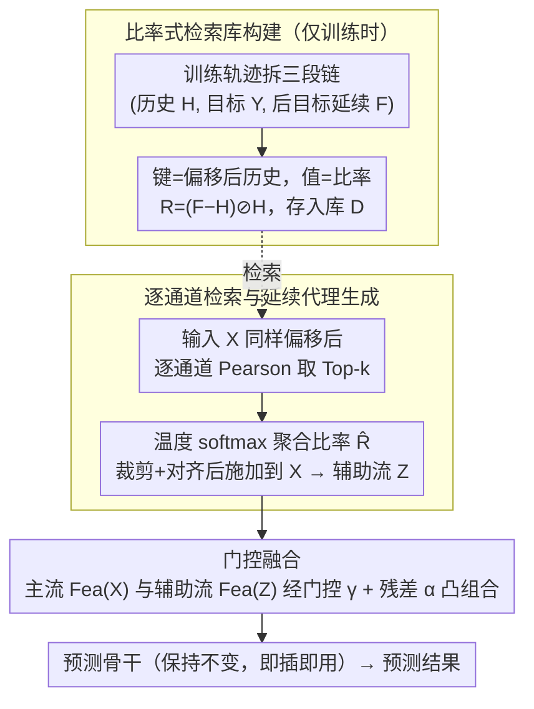

# Beyond Extrapolation: Knowledge Utilization Paradigm with Bidirectional Inspiration for Time Series Forecasting

**会议**: ICML 2026  
**arXiv**: [2605.19249](https://arxiv.org/abs/2605.19249)  
**代码**: 待确认  
**领域**: 时间序列预测  
**关键词**: 时间序列预测, 检索增强, 后目标延续, 双向启发, 门控融合  

## 一句话总结

提出 KUP-BI 框架，从训练集中构建"后目标延续"知识库，通过比率式变换检索相似历史轨迹的延续模式，生成延续风格辅助流并与主干网络特征门控融合，在 6 个数据集、4 种骨干架构上一致提升长时预测性能。

## 研究背景与动机

**领域现状**：时间序列预测广泛应用于能源、交通、金融等场景，主流深度学习方法（Transformer、MLP、CNN 等）均遵循**单向推理范式**——将历史序列映射到未来目标序列。

**现有痛点**：单向外推在长时预测中容易出现误差累积和趋势漂移。部分近期工作（如 RAFT）尝试从训练集检索**目标段**作为辅助信息，但目标段与监督信号高度对齐，训练时容易成为**过强的捷径**（shortcut），损害泛化能力。

**核心矛盾**：训练数据中天然存在"历史 → 目标 → 后目标延续"三段链结构，但现有方法只利用了前两段。后目标延续段（post-target continuation）与目标段共享同一动态系统，但在时间上与目标段解耦，提供的是**更弱但更可迁移**的演化线索。

**本文目标**：在推理时无法观测后目标延续的前提下，从训练集中蒸馏出延续风格的结构化先验，注入到标准预测骨干中。

**切入角度**：将后目标延续相对于历史的变化表示为比率（ratio），检索相似历史的比率模式并施加到当前输入，即可生成当前输入的近似后目标延续代理。

**核心 idea**：用检索+比率变换从训练集构建延续风格辅助流，与原始输入流门控融合，实现"双向启发"式预测。

## 方法详解

### 整体框架

推理时观测不到"目标之后的延续段"，KUP-BI 的思路是从训练集里把这种延续模式蒸馏成一条辅助流、再喂给标准骨干。整条 pipeline 分三个阶段：(1) **仅训练时**离线构建检索库——把每条训练轨迹拆成"历史 → 目标 → 后目标延续"三段，用比率算子把延续段相对历史的变化编码成值、偏移后的历史段作为键存库；(2) 给定新输入，按同样方式偏移后**逐通道**检索相似历史，softmax 加权聚合它们的比率变换并施加到当前输入，生成延续风格辅助信号 $\mathbf{Z}$；(3) 把 $\mathbf{Z}$ 与原始输入 $\mathbf{X}$ 分别提特征后经轻量门控融合，送入**不做任何修改**的预测骨干。整个过程不引入训练集之外的额外信息，只提供一个"未来通常怎么演化"的结构化归纳偏置。

### 关键设计

1. **后目标延续视角与比率式检索库（仅训练时构建）**:

   现有检索增强方法（如 RAFT）只用了训练链条的前两段——把"相似历史"对应的**目标段**直接拿来当辅助信号，但目标段和监督信号高度对齐，训练时极易退化成捷径、削弱泛化。KUP-BI 改用第三段"后目标延续"：它和目标段共享同一动态系统，却在时间上与目标窗解耦，是更弱但更可迁移的演化线索。具体地，对训练集每条轨迹拆出三段链 $(\mathbf{H}, \mathbf{Y}, \mathbf{F})$（历史、目标、后目标延续），用比率算子把延续段相对历史的变化编码为：

   $$\mathbf{R} = (\mathbf{F} - \mathbf{H}) \oslash (\mathbf{H} + \epsilon \, \text{sign}(\mathbf{H}))$$

   其中 $\oslash$ 为逐元素除法、$\epsilon$ 为数值稳定项。比率（而非残差）刻画的是延续段相对历史的**相对变化**（幅度缩放、季节性增减），具备尺度不变性，跨样本更可迁移。历史段经最后一步偏移（last-step offsetting）去掉局部水平差异后作为检索键，与比率矩阵 $\mathbf{R}$ 配对存入库 $\mathcal{D} = \{(\tilde{\mathbf{H}}_j, \mathbf{R}_j)\}_{j=1}^N$——**目标段 $\mathbf{Y}$ 不进库、不参与检索**，从源头避免了对标签邻居的依赖。

2. **逐通道检索与延续代理生成**:

   库建好后，推理时怎么把它用到当前输入上？给定新输入 $\mathbf{X}$，先做与建库时**一致**的最后一步偏移得到 $\tilde{\mathbf{X}}$，再按**逐通道**的 Pearson 相关性从库里选 Top-$k$ 个最相似的历史键，对它们配对的比率值做温度控制的 softmax 加权聚合，得到查询专属的比率变换 $\hat{\mathbf{R}}_q$。把 $\hat{\mathbf{R}}_q$ 施加回 $\mathbf{X}$，就得到了当前输入的"后目标延续代理"——延续风格辅助信号 $\mathbf{Z}$。为抑制极端比率带来的数值爆炸，聚合后还经分位数-$\tanh$ 裁剪，并对各通道做均值/标准差对齐。逐通道而非整段检索，是因为不同变量的演化模式差异大，按通道匹配能让每个变量都对上自己最相似的历史延续。

3. **轻量门控融合**:

   辅助流终究是"近似代理"，强行等权混入会污染主流，所以融合必须让主流占主导。主流 $\mathbf{X}_\text{main} = \text{Fea}(\mathbf{X})$ 与辅助流 $\mathbf{X}_\text{aux} = \text{Fea}(\mathbf{Z})$ 先经门控权重 $\boldsymbol{\gamma}$ 融合：

   $$\widetilde{\mathbf{X}} = \boldsymbol{\gamma} \odot \mathbf{X}_\text{main} + (1 - \boldsymbol{\gamma}) \odot \mathbf{X}_\text{aux}$$

   再经残差权重 $\alpha$ 做凸组合 $\mathbf{X}' = \alpha \mathbf{X}_\text{main} + (1 - \alpha) \widetilde{\mathbf{X}}$，保证主流始终占主导。门控支持静态（可学习标量 $g$）和动态（轻量 MLP $\phi$）两种模式。消融实验印证了"主流主导"的必要性：$\alpha$ 是最关键超参，去掉它后 ILI 的 MSE 从 1.366 剧增到 1.929。

4. **即插即用的骨干无关设计**:

   上述检索库构建与比率变换全是**非参数操作**，与骨干完全解耦，骨干本身一行不改、仍是唯一的预测器。这带来两个好处：同一检索库可复用于不同架构（Transformer / MLP / CNN / 混合），且支持两种接入模式——Plugin-only（冻结骨干、仅调 KUP-BI 超参数）和 Joint-tune（与骨干轻量联调）。前者已能稳定增益，后者进一步把增益拉满。

## 实验关键数据

| 数据集 | 骨干 | 原始 MSE | +KUP-BI (Plugin) MSE | +KUP-BI (Joint) MSE | 最佳相对降幅 |
|--------|------|---------|---------------------|---------------------|------------|
| ETTh2 | DLinear | 0.469 | 0.453 | **0.394** | -16.0% |
| ILI | TimesNet | 2.438 | 2.328 | **2.114** | -13.3% |
| Exchange | DLinear | 0.369 | 0.362 | **0.313** | -15.2% |
| ETTh1 | xPatch | 0.444 | 0.431 | **0.409** | -7.9% |
| ETTm2 | PatchTST | 0.258 | 0.257 | **0.255** | -1.2% |
| ILI | xPatch | 1.383 | 1.366 | **1.365** | -1.3% |

| 消融实验 (xPatch, 全长度平均) | ETTh1 MSE | ETTm1 MSE | ILI MSE |
|------------------------------|-----------|-----------|---------|
| KUP-BI 完整 | **0.431** | **0.352** | **1.366** |
| 去除 $\alpha$ | 0.457 | 0.412 | 1.929 |
| 随机检索 | 0.443 | 0.352 | 1.378 |
| 直接使用目标段 | 0.466 | 0.352 | 1.382 |
| 拼接替代门控 | 0.411 | 0.388 | 1.713 |

## 亮点与洞察

- **后目标延续 vs 目标段**：利用后目标延续而非目标段作为辅助信息，避免训练时对标签邻居的过度依赖，提供更可迁移的结构先验
- **比率 vs 残差**：比率式表示具有尺度不变性，在 ETTh1 上 MSE 0.431 vs 残差式 0.488，优势显著
- **弱骨干获益更大**：建模能力较弱的 DLinear 从延续辅助信号中获益最多（ETTh2 降幅 16%），强骨干如 xPatch 改进更温和但同样稳定
- 推荐默认超参数：$\alpha = 0.75$, Top-$k = 1$, $\tau = 0.01$

## 局限性 / 可改进方向

- 当前检索策略未显式处理**相位偏移**，可能导致检索匹配不精确
- 为充分发挥潜力，KUP-BI 可能需要骨干特定调参，而非完全即插即用，增加训练成本
- 比率变换为启发式设计，未来可探索可学习的编码器替代非参数比率
- 对突发尖峰等极端波动仍难以准确捕捉

## 相关工作与启发

- **RAFT (Han et al., 2025)**：检索目标段辅助预测，但目标段与监督对齐过强；KUP-BI 转用后目标延续段避免该问题
- **RAF (Tire et al., 2024)**：为基础时序模型做检索增强的 prompt，仅在推理时使用
- **xPatch (Stitsyuk & Choi, 2025)**：双流 MLP+CNN 混合骨干，作为实验中的最强 baseline

## 评分

- 新颖性: ⭐⭐⭐⭐ — "后目标延续"视角独特，将训练链条的第三段纳入建模是时序预测领域的新颖切入点
- 实验充分度: ⭐⭐⭐⭐ — 6 数据集 × 4 骨干，含消融、超参敏感度、比率 vs 残差、检索 vs 预测式等全面分析
- 写作质量: ⭐⭐⭐⭐ — 逻辑清晰，动机推导自然，公式符号一致
- 价值: ⭐⭐⭐⭐ — 提供了通用可插拔的增强范式，但绝对增益在强骨干上较有限

<!-- RELATED:START -->

## 相关论文

- [\[ACL 2026\] STK-Adapter: Incorporating Evolving Graph and Event Chain for Temporal Knowledge Graph Extrapolation](../../ACL2026/time_series/stk-adapter_incorporating_evolving_graph_and_event_chain_for_temporal_knowledge_.md)
- [\[ICLR 2026\] From Samples to Scenarios: A New Paradigm for Probabilistic Forecasting](../../ICLR2026/time_series/from_samples_to_scenarios_a_new_paradigm_for_probabilistic_forecasting.md)
- [\[ICML 2026\] It's TIME: Towards the Next Generation of Time Series Forecasting Benchmarks](its_time_towards_the_next_generation_of_time_series_forecasting_benchmarks.md)
- [\[NeurIPS 2025\] Fern: Chaining Spectral Pearls — Ellipsoidal Forecasting Beyond Trajectories for Time Series](../../NeurIPS2025/time_series/friren_beyond_trajectories_--_a_spectral_lens_on_time.md)
- [\[ICML 2026\] Ellipsoidal Time Series Forecasting](ellipsoidal_time_series_forecasting.md)

<!-- RELATED:END -->
