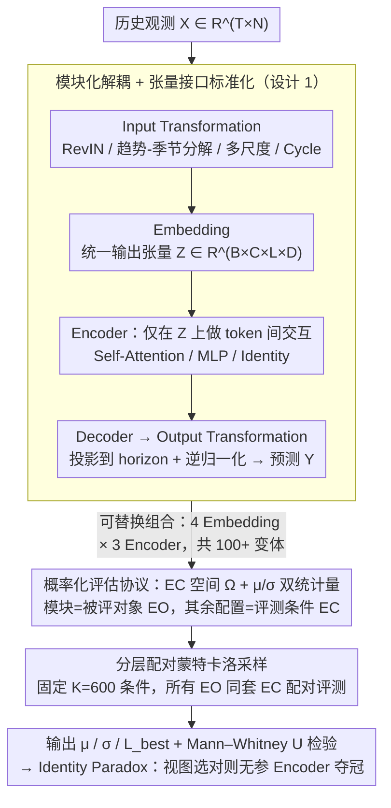

# CombinationTS: A Modular Framework for Understanding Time-Series Forecasting Models

**会议**: ICML 2026  
**arXiv**: [2605.01231](https://arxiv.org/abs/2605.01231)  
**代码**: https://github.com/BenchCouncil/CombinationTS  
**领域**: 时间序列预测  
**关键词**: 模块化归因、概率化评估、Identity Paradox、数据视图、Evaluatology

## 一句话总结
CombinationTS 把时序预测模型解耦为 Input Transformation / Embedding / Encoder / Decoder / Output Transformation 五个正交模块，在共享的"评估条件空间"上做配对蒙特卡洛采样，用边际性能 $\mu$ 和稳定性 $\sigma$ 取代脆弱的单点 MSE，结论是：一旦数据视图（Embedding）设计得好，参数无关的 Identity Encoder 就能打平甚至超过复杂 Transformer，时序预测领域的"SOTA 增益"很大程度上来自看数据的方式而不是建模能力。

## 研究背景与动机

**领域现状**：长时序预测从早期的 Informer / Autoformer 等稀疏注意力 Transformer，迅速转向 PatchTST、iTransformer、TimeMixer、CycleNet 等以"数据视图重塑"为核心卖点的架构，论文一篇比一篇复杂，leaderboard 上的 MSE 也一路下降。

**现有痛点**：DLinear 已经用一根线性层打脸过 Transformer 系；Tan et al. 2024、Brigato et al. 2025 等多篇审计工作进一步发现，所谓 SOTA gap 经常与种子噪声、超参对齐误差同量级——换一个 seed 或 batch size，冠军就翻盘。现有 benchmark（TSLib、BasicTS、TFB、TAB）虽然统一了实现接口，却没有解决"是模型在赢，还是评估姿势在赢"的问题。

**核心矛盾**：作者把这个困境归结为两条方法论缺陷。其一是 **Attribution Gap**：模型被当成不可分割的黑盒，Embedding 的贡献和 Encoder 的贡献被搅在一起，没人说得清"PatchTST 的提升是 patch tokenization 带来的，还是 Transformer 带来的"；其二是 **Benchmarking Crisis**：单点估计会同时落入"公平陷阱"（用同一套次优超参把所有模型一起摁住）和"最佳陷阱"（cherry-pick 单次最好结果），既不公平也不稳健。

**本文目标**：拆成三个子问题——(1) 怎么把架构分解成可独立替换的正交模块；(2) 怎么把"对一个模块的评测"从单点 MSE 升级为对超参噪声鲁棒的统计量；(3) 用这套审计工具能不能复现/推翻当下对 Transformer / 频域建模 / 多尺度分解的认知。

**切入角度**：作者借用 Evaluatology（Zhan et al. 2025）的视角，把"评测"看成一个信号—噪声分离问题：被评对象（Evaluated Object, EO）是要归因的那个组件，评测条件（Evaluation Condition, EC）包括其余四个模块、训练超参、数据集、look-back 长度、horizon 等，整体当作随机过程处理。如果某模块在大量 EC 上都赢，那才叫真赢。

**核心 idea**：用"模块化解耦 + 配对 EC 蒙特卡洛"把架构问题改写成统计归因问题——评的是 $(\mu(\theta), \sigma(\theta))$ 而不是 $\mathrm{MSE}(\theta, c^\ast)$。

## 方法详解

### 整体框架

CombinationTS 把任意时序预测模型 $f$ 改写成五阶段复合：

$$f = \mathcal{T}^{-1}_{out}\circ \mathcal{D}\circ \varPhi\circ \mathcal{E}\circ \mathcal{T}_{in}$$

输入是历史观测 $\mathbf{X}\in\mathbb{R}^{T\times N}$，输出是预测 $\mathbf{Y}\in\mathbb{R}^{P\times N}$。五个阶段分别是：Input Transformation $\mathcal{T}_{in}$（在原始信号上注入结构先验，如 RevIN、趋势-季节分解、多尺度下采样、Cycle 嵌入）、Embedding $\mathcal{E}$（决定 tokenization 视图，统一映射到 $\mathbb{R}^{B\times C\times L\times D}$ 这个张量接口）、Encoder $\varPhi$（在 latent 张量上做 token 间交互，可以是 Self-Attention / MLP / Identity）、Decoder $\mathcal{D}$（投影到预测 horizon）、Output Transformation $\mathcal{T}^{-1}_{out}$（逆归一化、加回趋势等）。

关键约束是：Embedding 只负责"视图 + token 内编码"，跨 token 的依赖建模一律下放给 Encoder——这条接口约束让"Embedding 贡献 vs Encoder 贡献"第一次能被解耦评估。

在这个统一接口上，每个模块都可以独立替换并自由组合，论文把 4 种 Embedding × 3 种 Encoder × 1 种 Decoder + 4 种 Input Transformation 组成 100+ 架构变体的搜索空间。然后用配对的 EC 蒙特卡洛在 6 个数据集 × 4 个 horizon 上跑出每个模块的 $(\mu, \sigma)$。

### 关键设计

**1. 模块化解耦 + 张量接口标准化：让任何论文的组件都能拆出来插回去**

以前评 PatchTST，没人分得清提升到底来自 patch 这个视图，还是来自 Transformer 这个 reasoner——Embedding 和 Encoder 的贡献被搅成一团。CombinationTS 的破题点是给五段流水线定一条硬接口约束：Embedding 的输出必须是 $\mathcal{Z}\in\mathbb{R}^{B\times C\times L\times D}$ 这个四维张量（batch / 变量 / 时间 token / 隐藏维），其中 Point-wise 每个时间步投影一次（$L=T$）、Patch-wise 切 patch 后投影（$L=\lceil T/S\rceil$）、Variate-wise 把整条变量历史压成 1 个 token（$L=1$）、Identity 不投影、Time-as-Feature 把 $T$ 维直接 reshape 到特征维（零参数）。关键是 Encoder 被严格限制只能在 $\mathcal{Z}$ 上做 token 间运算，跨 token 的依赖建模一律下放给它，这样替换 Encoder 就不会污染 Embedding 的归因。有了这条约束，把 Patch-wise Embedding 接上 Identity Encoder 跑一下，就能直接读出「视图的独立贡献」——这正是后面 Identity Paradox 能成立的方法论前提。

**2. 概率化评估协议（EC 空间 + $\mu/\sigma$ 双统计量）：用一片超参海洋取代单点 MSE**

单点 MSE 报数同时掉进两个对偶陷阱：用同一套次优超参把所有模型一起摁住的「公平陷阱」，和 cherry-pick 单次最好结果的「最佳陷阱」。作者借 Evaluatology 的视角把评测看成信号—噪声分离：被评对象（EO）是要归因的那个模块，其余四个模块、训练超参、数据集、look-back、horizon 等都算评测条件（EC）。于是定义评估条件空间 $\Omega$，每个 $\mathbf{c}\in\Omega$ 是一个配置元组（look-back $T\in\{96,192,336,512\}$、horizon $P\in\{96,192,336,720\}$、latent 维 $D\in\{64,128,256,512\}$、学习率、batch、dropout、seed 等），把模块性能视为随机变量 $L(\theta, \mathbf{c})$，估计边际性能 $\mu(\theta)=\mathbb{E}_{\mathbf{c}\sim\Omega}[L(\theta,\mathbf{c})]$ 和稳定性 $\sigma(\theta)=\sqrt{\mathrm{Var}_{\mathbf{c}\sim\Omega}[L(\theta,\mathbf{c})]}$，同时单独报 $L_{best}=\min_k L(\theta,\mathbf{c}_k)$。$\mu$ 对应「用户随便挑超参时的平均水平」、$\sigma$ 对应「超参敏感性」，正是落地真正关心的两个数；把 $L_{best}$ 拎出来对照，就能看出一个 SOTA 宣称到底是普遍能力还是离群点运气。

**3. 分层配对蒙特卡洛采样：压成本又消混淆**

如果 Identity 和 Transformer 各自在不同 EC 上评测，差异里很大一块其实是「采到的 EC 分布不同」——这正是当前 leaderboard 的核心毛病。CombinationTS 从 $\Omega$ 里采一个固定的、按数据集/horizon 分层的条件集 $\{\mathbf{c}_k\}_{k=1}^K$（主实验 $K=600$，每个数据集 100 个），强制所有 EO 在同一套条件上跑，即配对实验设计，再用 $\hat{\mu}(\theta)=\frac{1}{K}\sum_k L(\theta,\mathbf{c}_k)$ 和样本标准差 $\hat{\sigma}(\theta)$ 估计统计量。分层保证每个数据集/horizon 都被均匀覆盖，配对抵消「哪条 EC 本身就难」的系统偏差，让两个模块之差的方差大幅缩小，更容易拿到统计显著性（论文用单尾 Mann–Whitney U 检验在 $\alpha=0.05$ 下验证）；蒙特卡洛则在可控样本量下做偏差—方差权衡。

### 损失函数 / 训练策略

度量统一用 MSE 作为 $L$，主实验固定 seed 与 dropout=0.1，把所有可观测方差归因到架构与超参选择上；附录 A.7 做了多 seed 验证排除 seed 敏感性。训练统一为 batch=32、30 epochs、early-stopping patience=3。EC 空间在三个实验里逐步扩张：Exp.1 是 $D\in\{64,128,256,512\}$、$\eta\in\{10^{-3},10^{-4}\}$、encoder 层 $\in\{1,2,3\}$，Exp.2 把 $D$ 下探到 16 并扩 $\eta\in\{10^{-2},10^{-3},10^{-4}\}$ 来测试"输入先验能否让模型变瘦"，Exp.3 与 Exp.1 共用同一 EC 空间做配对比较。

## 实验关键数据

数据集：Weather、Electricity、ETTh1/h2/m1/m2 共 6 个长时序预测标准 benchmark；horizon $\in\{96,192,336,720\}$。

### 主实验

Exp.1 解构 backbone：4 种 Embedding × 3 种 Encoder，每个 EO 在 $K=600$ 配对 EC 上评测。

**Embedding 层面（Table 2 节选，$\mu/\sigma$，越小越好）**：

| 数据集 | Horizon | Point-wise | Patch-wise | Variate-wise | Time→Dim |
|--------|---------|------------|------------|--------------|----------|
| ETTh1 | 96 | 0.3898 / 0.0143 | **0.3772 / 0.0058** | 0.3834 / 0.0080 | 0.3937 / 0.0156 |
| ETTh1 | 192 | 0.4324 / 0.0166 | **0.4240 / 0.0133** | 0.4247 / 0.0128 | 0.4343 / 0.0161 |
| ETTm2 | 720 | 0.3981 / 0.0216 | **0.3813 / 0.0140** | 0.3863 / 0.0170 | 0.3892 / 0.0174 |
| Electricity | 96 | 0.1609 / 0.0228 | **0.1512 / 0.0176** | 0.1527 / 0.0135 | 0.1573 / 0.0190 |

结构化视图（Patch-wise / Variate-wise）全面好于 Point-wise，零参数 Time→Dim reshape 在不少格子上也能与可学习投影打平——结构本身就是信号。

**Encoder 层面（Table 3 节选）**：

| 数据集 | Horizon | MLP | Transformer | Identity |
|--------|---------|-----|-------------|----------|
| ETTh1 | 96 | 0.4371 / 0.0816 | 0.4518 / 0.0930 | **0.3907 / 0.0231** |
| ETTh1 | 720 | 0.5538 / 0.1039 | 0.5679 / 0.1014 | **0.4722 / 0.0406** |
| ETTh1 | avg | 0.4960 / 0.0938 | 0.5095 / 0.1004 | **0.4392 / 0.0424** |

参数无关的 Identity Encoder 在 $\mu$ 和 $\sigma$ 上同时压过 MLP 和 Transformer——这就是 **Identity Paradox**。统计上，Mann–Whitney U 检验给出 Identity vs Transformer $p<0.0001$、Identity vs MLP $p=0.0115$，全数据集合并显著。

Exp.2 审计 Input Transformation（Table 4 ETTh1 / ETTh2 / Electricity 节选）：

| 数据集 | Baseline (RevIN) | Cycle | MultiScale | TrendSeasonal |
|--------|------------------|-------|------------|---------------|
| ETTh1 | 0.3975 / 0.0315 | **0.3891 / 0.0283** | 0.3921 / 0.0183 | 0.3947 / 0.0248 |
| ETTh2 | 0.3013 / 0.0116 | **0.2969 / 0.0115** | 0.3071 / 0.0343 | 0.3024 / 0.0135 |
| Electricity | 0.2061 / 0.0238 | 0.1999 / 0.0225 | **0.1952 / 0.0202** | 0.1976 / 0.0197 |

Cycle（CycleNet 的可学习周期嵌入）在 $\mu$ 和 $\sigma$ 上全面最稳；朴素的 TrendSeasonal、MultiScale 经常打不过 RevIN baseline，唯有配上 TimeMixer 那种深度跨支交互才能反超。

Exp.3 频域 vs 时域（Table 5 ETTh1）：

| 数据集 | Horizon | iTransformer | SimpleTM (Spectral) | Variate + Identity |
|--------|---------|--------------|----------------------|--------------------|
| ETTh1 | 96 | 0.3934 / 0.0133 | 0.3812 / 0.0076 | **0.3805 / 0.0098** |
| ETTh1 | 720 | 0.4711 / 0.0155 | 0.4646 / 0.0151 | **0.4520 / 0.0191** |
| ETTh1 | avg | 0.4401 / 0.0335 | 0.4324 / 0.0354 | **0.4271 / 0.0355** |

频域 SimpleTM 的 $\mu$ 确实优于时域 iTransformer，但 $\sigma$ 几乎不变；并且在同一 Variate-wise Embedding 下，**Identity Encoder 仍然更好**——频域优势来自表示而不是稳健性。

### 消融实验

| 配置 | 关键指标 | 说明 |
|------|---------|------|
| Patch-wise + Identity Encoder | ETTh1 96 $\mu/\sigma$ ≈ 0.38 / 极低 | 结构化视图 + 无参 Encoder 即新基线 |
| Patch-wise + Transformer | 同上但 $\sigma$ 涨数倍 | Encoder 主要在引入超参噪声 |
| Point-wise + Transformer | $\sigma$ 显著高于其他组合 | Self-Attention 强依赖于"语义良好的 token" |
| Cycle 先验 + Variate-wise | ETTh2 $\mu/\sigma$ = 0.2969 / 0.0115 | 周期先验最稳，最 robust |
| 朴素 MultiScale 无交互 | 多数据集打不过 RevIN baseline | 没有跨支交互的"分而治之"反而丢信息 |
| 多 seed 验证（附录 A.7） | 结论不变 | 排除 seed 敏感性 |

### 关键发现

- **Identity Paradox**：在已设计良好的 Embedding 上，无参 Identity Encoder 的 $\mu$ 与 $\sigma$ 同时优于 Transformer 与 MLP。绝大多数复杂 Encoder 在标准 benchmark 上充当的是"过参数化噪声源"，而不是真正的特征提取器。
- **Transformer 对视图的依赖**：在 Patch-wise / Variate-wise 这类结构化视图下 Transformer 才稳定；Point-wise 这种"裸时间步"视图下 $\sigma$ 大幅膨胀——self-attention 不是通用特征提取器。
- **周期先验万金油，分解先验需要搭配深度交互**：Cycle 几乎在所有数据集上同时提升 $\mu$ 和 $\sigma$；TrendSeasonal / MultiScale 单独使用经常失败，TimeMixer 之所以好是因为多尺度后面接了 cross-component 混合。
- **频域提的是表示而不是鲁棒性**：SimpleTM 优于 iTransformer 的是 $\mu$，$\sigma$ 没改善——说明 wavelets/Fourier 改的是信号怎么表示，而不是优化怎么变稳。
- **统计显著性可复现**：作者在 Exchange-Rate 这种非平稳数据上也验证 Identity 系仍最低 MSE，并跑了 multi-seed，排除"刚好碰上周期性 benchmark"和"刚好碰上幸运 seed"两种伪解释。

## 亮点与洞察

- **把架构问题转译为统计归因问题**：用 EO/EC 这对概念干净地把"信号 vs 噪声"分开。等价的思想完全可以搬到 CV / NLP 的架构审计上（如把 LLaMA 拆成 tokenizer + position encoding + attention + FFN + lm-head 做 EC 配对扫描），是一套通用的方法论。
- **张量接口约束是被低估的方法论硬条件**：强行规定 Embedding 必须输出 $\mathbb{R}^{B\times C\times L\times D}$ 且不做 token 间运算，才能让 Identity Encoder 有意义；否则"Embedding 自己偷偷把 cross-token mixing 做完了"就会得出错误归因。这条接口工程上很值钱。
- **配对蒙特卡洛 + 分层采样的方差控制技巧**：相比独立采样，配对设计能把 $\mathrm{Var}(L_A - L_B)$ 显著压低，在固定 $K=600$ 预算下拿到更强的统计显著性，附录里 Mann–Whitney U 显著性可以直接复用。
- **零参 Time-as-Feature reshape 能打**：仅靠 reshape 改变张量结构就能逼近可学习投影，反过来说明现有 benchmark 上的"可学习"部分有大量是冗余的。
- **"举证倒置"宣言**：作者明确提出未来想加架构复杂度的工作必须先在 $(\mu, \sigma)$ 空间证明自己强于 Identity baseline，这种范式压力对整个时序预测社区都有约束力。

## 局限与展望

- 评估指标只用 MSE 一种损失；MAE、CRPS、概率预测等场景下 Identity Paradox 是否同样成立有待验证。
- EC 空间虽然 $K=600$ 但仍是预定义的离散网格（$D, T, P, \eta$ 等都是几个候选值），没有覆盖更野的超参（warmup、weight decay、激活函数等），$\Omega$ 的"代表性"本身没有理论保证。
- 数据集仍主要是 ETT / Weather / Electricity 这类强周期/平稳信号；作者只用 Exchange-Rate 做了一个非平稳点验证，金融高频、医疗 ICU 信号这类长尾、断点、缺失场景没系统覆盖。
- 仅在中小模型规模下结论成立（$D\leq 512$、层数 $\leq 3$）；大模型/基础模型（Chronos、TimeGPT、Moirai 等）的 Identity Paradox 是否也成立没回答。
- "Encoder 是噪声源"的结论强烈依赖于"Embedding 已经很好"这个前提；如果在 token 数极少（Variate-wise，$L=1$）的情况下，Encoder 本来就没事可做，得出的归因可能高估 Embedding。
- 改进方向：(i) 把 EC 空间扩到连续分布并做重要性采样；(ii) 把方法搬到分类 / 异常检测 / imputation 等其他时序任务；(iii) 与因果推断（Treatment Effect）框架显式对接，让"模块贡献"有更强的因果语义。

## 相关工作与启发

- **vs DLinear (Zeng et al. 2023)**：DLinear 用一根线性层打脸 Transformer，是第一波"质疑复杂度"的代表；CombinationTS 把这一观察推广到模块级别——不止是"模型可以简单"，而是"在已有的好 Embedding 上 Encoder 可以完全不要"。
- **vs PatchTST / iTransformer / TimeMixer**：以前把这些当作"完整模型"对比，本文把它们各自的核心创新（Patch、Variate token、多尺度下采样）拆出来当作可替换模块，重新组合后发现这些 Embedding/Input 设计才是真贡献源，配套的 attention/mixer 反而是冗余。
- **vs TFB / TAB / BasicTS / TSLib (Wang et al. 2024c, Qiu et al. 2024/2025a, Shao et al. 2024)**：这些 benchmark 统一了实现但仍是 leaderboard 范式；本文从评测协议这一层重写，等于给现有 benchmark 装上"配对蒙特卡洛"插件。
- **vs Brigato et al. 2025 ("There are no Champions")**：Brigato 用 3500+ 模型审计说 SOTA 是脆弱的，但只提供了"打破"；本文给出了一套**建设性**替代评测协议（$\mu, \sigma, L_{best}$ 三联报告）。
- **vs Evaluatology (Zhan et al. 2025)**：直接把 Evaluatology 的 EO/EC 概念落地为可执行的工程框架，是 Evaluatology 在时序预测领域的第一个完整 case study。
- **启发**：(i) 推荐系统、CV 检测/分割等 leaderboard-driven 子领域可以照搬这套"模块解耦 + 配对 EC"协议做归因；(ii) Identity Paradox 提示未来设计新架构时应优先迭代"数据视图"而不是堆 Encoder；(iii) $(\mu, \sigma)$ 双指标该成为论文 reporting 的默认动作。

## 评分
- 新颖性: ⭐⭐⭐⭐ 不是新模型而是新评测范式，提出 Identity Paradox 这一反直觉发现且能用统计检验背书，框架层面的贡献含金量很高。
- 实验充分度: ⭐⭐⭐⭐⭐ 6 数据集 × 4 horizon × $K=600$ 配对 EC、100+ 组合、Mann–Whitney U 显著性、非平稳数据集与 multi-seed 双重 robustness 验证，覆盖详尽。
- 写作质量: ⭐⭐⭐⭐ 三个 RQ 串得很清楚，"两大方法论缺陷"叙事干净，公式与表格密度合适；只是部分 appendix 引用偏多，正文 figure 解释略短。
- 价值: ⭐⭐⭐⭐⭐ 直接挑战社区当前的 SOTA 文化，给出可立即采用的开源框架，对时序预测乃至更广的 benchmark 实践都有结构性影响。

<!-- RELATED:START -->

## 相关论文

- [\[ICML 2026\] TimeOmni-VL: Unified Models for Time Series Understanding and Generation](timeomni-vl_unified_models_for_time_series_understanding_and_generation.md)
- [\[ICML 2026\] Parametric Prior Mapping Framework for Non-stationary Probabilistic Time Series Forecasting](parametric_prior_mapping_framework_for_non-stationary_probabilistic_time_series_.md)
- [\[ICLR 2026\] SciTS: Scientific Time Series Understanding and Generation with LLMs](../../ICLR2026/time_series/scits_scientific_time_series_understanding_and_generation_with_llms.md)
- [\[ICML 2026\] Interpretability in Deep Time Series Models Demands Semantic Alignment](interpretability_in_deep_time_series_models_demands_semantic_alignment.md)
- [\[ICML 2026\] Dynamic-TMoE: A Drift-Aware Dynamic Mixture of Experts Framework for Non-Stationary Time Series](dynamic_tmoe_a_drift-aware_dynamic_mixture_of_experts_framework_for_non-stationa.md)

<!-- RELATED:END -->
