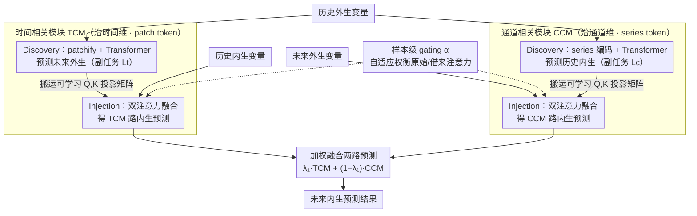

# DAG: A Dual Correlation Network for Time Series Forecasting with Exogenous Variables

**会议**: ICML 2026  
**arXiv**: [2509.14933](https://arxiv.org/abs/2509.14933)  
**代码**: https://github.com/decisionintelligence/DAG  
**领域**: 时间序列预测 / 外生变量建模 / 注意力机制  
**关键词**: 协变量预测, 未来外生变量, 时间相关, 通道相关, 注意力注入

## 一句话总结
针对"未来协变量已知"的时间序列预测 (TSF-X), DAG 设计了一个双通路网络: 一条沿时间维捕获"历史外生→未来外生"的注意力模式并注入到"历史内生→未来内生"的预测里, 另一条沿通道维捕获"历史外生→历史内生"的模式并注入到"未来外生→未来内生"的预测里, 在 12 个公开/新发布 TSF-X 数据集上 10/10 拿下 MSE 最佳, 显著超过 TimeXer、TFT、TiDE、CrossLinear、PatchTST 等。

## 研究背景与动机
**领域现状**：时间序列预测从早期 ARIMA / ETS 到近年的 Transformer (Informer, Autoformer, PatchTST) 与 MLP (DLinear, CycleNet, DUET) 系列, 大多只用内生变量 (目标变量本身的历史值)。但很多实际场景里, 协变量 (天气、节假日、电网负荷) 不仅历史已知, 未来一段时间也已知 (例如天气预报、排定的促销日历); 这类"已知未来协变量"是预测准确率最大的杠杆之一。

**现有痛点**：(1) PatchTST / DUET 等完全忽略协变量; (2) TimeXer / CrossLinear 只用历史协变量, 浪费了已知未来; (3) TFT / TiDE 同时用历史与未来协变量, 但只是把它们简单拼接 / cross-attention, 没有建模协变量与目标变量之间"时间方向"和"通道方向"的两类相关结构, 容易学到伪相关; (4) 多数 TSF-X 数据集小、协变量描述不规范, benchmark 本身不充分。

**核心矛盾**："未来已知协变量"能注入两类信息 —— 时间维上"历史协变量到未来协变量的演化模式" ≈ "历史内生到未来内生的演化模式" (Granger 因果直觉), 通道维上"协变量影响内生变量的方式" 在历史与未来之间是稳定的 (Pearson 相关直觉)。但已有方法只把它们作为"特征",  没有显式 transfer 这两类关系。

**本文目标**：(1) 设计一个能同时利用历史 + 未来协变量的预测器, (2) 显式建模时间维 / 通道维两条相关关系并把它们"注入" 主预测路径, (3) 提供更高质量的 TSF-X benchmark。

**切入角度**：把"协变量信息影响内生变量的预测"分解为两条结构对称的子任务 —— 时间维: $X^{exo} \to Y^{exo}$ 的注意力权重可以借给 $X^{endo} \to Y^{endo}$; 通道维: $X^{exo} \to X^{endo}$ 的注意力权重可以借给 $Y^{exo} \to Y^{endo}$。

**核心 idea**：把"协变量 → 内生"的相关性以"可学 $Q, K$ 矩阵"的形式抽出, 然后通过 gating 与原始注意力融合, 把相关性"注入"主预测路径, 让 Transformer 在两个方向同时携带额外结构化信号。

## 方法详解

### 整体框架
给定 $X^{endo} \in \mathbb{R}^{N \times T}$、$X^{exo} \in \mathbb{R}^{D \times T}$、$Y^{exo} \in \mathbb{R}^{D \times F}$, 目标预测 $\hat Y^{endo} \in \mathbb{R}^{N \times F}$。DAG 由两个对称模块组成:
- **时间相关模块 TCM**: 一对子模块 $\mathcal{F}_{\theta_1}, \mathcal{G}_{\theta_2}$ —— Discovery 用 patchify + Transformer 预测 $\hat Y^{exo}$ (副任务), 同时输出注意力的 $W_q', W_k'$; Injection 用相同的 patchify 处理 $X^{endo}$ 并用借来的 $W_q', W_k'$ + 自己的 $W_q, W_k, W_v$ 双注意力融合, 预测 $\ddot Y^{endo}$。
- **通道相关模块 CCM**: 镜像设计, Discovery 用 series-wise embedding + Transformer 预测 $\hat X^{endo}$ (副任务, 从历史外生反推历史内生), 输出 $\mathcal{W}_{q'}, \mathcal{W}_{k'}$; Injection 把它们注入 $Y^{exo}$ 的 Transformer, 预测 $\dot Y^{endo}$。
- 最终预测 $\hat Y^{endo} = \lambda_1 \cdot \ddot Y^{endo} + (1-\lambda_1) \cdot \dot Y^{endo}$, 总 loss $L_{total} = L_f + \lambda_2 (L_t + L_c)$ 同时优化主预测与两个 discovery 副任务。

### 关键设计

**1. 时间相关模块 TCM：把 $W_q', W_k'$ 投影矩阵跨任务搬运**

时间通路要补强的是框架图里「历史内生 → 未来内生」这一步——它本身缺乏额外结构信号。关键洞察是：「历史外生 → 未来外生」的演化模式（Granger 因果直觉）与「历史内生 → 未来内生」结构相似，于是前者学到的注意力可以借给后者。Discovery 子模块把 $X^{exo}$ patchify 成 $M$ 个 token, 用标准 Transformer 算 $S_i' = \text{softmax}(Q K^\top / \sqrt d) V$ 预测 $\hat Y^{exo}$（副任务），但**不传递 attention score、只抽出可学习的 $W_q', W_k'$ 矩阵**。Injection 子模块把 $X^{endo}$ 同样 patchify, 用自己的 $W_q, W_k, W_v$ 算 $(Q, K, V)$, 同时用借来的 $W_q', W_k'$ 算 $(Q', K')$, 再按 $S_{\text{fused}} = \alpha \cdot \sigma(QK^\top/\sqrt d) + (1-\alpha)\, \sigma(Q' K'^\top / \sqrt d)$ 融合两路注意力, 得 $P_i' = \sigma(S_{\text{fused}}) V$。之所以传可学习参数而非 attention score, 是因为 score 依赖具体样本、会让两个任务过度耦合; 而 $W_q', W_k'$ 是任务级的归纳偏置, 更稳健、更可解释——消融显示这一选择稳定优 1–2%。

**2. 通道相关模块 CCM：把跨通道相关性搬运**

通道通路镜像 TCM, 补强的是框架图里「未来外生 → 未来内生」这一步。洞察是：协变量影响内生变量的方式（Pearson 相关直觉, 如温度影响销量）在历史与未来之间近似稳定, 于是「历史外生 → 历史内生」学到的通道注意力可以借给「未来外生 → 未来内生」。与 TCM 用 patch token 不同, CCM 用 **series-wise embedding**——把每条序列整体编码成一个 token ($X^{exo}_i \to u_i \in \mathbb{R}^d$, 拼成 $U \in \mathbb{R}^{D \times d}$), 让 attention 直接作用在变量级别、抓的就是通道间相关结构（呼应论文 figure 2 的 "Pearson correlation for channels"）。Discovery 跑 Transformer 从历史外生反推历史内生 $\hat X^{endo}$（自监督副任务）, 抽出 $\mathcal{W}_{q'}, \mathcal{W}_{k'}$; Injection 把 $Y^{exo}$ 也 series-embed 后做同样的双注意力融合, 得到 $\dot Y^{endo}$。

**3. 样本级 gating $\alpha$：把硬搬运变成软切换**

TCM 与 CCM 各配一份 gating（即框架图里同时调控两条 Injection 的那个模块）, 用来回答「这个样本的借来注意力到底该信几分」。它把两路输入分别过 MLP 后点积成一个标量 $\alpha = \text{MLP}(\cdot)^\top \cdot \text{MLP}(\cdot)$（TCM 取 $X^{exo}, X^{endo}$, CCM 取 $X^{exo}, Y^{exo}$）, 再用 $\alpha$ 融合两路 attention score。当外生与内生在某样本上几乎不相关时 $\alpha \to 1$, 模型退化成标准 Transformer; 强相关时 $\alpha \to 0$, 让借来的注意力主导。这种动态平衡避免了硬 transfer 在低相关数据上的 overfit, 是双通路保持鲁棒的关键。

### 损失函数 / 训练策略
三个 loss 相加: $L_t = \|Y^{exo} - \hat Y^{exo}\|_1$ (时间相关副任务), $L_c = \|X^{endo} - \hat X^{endo}\|_1$ (通道相关副任务), $L_f = \|Y^{endo} - \hat Y^{endo}\|_1$ (主预测)。总损失 $L_{total} = L_f + \lambda_2 (L_t + L_c)$, $\lambda_1, \lambda_2$ 为超参。所有任务联合训练, end-to-end。

## 实验关键数据

### 主实验
12 个 TSF-X 数据集, 部分为新发布: NP / PJM / BE / FR / DE (5 个欧洲电力价格), Energy / Sdwpfm1/2 / Sdwpfh1/2 / Colbun / Rapel。Baseline 包括 GCGNet (图相关), TimeXer / CrossLinear (历史外生), TFT / TiDE (历史 + 未来外生), DUET / PatchTST / Amplifier / TimeKAN (仅内生)。

| 数据集 | DAG MSE | GCGNet | TimeXer | TFT | TiDE | PatchTST | 相对最佳提升 |
|--------|---------|--------|---------|-----|------|----------|--------------|
| NP | **0.362** | 0.370 | 0.418 | 0.379 | 0.443 | 0.390 | −2.2% vs GCGNet |
| PJM | **0.093** | 0.095 | 0.108 | 0.114 | 0.142 | 0.133 | −2.1% |
| BE | **0.423** | 0.431 | 0.452 | 0.454 | 0.498 | 0.577 | −1.9% |
| Energy | **0.124** | 0.131 | 0.163 | 0.130 | 0.153 | 0.226 | −4.6% |
| Colbun | **0.098** | 0.107 | 0.145 | 0.238 | 0.164 | 0.239 | −8.4% |
| Rapel | **0.230** | 0.306 | 0.344 | 0.305 | 0.320 | 0.269 | −14.5% |
| **1st Count** | **10/12** | 2/12 | 0/12 | 0/12 | 0/12 | 0/12 | — |

DAG 在 12 个数据集上 10 次 MSE 第一, GCGNet 2 次, TimeXer / TFT / TiDE 全部 0 次, 优势在新发布的 Colbun / Rapel / Sdwpfh 等水文/风电数据上尤其大。

### 消融实验 (仅历史外生设置)
对比"未来外生不可用"的退化场景, 验证 DAG 即使没有未来协变量仍能领先 (输入仅 $X^{endo} + X^{exo}$):

| 数据集 | DAG MSE | TimeXer | CrossLinear | DUET | 说明 |
|--------|---------|---------|-------------|------|------|
| NP | **0.419** | 0.440 | 0.451 | 0.444 | 历史外生模式 |
| PJM | **0.126** | 0.141 | 0.147 | 0.140 | DAG 仍最优 |
| FR | **0.435** | 0.454 | 0.476 | 0.468 | 通道相关贡献明显 |
| DE | **0.603** | 0.659 | 0.635 | 0.660 | 弱化但仍领先 |

| 配置 | 平均 MSE 变化 | 说明 |
|------|---------------|------|
| Full DAG | baseline | 双通路完整 |
| 只 TCM | ↑ ~5% | 缺通道相关, 弱化未来协变量利用 |
| 只 CCM | ↑ ~4% | 缺时间相关, 弱化时间演化模式 |
| 无相关损失 ($\lambda_2 = 0$) | ↑ ~3% | 副任务监督带来正则化 |

### 关键发现
- DAG 的核心收益来自"未来外生 + 双相关注入"组合: 在没有未来外生的设置 (Table 3) 上提升缩小但仍领先, 在有未来外生的设置 (Table 2) 上提升放大到 8–15% (尤其是 Colbun / Rapel)。
- 通道相关贡献在协变量数量多 (Sdwpfh 6 维, Weather 20 维) 数据集上更显著, 时间相关贡献在序列长度长 (NP / PJM ~52k 点) 数据集上更显著, 两者互补。
- 把 attention $W_q', W_k'$ 抽出而不是直接传 attention score, 在 4 个数据集消融上稳定优 1–2%, 验证"任务级参数 transfer 比样本级 score transfer 更鲁棒"。
- 在 PatchTST、DUET 等不用协变量的方法上, 即使是协变量信号很强的电力价格数据集, 也无法超越仅历史外生版的 DAG —— 强化"协变量是 TSF 准确率最大杠杆"的论断。

## 亮点与洞察
- **"$Q, K$ 矩阵搬运"是个可复用的 transfer trick**: 把可学习的 attention 投影矩阵在两个相关任务间共享, 比传 attention score 更稳健也更灵活; 这套思想可以迁移到任何"两条相关 Transformer 路径"场景, 如多模态、Auxiliary task learning。
- **副任务作为正则化, 双重收益**: $L_t$ 和 $L_c$ 表面上是两个辅助预测任务, 实际上同时给主预测带来梯度信号 + 给 $W_q', W_k'$ 提供监督, 比单纯 multi-task learning 多了一层"参数共享"的隐式 inductive bias。
- **样本级 gating 把 transfer 从硬约束变软约束**: $\alpha$ 用 MLP 点积算出, 既保证 gradient 流, 又允许动态退化为标准 Transformer; 对低相关样本天然鲁棒, 这种"软切换"设计值得在其他 transfer 框架借鉴。
- **新发布 TSF-X benchmark 是不小的社区贡献**: 水文 (Colbun, Rapel) / 风电 (Sdwpfh, Sdwpfm) 数据集填补了协变量丰富数据集的空白, 配套开源代码 + 数据是论文的隐形价值。

## 局限与展望
- 模型由 4 个 Transformer 子模块组成, 参数量与计算开销明显大于 PatchTST / DLinear, 没在论文中给出 inference latency 与参数对比; 部署友好性偏弱。
- "未来协变量已知"这一前提在很多场景不成立 (例如金融、突发事件预测); 论文虽用 Table 3 验证"无未来外生也行", 但 DAG 设计哲学本质是依赖这个前提, 在"未来协变量带噪"场景下未做鲁棒性分析。
- 仅在 1D 协变量上验证, 没有处理协变量本身缺失/异步采样 (CrossLinear 与 ExoTST 显式处理这些) 等实际工程问题。
- $\lambda_1, \lambda_2, \alpha$ 都涉及超参或额外可学参数, gating MLP 也是, 整体超参面比纯 Transformer 大, 论文没给系统化调参建议。
- 通道相关模块 series-wise embedding 假设变量级 token 充分, 在 1000+ 通道 (Traffic 861, Electricity 320) 上 attention 复杂度 $O(D^2)$ 仍是瓶颈。

## 相关工作与启发
- **vs TimeXer / CrossLinear**: 都只用历史协变量, 无法吃到未来已知协变量; DAG 在所有 12 数据集上稳超 TimeXer, MSE 平均低 5–15%, 体现"未来协变量 + 显式 transfer"双重优势。
- **vs TFT / TiDE**: 都用历史 + 未来协变量, 但只是 attention / concat, 没建模"时间 × 通道"双相关; DAG 在 TFT 上 PJM 0.093 vs 0.114 (−18%), 显示结构化相关注入的实质差距。
- **vs GCGNet**: GCGNet 用图结构建模相关性, 不区分历史/未来与内生/外生; DAG 在 10/12 数据集赢 GCGNet, 说明区分这些角色是必要的。
- **vs PatchTST / DUET / DLinear**: 完全忽略协变量, 即使是 SOTA 的 DUET 在 TSF-X benchmark 上也明显落后, 强化"在协变量丰富场景下 univariate-only 模型已经过时"。

## 评分
- 新颖性: ⭐⭐⭐⭐ "可学 $Q,K$ 矩阵跨任务搬运" + 双通路结构是清晰原创设计, 但相关性建模本身在 multi-task learning 文献中已有先例。
- 实验充分度: ⭐⭐⭐⭐⭐ 12 数据集 + 9 baseline + 主实验 + 仅历史外生消融 + 参数敏感性 + 长 lookback + 可视化, 同时还发布新数据集, 实验完整度极高。
- 写作质量: ⭐⭐⭐⭐ Figure 1 把 TSF-X 现状归类很清晰, figure 3 架构图直观; 公式略多但 sub-section 划分有助阅读。
- 价值: ⭐⭐⭐⭐ 给"已知未来协变量"场景提供了新 SOTA + 新 benchmark + 开源代码, 工业界 (电力、零售、能源调度) 即插即用。

<!-- RELATED:START -->

## 相关论文

- [\[AAAI 2026\] DeepBooTS: Dual-Stream Residual Boosting for Drift-Resilient Time-Series Forecasting](../../AAAI2026/time_series/deepboots_dual-stream_residual_boosting_for_drift-resilient_time-series_forecast.md)
- [\[AAAI 2026\] Sonnet: Spectral Operator Neural Network for Multivariable Time Series Forecasting](../../AAAI2026/time_series/sonnet_spectral_operator_neural_network_for_multivariable_time_series_forecastin.md)
- [\[ICML 2025\] HyperIMTS: Hypergraph Neural Network for Irregular Multivariate Time Series Forecasting](../../ICML2025/time_series/hyperimts_hypergraph_neural_network_for_irregular_multivariate_time_series_forec.md)
- [\[ICML 2026\] Ellipsoidal Time Series Forecasting](ellipsoidal_time_series_forecasting.md)
- [\[ICML 2025\] TQNet: Temporal Query Network for Efficient Multivariate Time Series Forecasting](../../ICML2025/time_series/temporal_query_network_for_efficient_multivariate_time_series_forecasting.md)

<!-- RELATED:END -->
