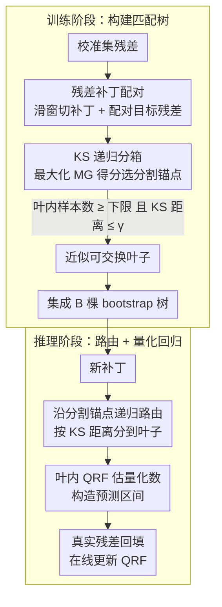

# DistMatch: Adaptive Binning via Distribution Matching for Robust Sequential Conformal

**会议**: ICML 2026  
**arXiv**: [2606.00690](https://arxiv.org/abs/2606.00690)  
**代码**: 待确认  
**领域**: 时间序列 / 不确定性量化 / 保形预测  
**关键词**: 序列保形预测, 分布漂移, Kolmogorov-Smirnov, 自适应分箱

## 一句话总结
DistMatch 提出基于 **KS 统计量**的递归分箱方法——通过将残差分组到近似可交换的叶子节点中**摒弃权重重新分配**，在分布漂移下提供有效的保形预测间隔；5 个数据集上均实现最小的区间宽度，同时保持有效覆盖率。

## 研究背景与动机

**领域现状**：序列保形预测通过构造预测区间提供有效的不确定性量化，但传统方法假设残差可交换性——这一假设在实际时间序列中常被违反。现有方法主要通过残差权重重新分配近似可交换性。

**现有痛点**：
- 权重重新分配方案（时间权重法）难以准确估计权重，容易在分布突变时丢弃信息丰富的早期样本。
- 相似性检索方法对检索质量高度敏感，即使小的相似度估计错误也可能分配过大权重给不相关或噪声样本。
- 连续权重分配会扭曲残差的经验分布，导致量化估计失准。

**核心矛盾**：如何在不依赖精确权重估计的情况下，处理时间序列中的分布漂移并保证保形覆盖率。

**本文目标**：设计一种不需要权重重新分配的分箱方法，通过分组类似样本来诱导近似的局部可交换性，并对分布漂移具有鲁棒性。

**切入角度**：使用非参数 KS 统计量进行分布相似性度量，可以避免对全局平稳性等时间假设的依赖；相比权重重新分配，分箱方法通过保持经验分布的完整性更好地保留了残差的统计特性。

**核心 idea**：用 KS 统计量驱动的递归二元树替代权重方案——将残差递归分组到分布有界的叶子中，每个叶子独立应用在线量化回归实现局部自适应的鲁棒推理。

## 方法详解

### 整体框架
两个阶段——**训练阶段**：给定校准集残差，构造残差补丁 $\tilde{\epsilon}_t = \{\epsilon_{t - w + 1}, \ldots, \epsilon_t\}$ 与目标残差 $\epsilon_{t+1}$ 配对；通过最大化匹配增益得分（MG）递归选择分割锚点，将补丁分组到满足 KS 距离界的近似可交换叶子中，并自助采样构建 $B$ 棵树做集成以增强漂移下的鲁棒性。**推理阶段**：对新补丁 $\tilde{\epsilon}_T$，通过递归比较其与分割锚点的 KS 距离路由到对应叶子，在叶子内应用量化回归森林（QRF）估计量化数构造预测区间；最后把真实残差回填到所属叶子、在线更新 QRF 以适应新观测。

### 关键设计

**1. 基于 KS 统计量的递归分箱：用分组诱导近似可交换性，绕开权重估计**

传统序列保形预测靠给残差重新分配权重来近似可交换性，但权重难估，分布突变时容易把信息丰富的早期样本丢掉，连续加权还会扭曲残差的经验分布、让分位数失准。DistMatch 干脆不分配权重，改用分布相似性把残差分组。它定义匹配增益得分 $\text{MG}(\tilde{\epsilon}_i) = \sum_j \mathbb{1}\{D_{\text{KS}}(\tilde{\epsilon}_i, \tilde{\epsilon}_j) \leq \gamma\}$，在每个分割节点选能最大化该得分的锚点 $s$，并递归分割直到再也找不到满足最小样本数 $n_{\min}$ 的更好分割。这里的相似性用 KS 距离 $D_{\text{KS}} = \sup_x |F_i(x) - F_j(x)|$ 衡量两条经验 CDF 的最大偏差——它密度无关、非参数，对偏斜分布的区分能力强，计算又只要 $O(w)$（相比 TV/Wasserstein 的 $O(n)$ 级别）。离散分箱比连续加权更可贵的一点是它保住了残差经验分布的完整性，不会人为扭曲分位数估计。

**2. 残差补丁 + 目标级可交换性：用补丁级测试换来目标级覆盖保证**

分箱是按补丁分的，但保形覆盖率最终要保证的是「未见目标残差」落在区间内，两者之间需要一座理论桥梁。DistMatch 把残差补丁 $\tilde{\epsilon}_t = \{\epsilon_{t-w+1}, \ldots, \epsilon_t\}$ 与目标残差 $\epsilon_{t+1}$ 配对，定义 $\gamma^*$-近似局部可交换性 $\max_{t \in \mathcal{L}_{k^*}} D_{\text{KS}}(P_{t+1}, P_{T+1}) \leq \gamma^*$，即一个叶子内所有目标残差分布与未见目标分布的 KS 距离都有界。借局部平稳性和 $\beta$-混合假设可以证明：当补丁级 KS 界为 $2\gamma$ 时，目标级界为 $2 C \gamma + \mathcal{O}(\sigma_{\text{mix}})$。这样一来，只要在可观测的补丁层面控制相似度，就能反推出对未来目标的覆盖保证，避开了直接估计未来分布这件本身就很难的事；相比要求全局可交换，局部可交换还能容忍温和的分布漂移。

**3. 在线自适应 + 集成鲁棒性：在长序列和剧烈漂移下守住覆盖率**

单棵树在严重漂移时可能把新补丁路由到错误的叶子，于是 DistMatch 用 $B$ 棵自助树做集成：每棵树用采样比率 $\theta$ 的自助样本构建，对每个未见补丁至少有一棵树以概率 $p_{\min}$ 把它路由到匹配的右叶子，最终取 $B$ 棵树量化估计的平均 $\bar{q} = \frac{1}{B} \sum_b q^{(b)}$ 作鲁棒预测——集成相当于在极端漂移下准备了多条后备路由路径。同时每观察到一个新残差，只更新对应叶子内的量化回归森林（QRF），不重建树结构，于是局部量化能持续自适应演变，而在线成本保持在 $O(T w \log n)$，比依赖滑窗重训的 SPCI、HopCPT 低约 $T$ 倍。

## 实验关键数据

### 主实验（5 个真实数据集，α = 0.1）

| 数据集 | 方法 | 覆盖率 ↑ | 区间宽度 ↓ | Winkler 分数 ↓ |
|--------|------|---------|----------|------------|
| Elec. | **DistMatch** | 0.92 | **0.27** | **1.97** |
| Elec. | SPCI | 0.90 | 0.28 | 2.54 |
| Solar | **DistMatch** | 0.91 | **60.00** | **1.54** |
| Solar | SPCI | 0.85 | 47.36 | 1.98 |
| Wind | **DistMatch** | 0.90 | **69.04** | **2.15** |
| Wind | SPCI | 0.83 | 63.14 | 2.19 |

DistMatch 在所有 5 个数据集上都实现最小的区间宽度，同时保持有效覆盖率。

### 消融实验

| 配置 | Elec. | Solar | Wind | 平均 Winkler |
|------|-------|-------|-------|-----------|
| 完整模型（γ = 0.1, w = 100） | 0.92 | 0.91 | 0.90 | 1.95 |
| w/o KS（用 Wasserstein） | 0.91 | 0.90 | 0.89 | 3.42 |
| w/o KS（用 KL 散度） | 0.88 | 0.86 | 0.82 | 覆盖率失效 |
| w/o 集成（单树） | 0.91 | 0.89 | 0.88 | 2.34 |

### 关键发现
- KS 统计量相比 Wasserstein 和 KL 散度表现更佳，同时计算成本最低（$O(w)$ vs $O(n^2)$）。
- 集成机制在严重漂移场景下关键。
- 超参数 $\gamma$ 在 0.1 以内稳定性好，权衡了偏差-方差权衡。

## 亮点与洞察
- **创新性的理论框架**：首次为基于分箱的序列 CP 建立了基于近似局部可交换性的理论保证；通过补丁级 KS 界推导目标级界，避免对未来分布的直接建模。
- **优雅的设计选择**：KS 统计量作为分布匹配标准既简洁有效（非参数、密度无关），又有明确的几何解释（经验 CDF 的最大偏差）；相比连续权重，离散分箱自然保持了残差的经验分布完整性。
- **在线鲁棒性机制**：集成 + 在线更新的二元组合使 DistMatch 在极端漂移下仍维持有效覆盖；计算效率比 SPCI 和 HopCPT 提升 $T$ 倍。
- **可迁移的思想**：分布匹配分箱的思想可扩展到其他需要处理分布漂移的不确定性量化任务（风险校准、概率预测）。

## 局限与展望
- 理论假设的实际满足度：依赖于局部平稳性和 $\beta$-混合假设，在长记忆或非平稳性极强的序列上可能失效。
- 超参数敏感性：虽然消融显示 $\gamma \in [0.05, 0.15]$ 内稳定，但在新数据集上仍需通过贪心搜索优化。
- 样本量要求：校准集大小 $n$ 影响树构建成本 $O(n^2 w \log n)$。
- 改进：自适应 $\gamma$ 选择机制；扩展到多维输出或多步预测；探索其他时间序列任务（异常检测、需求预测）。

## 相关工作与启发
- **vs SPCI**：依赖滑动窗口的模型更新捕捉分布变化，容易在极端漂移下失效；DistMatch 通过分布匹配分箱实现自适应，无需重训预测器。
- **vs HopCPT**：用 Hopfield 网络检索相似过去残差，检索质量敏感；DistMatch 用全局 KS 匹配避免相似度估计误差的放大。
- **vs KOWCPI**：依赖核方法进行权重计算，对核选择敏感；DistMatch 完全避免权重，改用离散分箱。

## 评分
- 新颖性: ⭐⭐⭐⭐⭐  首次将 KS 统计量引入序列 CP，用分箱替代权重，理论框架创新。
- 实验充分度: ⭐⭐⭐⭐  5 个真实数据集 + 8 个基线对比 + 消融实验 + 理论验证充分；缺乏在极限数据和跨领域泛化的实验。
- 写作质量: ⭐⭐⭐⭐⭐  逻辑清晰，符号规范，理论推导严密，实验分析透彻。
- 价值: ⭐⭐⭐⭐  序列 CP 是实用问题，DistMatch 效果显著；应用主要限于时间序列领域，理论框架对不确定性量化社区有参考价值。

<!-- RELATED:START -->

## 相关论文

- [\[ICML 2026\] Adaptive Time Series Reasoning via Segment Selection](adaptive_time_series_reasoning_via_segment_selection.md)
- [\[ICML 2026\] Doubly Outlier-Robust Online Infinite Hidden Markov Model](doubly_outlier-robust_online_infinite_hidden_markov_model.md)
- [\[ICML 2026\] Divide and Contrast: Learning Robust Temporal Features Without Augmentation](divide_and_contrast_learning_robust_temporal_features_without_augmentation.md)
- [\[NeurIPS 2025\] MAESTRO: Adaptive Sparse Attention and Robust Learning for Multimodal Dynamic Time Series](../../NeurIPS2025/time_series/maestro_adaptive_sparse_attention_and_robust_learning_for_multimodal_dynamic_tim.md)
- [\[ICLR 2026\] ResCP: Reservoir Conformal Prediction for Time Series Forecasting](../../ICLR2026/time_series/rescp_reservoir_conformal_prediction_for_time_series_forecasting.md)

<!-- RELATED:END -->
