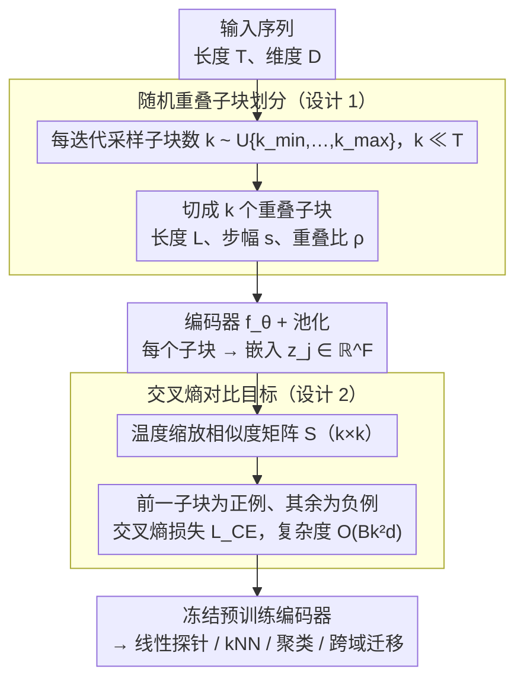

# Divide and Contrast: Learning Robust Temporal Features Without Augmentation

**会议**: ICML 2026  
**arXiv**: [2605.21241](https://arxiv.org/abs/2605.21241)  
**代码**: 待确认  
**领域**: 时间序列 / 自监督学习  
**关键词**: 时间序列表示学习, 对比学习, 自监督, 无增强, 子块划分

## 一句话总结
Di-COT 通过**随机划分序列为重叠子块**并对其进行对比学习——在不使用数据增强的情况下高效学习鲁棒的时间序列表示，相比现有方法速度快 2.5 倍、精度更高；6 大规模数据集 + 124 UCR + 28 UEA 上全面验证。

## 研究背景与动机

**领域现状**：时间序列自监督表示学习已成为重要研究方向，对比学习被广泛应用。现有方法如 TNC、TS-TCC、TS2Vec 等都利用时间邻近性或数据增强构造正负样本对。

**现有痛点**：
- 需要复杂的数据增强（时间变形、幅度变换）导致表示扭曲。
- 使用动态时间规整或多次编码器前向传播，计算开销大。
- 近期方法 CaTT 虽然避免了增强，但假设时间相邻性等价于语义相似性，在 UCR/UEA 上失效。

**核心矛盾**：在时间变化剧烈的数据集（频繁的事件转换）上，逐时步对比会在时间过渡处产生假正例；只依赖时间邻近性的方法又无法处理这种情况。同时现有损失计算复杂度与序列长度 $T$ 成平方关系，对长序列不友好。

**本文目标**：设计一个不需要数据增强、多次编码器传递、且对序列长度独立的自监督时间序列学习框架。

**切入角度**：与其对单个时步进行对比，不如将序列划分为具有**语义完整性**的子块单元进行对比——既能避免时间过渡的假正例，又能保留足够的学习信号。

**核心 idea**：用**动态重叠子块的对比学习**替代**逐时步或数据增强的对比学习**，并将其重新表述为**多类分类任务**以实现长度独立的高效计算。

## 方法详解

### 整体框架
Di-COT 想避开时序对比学习的两个老毛病——靠数据增强会扭曲表示、逐时步对比在时间过渡处又会产生假正例——办法是把对比的单元从"单个时步"换成"语义完整的重叠子块"。一条序列 $\mathbf{x}^{(i)}\in\mathbb{R}^{T\times D}$ 进来后，先随机划成 $k$ 个重叠子块（$k$ 从 $\{k_{\min},\ldots,k_{\max}\}$ 均匀采样）；每个子块编码 + 池化得到嵌入，算温度缩放的相似度矩阵 $\mathbf{S}^{(i)}\in\mathbb{R}^{k\times k}$；最后把"相邻子块预测"重述成多类分类，每个子块都当锚点产生密集监督。整条管线既不做任何增强，损失复杂度还独立于序列长度。

### 关键设计

**1. 随机重叠子块划分：用语义完整的子块替代数据增强与逐时步对比**

逐时步对比（如 CaTT）假设"时间相邻 = 语义相似"，在事件频繁切换的数据上会把时间过渡处的两个时步误判成正例，且逐时步相似度矩阵的计算随序列长度 $T$ 平方膨胀（$O(BT^2 d)$）；而靠数据增强又会扭曲表示、多次编码前向徒增开销。Di-COT 不在时步上做文章，而是每迭代从 $\mathcal{U}\{k_{\min},\ldots,k_{\max}\}$ 采子块数 $k\ll T$，把序列切成 $k$ 个重叠子块：子块长度 $L=\frac{T}{1+(k-1)(1-\rho)}$、步幅 $s=\lfloor L(1-\rho)\rceil$、$\rho\in(0,1)$ 为重叠比，编码后得 $z_j^{(i)} = f_\theta(\tilde x_j^{(i)})\in\mathbb{R}^F$。这一步同时解决三件事：重叠让相邻子块共享上下文、不产生人工硬边界；每迭代随机采 $k$ 让模型见到多种时间粒度，无需显式多分辨率设计就隐含学到多尺度鲁棒性；把对比粒度从 $T$ 降到 $k\ll T$，时间过渡处的假正例自然消失，又保住足够学习信号。更关键的是——切分同一条序列的不同部分本身就是数据增强的替代品：正例天生共享同一语义上下文，于是整个框架既不造任何增强视图、也不需要非线性投影头（消融显示投影在时序上反而降性能，与 SimCLR 那套 CV 经验相反）。

**2. 交叉熵对比目标：把相邻子块预测重述成多类分类，长度无关地密集监督**

传统 InfoNCE 在长序列上复杂度随 $T$ 平方膨胀，而 TNC、TS2Vec 这类成对目标每次只产生稀疏的约 $2B$ 个监督信号。Di-COT 对每个子块对 $(j,p)$ 算温度缩放相似度 $S_{j,p}^{(i)} = \frac{z_j^{(i)\top}z_p^{(i)}}{\tau}$，得到 $\mathbf{S}^{(i)}\in\mathbb{R}^{k\times k}$；把前一个子块定为正标签 $p^*(j) = j-1$（首个子块无前驱，目标置 0）、同序列其余子块为负，按多类分类做交叉熵 $\mathcal{L}_{\text{CE}} = -\frac{1}{Bk}\sum_i\sum_j\log\frac{\exp(S_{j,p^*(j)}^{(i)})}{\sum_p\exp(S_{j,p}^{(i)})}$。这样每个子块都当锚点，单次更新产生 $B\times k$ 个正样本对（远密于增强方法的 $2B$）；复杂度降到 $O(Bk^2 d)$（$k\ll T$），与序列长度解耦；而且它做的是表示空间的判别而非数值空间的预测，鼓励相邻子块嵌入相似，从而对窗口的小幅平移更鲁棒，同时保留温度缩放 InfoNCE 的核心性质。

## 实验关键数据

### 主实验（6 大规模数据集线性评估）

| 数据集 | **本文** | CaTT | TS2Vec | TF-C | 提升 vs CaTT |
|--------|------|------|--------|------|----------|
| ECG | **85.28** | 80.89 | 71.83 | 74.67 | +4.39% |
| HARTH | **93.23** | 93.13 | 90.27 | 92.24 | +0.10% |
| PAMAP2 | **71.38** | 69.86 | 70.37 | 71.30 | +1.52% |
| SKODA | **99.41** | 94.87 | 98.96 | 98.23 | +4.54% |
| SLEEP | **85.21** | 85.17 | 84.81 | 85.18 | +0.04% |
| WISDM2 | **63.92** | 63.25 | 62.39 | 62.54 | +0.67% |
| **平均准确率** | **83.07** | 81.20 | 79.77 | 80.69 | **+1.87%** |
| **训练时间（小时）** | **2.88** | 3.47 | 3.28 | 6.52 | **-17%** |

### 低标记体制（1% 标记数据）

| 数据集 | 本文 | TF-C | TNC | 监督基线 |
|--------|------|------|------|----------|
| ECG | **73.33** | 74.50 | 61.06 | 54.28 |
| HARTH | **87.23** | 78.00 | 83.04 | 75.37 |
| SKODA | **98.01** | 93.50 | 96.11 | 92.77 |
| **平均准确率** | **76.36** | 73.55 | 72.73 | 70.39 |

低标记设置下相比监督基线提升 +5.97%，相比 TF-C 快 2.5 倍。

### 消融实验

| 配置 | 大规模数据集 | UCR | UEA | 说明 |
|------|------------|------|------|------|
| 完整模型 | 83.07 | 81.33 | 71.24 | 标准 Di-COT |
| 去掉重叠（ρ=0） | 81.22 | 81.12 | 70.13 | -2.23% / -1.56% |
| 去掉温度 | 82.47 | 81.33 | 70.79 | -0.72% 影响小 |
| 固定全局划分 | 82.80 | 81.32 | 69.69 | 随机采样更优 |
| 对比洗牌子块 | 81.80 | 81.19 | 70.09 | 时间邻近性重要 |
| 非线性投影 | 81.85 | 79.88 | 69.73 | 与 CV 不同，不适用 |

### 关键发现
- **子块重叠最重要**：贡献最大，特别是大规模数据集（-2.23%）。
- **时间相邻性关键**：与时序相邻的子块作为正对显著优于随机配对（-1.53%）。
- **骨干网络选择**：InceptionTime 优于 ResNet（-3.56%）和 FCN（-2.58%）。
- **无需非线性投影**：不同于 SimCLR，投影反而降低性能。

## 亮点与洞察
- **巧妙的粒度缩放**：通过将对比粒度从时步（$T$）降低至子块（$k \ll T$），自然避免了时间过渡的假正例，同时保留足够的学习信号——比 CaTT 的假设更健壮。
- **长度独立计算**：将损失复杂度从 $O(B T^2 d)$ 降至 $O(B k^2 d)$，使长序列处理成为可能；交叉熵重新表述比传统 InfoNCE 更高效。
- **无增强的优势**：完全舍弃数据增强避免了表示畸变，同时减少计算开销——对时间序列领域很有启发，不是所有 CV 的技巧都适用于序列。
- **多粒度鲁棒性**：每迭代随机采样 $k$ 使模型天然学习多尺度时间特征，隐含了多分辨率学习而无需显式设计。

## 局限与展望
- Di-COT 基于对比学习，学到的是判别性表示，不适合时间序列预测任务。
- 方法强烈依赖"时间邻近性 = 语义相似性"假设；在高频率状态跳跃的数据上可能仍失效。
- 子块数 $k$ 和重叠比 $\rho$ 需要数据集相关的调参。
- 改进：自适应子块划分策略；混合对比策略；扩展到非序列任务验证泛用性。

## 相关工作与启发
- **vs CaTT**（Shamba et al. 2025）：也避免增强和多次编码，但对所有时步进行对比；Di-COT 用子块避免假正例 + 损失计算独立于序列长度 + 性能更优。
- **vs TS2Vec**（Yue et al. 2022）：对同时间戳跨视图对比，需要两个增强视图；Di-COT 更高效且避免增强偏差。
- **vs 基于增强的方法**（TS-TCC、TF-C）：传统方法依赖复杂增强；Di-COT 证明在时间序列上简单无增强策略 + 合理粒度选择就能胜出。
- **启发**：对 CV 中成功的方法在其他领域的应用要谨慎——有时"更少"（无增强）比"更多"（复杂增强）更好。

## 评分
- 新颖性: ⭐⭐⭐⭐  通过改进粒度选择和损失表述解决时间序列对比学习的核心权衡（效率 vs 准确率），思想直接但有效。
- 实验充分度: ⭐⭐⭐⭐⭐  覆盖 6 大规模 + 124 UCR + 28 UEA 数据集，5 种下游任务，充分的消融研究。
- 写作质量: ⭐⭐⭐⭐  论文结构清晰，相比前作差异阐述充分；个别段落可更简洁。
- 价值: ⭐⭐⭐⭐⭐  实际部署价值高——既快又准，代码开源，可直接应用于各类时间序列任务。

<!-- RELATED:START -->

## 相关论文

- [\[ICML 2026\] DistMatch: Adaptive Binning via Distribution Matching for Robust Sequential Conformal](distmatch_adaptive_binning_via_distribution_matching_for_robust_sequential_confo.md)
- [\[AAAI 2026\] Task-Aware Retrieval Augmentation for Dynamic Recommendation](../../AAAI2026/time_series/task-aware_retrieval_augmentation_for_dynamic_recommendation.md)
- [\[ICML 2026\] Doubly Outlier-Robust Online Infinite Hidden Markov Model](doubly_outlier-robust_online_infinite_hidden_markov_model.md)
- [\[ICML 2026\] Learning Long Range Spatio-Temporal Representations over Continuous Time Dynamic Graphs with State Space Models](learning_long_range_spatio-temporal_representations_over_continuous_time_dynamic.md)
- [\[NeurIPS 2025\] MAESTRO: Adaptive Sparse Attention and Robust Learning for Multimodal Dynamic Time Series](../../NeurIPS2025/time_series/maestro_adaptive_sparse_attention_and_robust_learning_for_multimodal_dynamic_tim.md)

<!-- RELATED:END -->
