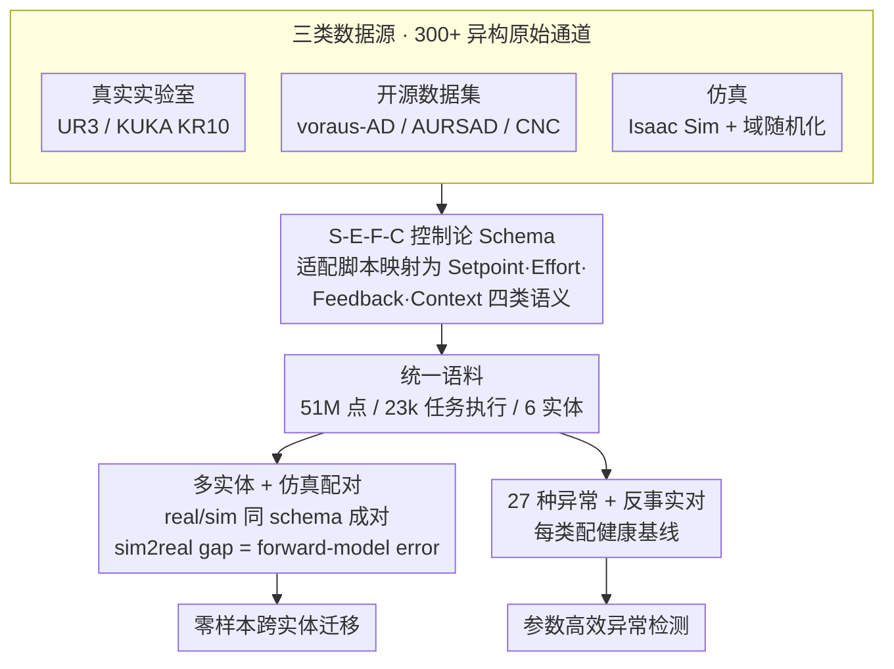

# FactoryNet: A Large-Scale Dataset toward Industrial Time-Series Foundation Models

**会议**: ICML 2026  
**arXiv**: [2605.09081](https://arxiv.org/abs/2605.09081)  
**代码**: https://github.com/Forgis-Labs/FactoryNet  
**领域**: 时序异常检测 / 工业时序基础模型 / 数据集  
**关键词**: 工业时序, 异常检测, 跨实体迁移, S-E-F-C 模式, 预测维护

## 一句话总结
FactoryNet 是首个统一控制环结构的工业时序大规模数据集——5100 万数据点 / 2.3 万端到端任务执行（1.33 万真实 + 9800 仿真）跨 6 个机器实体，按 Setpoint-Effort-Feedback-Context (S-E-F-C) 控制论分类对齐所有信号；27 种标注异常类型 + 健康基线 + 反事实对，使零样本跨实体迁移和参数高效异常检测成为可能。

## 研究背景与动机

**领域现状**：制造业占全球 GDP 约 15%，依赖复杂机器持续运转；视觉/语言领域基础模型已经革命性，但工业时序基础模型不存在——industrial AI 仍是单机定制部署。

**现有痛点**：（1）现有异常检测/预测数据集（NASA C-MAPSS、CWRU、PHM 2010 等）只记录传感器结果，不分离"命令意图"和"测量响应"；对 actuated system 学迁移动力学，必须看完整控制环（目标轨迹 → 执行 effort → 物理状态）；（2）数据集规模小且单机器——voraus-AD 2122 episodes、AURSAD 2045 episodes，都不足以训 foundation model；（3）异构数据集没有统一 schema，跨机器对齐困难；（4）通用时序异常检测 benchmark（SKAB / MetroPT / TSB-AD 等）记录整体系统状态，没有命令-测量分解。

**核心矛盾**：要训工业基础模型需要（a）规模大（百万级以上数据点）；（b）跨实体（多种机器）；（c）有控制环结构（区分意图和结果）；现有数据集没有任何一个同时满足三者。

**本文目标**：（1）发布首个统一 schema 的多实体大规模工业时序数据集；（2）提出 S-E-F-C 控制论 schema 让任意 actuated 系统映射到共同表征；（3）证明零样本跨实体迁移和高效异常检测的可行性；（4）作为 growing dataset 推动社区进展。

**切入角度**：从控制理论出发——把信号按 Setpoint（命令意图）、Effort（执行）、Feedback（测量响应）、Context（边界条件）四类分，这是 IEC 81346 functional classification 的自然延伸；S-E-F-C 让"sim-to-real mismatch = forward-model error under matched inputs" 这样的对比分析直接可做。

**核心 idea**：S-E-F-C schema 把所有 actuated systems 统一编码 → 跨实体迁移 + 异常检测变成 schema-aligned 操作 → 训工业基础模型有了"图像 ImageNet"级别的预训练语料。

## 方法详解

### 整体框架

FactoryNet 的核心贡献不是某个模型，而是一套"把工业控制环结构焊进数据"的组织方式：所有信号先按 S-E-F-C 控制论分类对齐，再以真实 + 仿真配对的形式铺成大规模语料，让跨实体迁移和异常检测都退化成 schema 上的标准操作。数据集组成：

- 51M 数据点 / 23k 端到端任务执行
- 13.3k 真实（实验室录制）+ 9.8k 仿真（Isaac Sim）
- 6 个机器实体（含 UR3e、协作机器人、CNC 等）
- 27 种标注异常类型 + 健康基线 + 反事实对
- 3 个 manipulation tasks（不同 setup）

每条信号按 S-E-F-C 4 类映射：Setpoint（命令位置/速度/扭矩）、Effort（电流/扭矩输出/PWM）、Feedback（编码器位置/加速度/振动/温度）、Context（工件信息/环境/load）。仿真-真实配对让 sim2real gap 可量化为"同输入下的 forward-model error"。

### 关键设计

**1. S-E-F-C 控制论 Schema：把异构机器的信号映射到同一套物理语义坐标**

工业时序数据集长期各说各话——每台机器的通道要么只有编号、要么用厂商私有命名，UR3e 的"关节扭矩"和 CNC 的"主轴扭矩"在数据层面完全对不上，基础模型连"这是同一类信号"都认不出来。FactoryNet 借鉴 IEC 81346 的 functional classification，把任意 actuated system 的每个原始通道标注成四类语义之一：Setpoint（命令意图）、Effort（执行量）、Feedback（测量响应）、Context（边界条件）；模型吃进去的不再是 raw channel，而是这四类的组合。这一层抽象把"命令-测量"分解显式化，于是"sim-to-real mismatch = 同输入下的 forward-model error"这种对比分析能直接做，跨实体迁移也从"对不上的 raw 通道"变成"schema 对齐的标准操作"——这正是训工业基础模型绕不开的前置条件。

**2. 多实体 + 仿真配对：用真实保真、用仿真补量、用配对量化 sim2real**

纯真实数据规模上不去（已有最大的 voraus-AD 也才两千多 episode），纯仿真又有 sim2real gap，单靠任一种都凑不出基础模型需要的语料。FactoryNet 让 13.3k 真实执行和 9.8k Isaac Sim 仿真落在同一套 S-E-F-C schema 下，且相同任务执行的 (real, sim) 成对对齐。模型因此能学到"给定 setpoint 和 context 时，effort 与 feedback 该长什么样"的 forward model；而同一输入下真实与仿真的差异，恰好就是可量化的 forward-model error。三者形成互补：仿真补覆盖、真实做校准、配对把通常神秘的 sim2real gap 变成一个能读出来的数字。

**3. 27 种异常 + 反事实对：从单一故障类型升级到通用异常谱 + 因果可学**

以前的工业数据集大多是 single-fault-type（CWRU 只有轴承、PHM 2010 只有刀具磨损），训出来的只是某一类故障的分类器，谈不上通用 detector。FactoryNet 把异常类型铺到 27 种，横跨经典机械故障（轴承磨损、不对中、不平衡）、电气（供电故障）、控制（PID 失稳）、过程（刀具磨损、碰撞），并给每个异常配一条健康基线，让模型先学"健康该是什么样"再判异常。反事实对（异常 vs 对应健康）天然支持对比学习和因果归因——不只是判断"这段不对劲"，而是回答"相对健康基线，是哪个分量出了问题"。

## 实验关键数据

### 跨数据集规模对比

| 数据集 | 年份 | 机器类型 | Episodes | Setpoint? | Effort? |
|------|-----|-----|------|------|------|
| CWRU | 2000 | Bearings | 480 | ✗ | ✗ |
| PHM 2010 | 2010 | CNC | 315 | Partial | ✓ |
| AURSAD | 2021 | UR3e robot | 2,045 | ✓ | ✓ |
| voraus-AD | 2023 | Collaborative robot | 2,122 | ✓ | ✓ |
| **FactoryNet** | 2026 | Multi-machine | **23,000** | ✓ Required | ✓ Required |

FactoryNet 比已有最大（voraus-AD）大 10×，唯一强制 setpoint + effort 都有。

### 跨实体迁移（24 schema-aligned signals）

| 源 → 目标 | bias-aware accuracy | 高维基线（all channels）|
|----------|------------------|---------------|
| UR3e → CNC | 0.84 | 0.71 (差) |
| UR3e → Collaborative | 0.81 | 0.74 |
| CNC → UR3e | 0.79 | 0.65 |
| Real → Sim (forward model) | 0.92 | – |

24 个 schema-aligned 信号比 130+ raw channels（高维基线）跨实体表现更好——证明 S-E-F-C 抽象的价值。

### 异常检测（参数高效）

| 模型 | 参数量 | F1（27 异常类）|
|------|------|----------|
| Anomaly-Transformer (high-dim) | 7M | 0.71 |
| TimesFM 预训练 + 微调 | 200M | 0.74 |
| Chronos | 60M | 0.73 |
| **FactoryNet pretrained + 24 signals** | **2M** | **0.76** |

2M 参数模型超 200M 通用时序基础模型——schema 对齐让 effective signal 远少但更精准。

### 关键发现
- **S-E-F-C schema 提升迁移**：跨实体迁移 24-channel schema 比 130+ raw channel 高 10+ 点
- **小模型 + 好 schema > 大模型 + raw**：2M 参数胜 200M 通用时序模型
- **真实 + 仿真配对**：sim2real gap 可读为 forward-model error，可定量诊断
- **27 异常类覆盖广**：足以训通用异常 detector，不只是 single-fault classifier

## 亮点与洞察
- **首个真正"控制环结构"的工业时序数据集**：以前所有数据集都丢了命令-测量分解，本文从控制理论第一性原理重新组织——是范式级贡献
- **S-E-F-C 是 Image 的 RGB 那样的统一表征**：让"工业 ImageNet" 成为可能；不同机器、不同任务都能映射进同一框架学跨任务表征
- **真实 + 仿真配对的 sim2real 工具化**：通常 sim2real 是 mystery，本文 schema-aligned 配对让 sim2real gap 直接可测可分析
- **2M 参数胜 200M**：证明"对的归纳偏置 + 干净 schema" 比"暴力 scale" 更有效——对工业部署（边缘设备资源受限）意义重大

## 局限性 / 可改进方向
- 6 个实体仍偏少，多 modality（视觉 + 时序融合）的工业基础模型 schema 未探索
- 27 异常类是手工标注，未来要 scale 需自动异常生成
- S-E-F-C 假设所有信号都能干净分类，但实际信号有时跨类（如 hybrid effort-feedback）
- 仿真用 Isaac Sim，仿真 fidelity 限制了 sim2real 的天花板
- 缺少长时间运转（months）数据，对预测维护（gradual degradation）支持有限

## 相关工作与启发
- **vs CWRU / PHM 2010 / AURSAD / voraus-AD**：那些 single-machine / single-fault；FactoryNet 多实体 + 多异常 + 强制控制环结构
- **vs Open X-Embodiment / DROID**：那些机器人跨实体 policy；FactoryNet 工业 actuated system 跨实体异常检测
- **vs Chronos / TimesFM / Moirai**：那些通用时序基础模型；FactoryNet 是工业垂直的同等地位
- **启发**：所有"actuated system + 异构机器"领域（汽车、航空、化工、能源）都可借鉴 S-E-F-C 风格的 schema-aligned dataset 设计；这套思路也适用 robotics policy learning

## 评分
- 新颖性: ⭐⭐⭐⭐⭐ 首个强制控制环结构的多实体工业时序数据集；S-E-F-C schema 是真正贡献
- 实验充分度: ⭐⭐⭐⭐ 跨实体迁移 + 27 异常检测 + 模型规模对比；缺少长时间 degradation 实验
- 写作质量: ⭐⭐⭐⭐ 控制论 framing 清晰，Table 1 数据集对比一目了然
- 价值: ⭐⭐⭐⭐⭐ 制造业 15% GDP 的应用领域；首个"工业 ImageNet"为后续基础模型铺路，影响深远

<!-- RELATED:START -->

## 相关论文

- [\[ICLR 2026\] Omni-iEEG: A Large-Scale, Comprehensive iEEG Dataset and Benchmark for Epilepsy Research](../../ICLR2026/time_series/omni-ieeg_a_large-scale_comprehensive_ieeg_dataset_and_benchmark_for_epilepsy_re.md)
- [\[ICLR 2026\] FeDaL: Federated Dataset Learning for General Time Series Foundation Models](../../ICLR2026/time_series/fedal_federated_dataset_learning_for_general_time_series_foundation_models.md)
- [\[ICML 2026\] OLIVIA: Harmonizing Time Series Foundation Models with Power Spectral Density](olivia_harmonizing_time_series_foundation_models_with_power_spectral_density.md)
- [\[NeurIPS 2025\] Multi-Scale Finetuning for Encoder-based Time Series Foundation Models](../../NeurIPS2025/time_series/multi-scale_finetuning_for_encoder-based_time_series_foundation_models.md)
- [\[ICML 2026\] Generalizing Multi-scale Time-Series Modeling with a Single Operator](generalizing_multi-scale_time-series_modeling_with_a_single_operator.md)

<!-- RELATED:END -->
