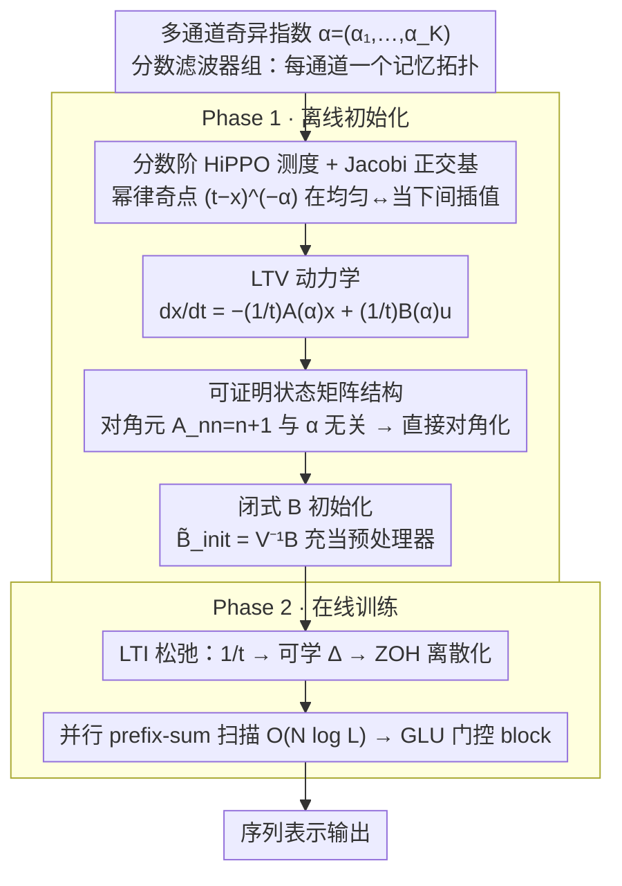

# FRACTAL: State Space Model with Fractional Recurrent Architecture for Computational Temporal Analysis of Long Sequences

**会议**: ICML 2026  
**arXiv**: [2605.08833](https://arxiv.org/abs/2605.08833)  
**代码**: 无  
**领域**: 序列建模 / 状态空间模型（SSM）  
**关键词**: HiPPO、分数阶微积分、状态空间模型、长程依赖、Long Range Arena

## 一句话总结
本文把 HiPPO 框架背后的概率测度推广到带可调奇异指数 $\alpha$ 的分数阶幂律测度，从而首次同时拿到「全历史保留 + 近时敏感 + 尺度不变」，并将这一理论落地为 LTI 对角化 SSM——FRACTAL 在 Long Range Arena 上以 87.11% 平均分追平 S5，并在 ListOps 上拿到 61.85%。

## 研究背景与动机
**领域现状**：现代 SSM（S4 / S4D / DSS / S5 / Mamba）几乎都建立在 HiPPO 的「在线多项式投影 + 概率测度」框架之上。架构层面已迭代多轮——从结构化矩阵到对角化、再到时变选择性 SSM——但用什么测度来加权历史这一最底层选择，多年没人动过。

**现有痛点**：经典测度三件套各有死结：LegS（均匀）保住全历史与尺度不变，但近时信号被 $1/t$ 稀释；LagT（指数）能凸显近时，但固定时间尺度，时间被放慢/加快后就崩；LegT（滑窗）局部分辨率高，但窗口外完全遗忘。表 1 把这三件套和三个性质一一对照后，直接喊出「Impossible Trinity」。

**核心矛盾**：要同时拥有「记忆能延伸到任意远」「对刚到的输入足够敏感」「对信号被放慢/加快保持稳健」，整数阶微分方程本质上做不到——它要么把记忆均匀摊开，要么指数衰减。

**本文目标**：在不放弃 HiPPO 「在线多项式投影 + 闭式动力学」的前提下，找到一类测度同时满足三个性质，并把它落到一个可以并行扫描的 LTI 对角 SSM 上。

**切入角度**：分数阶微积分天然描述非局部、有重尾的记忆。把测度里的「指示函数」换成 $(t-x)^{-\alpha}$ 这样的幂律奇点，奇异指数 $\alpha\in[0,1)$ 在 LegS（$\alpha=0$）和近 delta（$\alpha\to 1$）之间做连续插值。

**核心 idea**：用幂律奇异测度替换 HiPPO 的均匀/指数测度——这等价于把基底从 Legendre 推广到 Jacobi 多项式 $P_n^{(-\alpha,0)}$，并保留闭式可推导的 SSM 系数。

## 方法详解

### 整体框架
FRACTAL 分两个阶段。**Phase 1（离线初始化）**：给定多通道奇异指数 $\boldsymbol{\alpha}=(\alpha_1,\dots,\alpha_K)$，按 Def. 3.1 写出分数阶测度 $\mu^{(t)}(x)=(1-\alpha)t^{\alpha-1}(t-x)^{-\alpha}\mathbb{I}_{[0,t]}(x)$，把它的正交基（归一化 Jacobi 多项式）代入 HiPPO 的投影方程，导出 LTV 动力学 $\dot{x}=-\frac{1}{t}A(\alpha)x+\frac{1}{t}B(\alpha)u$；再对 $A(\alpha)$ 做特征分解得到 $\Lambda$，对 $B(\alpha)$ 用闭式公式做物理意义初始化 $\tilde{B}_{\text{init}}=V^{-1}B$。**Phase 2（在线训练）**：把 LTV 中的 $1/t$ 松弛为可学习时间尺度 $\Delta$ 得到 LTI 系统，再用 ZOH 离散化 + 并行 prefix-sum 在 $O(N\log L)$ 时间内完成扫描。最后用 GLU 包裹 SSM 输出形成一个标准的 gated SSM block。

### 关键设计

**1. 分数阶 HiPPO 测度：用一个奇异指数连续插值「均匀记忆」与「集中当下」**

经典测度三件套各有死结——LegS 保住全历史和尺度不变但近时被 $1/t$ 稀释、LagT 凸显近时却锁死时间尺度、LegT 局部分辨率高却窗外全忘，三者凑不齐「全历史 + 近时敏感 + 尺度不变」这个不可能三角。FRACTAL 的破题点是把测度里的指示函数换成幂律奇点：$\mu^{(t)}(x)=(1-\alpha)t^{\alpha-1}(t-x)^{-\alpha}\mathbb{I}_{[0,t]}(x)$，归一化因子由 $\int_0^t(t-x)^{-\alpha}dx=t^{1-\alpha}/(1-\alpha)$ 推出，奇异指数 $\alpha=0$ 退化为 LegS、$\alpha\to 1$ 让测度趋向 $\delta_t$，于是在「均匀」和「当下」之间连续可调。把域 $[0,t]$ 经 $y=2x/t-1$ 映到 $[-1,1]$ 后，权重恰好变成 Jacobi 权 $(1-y)^{-\alpha}$，正交基自然就是 Jacobi 多项式 $P_n^{(-\alpha,0)}$。幂律奇点同时给出重尾长程记忆和近时高响应，而 $\mu$ 的归一化形式在 $t\mapsto\lambda t$ 下保持不变又守住了尺度不变性——三角被一举破掉。

**2. 可证明的状态矩阵结构：让对角元与 $\alpha$ 无关，省掉 NPLR 近似**

要把这个测度落到能并行扫描的对角 SSM 上，关键是 $A(\alpha)$ 必须可对角化、谱稳定。本文在归一化 Jacobi 基下做 Galerkin 投影 $\mathcal{L}[P_n]=P_n+(1+\eta)P_n'$，证明 $A(\alpha)$ 严格下三角，且对角元 $A_{nn}=n+1$ 与 $\alpha$ 完全无关；非对角元 $A_{nk}$（$k<n$）由 $\langle\mathcal{L}[P_n^{(-\alpha,0)}],P_k^{(-\alpha,0)}\rangle_w/\|P_k\|_w^2$ 给出，仅 $\alpha=0$ 时退化为 $\sqrt{(2n+1)(2k+1)}$、其余靠 Gauss–Jacobi 数值积分，$B$ 项则有闭式 $B_n=\sqrt{(2n+1-\alpha)/(1-\alpha)}\binom{n-\alpha}{n}$。这里「对角元恒为 $1,\dots,N$」是最关键的稳定性保证：不论 $\alpha$ 怎么调，特征值都不动、只有特征向量被旋转，所以无须像 S4 那样做复杂的 NPLR 近似，直接 $A=V\Lambda V^{-1}$ 就拿到对角 SSM，长序列上也不会谱漂移。

**3. 分数滤波器组多通道架构：用不同 $\alpha_k$ 把多个时间尺度并行解耦**

实验发现像 ListOps 这种任务既要长程括号匹配又要局部数值，单一 $\alpha$ 顾此失彼。FRACTAL 因此把状态维 $H$ 切成 $K$ 个 block、每个 block 配一个 $\alpha_k$：低 $\alpha$ 通道像低通滤波器保留全局上下文与去噪，高 $\alpha$ 通道像带通/高通滤波器突出局部跳变，最后由输出投影 $C$ 学习如何组合这些时间基。这里 $\Delta$ 控制「看多远」（分辨率）、$\alpha$ 控制「怎么看」（记忆拓扑），两个旋钮被干净地解耦。把不同 $\alpha$ 当作不同频段的 filter bank 天然带来多尺度归纳偏置，也正是 FRACTAL 在 ListOps 上提分最多的根本原因。

### 损失函数 / 训练策略
没有引入新损失，沿用各 LRA 任务自带的 CE 或 BCE。$\alpha_k$ 在 $[0,0.9]$ 区间按线性间隔分配、固定不可学（论文把 learnable $\alpha$ 列为 future work），其余超参与 S5 一致以保证公平比较。

## 实验关键数据

### 主实验：Long Range Arena（Table 2）

| 模型 | ListOps | Text | Retrieval | Image | Pathfinder | Path-X | Avg |
|------|---------|------|-----------|-------|------------|--------|-----|
| Transformer | 36.37 | 64.27 | 57.46 | 42.44 | 71.40 | ✗ | – |
| S4 | 59.60 | 86.82 | 90.90 | 88.65 | 94.20 | 96.35 | 86.09 |
| S4D | 60.47 | 86.18 | 89.46 | 88.19 | 93.06 | 91.95 | 84.89 |
| DSS | 57.60 | 84.80 | 87.60 | 84.40 | 85.00 | 85.00 | 80.73 |
| S5（论文复现） | 61.10 | 88.72 | 91.27 | 87.59 | 95.04 | 98.62 | 87.04 |
| **FRACTAL** | **61.85** | **89.10** | 91.19 | 87.30 | 94.80 | 98.39 | **87.11** |

### 消融与诊断

| 设置 | 关键指标 | 说明 |
|------|----------|------|
| $\alpha=0$（退化为 LegS / 类 S4） | 与 S4 同档 | 验证框架严格泛化既有方法 |
| 单一 $\alpha$（非 filter bank） | ListOps 明显回落 | 单一时间尺度无法同时抓全局括号和局部数字 |
| Random $B$ vs 解析 $\tilde{B}_{\text{init}}$ | 同最终精度，但解析版前期 loss 明显更低 | 闭式公式起到预处理器的作用，对应 Remark 4.1 |
| 数值验证 $A_{nn}=n+1$ | 任意 $\alpha$ 下都成立 | 与 Theorem 3.4 完美一致，长序列上不会出现谱漂移 |

### 关键发现
- 在层级 + 重尾结构最明显的 ListOps 上 FRACTAL 比 S5 高 0.75pt、比 S4 高 2.25pt，提分最大；在主要是局部依赖的 Image / Pathfinder 上几乎与 S5 持平。这恰好对应理论预测：「幂律测度的优势集中在长程 + 多尺度任务」。
- Path-X（长度 16K）下 FRACTAL 仍能拿到 98.39%，说明引入奇点没有让梯度在极长序列上失稳——这是 $A_{nn}=n+1$ 谱稳定性的实验背书。
- 离开 LTI 假设后理论上的严格尺度不变性丢失，但 filter bank 仍保留了多尺度归纳偏置，工程上比「严格尺度不变但难训练」的 LTV 系统更可用。

## 亮点与洞察
- 「Impossible Trinity → 分数阶解锁」的叙事很干净：作者把 SSM 的进步路径明确划成「架构 vs 测度」两条线，并指出测度这条线被搁置了多年。这种「重新审视隐性假设」的研究模式可复用到很多领域（如 attention 的归一化、扩散模型的噪声调度）。
- 「对角元与 $\alpha$ 无关」这一谱不变性是一个非常漂亮的副产物：它意味着可以把 $\alpha$ 设为可学超参（甚至 per-token 自适应），而几乎不破坏数值稳定性——这给后续的「数据驱动选择 $\alpha$」打开门。
- 用 filter bank 把不同 $\alpha$ 当作不同频段，可以借鉴到非 SSM 模型（如线性注意力或 RNN-style 模型）——只要把 kernel 的衰减形状视为可调节的「频段」，类似的多通道结构也能拿到多尺度归纳偏置。

## 局限与展望
- 严格尺度不变性只在 LTV（保留 $1/t$）下成立；为了并行扫描，作者主动放弃这个性质，工程版退化为「光谱多尺度」而非「真尺度不变」。如果未来想在物理/生理信号上真正利用尺度不变，需要专门设计一个 LTV-friendly 的扫描算法。
- $\alpha_k$ 目前是固定线性间隔，没有学习；不同任务下最优 $\alpha$ 谱可能差异很大，端到端可学化是显然的下一步。
- 评测局限于 LRA；论文明确把自己定位为「train-from-scratch LTI」，没和 Mamba 系选择性 SSM 在大规模语言任务上对比，因此对「语言建模质量」的结论需要谨慎外推。

## 相关工作与启发
- **vs S4 / S4D**：S4 把 HiPPO-LegS 当成静态初始化，再做 NPLR 工程化；FRACTAL 把测度变成可调设计参数，并由谱不变性直接对角化，省去 NPLR 这一步。
- **vs DSS / S5**：DSS / S5 主张「精确矩阵结构不重要、谱结构才关键」，FRACTAL 是这一思路的延续——但把谱结构进一步「按测度规律设计」而不是随机或近似初始化。
- **vs Mamba 等选择性 SSM**：Mamba 把矩阵做成输入相关来引入数据依赖；FRACTAL 走的是正交方向——继续坚持 LTI、但用测度做归纳偏置——两者其实可以叠加（输入相关 $\alpha$）。
- **vs LMU / Voelker 2019**：LMU 用滑窗 Legendre，相当于 LegT；FRACTAL 把它推广为可调 $\alpha$，所以 LMU 是其特例。

## 评分
- 新颖性: ⭐⭐⭐⭐⭐ 把分数阶测度首次带进 HiPPO 框架，并给出闭式可推导结构。
- 实验充分度: ⭐⭐⭐ 在 LRA 上对齐 S5 且 ListOps 领先，但缺少大规模语言建模对比。
- 写作质量: ⭐⭐⭐⭐ 从「不可能三角」推到 FRACTAL 的逻辑链非常顺，附录推导也比较自洽。
- 价值: ⭐⭐⭐⭐ 为 SSM 提供了一个被忽略多年的设计维度，对长程信号建模有清晰指导意义。

<!-- RELATED:START -->

## 相关论文

- [\[ICML 2026\] Learning Long Range Spatio-Temporal Representations over Continuous Time Dynamic Graphs with State Space Models](learning_long_range_spatio-temporal_representations_over_continuous_time_dynamic.md)
- [\[ICML 2026\] HiPPO Zoo: Explicit Memory Mechanisms for Interpretable State Space Models](hippo_zoo_explicit_memory_mechanisms_for_interpretable_state_space_models.md)
- [\[ICML 2025\] A Generalizable Physics-Enhanced State Space Model for Long-Term Dynamics Forecasting in Complex Environments](../../ICML2025/time_series/a_generalizable_physics-enhanced_state_space_model_for_long-term_dynamics_foreca.md)
- [\[ICLR 2026\] Weight-Space Linear Recurrent Neural Networks](../../ICLR2026/time_series/weight-space_linear_recurrent_neural_networks.md)
- [\[NeurIPS 2025\] WaLRUS: Wavelets for Long-range Representation Using SSMs](../../NeurIPS2025/time_series/walrus_wavelets_for_long-range_representation_using_ssms.md)

<!-- RELATED:END -->
