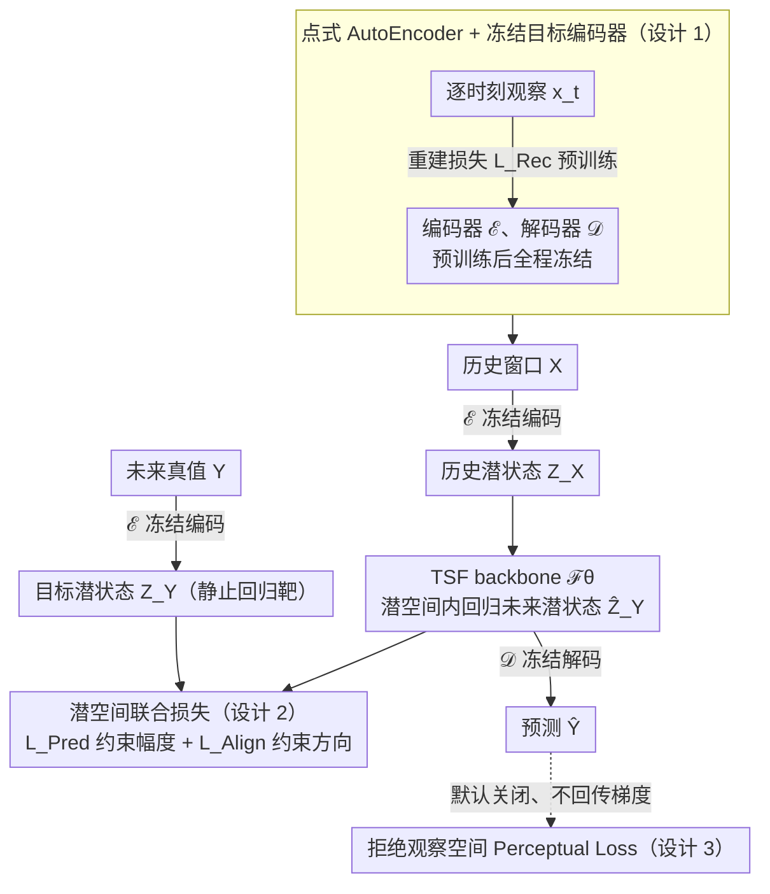

# From Observations to States: Latent Time Series Forecasting

**会议**: ICML 2026  
**arXiv**: [2602.00297](https://arxiv.org/abs/2602.00297)  
**代码**: https://github.com/Muyiiiii/LatentTSF (有)  
**领域**: 时序预测 / 表示学习  
**关键词**: 时序预测、潜状态空间、Latent Chaos、表示对齐、互信息

## 一句话总结
作者发现现有 TSF 模型即使预测精度高，其潜空间也常常是"时间错乱"的（Latent Chaos）；他们提出 LatentTSF——先用 AutoEncoder 把观察压到一个高维潜状态空间，然后让任何主流 backbone 在这个空间内做未来预测（Pred + Align 双损失），最后再解码回观察空间——在 6 个标准 benchmark 上稳定降 MSE/MAE，并恢复了潜表征的时间局部性和频谱结构。

## 研究背景与动机

**领域现状**：现代 TSF 几乎清一色采用"观察空间回归"范式：给定历史窗口 $\mathbf{X} \in \mathbb{R}^{C \times L}$，用 RNN / CNN / MLP / Transformer 学一个映射 $\mathcal{F}_\theta: \mathbb{R}^{C \times L} \to \mathbb{R}^{C \times T}$ 直接预测未来观察 $\mathbf{Y}$，并最小化 MSE / MAE。

**现有痛点**：作者在 iTransformer 这类强 backbone 上做了多视角的表示级诊断，发现一个让人意外的悖论——同一个模型在观察空间 MAE 很低，但内部潜表征是"时间错乱"的：相邻时间步的 embedding 没有聚类、t-SNE 上不再形成连续轨迹、频谱被破坏。在 Electricity 上相邻潜状态的平均欧氏距离从原始 12.94 飙到 94.03，dominant 周期信号几乎消失。

**核心矛盾**：作者把这个现象归因于两个层面的根本问题。**(i) 系统论**：真实观察 $\mathbf{X}$ 是底层高维动力系统的"噪声 + 部分投影"，关键潜变量在观察空间里就是看不到，最小化观察 MSE 反而鼓励模型学到走捷径——抓住均值回归、周期、自相关等浅统计而非真正的生成动力学。**(ii) 优化**：点级 MAE/MSE 损失对"时间连续性"没有任何归纳偏置，模型当然不会主动学时间相干的潜空间。

**本文目标**：构造一种新的训练范式，让模型显式地在一个"结构化潜状态空间"里学时间动力学，而不是只优化观察空间精度；要求该范式 (a) 能兼容任何现有 backbone，(b) 在嘈杂、部分可观测的真实数据上比标准范式更稳。

**切入角度**：与其改 backbone 架构，不如改训练范式本身——把"观察 → 观察"的目标改成"观察 → 潜状态 → 潜状态预测 → 解码回观察"四步管线，所有监督都打在潜空间里。

**核心 idea**：用一个预训练 + 冻结的 AutoEncoder 把每个时刻独立编码到高维潜状态 $\mathbf{Z}$，让 backbone 在 $\mathbf{Z}$ 空间内学未来潜状态 $\widehat{\mathbf{Z}}_Y$，监督信号是"潜空间预测损失 $\mathcal{L}_\text{Pred}$ + 潜空间对齐损失 $\mathcal{L}_\text{Align}$"，最终用冻结解码器映射回观察空间得到 $\widehat{\mathbf{Y}}$。

## 方法详解

### 整体框架
两阶段管线：(1) **潜状态空间构造**：用一个点式 (point-wise，即对每个时刻独立) AutoEncoder $\mathcal{E}, \mathcal{D}$ 把 $\mathbf{x}_t \in \mathbb{R}^C$ 映到 $\mathbf{z}_t \in \mathbb{R}^D$（$D$ 可以比 $C$ 大也可以更小，重点是"更适合动力学建模"），用 MAE 重建损失预训练，然后**冻结**。(2) **潜状态预测**：任意 TSF backbone $\mathcal{F}^\mathbf{Z}_\theta$ 输入 $\mathbf{Z}_X = \mathcal{E}(\mathbf{X})$，输出 $\widehat{\mathbf{Z}}_Y$，再用冻结 $\mathcal{D}$ 解码出 $\widehat{\mathbf{Y}} = \mathcal{D}(\widehat{\mathbf{Z}}_Y)$。训练时不再对 $\widehat{\mathbf{Y}}$ 算损失，而是在潜空间里同时拉近 $\widehat{\mathbf{Z}}_Y$ 和 ground-truth 潜状态 $\mathbf{Z}_Y = \mathcal{E}(\mathbf{Y})$。下图把这条"观察 → 潜状态 → 潜状态预测 → 解码回观察"的管线和三个关键设计落在同一张图上。

### 关键设计

**1. 点式 AutoEncoder + 冻结目标编码器：造一个平滑、适合学动力学的潜空间，并提供一个不动的回归靶**

观察空间本身是底层动力系统的"噪声 + 部分投影"，直接在上面回归会鼓励模型走捷径抓浅统计；而且如果回归目标会动，又容易表示坍缩。LatentTSF 的 AutoEncoder 是**逐时刻**独立编码的（不沿时间维做卷积/attention），用 $\mathcal{L}_\text{Rec} = \frac{1}{L}\sum_t \|\mathbf{x}_t - \mathcal{D}(\mathcal{E}(\mathbf{x}_t))\|_1$ 预训练后**冻结**，于是 $\mathbf{Z}_Y = \mathcal{E}(\mathbf{Y})$ 成了一个静止目标供 backbone 回归。冻结 + 点式各管一件事：冻结从结构上排除了坍缩——只要 AE 把不同输入编到不同潜点，常数解就不可能最优（Remark 3.1 + App. C.3 有形式化证明），不需要 SimSiam/BYOL 那种 stop-gradient 或 EMA；点式保证 backbone 拿到的是纯净潜状态而非已被 AE 平滑过的序列，否则动力学建模就变平凡了。

**2. 潜空间联合损失 $\mathcal{L}_\text{Pred} + \mathcal{L}_\text{Align}$：让预测潜状态既"幅度对"又"方向对"**

只把潜状态拉到数值接近还不够——方向（即动力学走向）对不对同样关键，单一损失各有盲区。总损失 $\mathcal{L}_\text{Total} = \alpha\cdot\|\mathbf{Z}_Y - \widehat{\mathbf{Z}}_Y\|_F^2 + \beta\cdot(1 - \cos(\mathbf{Z}_Y,\widehat{\mathbf{Z}}_Y))$：前者 Frobenius 范数强约束幅度，后者 cosine 强约束方向。作者给了信息论解释——$\mathcal{L}_\text{Pred}$ 是最大化 $I(\mathbf{Z}_Y;\widehat{\mathbf{Z}}_Y)$ 的变分下界（高斯假设下退化成平方误差），$\mathcal{L}_\text{Align}$ 是 InfoNCE 简化后最大化 $I(\mathbf{Y};\widehat{\mathbf{Z}}_Y)$ 的实用代理。消融证实两者缺一不可，ranking 一致是 "full > w/o Align > w/o Pred ≈ baseline"：Pred 单干缺方向、Align 单干缺幅度。默认权重 $\alpha=10,\beta=15$ 落在一大片"广平台"上，不挑参数。

**3. 彻底拒绝观察空间损失（Perceptual Loss）：把监督信号整条锁死在潜空间内**

直觉上"既在潜空间监督、又在解码后的观察空间补个 MSE"应该更稳，像上了双保险。但作者尝试加 $\mathcal{L}_\text{Perc} = \|\widehat{\mathbf{Y}} - \mathbf{Y}\|^2$ 后发现它反而破坏稳定的潜空间：冻结解码器是非线性的，潜空间的微小偏差被它放大成大幅重建误差，反传回 backbone 的梯度噪声很大。所以最终 recipe 默认**关掉** $\mathcal{L}_\text{Perc}$。这一条颠覆了"多加一个观察空间损失总没坏处"的常规直觉，也是对"潜空间监督本身就足以做好 TSF"这个中心论点最硬的实证支撑。

### 损失函数 / 训练策略
两阶段。**Stage 1**：用 $\mathcal{L}_\text{Rec}$ 预训练 AutoEncoder（MAE 重建，逐时刻），完成后参数全部冻结。**Stage 2**：用 $\mathcal{L}_\text{Total} = 10 \cdot \mathcal{L}_\text{Pred} + 15 \cdot \mathcal{L}_\text{Align}$ 训练 backbone，输入 $\mathbf{Z}_X$ 输出 $\widehat{\mathbf{Z}}_Y$，最后再由冻结 $\mathcal{D}$ 解码。AdamW + cosine 调度 + early stopping (patience=5)。

## 实验关键数据

### 主实验
在 6 个标准 benchmark（ETTh1/h2/m1/m2、Traffic、Electricity）×  6 个 backbone（CMoS、DLinear、PatchTST、TimeBase、TimeXer、iTransformer）上做了完整对照，比较"原始 (Original)"和"加上 LatentTSF" 两种训练方式。

| 数据集 | 指标 | 原始最强 | +LatentTSF | 提升 |
|--------|------|----------|------------|------|
| Electricity | MSE (PatchTST) | 0.389 | 0.207 | -0.182 (-47%) |
| Electricity | MSE (iTransformer) | 0.268 | 0.194 | -0.074 (-28%) |
| Traffic | MSE (TimeXer) | 1.270 | 0.636 | -0.634 (-50%) |
| Traffic | MSE (PatchTST) | 0.982 | 0.719 | -0.263 (-27%) |
| ETTh1 | MSE (TimeXer) | 0.485 | 0.432 | -0.053 (-11%) |
| ETTm2 | MSE (PatchTST) | 0.261 | 0.247 | -0.014 (-5%) |

LatentTSF 几乎在所有 backbone × 数据集组合上都降误差，**变量维度越高、horizon 越长，收益越大**。在 Electricity (321 变量) 上 PatchTST 的 MSE 直接腰斩；在 ETTm2 (7 变量) 这类低维数据上提升较温和但仍正向。

### 消融实验

| 配置 | ETTh1 CKA ↓ | Eff. Rank ↑ | TTC ↑ | 说明 |
|------|-------------|-------------|-------|------|
| 观察空间 | – | 2.86 | 0.913 | 标准范式 |
| LatentTSF 潜空间 | 0.015 | 3.36 | 0.983 | 非平凡映射 + 时间一致性提升 ~7% |
| Electricity 观察空间 | – | 7.89 | 0.894 | – |
| Electricity LatentTSF | 0.023 | 34.90 | 0.967 | Effective Rank 4.4×、TTC +7% |

| 配置 | Electricity MSE | 说明 |
|------|-----------------|------|
| DLinear baseline | 0.201 | 原始观察空间 |
| LatentTSF (full) | 0.182 | 完整版 |
| w/o $\mathcal{L}_\text{Align}$ | 0.183 | Pred 是主驱动力 (-8.8% vs baseline) |
| DLinear + Align on observation | ≈baseline | Align 单独在观察空间无效甚至有害 |
| LatentTSF + Perceptual | 比 full 弱 | 观察空间监督扰动潜空间 |

### 关键发现
- $\mathcal{L}_\text{Pred}$ 是收益的**主驱动力**（拿掉 Align 还能保住 90% 的提升），但 $\mathcal{L}_\text{Align}$ 在潜空间才有效，搬到观察空间就废——这强烈支持"潜空间监督本身就是关键"的论点。
- 在 ETTh1 输入加噪声 $\sigma \in \{0, 0.1, 0.2, 0.5\}$ 或 missing rate 0%-30%，LatentTSF 在每一档扰动下都比观察空间训练 MSE 更低，说明结构化潜空间真的让模型抗噪能力变强了。
- AE 学习率扫描显示：即便加上 perceptual loss 让 encoder/decoder 一起 fine-tune，效果也不如**冻结 AE + 只用潜空间 loss**——这反复印证了冻结目标编码器才是稳定性的来源。
- 长 horizon ($T=720$) 时 LatentTSF 的优势进一步放大，因为它把"误差累积"问题转化为"在稳定流形上漂移"问题，本质上规避了观察空间内一阶误差的链式放大。

## 亮点与洞察
- **"Latent Chaos"是个值得起名的现象**：作者用 t-SNE + 频谱分析 + 邻接欧氏距离三视角同时验证了"准确预测 ≠ 学到时间结构"这件反直觉的事，给整个 TSF 社区敲了个警钟——未来评估时序模型不能只看 MSE/MAE，还得看潜表征本身的几何/动力学性质。
- **冻结目标编码器结构上排除坍缩**：与 SimSiam/BYOL 依赖 stop-gradient 或 EMA 这类工程 hack 不同，本文证明只要 $\mathcal{E}$ 冻结且能区分输入，cosine align 损失就不可能在常数解达到最优。这个理论性观察对自监督表示学习领域都有借鉴价值。
- **训练范式 vs 架构创新的鲜明对比**：本文没改任何一行 backbone 代码，纯靠"训练在哪个空间"就把 6 个不同 backbone 全部推上 SOTA，把"范式 > 架构"这件事讲得很清楚——对那些天天魔改 Transformer 的 TSF 论文是一种反思。

## 局限与展望
- 默认权重 ($\alpha=10, \beta=15$) 是在大量扫描后选定的"通用值"，虽然平台广但未必对每个数据集都是最优，针对极端长 horizon 或超高维场景可能仍需调参。
- AE 是逐时刻独立编码的，意味着它完全不利用时间信息——这是有意为之但也限制了潜空间的"丰富度"，未来加轻量时序结构（如 short-range conv）可能进一步提升潜状态质量。
- 实验全部限定在多元时序数值预测上，未触及概率预测、长尾分布、不规则采样等更现实的场景。
- 跟一些极强的最新 backbone（如 TimeMixer++、TimeXer 的最新版本）以及在 large-scale TSF foundation models 上的对比比较缺。

## 相关工作与启发
- **vs 表示正则化方法 (Glocal-IB / TimeAlign)**: 这些方法仍把 backbone 训在观察空间，只是用潜空间项做正则；LatentTSF 是**把 backbone 完全搬到潜空间**，更彻底。
- **vs Patch-wise loss**: 后者在观察空间内细化局部监督，没解决"观察空间本身嘈杂"的问题；LatentTSF 直接换战场。
- **vs SimSiam / BYOL**: 同样是 cosine 对齐 + 非对比学习，但本文用**预训练 + 冻结的 AE 目标**替代 learnable target，结构上避免坍缩，是这条思路在监督学习场景的简洁迁移。
- **vs InfoNCE**: 作者推导出 InfoNCE 是严格 MI 下界，但简化掉负样本后变成 cosine alignment，丢失了严格性但保留了实用性——这一权衡可作为类似设置（小 batch、frozen target）下的参考。

## 评分
- 新颖性: ⭐⭐⭐⭐ "把 TSF 搬到潜空间"看似简单但概念清晰，Latent Chaos 的命名 + 冻结编码器的理论保证有不错的研究价值。
- 实验充分度: ⭐⭐⭐⭐⭐ 6 backbone × 6 dataset × 多 horizon × 多消融 + 噪声鲁棒性测试，覆盖面非常彻底。
- 写作质量: ⭐⭐⭐⭐⭐ 从现象诊断 → 机制分析 → 理论框架 → 实证验证，逻辑链非常清晰，公式推导和直觉解释也都到位。
- 价值: ⭐⭐⭐⭐ 范式级的工作，可以直接套到几乎所有 TSF backbone 上当 plug-in，社区影响潜力大。

<!-- RELATED:START -->

## 相关论文

- [\[ICML 2026\] Latent Laplace Diffusion for Irregular Multivariate Time Series](latent_laplace_diffusion_for_irregular_multivariate_time_series.md)
- [\[ICML 2026\] Ellipsoidal Time Series Forecasting](ellipsoidal_time_series_forecasting.md)
- [\[NeurIPS 2025\] OmniCast: A Masked Latent Diffusion Model for Weather Forecasting Across Time Scales](../../NeurIPS2025/time_series/omnicast_a_masked_latent_diffusion_model_for_weather_forecasting_across_time_sca.md)
- [\[ICML 2026\] Time-series Forecasting Through the Lens of Dynamics](time-series_forecasting_through_the_lens_of_dynamics.md)
- [\[ICML 2026\] Nested Spatio-Temporal Time Series Forecasting](nested_spatio-temporal_time_series_forecasting.md)

<!-- RELATED:END -->
