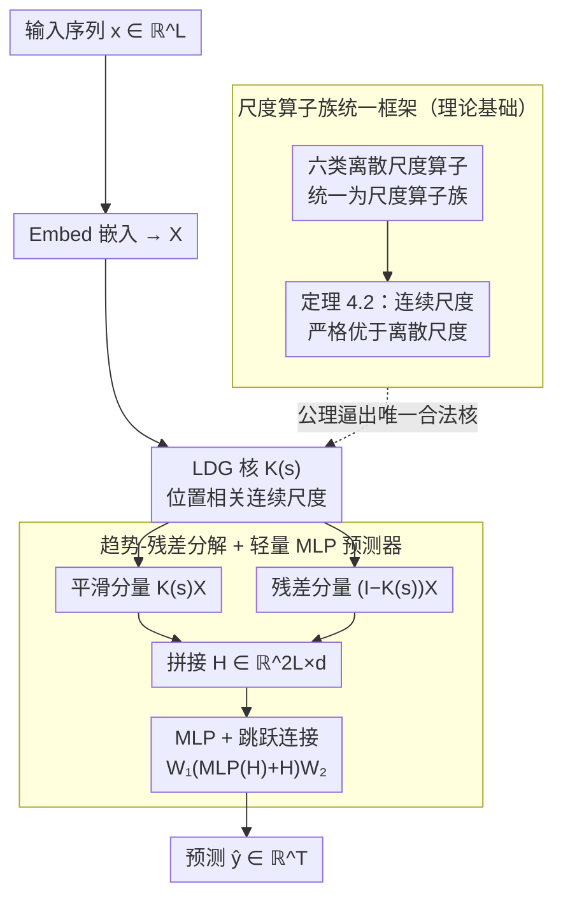

# Generalizing Multi-scale Time-Series Modeling with a Single Operator

**会议**: ICML 2026  
**arXiv**: [2605.31129](https://arxiv.org/abs/2605.31129)  
**代码**: 待确认  
**领域**: 时间序列预测 / 多尺度建模  
**关键词**: 时间序列预测, 多尺度建模, 高斯核, 尺度空间理论

## 一句话总结
Sigma 框架通过学习**离散高斯（LDG）核**实现**连续、距离感知的尺度参数**，统一了现有的离散多尺度算子——在长期和短期预测任务上达到 SOTA，同时大幅降低计算成本（训练快 5.3×、显存少 3.8×）。

## 研究背景与动机

**领域现状**：多尺度建模已被证明是时间序列预测的有效设计原则，通过在多个分辨率下捕获时间动态来改进预测性能。现有方法包括层次化分解（downsampling）、频域变换（小波分解）和尺度聚合等多样化策略。

**现有痛点**：现有多尺度方法都依赖于**固定的、离散的尺度参数**，对所有时间步统一应用——（1）真实时间序列的特征时间尺度（如主频率、衰减率）是连续变化的，而不是离散的；（2）不同时间步的最优尺度可能不同，但离散算子无法适应这种变化。

**核心矛盾**：离散尺度参数会在表示空间中引入隐式边界，使得模型无法平滑地表示跨分辨率的时间动态。通过"可预见性间隙"理论（Theorem 4.2）证明：即使是最优离散尺度也无法达到连续尺度空间中的最优性能。

**本文目标**：建立多尺度时间序列建模的数学基础，设计能够学习连续、动态尺度参数的统一框架。

**切入角度**：从尺度空间理论（scale-space theory，源自计算机视觉）出发，采用**学习离散高斯（LDG）核**作为广义尺度算子族的实例。

**核心 idea**：用单一的可学习高斯核算子代替多个离散尺度算子，通过 $L$ 个位置相关的连续尺度参数 $\mathbf{s}$ 动态控制每个时间步的平滑程度。

## 方法详解

### 整体框架
Sigma 想解决的是"多尺度建模为什么非得用一堆离散尺度算子拼"这个问题，整条路线从数学基础往下落到一个极简架构。先把平均池化、最大池化、移动平均、下采样、分割、小波分解这六类常见操作抽象成一个"尺度算子族"，用两条公理统一刻画；再把这个离散族扩展到连续版本 $\mathcal{F} = \{f(\mathbf{x} \mid \mathbf{s}) \mid \mathbf{s} \in \mathbb{R}_+^M\}$，保证一致性和可微性；最后落地成一个可学习的高斯核 + 一个带跳跃连接的 MLP，刻意避开 AMD、TimeMixer 那种多级 downsampling + 复杂跨尺度交互。运行时数据流很短：输入序列先嵌入，过 LDG 核得到平滑分量与残差分量，拼接后只用一个 MLP 输出预测；而那套尺度算子族理论并不在数据流上，它在"幕后"决定了为什么必须用 LDG 这个核。

### 关键设计

**1. 尺度算子族的统一框架：先说清楚"什么才算一个合法的尺度操作"**

多尺度方法五花八门，但谁也没讲清它们到底共享什么本质，更没人证明"离散尺度"这件事本身有没有代价。Sigma 给尺度算子族 $\mathcal{F}$ 定了两条必须满足的数学性质——非扩展性（算子不引入新信息）和能量递减性（粗尺度的能量不超过细尺度），Theorem 3.2 证明前述六类操作都满足这两条，而标量乘法、置换这类平凡操作不满足，于是"尺度操作"有了边界清晰的定义。真正关键的是 Theorem 4.2：它证明连续尺度空间的最优性总是**严格大于**离散版本，即离散尺度参数会在表示空间留下隐式边界，再怎么调也碰不到连续空间的上界——这就把后面"为什么要学连续尺度"从直觉变成了定理。

**2. 学习离散高斯（LDG）核：让每个位置自己决定该平滑多少**

承接上一点，既然离散尺度有天花板，就需要一个能表达连续、位置相关尺度的算子。Sigma 用学习离散高斯核：核矩阵第 $(i,j)$ 元素 $[\mathbf{K}(\mathbf{s})]_{i,j} = e^{-s_d} I_d(s_d)$，其中 $d = |i-j|$ 是时间距离、$I_d(\cdot)$ 是修正的第一类贝塞尔函数；尺度参数 $\mathbf{s} \in \mathbb{R}_+^L$ 是**位置相关**的，每个位置 $i$ 有自己的 $s_i$ 控制邻域聚合的强弱。这样做有效有两层保障：Theorem 4.3 保证 LDG 核族确实落在广义尺度算子族里，Theorem 4.4 更强——它是满足离散尺度空间公理的**唯一**对称核，于是用 LDG 既消除了离散算子的隐式边界，又不是随便选了个核，而是被公理逼出来的唯一选择。

**3. 趋势-残差分解 + 轻量级 MLP 预测器：把学到的尺度表示用最简单的方式榨干**

有了 LDG 表示，最后一步是怎么用它做预测——很多方法到这里又堆上多层交互模块，反而把简洁性丢了。Sigma 选择把嵌入 $\mathbf{X} = \text{Embed}(\mathbf{x})$ 拆成平滑分量 $\mathbf{K}(\mathbf{s})\mathbf{X}$ 和残差分量 $(\mathbf{I} - \mathbf{K}(\mathbf{s}))\mathbf{X}$，拼成 $\mathbf{H} \in \mathbb{R}^{2L \times d}$，再用带跳跃连接的 MLP 输出 $\hat{\mathbf{y}} = \mathbf{W}_1(\text{MLP}(\mathbf{H}) + \mathbf{H})\mathbf{W}_2$。趋势-残差的拆法呼应经典时序分解，跳跃连接稳定优化并保住尺度特定信息；相比需要多级 downsampling 的方法，这套设计把多尺度的复杂度全压进了那个可学习的核里，外面只剩一个 MLP——这也是它训练快 5.3×、显存少 3.8× 的来源。

## 实验关键数据

### 主实验：长期预测

| 数据集 | 指标 | **Sigma** | AMD | WPMixer | TimeMixer |
|--------|------|-------|-----|---------|-----------|
| Weather | MSE | 0.247 | 0.263 | 0.255 | 0.246 |
| Electricity | MSE | **0.175** | 0.208 | 0.198 | 0.185 |
| Traffic | MSE | **0.458** | 0.546 | 0.497 | 0.501 |
| Exchange | MSE | **0.353** | 0.358 | 0.387 | 0.384 |
| ETTm2 | MSE | **0.276** | 0.285 | 0.283 | 0.281 |

Sigma 在 16 个设置中赢得 13 个，高维数据集优势明显。

### 消融实验

| 配置 | MSE | MAE | 说明 |
|------|-----|-----|------|
| Sigma 完整 | **0.480** | **0.468** | 基准 |
| ① 用 TimeMixer 混合替代 MLP | 0.486 | 0.467 | +0.6% 误差 |
| ② 单一尺度参数的 LDG | 0.489 | 0.473 | +1.9% 误差，位置相关性重要 |
| ③ 样本级别的尺度参数 | 0.490 | 0.474 | +2.1% 误差，灵活性过高引入噪声 |
| ④ 无尺度算子，仅原始输入 | 0.492 | 0.475 | +2.5% 误差 |
| ⑤ 用移动平均代替 LDG | 0.493 | 0.475 | +2.7% 误差，可学习性关键 |
| ⑥ 无约束卷积（非尺度算子族） | 0.524 | 0.492 | +9.2% 误差，**最差** |

### 效率分析

| 指标 | Sigma | AMD | 提升 |
|------|-------|-----|------|
| 训练时间 | — | — | **5.3× 快** |
| 显存占用 | — | — | **3.8× 少** |

### 关键发现
- LDG 核的位置相关性、可学习性、以及作为广义尺度算子族的约束都至关重要。
- 即使替换为其他多尺度策略（变体①），MLP 的简洁性已足够有效。
- 违反尺度算子族公理的任意卷积（变体⑥）性能崩溃——证实理论基础的必要性。
- M4 短期预测：Sigma 在 15 个案例中赢得 11 个。

## 亮点与洞察
- **尺度空间理论的首次严格应用**：首次为多尺度时间序列建模建立数学基础，用"尺度算子族"概念统一六类现有方法。
- **从连续优化看多尺度建模**：核心洞察是将"最优尺度参数"从问题参数转变为**学习参数**——通过证明连续尺度空间的最优性严格优于离散，理论上解释了为什么学习 $\mathbf{s} \in \mathbb{R}_+^L$ 会更好。
- **极简而高效的架构**：Sigma 用一个 LDG 核 + 一个 MLP 就达到了 SOTA，相比动辄引入多层交互的方法更具优雅性。
- **消融揭示理论和实践的对齐**：变体⑥（无约束卷积）的大幅掉点直接验证了"尺度算子族"约束的必要性。

## 局限与展望
- 数据集级别尺度参数的限制：当训练样本不足时共享的 $\mathbf{s}$ 学习困难，导致在 M4 的"Others"类（< 5% 数据）性能平庸。
- LDG 核的计算复杂度：当前实现采用密集矩阵乘法，时间复杂度 $O(L^2)$；核矩阵是 Toeplitz 结构，理论上可用 FFT 或截断卷积降至 $O(L \log L)$。
- 多变量间交互：采用通道独立假设，可能忽略变量间的互依关系。

## 相关工作与启发
- **vs TimeMixer / AMD**：都是多尺度方法，但 TimeMixer 固定多个离散尺度，AMD 引入复杂的跨尺度混合；Sigma 通过可学习的连续参数和数学约束，用更简洁的架构获得更优性能。
- **vs 尺度空间理论（CV）**：Sigma 是对经典 Witkin、Lindeberg 尺度空间思想的首次严格应用到时间序列。
- **vs 小波分解**：Sigma 的 LDG 在理论上更具一般性（尺度算子族包含小波为一个特例），且学习能力更强。

## 评分
- 新颖性: ⭐⭐⭐⭐⭐  首次将尺度空间理论严格形式化到时间序列，统一现有方法，理论贡献显著。
- 实验充分度: ⭐⭐⭐⭐⭐  长期预测（8 数据集 × 4 预测长度）+ 短期预测（M4）+ 效率分析 + 深度消融。
- 写作质量: ⭐⭐⭐⭐⭐  逻辑链清晰（动机 → 定义 → 定理 → 设计 → 实验）。
- 价值: ⭐⭐⭐⭐⭐  刷新 SOTA 同时建立多尺度建模的数学基础，效率大幅提升使其实用性强。

<!-- RELATED:START -->

## 相关论文

- [\[AAAI 2026\] FreqCycle: A Multi-Scale Time-Frequency Analysis Method for Time Series Forecasting](../../AAAI2026/time_series/freqcycle_a_multi-scale_time-frequency_analysis_method_for_time_series_forecasti.md)
- [\[ICLR 2026\] Learning Recursive Multi-Scale Representations for Irregular Multivariate Time Series Forecasting](../../ICLR2026/time_series/learning_recursive_multi-scale_representations_for_irregular_multivariate_time_s.md)
- [\[NeurIPS 2025\] Multi-Scale Finetuning for Encoder-based Time Series Foundation Models](../../NeurIPS2025/time_series/multi-scale_finetuning_for_encoder-based_time_series_foundation_models.md)
- [\[ICML 2026\] IMPACT: Influence Modeling for Open-Set Time Series Anomaly Detection](impact_influence_modeling_for_open-set_time_series_anomaly_detection.md)
- [\[ICML 2026\] FactoryNet: A Large-Scale Dataset toward Industrial Time-Series Foundation Models](factorynet_a_large-scale_dataset_toward_industrial_time-series_foundation_models.md)

<!-- RELATED:END -->
