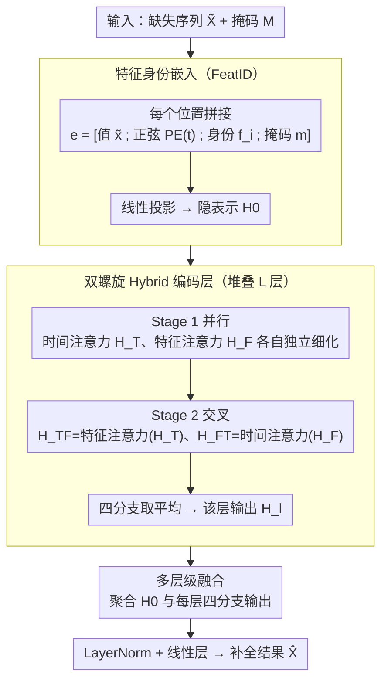

# HELIX: Hybrid Encoding with Learnable Identity and Cross-dimensional Synthesis for Time Series Imputation

**会议**: ICML 2026 Spotlight  
**arXiv**: [2605.02278](https://arxiv.org/abs/2605.02278)  
**代码**: https://github.com/milaogou/HELIX (已集成进 PyPOTS)  
**领域**: 时间序列 / 缺失值插补 / Transformer  
**关键词**: 特征身份嵌入, 时间序列插补, 时空 Transformer, 双螺旋编码

## 一句话总结
给每个特征学一个"身份嵌入"作为持久语义锚点，配合时间-特征双螺旋注意力，在 5 个公开多变量时序数据集 21 个缺失场景上全部拿下第一，比次优的 ImputeFormer 在 ETT-h1 等数据集上多 25% 以上的 MAE 降幅。

## 研究背景与动机

**领域现状**：多变量时间序列插补是医疗、气象、交通等下游任务的关键预处理，主流方法分三类：RNN 类 (BRITS, GRU-D)、Transformer 类 (SAITS, ImputeFormer)、扩散模型类 (CSDI, PriSTI)。最近 GNN 方法 (GRIN, SPIN) 也试图显式建模特征间依赖。

**现有痛点**：(1) 现有注意力方法每层都"重新发现"特征间关系，缺乏跨层一致的锚点——导致重度缺失时特征关系崩塌；(2) GNN 方法依赖预定义图拓扑，假设特征同质化（比如都是同类型空间传感器），无法处理特征类型混合的场景；(3) 学习邻接矩阵开销 $O(F^2)$ 且仍受数据缺失影响；(4) Crossformer 等双向注意力方法仅靠数值 patch 做 embedding，值全缺时跨特征注意力直接退化。

**核心矛盾**：要做"跨特征推理"，模型需要每个 token 同时具备时间和特征双重身份；但现有方案只能在一个轴上有持久锚点（要么时间 PE，要么图拓扑），另一个轴必须从数值动态推断——当数值缺失时整个推断就失效了。

**本文目标**：(1) 给每个特征一个跨层稳定的语义身份，(2) 设计时间和特征双向充分交互的编码结构，(3) 即使在重度缺失下也能保持稳定的跨特征推理。

**切入角度**：作者把 token embedding 当成 NLP 里的 soft prompt——每个特征学一个 $d_f$ 维向量 $f_i$ 当作"特征专用提示"，无论该位置数值是否缺失，特征身份信息始终存在。再设计一种"先并行后交叉"的双螺旋注意力把时间和特征维度交替处理。

**核心 idea**：把每个 $(t, i)$ 位置的 embedding 写成 $e_{t,i} = [\tilde x_{t,i}; \text{PE}(t); f_i; m_{t,i}]$，其中 $f_i$ 是可学习身份嵌入；再用 $L$ 层"双螺旋"编码（每层先并行做时间和特征注意力，再交叉做特征和时间注意力）让两个维度信息充分流转。

## 方法详解

### 整体框架
输入 $\tilde X \in \mathbb{R}^{T \times F}$ 和缺失掩码 $M$，每个位置拼出 $e_{t,i} \in \mathbb{R}^{d_e}$（值 + 正弦 PE + 身份 + mask），过线性层投影到隐维 $d$ 得到 $H^{(0)}$；接 $L$ 个 Hybrid Encoding Layer，每层输出 4 个分支 $H_T^{(l)}, H_F^{(l)}, H_{TF}^{(l)}, H_{FT}^{(l)}$ 平均得 $H^{(l)}$；最后做 multi-level fusion $\tilde H = \frac{1}{1+4L}(H^{(0)} + \sum_l \text{分支总和})$，过 LayerNorm + 线性层得 $\hat X$。

### 关键设计

**1. 特征身份嵌入（FeatID）作为跨特征注意力的软邻接先验：给每个特征发一张永不缺席的 ID 卡**

现有注意力插补方法每层都"重新发现"特征间关系、缺乏跨层一致锚点，一旦数值重度缺失，跨特征注意力就因为没东西可算而崩；GNN 方法又得靠预定义图拓扑、假设特征同质。HELIX 借 NLP soft prompt 的思路，给每个特征学一个 $d_f$ 维向量 $f_i$ 当"特征专用提示"，拼进 $e_{t,i} = [\tilde x_{t,i}; \text{PE}(t); f_i; m_{t,i}]$——无论该位置数值在不在，特征身份始终在。注意力分数 $s_{ij}^{(t)} = e_{t,i}^\top A e_{t,j}$ 可以拆成身份先验 $f_i^\top A_{ff} f_j$、身份-上下文交叉项、动态上下文 $r_{t,i}^\top A_{rr} r_{t,j}$ 三部分；当 $x_{t,i}$ 和 $x_{t,j}$ 都缺失时，动态项退化，身份先验项依然完整撑着跨特征兼容性。它既不需要图先验、也能在重度缺失下保持锚定——BeijingAir 上去掉 FeatID 后 Subseq-50% 的 MAE 从 0.166 暴涨到 0.398，足见这是命脉组件。

**2. 双螺旋 Hybrid 编码层（先并行后交叉）：让时间和特征两个维度既能独立细化、又能跨维度交换信息**

纯串行的 Time→Feature→Time 编码会把另一维度的信息压到前一阶段之后才传播，形成信息瓶颈，长缺口下尤其吃亏。HELIX 每层分两阶段：Stage 1 并行做 $H_T = \text{TimeMHA}(H^{(l-1)})$ 和 $H_F = \text{FeatMHA}(H^{(l-1)})$ 各自独立优化；Stage 2 串行交叉 $H_{TF} = \text{FeatMHA}(H_T)$、$H_{FT} = \text{TimeMHA}(H_F)$；最后四分支取平均 $H^{(l)} = \frac{1}{4}(H_T + H_F + H_{TF} + H_{FT})$，形状像 DNA 双螺旋而得名。并行 + 交叉的双向流通在长缺口下才显威力——Point-50% 上去掉 Hybrid 只掉 2%，但 Subseq-50% 上掉 77%，说明上下文严重缺失时，让两个维度充分对流是补全的关键。

**3. 多层级融合：把每一层的输出都拿出来加权平均，别让浅层细节被深层抽象冲掉**

插补要精细到 $(t,i)$ 像素级重构，但只用最后一层会丢掉浅层保留的原始信号细节。HELIX 把每层（含第 0 层 embedding）的多分支输出都聚合：$\tilde H = \frac{1}{1+4L}(H^{(0)} + \sum_{l=1}^L (H_T^{(l)} + H_F^{(l)} + H_{TF}^{(l)} + H_{FT}^{(l)}))$，故意省掉 $H^{(l)}$ 因为它本身就是四分支平均、避免重复计数。这与 ResNet"直连更好"的发现一致——浅层的原始信号对填补缺口往往比深层抽象更有用；消融显示简单平均比可学习门控还更稳。

### 损失函数 / 训练策略
沿用 SAITS 的两段损失：观测重构 $\mathcal{L}_{ORT}$ + 人工掩码插补 $\mathcal{L}_{MIT}$，两者等权重 $\mathcal{L} = \mathcal{L}_{ORT} + \mathcal{L}_{MIT}$。$d_{pe} \in [6, 24], d_f \in [6, 32], d \in [32, 576], L \in [2, 3]$。

## 实验关键数据

### 主实验（基准排名）

| 模型 | 平均 rank ↓ | 备注 |
|------|-------------|------|
| **HELIX (本文)** | **1.00** | 21/21 全部第 1 |
| ImputeFormer | 3.29 | KDD'24 SOTA |
| SAITS | 3.76 | 88M 参数 |
| StemGNN | 5.71 | GNN |
| Linear Interpolation | 6.67 | 朴素基线居然能排第 5 |
| PatchTST | 7.24 | — |

ETT-h1 上各缺失模式 MAE（5 次平均 ± 标准差）：

| 模式 | HELIX | ImputeFormer | SAITS | 朴素线性插值 |
|------|-------|--------------|-------|--------------|
| Point-10% | **0.128 ± 0.005** | 0.202 ± 0.044 | 0.150 ± 0.007 | 0.197 |
| Point-50% | **0.189 ± 0.012** | 0.296 ± 0.036 | 0.208 ± 0.009 | 0.267 |
| Block-50% | **0.372 ± 0.015** | 0.404 ± 0.021 | 0.422 ± 0.019 | 0.527 |
| Subseq-50% | **0.489 ± 0.014** | 0.520 ± 0.017 | 0.620 ± 0.016 | 0.722 |

参数量 803K，比 SAITS (88M) 小 100 倍。Wilcoxon 显著性 $p < 0.001$。

### 消融实验（BeijingAir）

| 配置 | Point-50% | Block-50% | Subseq-50% |
|------|-----------|-----------|------------|
| 完整 HELIX | **0.102 ± 0.005** | **0.131 ± 0.005** | **0.166 ± 0.009** |
| w/o Fusion | 0.104 | 0.147 | 0.173 |
| w/o Sinusoidal | 0.108 | 0.142 | 0.173 |
| w/o Hybrid | 0.104 | 0.137 | 0.294 (崩) |
| w/o FeatEmb | 0.144 | 0.223 | 0.398 (大崩) |

### 关键发现
- **FeatID 是命脉**：去掉后所有缺失模式都大幅退化，尤其 Subseq-50% 上崩到 0.398——证明持久身份锚点在长缺口下不可替代。
- **双螺旋在长缺口下才显威力**：Point-50% 上去掉 Hybrid 只掉 2%，但 Subseq-50% 上掉 77%；说明双向交叉对"上下文严重缺失"的场景最关键。
- **身份嵌入维度亚线性扩展**：PeMS 862 特征只需 $d_f = 32$（压缩 27:1），但 ETT-h1 7 特征反而要 $d_f = 12$（扩展 0.6:1）——特征数少时"内在结构"反而要靠 FeatID 补足。
- **特征注意力逐层对齐物理拓扑**：BeijingAir 上特征注意力与北京 12 个气象站的地理邻近度相关系数从 Layer 0 的 0.589 涨到 Layer 2 的 0.712，是完全无监督的空间结构发现。
- **结构利用度随相关性增强**：HELIX 相对 ImputeFormer 的提升从低相关组的 16.5% 涨到高相关组的 22.1%，证明 FeatID 真正在"利用结构"而非只是表面拟合。

## 亮点与洞察
- **"持久 token 身份"思想**：把 NLP soft prompt 思路搬到时序，给每个特征发一个永不缺席的 ID 卡，让跨特征注意力即使数据全缺仍能基于身份做兼容性推理。这个想法可以推广到任何"列稀疏"的表格 / 多模态场景。
- **三项独立证据互相印证**：消融退化 + 无监督空间结构发现 + 注意力跨层渐进对齐，三条独立证据共同支持 FeatID 的必要性，论证扎实。
- **小模型打大模型**：803K 参数干翻 88M 的 SAITS 和 109M 的 MOMENT，证明在时序里"嵌入设计"比"堆参数"更重要。
- **双螺旋的物理隐喻**：先并行后交叉的结构让人立刻想到 DNA 复制，把架构和动机绑在一起，对论文传播很有利。

## 局限与展望
- 特征身份嵌入是 per-dataset 学的，跨数据集迁移困难——例如把 BeijingAir 学到的 FeatID 迁到 PeMS 没有意义；想要做基础模型还要再想办法。
- 特征数 $F > 10^3$ 时跨特征注意力 $O(TF^2)$ 仍是瓶颈，作者也承认这个 scalability 问题。
- 重度缺失下首步对齐的可视化只在 BeijingAir 上做，泛化到其他时空数据需要更多实证。
- 没和扩散插补 (CSDI) 直接比，作者在文中给出了 BeijingAir 上单点对比 (HELIX 0.073 vs CSDI 0.102 提升 28.4%) 但不算系统对比。

## 相关工作与启发
- **vs ImputeFormer** (KDD 2024)：ImputeFormer 学静态特征嵌入但与 mask 状态无交互，HELIX 把 mask 也拼进 embedding 让身份信息和缺失状态联动。
- **vs SPIN** (NeurIPS 2022)：SPIN 用预定义图，HELIX 端到端学软邻接，无需空间先验。
- **vs SAITS** (ESWA 2023)：SAITS 是当年的 attention 插补 SOTA，HELIX 在所有 21 个设置上都优于它且参数小 100 倍。
- **vs Crossformer** (ICLR 2023)：同样做时间-特征两阶段注意力，但 Crossformer 的 token 由 patch 数值得到，HELIX 加上显式 FeatID 是关键差异。

## 评分
- 新颖性: ⭐⭐⭐⭐ "持久特征身份嵌入"是清晰的新增组件，双螺旋编码是新组合但单点没有特别创新。
- 实验充分度: ⭐⭐⭐⭐⭐ 5 数据集 × 5 缺失模式 = 21 个设置全部第一，16 个对照基线，5 种子均值方差全报告，可视化非常充分。
- 写作质量: ⭐⭐⭐⭐⭐ 故事清晰，把消融、可解释性、跨域可视化全包了，DNA 类比也增加可读性。
- 价值: ⭐⭐⭐⭐⭐ 已集成进 PyPOTS 开源工具包，可直接用；FeatID 思路对宽口多变量时序任务有广泛借鉴价值。

<!-- RELATED:START -->

## 相关论文

- [\[ICLR 2026\] T1: One-to-One Channel-Head Binding for Multivariate Time-Series Imputation](../../ICLR2026/time_series/t1_one-to-one_channel-head_binding_for_multivariate_time-series_imputation.md)
- [\[NeurIPS 2025\] Statistical Guarantees for High-Dimensional Stochastic Gradient Descent](../../NeurIPS2025/time_series/statistical_guarantees_for_high-dimensional_stochastic_gradient_descent.md)
- [\[AAAI 2026\] HydroDCM: Hydrological Domain-Conditioned Modulation for Cross-Reservoir Inflow Prediction](../../AAAI2026/time_series/hydrodcm_hydrological_domain-conditioned_modulation_for_cross-reservoir_inflow_p.md)
- [\[CVPR 2026\] SATTC: Structure-Aware Label-Free Test-Time Calibration for Cross-Subject EEG-to-Image Retrieval](../../CVPR2026/time_series/sattc_structure-aware_label-free_test-time_calibration_for_cross-subject_eeg-to-.md)
- [\[ICML 2025\] Risk and Cross Validation in Ridge Regression with Correlated Samples](../../ICML2025/time_series/risk_and_cross_validation_in_ridge_regression_with_correlated_samples.md)

<!-- RELATED:END -->
