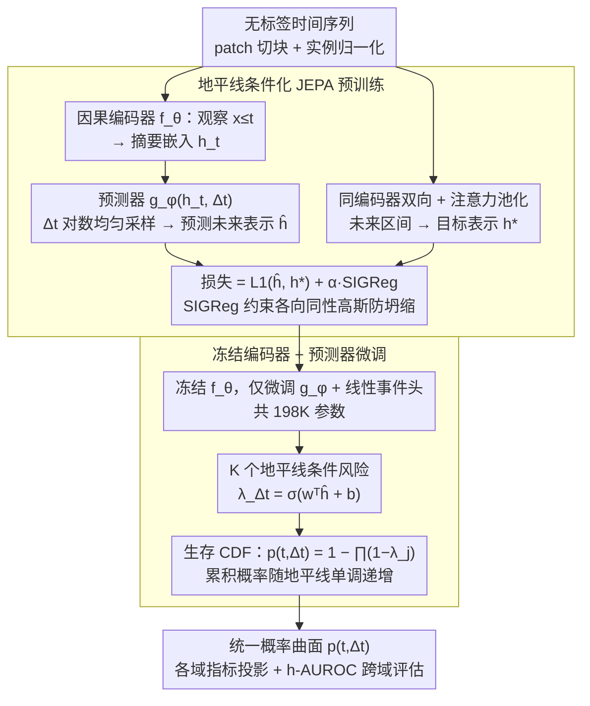

# HEPA: A Self-Supervised Horizon-Conditioned Event Predictive Architecture for Time Series

**会议**: ICML 2026 Spotlight  
**arXiv**: [2605.11130](https://arxiv.org/abs/2605.11130)  
**代码**: 待确认  
**领域**: 时间序列 / 自监督学习 / 事件预测  
**关键词**: 事件预测, JEPA, 自监督预训练, 标签效率, 生存分析

## 一句话总结
HEPA 通过**地平线条件化的 JEPA 自监督预训练**学习时间序列中的可预测动态——冻结编码器只微调预测器，用单一架构和固定超参在 11 个领域 14 个基准上超越多个 SOTA 方法，仅用 2% 标签数据即可达到 92% 性能。

## 研究背景与动机

**领域现状**：涡轮机故障预测、心律不齐检测、异常检测、RUL（剩余寿命）预测这些事件预测任务分散在不同社区，各用各的基准、指标和模型架构。虽然这些任务从结构上看都是同一问题——"给定时刻 $t$ 的观察，估计 $P(\text{事件发生在} \Delta t \text{内})$"——但方法论碎片化严重。

**现有痛点**：
- 值预测方法（无论是监督还是预训练）将编码器塑造成所有信号变化的捕捉器，包括与下游事件无关的噪声。
- 现有自监督方法用 JEPA 做分类需要标签，做异常检测只针对特定任务调优。
- 单个架构无法跨领域通用，每个应用需要域特定的参数调整。

**核心矛盾**：如何让编码器学到"可预测的"时间动态（而非所有变化），同时用最少的标签完成下游事件预测任务？

**本文目标**：构建一个统一架构和固定超参的通用事件预测系统，能跨多个领域处理不同类型的事件（从机械磨损到心脏异常）。

**切入角度**：与其让编码器预测未来数值（包含噪声），不如让它预测未来表示（只保留可预测部分）——这正是 JEPA 的核心思想。

**核心 idea**：（1）用 horizon-conditioned JEPA 预训练编码器，强制它在多个时间尺度学习动态；（2）冻结编码器，只微调预测器和事件头，用生存 CDF 输出单调递增的事件概率曲面。

## 方法详解

### 整体框架
HEPA 想把涡轮故障、心律不齐、异常检测、RUL 这些散落各社区、但结构上都是"估计事件在 $\Delta t$ 内发生概率"的任务，用一套架构 + 一套固定超参吃下来。它分两阶段：预训练阶段让因果 Transformer 编码器从无标签数据里学时间动态，预测器学在给定地平线 $\Delta t$ 下预测未来**表示**（而非未来数值，从而只保留可预测部分、滤掉噪声）；下游微调阶段冻结编码器，只调预测器和一个轻量事件头，输出离散时间生存 CDF——这个 CDF 天然保证事件概率随 $\Delta t$ 单调递增；最后所有领域的指标都从同一张概率曲面投影出来，用 h-AUROC 做跨域统一度量。

### 关键设计

**1. 地平线条件化 JEPA 预训练：让编码器学"可预测的动态"，而不是所有变化**

值预测（无论监督还是预训练）会逼编码器去捕捉所有信号变化，包括跟下游事件无关的噪声，学出来的表示又杂又不聚焦。HEPA 改成预测未来表示：因果编码器 $f_\theta$ 把观察 $\mathbf{x}_{\leq t}$ 映成摘要嵌入 $\mathbf{h}_t$，预测器 $g_\phi$ 接 $\mathbf{h}_t$ 和地平线 $\Delta t$ 预测未来区间表示 $\hat{\mathbf{h}}_{(t,t+\Delta t]}$，目标表示 $\mathbf{h}^*_{(t,t+\Delta t]}$ 由双向编码器 + 注意力池化得到。训练时 $\Delta t$ 从对数均匀分布 $[1,\Delta t_{\max}]$ 采样，强迫编码器在多个时间尺度上理解动态。损失 $\mathcal{L} = (1-\alpha)\|\hat{\mathbf{h}} - \mathbf{h}^*\|_1 + \alpha\mathcal{L}_{\text{SIG}}$，其中 SIGReg 把预测表示约束向同向高斯分布、替代标准 JEPA 的 EMA 动量来防坍缩。这套组合的好处是：地平线条件化逼出对长期依赖的理解，SIGReg 比 EMA 更稳超参更少，L1 又比 L2 抗离群。

**2. 冻结编码器 + 预测器微调：用 198K 参数留住预训练知识，还比线性探针更能表达**

下游事件预测如果端到端微调，2.16M 参数容易过拟合、还会灾难性遗忘掉 JEPA 学到的东西；但纯线性探针又表达力不够、丢掉了地平线条件表示能力。HEPA 取中间——冻结编码器，只联合微调预测器 + 线性事件头（共 198K 参数）。对 $K$ 个离散地平线 $\Delta t = 1,\dots,K$，预测器输出每段的条件风险 $\lambda_{\Delta t}(t) = \sigma(\mathbf{w}^\top\hat{\mathbf{h}}_{(t,t+\Delta t]} + b)$，离散时间生存 CDF $p(t,\Delta t) = 1 - \prod_{j=1}^{\Delta t}(1-\lambda_j(t))$ 保证单调，微调损失 $\mathcal{L}_{\text{FT}} = \sum_{\Delta t=1}^K w^+\text{BCE}(p(t,\Delta t),y(t,\Delta t))$ 用 $w^+ = N_{\text{neg}}/N_{\text{pos}}$ 补类不平衡。生存 CDF 的连乘形式还顺手解决了"长地平线下事件概率反复横跳"的内部矛盾——累积概率只能单调升。

**3. 统一的概率曲面 + h-AUROC 评估：用一张曲面投影出所有领域的指标**

11 个领域各有各的度量（RUL 用 RMSE、异常检测用 PA-F1），如果每个领域单独建模就回到了碎片化老路。HEPA 让模型为每个观测时刻 $t$ 和地平线 $\Delta t$ 输出一个概率，构成统一的概率曲面 $p(t,\Delta t)$；所有领域特定度量都从这张曲面投影得到，跨域统一度量则用 h-AUROC（各地平线 AUROC 的平均）。正因为输出被收敛成一张曲面，14 个数据集、11 个领域才能共用同一个模型和同一套超参，而曲面表示又保留了完整的预测信息不被某个指标压扁。

## 实验关键数据

### 主实验

| 数据集 | 领域 | h-AUROC (HEPA) | h-AUROC (PatchTST) | h-AUROC (iTransformer) | 领先? |
|--------|------|-----------------|-------------------|----------------------|--------|
| C-MAPSS-1 | 涡轮 | **0.81 ± 0.03** | 0.80 | 0.70 | ✓ |
| C-MAPSS-3 | 涡轮 | **0.84 ± 0.01** | 0.79 | 0.76 | ✓ |
| TEP | 化工 | **1.00** | 0.99 | 0.93 | ✓ |
| Weather | 气候 | **0.89** | 0.88 | 0.83 | ✓ |
| GECCO | 水质 | **0.88** | 0.65 | 0.64 | ✓ |
| MBA | 心脏 | 0.75 | 0.68 | **0.84** | ✗ |

14 个基准中 HEPA 在 10 个上领先；仅调优 198K 参数（PatchTST 的 11 倍少）。

### 消融与标签效率

| 配置 | C-MAPSS-1 h-AUROC | C-MAPSS-3 h-AUROC | 说明 |
|------|------------------|------------------|------|
| 完整模型（100% 标签） | 0.786 | 0.853 | 完整 HEPA |
| 10% 标签 | 0.772 | 0.830 | 保留 98% / 97% 性能 |
| 5% 标签 | 0.730 | 0.709 | 保留 93% / 83% 性能 |
| **2% 标签（2-5 个引擎）** | **0.724** | **0.635** | **保留 92% / 74% 性能** |
| 1% 标签 | 0.670 | 0.513 | 性能下降明显 |

### 理论支撑（Proposition 1：事件信息保留界）
$I(H_t; E_{t + \Delta t}) \geq I(H^*; E_{t + \Delta t}) - C_\eta L^2 \varepsilon$，$C_\eta = (2 \underline{\eta} (1 - \overline{\eta}))^{-1}$。预训练损失越小，下游 h-AUROC 越高（实验在 C-MAPSS-1/3、MBA 三个不同领域验证，Spearman $\rho = -0.67/-0.64/-0.49$, p < 0.05）。

### 关键发现
- 在有延长前兆的生命周期数据集上，HEPA 以极少标签保持高性能——C-MAPSS-1 仅用 2% 标签（2 台引擎）就达 92% 满标签性能。
- 这验证了 Proposition 1 的理论预测：低预训练损失 $\varepsilon$ 与高下游性能正相关。

## 亮点与洞察
- **地平线条件化的创新应用**：标准 JEPA 用于图像时不区分时间尺度，HEPA 通过对数均匀采样 $\Delta t$ 强制编码器学习多尺度动态——在需要从长期漂移信号中预测稀有事件的应用中特别有效。
- **预测器微调 vs 线性探针的表达能力权衡**：线性探针只用 198 参数但丧失地平线条件表示能力，端到端需调优 2.16M 参数；预测器微调巧妙地用 MLP 重塑地平线条件化输出，用 1/11 参数达到等效性能。
- **生存 CDF 的单调约束设计**：通过将离散风险 $\lambda_j$ 组合为生存函数 $\prod_j (1 - \lambda_j)$，确保累积事件概率随地平线严格单调递增——避免模型的内部矛盾。
- **跨域通用性与领域特定指标的统一**：同一模型在涡轮、心脏、异常等完全不同的领域达到竞争或超越的性能，体现了设计的稳健性。

## 局限与展望
- 传感器本地化事件的劣势：在 MBA（心律不齐）和 BATADAL（网络攻击）上低于 iTransformer 和 PatchTST，因为这类事件信息浓缩在少数传感器通道而 HEPA 的 patch tokenization 稀释了相关信息。
- 短窗口异常数据集的性能不稳定：在 GECCO 等短异常窗口数据集上标签效率优势消失。
- 预训练损失与下游性能的跨域失效：单数据集内验证了理论界，跨数据集的预训练损失与 h-AUROC 无相关（r = -0.05），因为 Lipschitz 常数等在数据集间变化剧烈。

## 相关工作与启发
- **vs TS2Vec / TNC / TimesURL**：对比学习方法通过正负样本对学习，对噪声敏感；HEPA 的 JEPA 直接预测表示避免了对比对的构造复杂性。
- **vs PatchTST / SimMTM**：值预测和掩码重构方法学全信号变化包括对下游任务无关的噪声；HEPA 只学可预测动态更高效。
- **vs Chronos-2 / MOMENT**：大规模预训练基础模型通过广阔外部语料获得通用性；HEPA 每数据集预训练（< 1 分钟）虽不跨域共享权重，但得益于固定的通用微调食谱，实现了实际可部署性。
- **vs MTS-JEPA / TS-JEPA**：MTS-JEPA 针对异常检测添加码本正则化；HEPA 用 SIGReg 替代 EMA，避免了超参调优；在 9 个重现数据集上 HEPA 赢 8 个。

## 评分
- 新颖性: ⭐⭐⭐⭐⭐  Horizon-conditioned JEPA + 预测器微调的组合应用于时间序列事件预测；理论界 Proposition 1 验证了设计原理。
- 实验充分度: ⭐⭐⭐⭐⭐  14 个基准 + 11 个领域 + 5 个 baseline + 消融表 + 理论验证 + 标签效率曲线 + 表示可视化。
- 写作质量: ⭐⭐⭐⭐⭐  论文结构清晰，Method 段既有形式化表述又有直观解释。
- 价值: ⭐⭐⭐⭐⭐  统一框架、极少参数调优、高标签效率使其有实际工业部署价值；理论与实验结合验证了何时该方法有效及失效，提供了设计者的实用指导。

<!-- RELATED:START -->

## 相关论文

- [\[NeurIPS 2025\] Towards Self-Supervised Foundation Models for Critical Care Time Series](../../NeurIPS2025/time_series/towards_self-supervised_foundation_models_for_critical_care_time_series.md)
- [\[AAAI 2026\] Detecting the Future: All-at-Once Event Sequence Forecasting with Horizon Matching](../../AAAI2026/time_series/detecting_the_future_all-at-once_event_sequence_forecasting_with_horizon_matchin.md)
- [\[NeurIPS 2025\] Universal Spectral Tokenization via Self-Supervised Panchromatic Representation Learning](../../NeurIPS2025/time_series/universal_spectral_tokenization_via_self-supervised_panchromatic_representation_.md)
- [\[ECCV 2024\] OmniSat: Self-Supervised Modality Fusion for Earth Observation](../../ECCV2024/time_series/omnisat_self-supervised_modality_fusion_for_earth_observation.md)
- [\[ICML 2025\] TimePoint: Accelerated Time Series Alignment via Self-Supervised Keypoint and Descriptor Learning](../../ICML2025/time_series/timepoint_accelerated_time_series_alignment_via_self-supervised_keypoint_and_des.md)

<!-- RELATED:END -->
