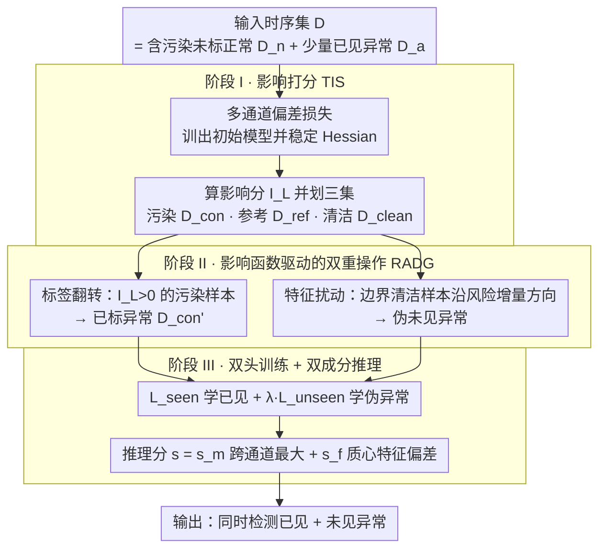

# IMPACT: Influence Modeling for Open-Set Time Series Anomaly Detection

**会议**: ICML 2026  
**arXiv**: [2603.29183](https://arxiv.org/abs/2603.29183)  
**代码**: https://github.com/mala-lab/IMPACT  
**领域**: 时序异常检测 / 开放集异常检测  
**关键词**: 影响函数、伪异常生成、标签翻转、污染纠正、开放集时序检测  

## 一句话总结
IMPACT 把"影响函数"同时拿来当探照灯和手术刀——先用一个多通道偏差损失训出初始模型并算出每个训练样本对验证风险的影响分数，再在风险下降的理论保证下，把高影响的污染未标样本一键翻成有标异常、把对风险贡献最小的"边界正常样本"沿梯度方向扰动成"未见过的伪异常"，最后用双头网络分别学已见与未见两类异常，在 8 个真实时序基准上稳定超越十多个无监督与开放集基线。

## 研究背景与动机

**领域现状**：时序异常检测（TSAD）长期以无监督为主——重构、单类 SVM、自监督预测、扩散模型等，假设训练集纯正常。近年开放集异常检测（OSAD）开始流行：允许少量带标的已见异常类，期望同时识别"已见 + 未见"两类异常。代表方法 DRA、AHL、DPDL、MOSAD、InvAD 等。

**现有痛点**：OSAD 在图像上还算 work，但搬到时序就两头碰壁。一是污染：未标训练子集里几乎一定混杂着未知异常（contamination），现有方法把它们整体当正常喂进去，监督信号被污染；二是伪异常生成：图像里常用的旋转、Cutout、CutPaste、Mixup 都打破时序的序贯性——把 ECG 片段水平翻转直接违反心电生理，把短窗滑动平均也消不掉长周期季节性。结果是决策边界被两类噪声同时拉偏。

**核心矛盾**：要在不知道哪些未标样本是污染、也不知道未见异常长什么样的前提下，同时完成"清洗训练集"与"生成代表性伪异常"两件事，并且要可证明这两步都让测试风险下降，而不是引入新的偏差。

**本文目标**：分解为三个子问题——(i) 设计一个既适合多通道时序、又能 hook 进影响函数的损失；(ii) 用影响分数自动找出污染样本与"风险贡献最低的边界正常样本"；(iii) 给"翻标签"和"沿影响方向扰动特征"两类操作都证明能降低测试风险。

**切入角度**：作者重新审视 Koh & Liang 的影响函数 $\mathcal{I}_L(\bm z_i,\bm z_t)=-\nabla_\theta L(\bm z_t,\hat\theta)^\top H_{\hat\theta}^{-1}\nabla_\theta L(\bm z_i,\hat\theta)$——它不仅能告诉你"这个样本对预测的边际贡献"，还能用作两种修改操作的方向盘：标签翻转（$\bm z_i\mapsto\bm z_{i\mathbf 1}$）和特征扰动（$\bm w_i\mapsto\bm w_i+\zeta_i$）的风险变化都能用它的二阶导封闭表达。

**核心 idea**：用影响函数同时驱动"污染纠正"和"伪异常生成"——前者把 $\mathcal{I}_L(\bm z_i)>0$ 的样本翻成异常，后者把 $\mathcal{I}_L(\bm z_i)<0$ 中绝对值最小的边界样本沿 $\nabla_\varphi\nabla_{\theta_h}L$ 方向扰动产生未见异常，统一在一个风险降低框架里。

## 方法详解

IMPACT 流水线有三阶段：阶段 I（影响打分模块 TIS）用多通道偏差损失训初始模型并算每个训练样本的影响分数，划出污染集 $\mathcal{D}_{con}$、参考正常集 $\mathcal{D}_{ref}$、剩余清洁集 $\mathcal{D}_{clean}$；阶段 II（纠正—生成模块 RADG）在影响分数指引下做"标签翻转 + 特征扰动"，构造翻标后的 $\mathcal{D}_{con}'$ 与扰动特征集 $\mathcal{W}_{per}'$；阶段 III 增加未见异常学习头，用 $L_{seen}+\lambda L_{unseen}$ 联合训练；推理时取最大跨通道异常分加上对参考正常质心的特征偏差作为最终分数。

### 整体框架
输入时序集合 $\mathcal{D}=\mathcal{D}_n\cup\mathcal{D}_a$，每个样本 $\bm x_i\in\mathbb{R}^{D\times L}$（$D$ 通道、$L$ 步长）。模型分两段：特征抽取器 $\bm\varphi_i=\phi(\bm x_i,\theta_\phi)$（多变量时序编码器）+ 异常分头 $h(\bm\varphi_i,\theta_h)\in\mathbb{R}^r$（输出 $r$ 通道异常分）。训练目标先用多通道偏差损失，然后引入影响函数二次选样，最后并接一个未见异常头 $h'(\cdot,\theta_{h'})$。

### 关键设计

**1. 多通道偏差损失：既扩大表达力，又给影响函数一个稳定可逆的梯度结构**

影响函数要求损失对参数二阶可微、Hessian 可逆，可传统 deviation loss 是单通道、丢方差信息，直接拿来算 $H_{\hat\theta}^{-1}\nabla_\theta L$ 不稳。IMPACT 把它做成多通道——让正常样本的 $r$ 通道异常分都对齐各向同性高斯先验 $\mathcal{N}(\bm\mu,\bm\Sigma)$ 的均值 $\bm\mu_r$、异常样本至少推开 $a$，用马氏距离 $\mathit{dev}(\bm x_i) = \sqrt{(f(\bm x_i,\theta)-\bm\mu_r)^\top\bm\Sigma_r^{-1}(f(\bm x_i,\theta)-\bm\mu_r)}$ 度量偏差，损失写成 $L(\bm z_i,\theta) = \tfrac{1}{r}\sum_{j=1}^r[(1-y_i)\mathit{dev}(\bm x_i)_j + y_i\max(0,a-\mathit{dev}(\bm x_i)_j)]$。多通道相当于从多个角度评估异常：正常样本要所有角度都对齐先验，异常样本只要任一角度偏离超 $a$ 就算数。Theorem 1 进一步证明这等价于最小化潜变量分布的熵 $\mathcal{H}(S) = \tfrac{r}{2}(1+\log(2\pi\sigma^2))\propto\log\sigma^2$——于是"压紧正常 + 推开异常"的几何直觉有了信息论依据，单通道版本则在消融里数值更不稳，证明多通道是影响函数能稳的前提。

**2. 影响函数驱动的双重操作：用同一组影响分数，既清洗污染又生成未见异常**

OSAD 搬到时序两头碰壁：未标子集几乎一定混着未知污染、图像那套手工增强（旋转、Cutout、Mixup）又会破坏时序的序贯性。IMPACT 重新审视 Koh & Liang 的影响函数 $\mathcal{I}_L(\bm z_i,\bm z_t) = -\nabla_\theta L(\bm z_t,\hat\theta)^\top H_{\hat\theta}^{-1}\nabla_\theta L(\bm z_i,\hat\theta)$，把它当成两种修改操作的方向盘。一边是**标签翻转**：对污染集 $\mathcal{D}_{con} = \{\bm z_i\in\mathcal{D}_n\mid\mathcal{I}_L(\bm z_i)>0\}$，作者证明 $\nabla_\theta L(\bm z_{i\mathbf 1},\theta)-\nabla_\theta L(\bm z_i,\theta) = -2\nabla_\theta L(\bm z_i,\theta)$，于是翻标影响 $\mathcal{I}_{L\mathbf 1}(\bm z_i,\bm z_t) = -2\mathcal{I}_L(\bm z_i,\bm z_t)$，Theorem 2 给出风险变化 $\approx -\tfrac{2}{N\cdot|\mathcal{D}_{con}|}\sum_{\bm z_i\in\mathcal{D}_{con}}\mathcal{I}_L(\bm z_i)<0$——翻标必然降风险。另一边是**特征扰动**：对清洁集里"绝对值最小"的边界样本 $\mathcal{D}_{per} = \{\bm z_i\in(\mathcal{D}_n\cap\mathcal{D}_{clean})\mid\mathcal{I}_L(\bm z_i)<0\}$，沿方向 $\mathcal{I}_{per}(\bm w_i) = -\nabla_{\theta_h}L(\mathcal{V},\hat\theta_h)^\top H_{\hat\theta_h}^{-1}[\nabla_\varphi\nabla_{\theta_h}L(\bm w_i,\hat\theta_h)]$ 扰动成 $\bm\varphi_{i\zeta_i} = \bm\varphi_i + \alpha\mathcal{I}_{per}(\bm w_i)^\top$，Theorem 3/4 证明扰动特征落在与原分布有正下界距离的新分布上、且风险变化 $\approx -\tfrac{\alpha}{N\cdot|\mathcal{W}_{per}|}\sum\|\mathcal{I}_{per}(\bm w_i)\|_2^2<0$。这一来一回相当于双倍收益——污染样本不再是被删掉浪费，而是翻成宝贵的已标异常；伪异常也不靠手工增强，而是直接在特征空间沿"风险增量方向"走，既保证未见性又保证有用性。

**3. 双头训练 + 双成分推理：用独立的未见头学伪异常，推理时融合两路异常分**

如果让伪异常梯度回流污染主干表征，已见类反而会受伤。IMPACT 用 $L_{re} = L_{seen} + \lambda L_{unseen}$ 分开学：$L_{seen}$ 覆盖原标签 + 翻标后异常 + 清洁正常（$\mathcal{D}_s = \mathcal{D}_{con}'\cup\mathcal{D}_{ref}\cup\mathcal{D}_{clean}$），$L_{unseen}$ 把扰动特征喂给独立的未见头 $h'$。推理时分两路相加 $s = s_m + s_f$：$s_m = \max_{l<r}(h(\bm\varphi_i,\theta_h)+h'(\bm\varphi_i,\theta_{h'}))_l$ 取跨通道最大（呼应"多角度评估"——任一通道亮灯就算异常），$s_f = \|\bm\varphi_i - \tfrac{1}{|\mathcal{D}_{ref}|}\sum_{\bm x_j\in\mathcal{D}_{ref}}\bm\varphi_j\|^2$ 是对参考正常质心的特征偏差兜底——当 $h,h'$ 对极轻微的分布漂移不敏感时，质心距离仍能把异常分拉开。

### 损失函数 / 训练策略
两阶段训练：先用 $\mathcal{D}$ 全集训初始模型 $\hat\theta$，再用 LiSSA 类近似求 Hessian 逆，算 $\mathcal{I}_L(\bm z_i)$ 划集合；最后用 $L_{re}$ 重训。$\alpha$ 控制特征扰动强度，$\lambda$ 平衡两损失，$k$ 控制翻标与生成样本数量。所有定理只要求损失对参数二阶可微 + Hessian 在 $\hat\theta$ 邻域可逆，标准多通道偏差损失均满足。

## 实验关键数据

### 主实验
在 8 个真实时序基准（UCR / ASD / PSM / SMD / CT / SAD / PTBXL / TUSZ，覆盖时间序列异常、机器多变量监测、心电图、脑电图等）上对比 7 个无监督方法（TCN-AE、THOC、TranAD、DCdetector、GPT4TS、COUTA、DADA）和多个开放集方法（DevNet、DRA、AHL、DPDL、MOSAD、InvAD、WSAD-DT 等），评测 AUC（%）± 标准差。

| 设置 / 数据集 | 本文 IMPACT | 之前最强基线 | 提升趋势 |
|--------|------|----------|------|
| 开放集平均 AUC（8 个数据集） | 显著最高 | DRA / AHL / DPDL 等 | 一致超越，多数据集为最优 |
| 无监督代表对比 (UCR / TUSZ) | — | GPT4TS 54.60 / 66.31 | 表明无监督上限低，验证开放集必要性 |
| 不同污染率 (0%–10%) | 最稳健 | 大多数基线随污染率上升急剧下降 | IMPACT 几乎平坦 |
| 不同已见异常类比例 | 最稳健 | 基线对已见类比例敏感 | 验证未见异常头有效 |

> 注：原文 Table 1 中最优加粗、次优下划线，IMPACT 在多数列拿到加粗或下划线。

### 消融实验
| 配置 | 关键指标变化 | 说明 |
|------|---------|------|
| Full IMPACT | 基准 AUC | TIS + RADG + 双头 |
| w/o 标签翻转（保留污染样本） | 下降，污染率越高掉得越多 | 验证定理 2 的纠正收益 |
| w/o 特征扰动（无未见样本） | 在未见异常类上明显下降 | 验证定理 4 的生成收益 |
| 用 CutAddPaste / COE 等手工增强替代扰动 | 下降 | 启发式增强不如影响函数引导 |
| 单通道偏差损失 ($r=1$) | 下降，且 Hessian 数值更不稳 | 多通道是影响函数稳定的前提 |
| w/o 未见异常头 $h'$（共用 $h$） | 下降，已见类轻微伤害 | 解耦学习头避免伪样本污染主干 |
| w/o 特征偏差分 $s_f$（仅 $s_m$） | 在细微异常数据集下降 | 兜底分项必要 |

### 关键发现
- 翻标签 + 特征扰动是真正的"1+1>2"——单独任一项都已显著超越基线，但合起来才接近论文最终数字，验证两个组件解决的是正交问题（监督污染 vs 表达力不足）。
- 在污染率从 0% 一路加到 10% 的鲁棒性测试中，几乎所有基线（包括强 OSAD 方法）AUC 单调下滑，而 IMPACT 几乎平坦——这正是定理 2 在实际数据上的兑现。
- 已见异常类比例从 25% 一路降到 0%（接近完全未见）时，IMPACT 下降斜率最小，说明未见异常头确实学到了与已见类正交的边界。
- 特征扰动强度 $\alpha$ 太小退化为无效增强、太大让伪样本飘出流形被忽略；论文取适中值，敏感性曲线呈倒 U 形。

## 亮点与洞察
- 把"影响函数"从"事后诊断工具"升级为"训练时的方向盘"——同一组 $\mathcal{I}_L$ 既驱动标签翻转又驱动特征扰动，二阶信息被用得淋漓尽致，这是影响函数在自监督/弱监督场景里少见的双重利用。
- 翻标签 = 把负面信号变成监督信号，本质上是用统计影响替代主动学习的人工查询；这一思路可迁移到任何"未标集合包含少量目标类"的弱监督任务（如开放集 OOD、PU 学习）。
- 沿 $\mathcal{I}_{per}(\bm w_i)$ 方向扰动是把对抗扰动思想反过来用：对抗样本朝"误分类方向"走，而 IMPACT 朝"风险增量方向"走以模拟未知分布——可证明地走到了已知分布之外又不至于完全脱离流形。
- 多通道偏差损失 + 各向同性高斯先验 + 熵最小化的三重等价非常优雅，把几何（推向中心）、统计（最小熵）、信息论（最低不确定性）三套语言统一在一个 loss 上。

## 局限与展望
- 求 Hessian 逆 + LiSSA 近似在大规模时序集合上仍较重，论文未给百万级长序列的运行时间；可探索 K-FAC / Arnoldi 等更省内存的二阶近似。
- 影响函数本身对模型在 $\hat\theta$ 附近凸性的隐含假设，在深度 Transformer 主干上可能误差较大；论文未讨论这一估计误差对翻标决策的影响。
- 阈值 $\mathcal{I}_L(\bm z_i)>0$ 把"污染"判定卡得很硬，对接近 0 的边界样本容易抖动；可引入软翻标（按 $|\mathcal{I}_L|$ 加权）替代硬阈值。
- 仅在时序分类/段级异常上验证，对长时点级异常或流式在线场景需要重新设计参考集 $\mathcal{V}$ 更新策略。

## 相关工作与启发
- **vs DRA / AHL / DPDL（OSAD）**：他们也用 limited 标记 + 伪异常，但伪异常靠手工增强；IMPACT 把伪异常生成升级为可证明的影响函数引导，并额外做污染纠正，所以在时序上跨步式领先。
- **vs CutAddPaste / DADA / COE（时序数据增强）**：他们设计五花八门的时序变换，本质仍是启发式；IMPACT 直接在特征空间沿风险方向扰动，绕开"如何在原始时序保留语义"的难题。
- **vs GammaGMM / ExCeeD（污染估计）**：他们只在推理时估计污染率或校正分数，不改训练集；IMPACT 在训练阶段就翻标签，直接消除污染源头。
- **vs Koh & Liang 2017（影响函数原作）**：原作用影响函数做数据估值/解释，IMPACT 把它用作训练时的两类闭式操作，并都给出风险下降证明——把工具升级为学习目标。

## 评分
- 新颖性: ⭐⭐⭐⭐⭐ 第一个用影响函数同时驱动污染纠正与伪异常生成的 OSAD 框架，四个定理把训练动作全部理论化。
- 实验充分度: ⭐⭐⭐⭐ 8 个真实数据集 + 多基线 + 污染率/已见比/超参敏感性消融，缺一个真正大规模长序列的 runtime 对比。
- 写作质量: ⭐⭐⭐⭐ 动机—理论—算法—实验闭环完整，每个定理对应一段实验验证；公式略密集但符号一致。
- 价值: ⭐⭐⭐⭐⭐ 给开放集时序检测提供了一个理论扎实、工程可复现（已开源）的新基线，影响函数 + 风险下降的范式可外推到 PU/弱监督等任务。

<!-- RELATED:START -->

## 相关论文

- [\[ICML 2026\] AnomSeer: Reinforcing Multimodal LLMs to Reason for Time-Series Anomaly Detection](anomseer_reinforcing_multimodal_llms_to_reason_for_time-series_anomaly_detection.md)
- [\[ICML 2026\] Generalizing Multi-scale Time-Series Modeling with a Single Operator](generalizing_multi-scale_time-series_modeling_with_a_single_operator.md)
- [\[ACL 2026\] Time-RA: Towards Time Series Reasoning for Anomaly Diagnosis with LLM Feedback](../../ACL2026/time_series/time-ra_towards_time_series_reasoning_for_anomaly_diagnosis_with_llm_feedback.md)
- [\[NeurIPS 2025\] Channel Matters: Estimating Channel Influence for Multivariate Time Series](../../NeurIPS2025/time_series/channel_matters_estimating_channel_influence_for_multivariate_time_series.md)
- [\[ICML 2026\] QuITE: Query-based Irregular Time Series Embedding](quite_query-based_irregular_time_series_embedding.md)

<!-- RELATED:END -->
