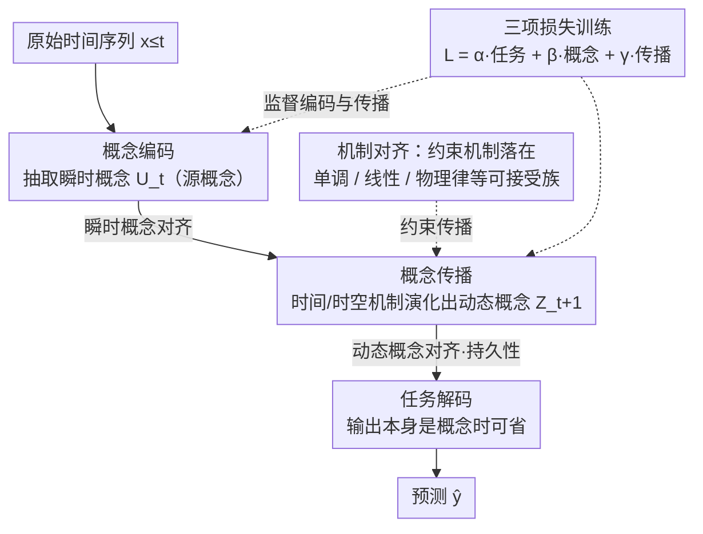

# Interpretability in Deep Time Series Models Demands Semantic Alignment

**会议**: ICML 2026  
**arXiv**: [2602.02239](https://arxiv.org/abs/2602.02239)  
**代码**: 待确认  
**领域**: 时间序列 / 可解释性  
**关键词**: 语义对齐, 可解释性, 时间序列, 概念瓶颈, 神经符号

## 一句话总结
本文是一篇**位置论文**——提出深度时间序列模型应该强制**语义对齐**：让模型的内部变量和机制对应领域专家的推理方式而非仅解释内部计算；核心创新是针对时间演化定义了语义对齐的持久性约束（这是时间序列特有问题）。

## 研究背景与动机

**领域现状**：深度学习在时间序列预测中效果显著，但模型黑箱特性限制了在金融、医疗等高风险领域的应用。现有可解释性方法（注意力机制、事后解释、机制可解释性）都试图解释模型内部计算。

**现有痛点**：这些方法只解决了**结构不透明性**（如何理解内部计算），但没有解决**语义不透明性**。例如医生无法理解"时步 47 的隐变量激活"的含义，因为这无法对应到他所理解的医学概念（如"心动过速发作"）。

**核心矛盾**：即使模型预测准确，用户也无法有意义地验证、调试或干预模型行为——因为模型操作的概念层次与用户的推理层次不匹配。

**本文目标**：（1）形式化定义时间序列中的语义对齐；（2）提供可解释时间序列模型的设计蓝图；（3）讨论支撑可信性的性质和新设计机遇。

**切入角度**：受 CV 中概念瓶颈模型（CBM）启发，但现有 CBM 方法不适用于时间序列（缺乏对时间演化的语义对齐保证）。

**核心 idea**：扩展概念瓶颈模型到时间域，通过将模型分解为【概念编码 → 概念传播 → 任务解码】，并约束传播机制满足领域知识约束。

## 方法详解

### 整体框架
本文考虑的所有时间序列模型都可归到同一个**编码-传播-解码**（Enc-Prop-Dec）模板：
$$\mathbf{u}_t = \text{Enc}(\mathbf{x}_{\leq t}), \quad \mathbf{z}_{t+1} = \text{Prop}(\mathbf{z}_{\leq t}, \mathbf{u}_t), \quad \hat{\mathbf{y}} = \text{Dec}(\mathbf{z}_{t+1})$$
其中 $\mathbf{u}_t$ 是编码器产生的瞬时表示、$\mathbf{z}_t$ 是传播层产生的动态表示——但在普通深度模型里这两者都是语义不透明的隐变量。本文的逻辑是：先把「什么叫语义对齐」形式化清楚（区分结构/语义不透明、定义概念与机制、给出瞬时与动态两类概念对齐、以及机制对齐约束），再据此给出一张可操作的**设计蓝图**——蓝图沿用同一套 Enc-Prop-Dec 骨架，但强制让 $\mathbf{u}_t$ 对应瞬时概念、$\mathbf{z}_{t+1}$ 对应动态概念，在编码处施加瞬时概念对齐、在传播处施加动态概念对齐（持久性）与机制约束，并用三项损失（任务 + 概念 + 传播）把对齐训出来。下图把蓝图骨架与三类约束画在同一张图上：

### 关键设计

**1. 语义不透明性的形式化：把「看不懂内部计算」和「说不出领域含义」分开**

现有可解释性工作大多在解释「内部如何计算」，却没人追问医生能不能把「时步 47 的隐变量激活」对应到「心动过速发作」这样的医学概念。本文先把两类不透明性切开：结构不透明指看不清内部计算过程，语义不透明指无法用领域概念表达模型的推理。为此引入两个基本对象——「概念」是人可解释的随机变量，「机制」是概念间的条件概率分布 $P(V_{\text{out}} \mid V_{\text{in}})$，并据此把语义对齐定义为模型表示与领域概念的匹配。有了这套区分，才能指出现有方法的盲区：要么只盯结构计算，要么完全没考虑时间演化会破坏对齐——即使 $t$ 时刻对齐了，$t+1$ 时刻也可能漂走。

**2. 瞬时与动态概念的二元划分：补上时间序列独有的持久性约束**

用户关心的概念其实有两类，混在一起谈就抓不住时间序列的特殊难点。本文把它们拆成：瞬时概念 $C_t^U$ 是系统当前状态的快照、与时间演化无关（如「当前温度超过阈值」）；动态概念 $C_t^Z$ 则是用户想预测其未来值、语义必须在时间演化中保持的概念（如「热应力累积」）。于是语义对齐被形式化为两条约束同时成立：$P(U_t = C_t^U \mid \mathbf{x}_{\leq t}) = 1$ 且 $P(Z_{t+1} = C_{t+1}^Z \mid \mathbf{x}_{\leq t}) = 1$。第二条在静态模型里根本没有类比，是本文针对时间序列的独有贡献——因为只满足 $t$ 时刻对齐而不保证 $t+1$ 时刻持续，语义对齐会以指数速度衰减，多步传播后模型照样不可信。

**3. 机制对齐作为约束满足问题：让模型连「概念怎么关联」都符合用户理解**

光是概念对齐还不够，模型表达概念之间关系的方式也得是用户认可的，否则用户仍无法验证或干预推理步骤。本文把机制对齐写成约束满足：要求 $P(V_{\text{out}} \mid V_{\text{in}}) \in \mathcal{M}^{(h)}_{V_{\text{out}} \mid V_{\text{in}}}$，其中 $\mathcal{M}^{(h)}$ 是用户可接受的条件概率分布族，可以指定为单调函数、线性关系或物理约束等。把推理机制限制在这样一个可声明的族里，用户就拿回了对模型推理步骤的控制力，也为形式化验证和人机交互留出了接口。

**4. 可解释模型的设计蓝图：把抽象定义落到「概念编码 → 概念传播 → 任务解码」的具体骨架上**

光有定义还不能指导建模，所以本文进一步给出一张可操作的蓝图，把前面三条对齐落到 Enc-Prop-Dec 骨架的每一处——本质是把计算机视觉里的概念瓶颈模型（CBM）延拓到时间域。**概念编码**把原始窗口映射成一组人可解释的源概念 $c^{(k)}_{\leq t},\, k\in\mathcal{S}$（承担瞬时概念对齐）；**概念传播**用两类机制把概念沿时间推演出派生概念——时间机制 $P(c^{(k)}_{t+1}\mid c^{(k)}_{\leq t})$ 管单个概念怎么演化、时空机制 $P(c^{(k)}_{t+1}\mid c^{(j)}_{\leq t},\dots)$ 管概念之间的相互依赖（承担动态概念对齐与机制约束）；**任务解码** $P(Y\mid\mathbf{c})$ 把概念映射到输出，当输出本身就是可解释概念时这一步可省。训练上用三项损失把对齐压进模型：$\mathcal{L}=\alpha\mathcal{L}_{\text{task}}+\beta\mathcal{L}_{\text{concept}}+\gamma\mathcal{L}_{\text{prop}}$，其中概念损失监督编码器（对应瞬时对齐）、传播损失监督传播层（对应动态对齐）——这也正好解释了为什么消融里一旦去掉传播损失，长期预测的概念对齐就会崩掉。需要强调蓝图本身是本文给社区的**研究指引**而非已落地系统：如何在保持表达力的同时实现机制对齐，仍是其点明的开放问题。

## 实验关键数据

### 主实验与对比

| 可解释性范式 | 瞬时概念对齐 | 动态概念对齐 | 机制对齐 |
|-----------|-----------|-----------|--------|
| 输入重要性 / 代理模型 / 事后解释 | ✗ | ✗ | ✗ |
| 注意力机制 / Attention | ✗ | ✗ | ✗ |
| Koopman 线性化 | ✗ | ~ | ~ |
| 符号回归 | ~ | ~ | ✓ |
| 机制可解释性 | ✗ | ✗ | ✗ |
| 原型方法 | ~ | ✗ | ✗ |
| 物理信息约束 | ~ | ~ | ✓ |
| **本文提案（语义对齐）** | **✓** | **✓** | **✓** |

### 消融分析

| 设计选项 | 关键性质 | 说明 |
|--------|--------|------|
| 仅瞬时对齐 | 不完整 | 无法保证时间演化中的语义稳定 |
| 加入动态对齐 | 必要 | 阻止语义漂移的指数衰减 |
| 3 项损失（任务 + 概念 + 传播）vs 2 项 | 关键 | 去掉传播损失会导致长期预测时概念对齐破坏 |

### 关键发现
- **动态对齐的必要性**：若忽略第二个对齐约束，即使每个时步的概念预测都准确，多步传播后模型仍会背离用户理解的概念演化轨迹——这是时间序列特有的问题。
- **与静态 CBM 的关系**：框架直接兼容现有概念瓶颈模型的进展（概率概念、概念嵌入等），但增加了时间维度约束。
- **精度-可解释性权衡的缓解**：通过残差路径、概念嵌入或无监督概念，语义对齐模型可以保持与黑箱模型相当的精度。

## 亮点与洞察
- **概念框架的创新**：将可解释性问题从"解释内部计算"重新定位为"确保概念与机制与用户思维一致"——这个视角转变对整个领域有启发。
- **时间序列的独有挑战**：与静态模型不同，时间序列模型必须在多个时步上保持语义对齐；仅靠事后解释或注意力可视化无法解决这个问题——需要在模型设计层面强制对齐。
- **可迁移的设计原则**：蓝图可应用到多种时间序列任务（预测、分类、生成），也为神经符号方法、形式化验证与时间序列的结合指明方向。
- **对现有方法的理性批评**：通过表 1 系统地证明现有机制可解释性、线性化等方法要么缺失概念对齐，要么缺失机制对齐，要么忽视动态对齐——这种对标很有说服力。

## 局限与展望
- **标注瓶颈**：要实现语义对齐需要大量概念级标注；论文承认这一点但提出替代方案（LLM 标注、概念发现算法、形式化约束）。
- **完整形式化理论缺失**：论文聚焦定义和蓝图，但没给出完整的可解释性理论（如何量化对齐程度、形式化验证算法）。
- **实际系统缺失**：纯位置论文，无具体系统实现或案例研究验证蓝图的可行性。
- **机制对齐的权衡**：通过物理约束或模块组合强制机制对齐，但对精度影响、如何在满足约束与保持表达力间平衡讨论不深入。

## 相关工作与启发
- **vs 传统可解释性（LIME、SHAP）**：这些方法解释单个预测但不构建可检验、可干预的语义结构；本文强调事后解释无法保证对齐。
- **vs 神经符号方法**：尝试结合符号推理，但多数工作在静态或简单动态设置；本文将其延拓到完整时间序列框架。
- **vs Koopman / 线性化动力学**：这些方法在学习空间约束模型，但不一定与用户概念对齐；本文补充了概念层面的约束。
- **vs 概念瓶颈模型（CBM）**：文献中 CBM 主要针对静态分类；本文的主要贡献是**时间传播层的语义对齐形式化**。

## 评分
- 新颖性: ⭐⭐⭐⭐⭐  首次系统形式化时间序列中的语义对齐，将 CBM 从静态推向动态，引入动态对齐持久性约束。
- 实验充分度: ⭐⭐⭐  作为位置论文无实验数据，但通过对标表、反驳论证、设计蓝图充分支撑观点；缺少原型系统或案例验证会更有说服力。
- 写作质量: ⭐⭐⭐⭐⭐  逻辑清晰、符号一致、动机充分；运行示例（工业设备故障诊断）贯穿全文帮助理解。
- 价值: ⭐⭐⭐⭐⭐  对时间序列可解释性社区有重大指导意义；形式化了长期被忽视的问题、给出了操作性蓝图、指出了至少 5 个新研究方向。

<!-- RELATED:START -->

## 相关论文

- [\[ICML 2026\] PATRA: Pattern-Aware Alignment and Balanced Reasoning for Time Series Question Answering](patra_pattern-aware_alignment_and_balanced_reasoning_for_time_series_question_an.md)
- [\[ICML 2026\] Position: Current Benchmarking Hinders Real Progress in Deep Learning for Time Series](position_current_benchmarking_hinders_real_progress_in_deep_learning_for_time_se.md)
- [\[NeurIPS 2025\] SynTSBench: Rethinking Temporal Pattern Learning in Deep Learning Models for Time Series](../../NeurIPS2025/time_series/syntsbench_rethinking_temporal_pattern_learning_in_deep_learning_models_for_time.md)
- [\[ICML 2026\] OLIVIA: Harmonizing Time Series Foundation Models with Power Spectral Density](olivia_harmonizing_time_series_foundation_models_with_power_spectral_density.md)
- [\[ICML 2026\] TimeOmni-VL: Unified Models for Time Series Understanding and Generation](timeomni-vl_unified_models_for_time_series_understanding_and_generation.md)

<!-- RELATED:END -->
