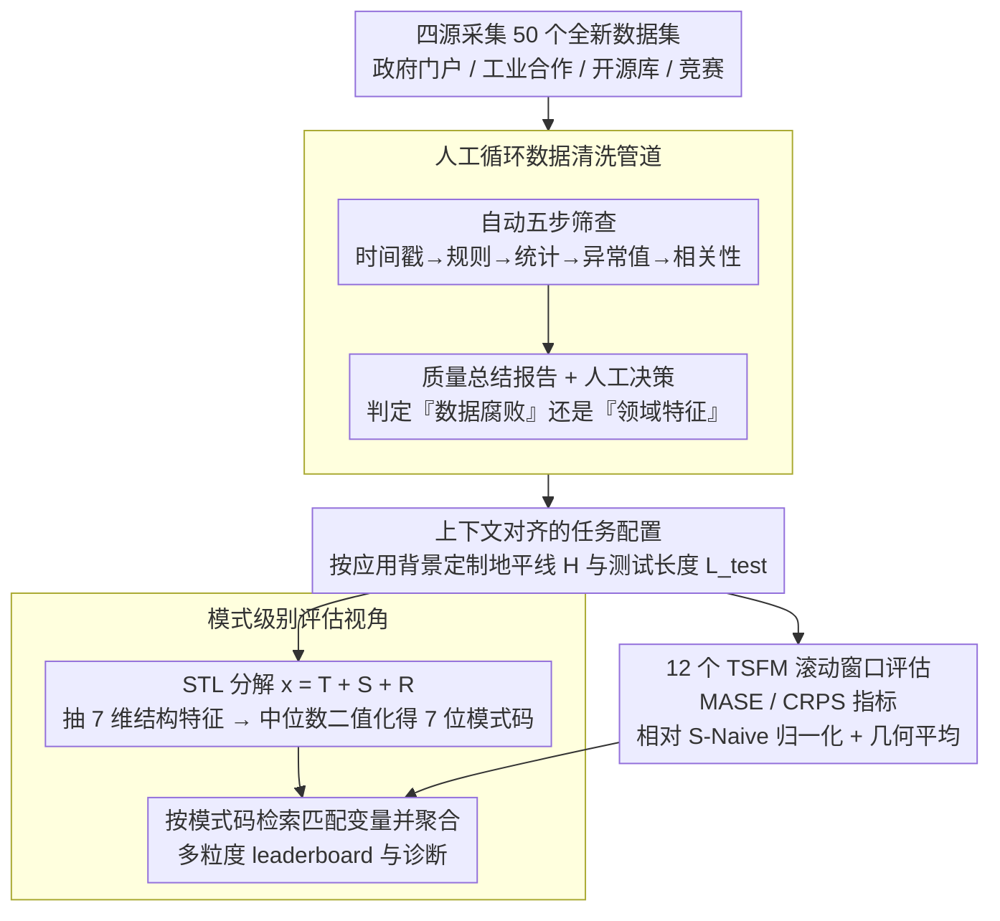

# It's TIME: Towards the Next Generation of Time Series Forecasting Benchmarks

**会议**: ICML 2026  
**arXiv**: [2602.12147](https://arxiv.org/abs/2602.12147)  
**代码**: 待确认  
**领域**: 时间序列 / 基准设计  
**关键词**: 时间序列预测, 基础模型, 零样本评估, 基准设计, 模式级别评估

## 一句话总结
TIME 是面向**时间序列基础模型（TSFM）**的下一代基准——通过**人工标注 + LLM 驱动的数据清洗**、**上下文对齐的任务设计**、**模式级别的评估视角**，克服现有基准的数据重用、质量问题、任务配置不当和评估粒度低等四大痛点；50 个全新数据集 × 98 任务 × 12 TSFM 评估。

## 研究背景与动机

**领域现状**：TSFM 的出现推动了预测评估范式的转变——从数据集中心转向任务中心。现有基准如 Monash、LSF 等已被广泛采用但逐渐暴露核心局限。

**现有痛点**：
- **数据重用与泄露风险**：现有基准数据高度重复依赖，造成数据污染风险；新一代大规模预训练模型可能已摄入这些遗产数据。
- **数据质量缺陷**：自动化处理不足，缺乏严格的质量保证；常见问题包括异常值爆炸、缺失值过多、恒常序列。
- **任务配置脱离实际**：传统基准采用"一刀切"策略（如固定 720 步预测地平线），完全忽视不同应用场景、频率、可预测性的差异。
- **评估视角粗粒度**：现有工作按数据集 / 频率等静态元标签聚合，隐藏了跨数据集相似模式下的性能洞察。

**核心矛盾**：TSFM 需要跨异构数据的通用评估，但现有基准既没有足够新鲜的数据，也没有贴切的任务设计，更没有足够细粒度的分析。

**本文目标**：构建 TIME（Task-centric Benchmark for Universal Forecasting Models），从数据、任务、评估三个维度彻底升级基准。

**切入角度**：利用 LLM + 人工专业判断实现高保真的数据标注和任务设计，通过可解释的时间序列特征（而非静态标签）进行模式级别的聚类分析。

**核心 idea**：将基准设计从"数据集收集 + 机械评估"转变为"新鲜数据 + 人工标注 + 模式驱动"的三层递进。

## 方法详解

### 整体框架
TIME 把"基准设计"从机械的数据收集 + 跑分，重做成"新鲜数据 → 人工标注 → 模式驱动评估"的三层递进，针对的是现有基准数据重用、质量差、任务一刀切、评估太粗这四大痛点。具体落成四个环节：先从政府门户、工业合作、开源库、竞赛四个源头采集 50 个全新数据集并做人工循环清洗；再按每个数据集的真实应用背景定制预测地平线（而非统一 720 步）；接着对每条序列做 STL 分解抽 7 维结构特征并二值化成模式码；最后兵分两路——一路按模式码刻画每条变量的内在模式、一路让 12 个 TSFM 在滚动窗口上跑出 MASE/CRPS，两路在「按模式检索 + 聚合」处汇合，产出可诊断的多粒度 leaderboard。

### 关键设计

**1. 人工循环数据清洗管道：自动化跑量，人工守住"真伪问题"的最后一公里**

大规模数据清洗如果全自动，最容易在"这是数据腐败还是领域特征"上判错——把真实的尖峰当异常删掉、或把缺失当正常留下。TIME 把清洗拆成自动化五步（时间戳修复 → 规则验证 → 统计检验 → 异常值消除 → 相关性检查）加一道人工决策：自动化先生成质量总结报告，人再结合领域知识和 LLM 洞察判断每个可疑项到底是腐败还是特征。这样既保住了大规模处理的效率，又用人工兜底语义正确性——比如某条电力序列的恒定段，自动规则会标成异常，但人能看出那是停机检修而非数据错误。

**2. 上下文对齐的任务配置：让预测地平线反映真实运营需求，而不是学术惯例**

传统基准的"一刀切 720 步"在低频数据上可能毫无意义、在高频数据上又太短，导致评估结果和实际决策对不上。TIME 根据每个数据集的应用背景和运营约束定制地平线 $H$ 和测试长度 $L_{\text{test}}$：高频数据分短/中/长三个地平线，低频或样本有限的数据只给一个可行的运营地平线，测试窗口覆盖完整季节周期，并用 LLM + 领域知识逐个验证任务合理性。这样每个任务的分数都能直接映射回一个真实场景——评估哲学从"学术虚拟设定"转向"实战导向"。

**3. 模式级别的可解释评估视角：从"按数据集聚合"升级到"按时序模式聚合"**

按数据集或频率这类静态元标签聚合，会把"哪些模型擅长季节性强的序列、哪些擅长复杂噪声"这类规律藏起来。TIME 对每个变量做 STL 分解 $\mathbf{x} = T + S + R$，抽 7 维特征（趋势强度、线性度、季节性强度、季节相关性、残差 ACF、复杂度、平稳性），对每个连续特征 $F_k$ 取全基准中位数 $\tilde{F}_k$ 做二值化，于是每个变量对应一个 7 维二进制码 $\mathbf{B}\in\{0,1\}^7$。评估时对目标模式检索所有匹配变量，用尺度不变的 MASE 和 CRPS 算模式特定性能。这把评估从描述性（"模型 A 在 Electricity 上排第二"）升级到规范性（"模型 A 在强趋势 + 弱季节的模式上系统占优"），揭示的是模型的真实泛化边界。

### 训练策略与评估协议
采用滚动窗口评估。指标选择 MASE（点预测）+ CRPS（概率预测），相对化评估框架——将所有指标归一化相对于季节朴素基线（S-Naive）：$\text{Metric}_{\text{model}}^{\text{norm}}(u) = \frac{\text{Metric}_{\text{model}}(u)}{\text{Metric}_{\text{S-Naive}}(u)}$。用几何平均（而非算术平均）聚合跨单位的归一化指标，避免某个极端任务支配排名。

## 实验关键数据

### 基准规模与模型覆盖

| 指标 | 数值 | 说明 |
|-----|------|------|
| 数据集数量 | 50 | 全新采集 |
| 预测任务数 | 98 | 不同频率和预测地平线组合 |
| 评估模型数 | 12 | 涵盖解码器、编码-解码器等多种架构 |
| 应用领域 | 8 | 金融、系统指标、能源、运输等 |

### 整体性能对比

| 模型 | 发布时间 | 架构 | 参数 | MASE | CRPS | 排名 |
|-----|---------|------|------|------|------|------|
| Chronos-2 | 10-25 | Enc. | 120M | 0.645 | 0.421 | ⭐⭐⭐ |
| TimesFM-2.5 | 10-25 | Dec. | 200M | 0.648 | 0.425 | ⭐⭐⭐ |
| TiRex | 05-25 | xLSTM | 35M | 0.672 | 0.438 | ⭐⭐⭐ |
| Moirai-2 | 08-25 | Dec. | 11M | 0.698 | 0.455 | ⭐⭐⭐⭐ |
| TimesFM-2.0 | 12-24 | Dec. | 500M | 0.741 | 0.489 | ⭐⭐⭐⭐ |

最新迭代模型一致超越前代，验证了基准的真实区分能力。

### 模式级别关键发现

| 时间序列特征 | 模型间分化程度 | 关键洞察 |
|-----------|-------------|---------|
| 趋势强度 | 高 | Chronos-2 / TimesFM-2.5 在强趋势上相对收益更显著 |
| 季节性强度 | 中 | 弱季节性数据上各模型聚集，强季节性上分化显著 |
| 季节相关性 | 中-高 | 早期模型在季节稳定和不稳定间有显著 gap；最新 TSFM 这个 gap 收窄 |
| 平稳性 | 高 | 大多数模型在非平稳数据收益更大，但排名对平稳性敏感 |
| 复杂度 | 高 | 高复杂数据上各模型"拉平"，低复杂数据上领先模型能拉开差距 |

### 关键发现
- 任务级排名与特征级排名有偏差，说明不同聚合粒度会影响结论。
- 时间序列可在不同粒度呈现不同模式（全局尖峰在局部可能是周期性）。
- 模型通常可以准确预测明显的季节性和趋势，但高波动序列上倾向保守预测——纯指标排名会掩盖这一失败。

## 亮点与洞察
- **数据新鲜度保证**：50 个全新数据集来自四个不同源头，历史未被或极少被预训练摄入——严格防止数据泄露与基准污染。
- **人工标注的质量保证三层递进**：自动化五步 → 质量总结报告 → 人工决策——既高效处理大规模，又避免自动化的盲区。
- **上下文驱动的任务设计**：打破"一刀切"教条，让每个数据集的预测地平线和测试长度反映真实运营需求——转变了评估哲学从"学术虚拟设定"到"实战导向"。
- **模式级可解释评估的范式转移**：基于 STL 分解的动态特征聚类，既保留了可解释性又实现了跨域相似模式的统一分析。
- **几何平均的对称性聚合**：相对化指标 + 几何平均防止了某个极端任务支配排名。

## 局限与展望
- 50 个数据集相对于万级基准仍有有限的覆盖。
- 模式级分析目前基于单特征，复杂的多特征模式交互需在 leaderboard 交互查询。
- 可视化分析虽然揭示了保守预测问题，但缺乏定量的"预测可靠性"度量。
- MASE / CRPS 虽然是标准但对应用领域的真实损失函数可能有偏差。
- 改进：多特征联合模式聚类；应用定制化指标；数据持续扩展；时间演化分析。

## 相关工作与启发
- **vs M4 / LSF**：早期标准化基准，严重依赖遗产数据和固定设定；TIME 采用全新数据源、上下文对齐任务，评估更公平。
- **vs 最近的大规模基准**：扩大了规模但仍主要复用历史数据；TIME 的三大创新直接针对这些痛点。
- **vs 时间序列特征分析**：早期工作用特征做分类或可视化；TIME 进一步利用特征做**评估聚合**——从描述性到规范性的升级。

## 评分
- 新颖性: ⭐⭐⭐⭐⭐  基准设计的三维创新（新鲜数据 + 人工标注 + 模式级评估）同时解决了现有基准的四大痛点。
- 实验充分度: ⭐⭐⭐⭐⭐  12 个代表性 TSFM × 98 个任务 × 多粒度分析，覆盖 8 个应用域和完整频率谱。
- 写作质量: ⭐⭐⭐⭐  逻辑清晰、图表信息量大；部分细节如 LLM 提示词在主文缺失。
- 价值: ⭐⭐⭐⭐⭐  为 TSFM 社区提供了防污染、贴近实战的新一代基准；leaderboard 的可交互设计和模式级分析为模型选型和改进提供了可行的诊断工具。

<!-- RELATED:START -->

## 相关论文

- [\[ICML 2026\] TimeOmni-VL: Unified Models for Time Series Understanding and Generation](timeomni-vl_unified_models_for_time_series_understanding_and_generation.md)
- [\[ICLR 2026\] SciTS: Scientific Time Series Understanding and Generation with LLMs](../../ICLR2026/time_series/scits_scientific_time_series_understanding_and_generation_with_llms.md)
- [\[ICML 2026\] Ellipsoidal Time Series Forecasting](ellipsoidal_time_series_forecasting.md)
- [\[ICML 2026\] Beyond Extrapolation: Knowledge Utilization Paradigm with Bidirectional Inspiration for Time Series Forecasting](beyond_extrapolation_knowledge_utilization_paradigm_with_bidirectional_inspirati.md)
- [\[ICML 2026\] Nested Spatio-Temporal Time Series Forecasting](nested_spatio-temporal_time_series_forecasting.md)

<!-- RELATED:END -->
