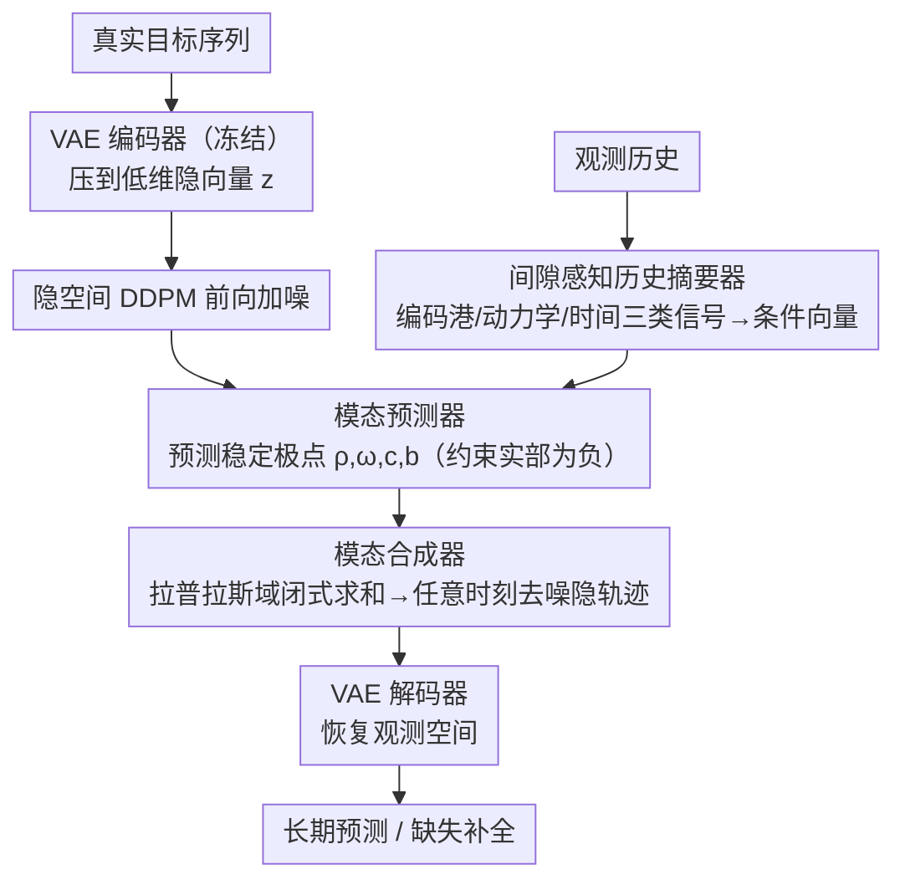

# Latent Laplace Diffusion for Irregular Multivariate Time Series

**会议**: ICML 2026 Spotlight  
**arXiv**: [2605.19805](https://arxiv.org/abs/2605.19805)  
**代码**: 待确认  
**领域**: 时间序列 / 生成模型  
**关键词**: 不规则时间序列, 扩散模型, 隐空间生成, 拉普拉斯域, 港哈密顿系统

## 一句话总结
LLapDiff 是在**隐空间中进行扩散**的生成框架——通过在拉普拉斯域用可学习的复共轭极点参数化**稳定的模态演化**，实现不规则时间序列的长期预测和缺失值补全，**无需逐步的物理时间积分**；7 个数据集上平均排名 2.1±1.7。

## 研究背景与动机

**领域现状**：不规则多变量时间序列（IMTS）建模通常分为三类——（1）离散管道将数据插值 / 重网格化后用强序列模型处理；（2）神经 ODE / 连续 RNN 等连续时间模型自然处理时间戳但需要逐步数值积分；（3）扩散生成模型提供不确定性量化但多在观测空间直接去噪，缺乏动力学结构和稳定性控制。

**现有痛点**：离散方法容易扭曲严重不规则情况下的时间结构；连续时间模型的逐步积分在长期预测时会累积误差和数值漂移；现有扩散方法缺乏显式的稳定性约束，长期生成在不规则采样下易不稳定。

**核心矛盾**：如何在不做激进网格重整的情况下，设计既能保留时间戳保真度、又能避免数值积分成本和误差累积、同时保证长期动力学稳定性的长期预测方法？

**本文目标**：设计一个结合连续时间归纳偏置但无需 ODE/SDE 求解器的条件生成模型。

**切入角度**：将目标时间序列表示为低维隐空间轨迹并在隐空间进行扩散；从**随机港哈密顿系统**的能量守恒启发，在拉普拉斯域用稳定的模态参数化（复共轭极点）指导反向过程。

**核心 idea**：用稳定的模态参数化 $\mathcal{G}(s) = \sum_{k=1}^K \frac{\omega_k \mathbf{c}_k \mathbf{b}_k^\top}{s^2 + 2 \rho_k s + (\rho_k^2 + \omega_k^2)}$ 直接在隐轨迹的任意查询时间点上评估生成，避免逐步时间积分。

## 方法详解

### 整体框架
（1）用预训练 VAE 编码器将真实目标序列映射到低维隐空间 $\mathbf{z} = \text{VAE}_{\text{enc}}(\mathcal{Y}_{t_i})$；（2）用间隙感知的历史摘要器 $\mathcal{S}_\phi$ 将观测历史 $\mathcal{H}_{t_i}$ 压缩为条件向量 $\mathbf{E}_{t_i}$；（3）在隐空间执行标准 DDPM 前向过程；（4）反向去噪时模态预测器 $\mathcal{L}_\theta$ 根据当前噪声隐状态和历史摘要预测连续时间模态参数（衰减率 $\rho_k$、振荡频率 $\omega_k$ 及残差向量 $\mathbf{c}_k, \mathbf{b}_k$）；模态合成器 $\mathcal{L}_\theta^+$ 用这些极点在任意查询时刻直接计算去噪隐轨迹 $\hat{\mathbf{z}}_0(t_r) = \sum_k e^{-\hat{\rho}_k \tilde{t}_r}(\hat{\mathbf{c}}_k \cos(\hat{\omega}_k \tilde{t}_r) + \hat{\mathbf{b}}_k \sin(\hat{\omega}_k \tilde{t}_r))$；（5）用 VAE 解码器恢复观测空间。

### 关键设计

**1. 港哈密顿系统启发的稳定模态参数化：用能量守恒从源头堵住长期漂移**

现有扩散方法多在观测空间直接去噪，没有显式稳定性约束，长期生成在不规则采样下很容易能量无限增长、数值漂移。LLapDiff 从随机港哈密顿 SDE 的能量平衡方程出发，其中耗散项 $\mathbf{R} \succ 0$ 天然保证能量递减；对局部线性化系统做拉普拉斯变换后，动力学被表示成 $K$ 个复共轭极点对 $(-\rho_k \pm i \omega_k)$ 构成的转移函数。学习器直接预测 $(\hat{\rho}_k, \hat{\omega}_k, \hat{\mathbf{c}}_k, \hat{\mathbf{b}}_k)$ 并约束 $\rho_k > 0$——只要所有极点实部为负（赫尔维茨性质），长期预测的渐近稳定性就被自动锁死。这比纯黑箱学习更直接地把「轨迹不该发散」这件事写进了模型结构里。

**2. 更新平均视角的间隙感知条件化：把采样间隔的统计揉进极点**

不规则采样会改变模型看到的动力学，模型必须分清哪些是信号固有的极点、哪些是采样间隔引入的假象。LLapDiff 借更新理论建立这层关系：当采样间隔 $\Delta_j$ i.i.d. 时，连续时间极点 $s_k = -\rho_k + i \omega_k$ 会映射到事件域等效极点 $\lambda_k = \mathbb{E}[e^{s_k \Delta}]$，其对数经 Taylor 展开为 $\bar{s}_k \approx s_k \mathbb{E}[\Delta] + \frac{1}{2} s_k^2 \text{Var}(\Delta)$，清楚显示间隙的均值和方差如何调制衰减与振荡。基于这个理论连接，历史摘要器被设计成同时编码三类信号——港信号（观测值）、动力学信号（有限差分特征）、时间信号（时间戳、$\Delta t$ 编码及掩码），逼模型学会把固有动力学和采样引入的有效极点变化分离开。

**3. 隐空间生成 + VAE 编码的双层框架：在低维轨迹上扩散，规避稀疏高维去噪的困难**

直接在 $h \times d_y$ 的观测轨迹上扩散，要同时对付稀疏掩码和高维度，既不稳又贵。LLapDiff 改成两层：先用预训练且冻结的 VAE 把目标序列压到低维隐向量 $\mathbf{z} \in \mathbb{R}^{h \times d_z}$（隐维通常只有 4–16，$d_z \ll d_y$），扩散就只在这个紧凑空间里跑，学习条件生成 $p_\theta(\mathbf{z} \mid \mathbf{E}_{t_i})$。反向去噪时模态合成器用预测出的极点在任意查询时刻闭式求和 $\hat{\mathbf{z}}_0(t_r) = \sum_k e^{-\hat{\rho}_k \tilde{t}_r}(\hat{\mathbf{c}}_k \cos(\hat{\omega}_k \tilde{t}_r) + \hat{\mathbf{b}}_k \sin(\hat{\omega}_k \tilde{t}_r))$，一次算出所有时刻而无需逐步积分。VAE 先验又给扩散提供了良好的初始化和正则化，让隐空间生成既稳定又高效。

### 损失函数 / 训练策略
VAE 先在训练集上独立预训练并冻结；扩散器用标准 DDPM 前向加噪、反向由模态预测器与合成器联合去噪，历史摘要器与扩散器一起端到端训练（消融显示把摘要器改成联合训练之外的单独阶段会明显掉点）。查询集既可放未来时刻做长期预测，也可放历史缺失时刻做因果滤波式补全。

## 实验关键数据

### 主实验

| 数据集 | 指标 | DLinear | PatchTST | TimeGrad | mTAN | NeuralCDE | ContiFormer | **LLapDiff** |
|--------|------|---------|----------|----------|------|-----------|------------|----------|
| BMS Air (h=168) | CRPS | 1.448 | 0.929 | 0.537 | 0.547 | 1.019 | 0.984 | **0.516** |
| UCI Air (h=168) | CRPS | 2.751 | 1.149 | 1.122 | 0.836 | 1.991 | 2.143 | **1.003** |
| PhysioNet (h=12) | CRPS | 0.476 | 0.486 | 0.446 | 0.452 | 0.431 | 0.420 | **0.318** |
| NOAA US (h=168) | CRPS | 0.355 | 0.333 | 0.639 | 0.869 | 0.511 | 0.468 | **0.440** |
| NOAA UK (h=168) | CRPS | 1.546 | 0.750 | 0.639 | 0.869 | 1.114 | 1.354 | **0.557** |
| US Equity (h=100) | CRPS | 0.572 | 0.565 | 0.423 | 0.417 | 0.561 | 0.563 | **0.406** |

平均排名 2.1 ± 1.7（远优于其他扩散方法的 3.0-6.6）。

### 消融实验

| 配置 | BMS Air | NOAA US | US Equity | 说明 |
|------|---------|---------|-----------|------|
| Full model | 0.516 | 0.440 | 0.406 | 完整模型 |
| w/o conditioning | 0.816 (+0.30) | 1.450 (+1.01) | 0.466 (+0.06) | 移除历史摘要 |
| w/o learned poles | 0.696 (+0.18) | 1.310 (+0.87) | 0.476 (+0.07) | 移除极点参数化 |
| w/o latent space | 0.666 (+0.15) | 1.030 (+0.59) | 0.446 (+0.04) | 直接在观测空间扩散 |
| joint-trained summarizer | 0.806 (+0.29) | 1.360 (+0.92) | 0.476 (+0.07) | 联合训练摘要器 |

### 关键发现
- **长期稳定性优势明显**：在最长预测视距（h=168）和高度不规则数据集上 LLapDiff 相比 mr-Diff 提升 15-30%，而 h=24 时提升缩小至 5-10%。
- **间隙感知的实际效果**：定性结果显示 LLapDiff 在多个缺失发生的区间仍保持连贯轨迹和良好校准的不确定性。
- **缺失值补全的双重功效**：将历史缺失时刻加入查询集，LLapDiff 可执行因果滤波式的补全（CRPS 0.321 vs CSDI 0.469）。
- **压力测试**：在手动诱导缺失下性能稳定（即使覆盖率下降 20% 后 CRPS 变化 < 0.1）。

## 亮点与洞察
- **物理启发的稳定性设计**：港哈密顿能量平衡巧妙地为扩散去噪器注入了二阶动力学约束（极点赫尔维茨性），从源头强制稳定。
- **避免逐步积分的巧思**：通过在拉普拉斯域用闭式模态求和而不是矩阵指数，模型实现了"一步计算所有时刻"的并行化，成本从 $O(h \cdot T \cdot d_z^3)$ 降至 $O(h \cdot K)$。
- **更新平均理论的创意应用**：从概率论中的经典工具（更新理论、特征函数）汲取灵感，推导出间隙统计如何调制连续时间动力学。
- **统一预测与补全**：同一个模型通过改变查询时刻（未来 vs 历史）既可做长期预测也可做缺失值补全。

## 局限与展望
- 隐空间维度的权衡：未充分探讨隐维 $d_z$ 对长期稳定性和计算效率的影响。
- 理论与实践的间隙：更新平均分析假设间隔 i.i.d.，但真实数据的间隙往往是非平稳和状态相关的。
- 极点数 $K$ 的选择：论文采用固定 $K$，但不同数据集可能需要不同的模态丰富度。
- 对超长期预测（h > 500）的扩展性：实验最长 h=168。

## 相关工作与启发
- **vs TimeGrad / mr-Diff**（扩散基线）：多在观测空间去噪并靠掩码 + 时间嵌入处理不规则性，缺乏显式动力学约束；LLapDiff 在隐空间引入刚性的能量守恒和极点稳定性。
- **vs NeuralCDE / ContiFormer**（连续时间基线）：用神经 ODE 或连续 Transformer 自然处理时间戳但需逐步积分；LLapDiff 通过拉普拉斯域参数化完全规避积分。
- **vs 结构化 SSM（S4 等）**：SSM 在长序列上高效但多用于同步采样；LLapDiff 专门为不规则采样设计的间隙感知条件化和模态参数化是新颖贡献。

## 评分
- 新颖性: ⭐⭐⭐⭐⭐  港哈密顿系统启发稳定性设计与拉普拉斯极点参数化的结合完全新颖，将物理启发的能量约束与现代扩散框架自然融合。
- 实验充分度: ⭐⭐⭐⭐  七个数据集、完整消融、压力测试、可视化都很充分；缺少计算时间对比与超长期稳定性的深入验证。
- 写作质量: ⭐⭐⭐⭐⭐  数学推导清晰、动机铺垫充分、实验结果有说服力。
- 价值: ⭐⭐⭐⭐⭐  解决了实际重要的不规则时间序列长期预测问题，方法的物理启发性与可迁移性（极点参数化思想可推广到其他生成任务）都很高。

<!-- RELATED:START -->

## 相关论文

- [\[ICLR 2026\] Learning Recursive Multi-Scale Representations for Irregular Multivariate Time Series Forecasting](../../ICLR2026/time_series/learning_recursive_multi-scale_representations_for_irregular_multivariate_time_s.md)
- [\[ICML 2026\] QuITE: Query-based Irregular Time Series Embedding](quite_query-based_irregular_time_series_embedding.md)
- [\[ICML 2026\] From Observations to States: Latent Time Series Forecasting](from_observations_to_states_latent_time_series_forecasting.md)
- [\[AAAI 2026\] Revitalizing Canonical Pre-Alignment for Irregular Multivariate Time Series Forecasting](../../AAAI2026/time_series/revitalizing_canonical_pre-alignment_for_irregular_multivariate_time_series_fore.md)
- [\[NeurIPS 2025\] OmniCast: A Masked Latent Diffusion Model for Weather Forecasting Across Time Scales](../../NeurIPS2025/time_series/omnicast_a_masked_latent_diffusion_model_for_weather_forecasting_across_time_sca.md)

<!-- RELATED:END -->
