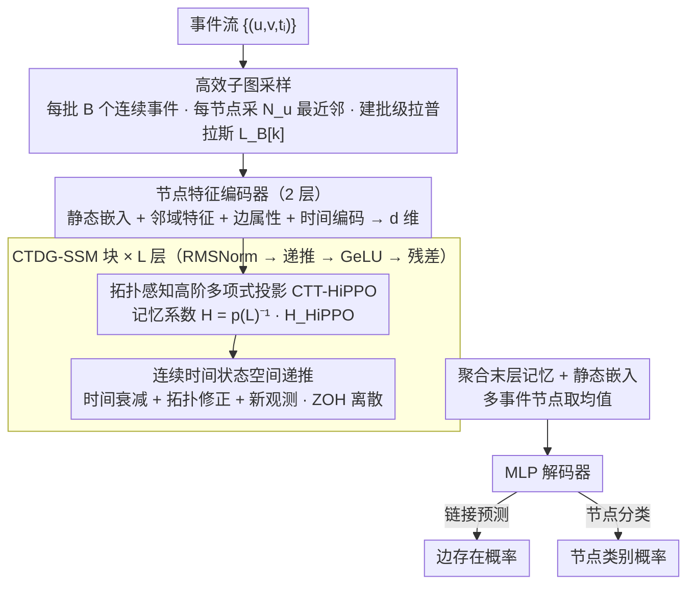

# Learning Long Range Spatio-Temporal Representations over Continuous Time Dynamic Graphs with State Space Models

**会议**: ICML 2026  
**arXiv**: [2606.04672](https://arxiv.org/abs/2606.04672)  
**代码**: 待确认  
**领域**: 时间序列 / 图学习 / 动态图  
**关键词**: 连续时间动态图, 状态空间模型, 长距离依赖, 时空表示学习

## 一句话总结
CTDG-SSM 首次通过**拓扑感知 HiPPO 投影**和状态空间模型，同时捕捉动态图中的多跳长距离空间依赖（LRS）和长距离时间依赖（LRT），在链接预测 / 节点分类等任务上超越 SOTA 且参数量仅为竞争方法的 1/10。

## 研究背景与动机

**领域现状**：连续时间动态图（CTDG）提供了建模演化关系数据的强大框架。现有方法主要分两类——事件驱动模型（TGAT、TGN）计算高效但难保留长时间尺度的历史信息（LRT 能力弱）；序列模型变体（DyGFormer、DyGmamba）能捕捉 LRT 但预处理时把注意力限制在 1-hop 邻域，丧失多跳全局空间结构信息（LRS 能力弱）。

**现有痛点**：没有现有方法能同时保持 LRS 和 LRT——这在金融欺诈检测等实际应用中很关键（洗钱通常通过长交易链传播而非孤立的局部交互）。

**核心矛盾**："空间-时间权衡"困境——要么为了捕捉 LRT 而打破图结构，要么为了利用图结构而限制时间感受野。

**本文目标**：开发统一的时空状态空间框架，在同一框架内既能压缩历史事件信息到紧凑内存（LRT），又能通过图多项式滤波器聚合多跳邻域信息（LRS）。

**切入角度**：从古典 HiPPO（High-order Polynomial Projection Operator）扩展到图数据。关键观察是可通过投影古典 HiPPO 系数到拉普拉斯矩阵多项式的逆，得到同时编码时间与拓扑动态的状态空间模型。

**核心 idea**：拓扑感知的高阶多项式投影（CTT-HiPPO）替代简单的序列内存机制——内存系数既受时间演化影响也受图结构约束；通过零阶保持离散化实现高效计算。

## 方法详解

### 整体框架
CTDG-SSM 要破的是动态图里"空间-时间二选一"的困局：现有方法要么打破图结构去抓长时记忆，要么守住图结构但限死时间感受野。它的思路是把图拓扑直接焊进状态空间模型的记忆机制里，让一套递推同时压缩历史（LRT）和聚合多跳邻域（LRS）。一条事件流 $\{(u,v,t_i)\}$ 进来后，先做批级子图采样（每批构造拉普拉斯矩阵 $L_B[k]$、每个节点采 $N_u$ 个最近邻），把节点静态嵌入 + 动态邻域特征 + 边属性 + 时间编码经 2 层编码器投到 $d$ 维隐空间；再过多层 CTDG-SSM 块（每层 RMSNorm → CTDG-SSM 递推 → GeLU → 残差，借鉴 Mamba 风格），其中拓扑感知投影（设计 1）和状态空间递推（设计 2）就嵌在每层块里；最后把末层隐状态和静态嵌入聚合，经 MLP 解码器输出链接预测分数或节点分类概率。

### 关键设计

**1. 拓扑感知高阶多项式投影（CTT-HiPPO）：让记忆系数既听时间的、也听图结构的**

经典 HiPPO 能把时间序列最优地压进紧凑记忆，但它完全不懂图——直接拿来用，多跳的空间结构就丢了。CTDG-SSM 在时间窗口 $[0,\tau]$ 上把 $i$ 维节点特征建模为 $X_{:,i}(t) = p(L_\tau)H_\tau^{(i)}g(t) + r_i(t)$，其中 $g(t)$ 是正交多项式基、$p(L_\tau)$ 是拉普拉斯矩阵多项式（即图滤波器）；一阶最优性条件给出 $H_\tau^{(i)} = p(L_\tau)^{-1}H_\tau^{(i),\text{HiPPO}}$——也就是把经典 HiPPO 系数再过一道逆多项式滤波器投影。这样记忆系数既继承了 HiPPO 对时间的最优压缩，又被 $p(L_\tau)$ 注入了图拓扑约束；$K$ 阶多项式自动聚合 $K$ 跳邻域，而图结构随时间演变时滤波器也跟着动，多跳聚合不再是外挂的预处理，而是记忆本身的一部分。

**2. 连续时间状态空间模型（CTDG-SSM）：用一个微分方程把"时间衰减"和"拓扑变化"统一进演化**

光有静态投影还不够，记忆系数 $H_s$ 是随时间和图一起变的，需要刻画它怎么演化。作者证明它满足微分方程 $\frac{dH_s}{ds} = -\frac{H_s A^\top}{M(s)} - p(L_s)^{-1}\frac{dp(L_s)}{ds}H_s + \frac{p(L_s)^{-1}X(s)B^\top}{M(s)}$：第一项是时间记忆衰减，第二项是图拓扑变化带来的修正，第三项整合新观测——三股力量在一个方程里。再用零阶保持（ZOH）离散化，得到可计算的递推 $H[k+1] = \bar{A}_{L[k]}H[k]\bar{A} + \bar{B}(L[k],X[k])$。这个统一形式的妙处在于它能干净退化：当 $p(L_\tau)=I$（没有图）时它就是经典 SSM，当图结构固定时它就是分段常数 SSM，于是"图 + 时间"不是两个流水线拼起来，而是同一动力学的两个分量。

**3. 高效离散实现 + 鲁棒性保证：把全图开销降下来，并证明它对图噪声稳**

事件流图可能很大、还带噪声，直接算稠密 Laplacian 既贵又脆。CTDG-SSM 用批次级子图采样把运算限制在 $N_B \times N_B$ 规模，配合残差 + RMSNorm 保证训练稳定；理论上它进一步证明当拉普拉斯矩阵受扰 $\|\Delta L\|_2 \leq \epsilon$ 时，CTT-HiPPO 系数的相对误差以 $\epsilon$ 一阶线性有界，并保证节点排列等变性。前者让多跳信息和计算复杂度可以兼得，后者让方法在真实图的噪声下不至于系数乱飞——这也是它参数量只有竞争方法 1/10 还能更稳的工程底气。

## 实验关键数据

### 主实验（动态链接预测，AUC ROC）

| 数据集 | JODIE | TGN | DyGmamba | **CTDG-SSM** |
|--------|-------|-----|----------|-------------|
| LastFM | 70.89 | 76.64 | 93.31 | **93.79** |
| Enron | 87.77 | 88.72 | 93.34 | **94.98** |
| MOOC | 84.50 | 91.91 | 89.58 | **99.00** |
| Reddit | 98.29 | 98.61 | 99.27 | **99.48** |
| **Avg. Rank** | 7.93 | 4.57 | 2.00 | **1.86** |

CTDG-SSM 在 LRT 基准（LastFM、MOOC、Enron）上显著领先，MOOC 上相对 DyGmamba 提升 9.4%。

### 消融实验（序列分类，长距离依赖测试）

| 变体 | n=3 | n=9 | n=15 | n=20 | 平均 |
|------|-----|-----|------|------|------|
| TU-SSM（无拓扑项） | 47.0 | 50.7 | 52.3 | 54.5 | 51.1% |
| CTDG-SSM (FO，1 阶) | 100.0 | 97.1 | 97.4 | 97.1 | 97.9% |
| **CTDG-SSM (SO，2 阶)** | **100.0** | **98.1** | **97.8** | **98.6** | **98.6%** |

### 效率对比

| 指标 | CTDG-SSM | DyGmamba | DyGFormer |
|------|----------|----------|-----------|
| 参数量（相对） | 1× | ~10× | ~8× |
| LastFM 训练时间 / epoch | 4.45 分 | 28.45 分 | 47.00 分 |
| GPU 内存 | 1.15 GB | 4.17 GB | 7.57 GB |

### 关键发现
- 去掉拓扑项（TU-SSM）性能从 98% 崩到 51%，证实结构化记忆更新的关键作用。
- 二阶多项式相比一阶在长序列上显著改进（n=20 从 97.13% → 98.60%）。
- 参数量是竞争方法 1/10，训练速度 6.4× 快，GPU 内存 3.6× 少。

## 亮点与洞察
- **理论深度**：从古典 HiPPO 推导拓扑感知变体，巧妙将图滤波注入时间记忆；推导比直接设计更有原理性。
- **空间-时间统一框架**：而非"先时间后空间"流水线，通过微分方程自然耦合两者于内存动态中。
- **参数高效性**：仅靠多项式滤波系数 + 状态转移矩阵达 SOTA，参数量竞争方法 1/10，在模型压缩和边缘部署上有实际价值。
- **可迁移设计**：CTT-HiPPO 思路（通过逆滤波器投影）可推广到其他需要联合时空建模的任务。

## 局限与展望
- 子图采样策略固定（$N_u$ 最近邻），未来可探索学习式采样。
- 零阶保持假设对高频图变化可能不精确，可尝试更高阶离散化。
- 可解释性缺失——对"学到的滤波器在表达什么"缺少可视化分析。
- 未涵盖事件时间间隔差异极大的场景（传感器数据稀疏 + 突发）。

## 相关工作与启发
- **vs DyGmamba**：后者只捕捉 LRT，结构受限；CTDG-SSM 通过拓扑项同时捕捉 LRS。
- **vs GraphSSM**：面向离散图、假设固定结构；CTDG-SSM 适配连续事件流与动态拓扑。
- **vs Transformer 变体（DyGFormer）**：用注意力但限制 1-hop；CTDG-SSM 用图滤波器隐式聚合多跳，计算量更低。

## 评分
- 新颖性: ⭐⭐⭐⭐⭐  首次从状态空间视角统一 LRT 与 LRS，理论推导严谨。
- 实验充分度: ⭐⭐⭐⭐  三类任务充分验证，消融深入，效率对比全面；可解释性和极端场景测试还有余地。
- 写作质量: ⭐⭐⭐⭐⭐  逻辑清晰，数学严格，问题动机 → 理论 → 实验完整闭环。
- 价值: ⭐⭐⭐⭐⭐  解决重要 CTDG 建模问题，参数高效率对实际部署有价值，理论可迁移性强。

<!-- RELATED:START -->

## 相关论文

- [\[ICML 2026\] FRACTAL: State Space Model with Fractional Recurrent Architecture for Computational Temporal Analysis of Long Sequences](fractal_ssm_with_fractional_recurrent_architecture_for_computational_temporal_an.md)
- [\[ICML 2026\] HiPPO Zoo: Explicit Memory Mechanisms for Interpretable State Space Models](hippo_zoo_explicit_memory_mechanisms_for_interpretable_state_space_models.md)
- [\[ICML 2026\] Nested Spatio-Temporal Time Series Forecasting](nested_spatio-temporal_time_series_forecasting.md)
- [\[NeurIPS 2025\] WaLRUS: Wavelets for Long-range Representation Using SSMs](../../NeurIPS2025/time_series/walrus_wavelets_for_long-range_representation_using_ssms.md)
- [\[NeurIPS 2025\] Structured Sparse Transition Matrices to Enable State Tracking in State-Space Models](../../NeurIPS2025/time_series/structured_sparse_transition_matrices_to_enable_state_tracking_in_state-space_mo.md)

<!-- RELATED:END -->
