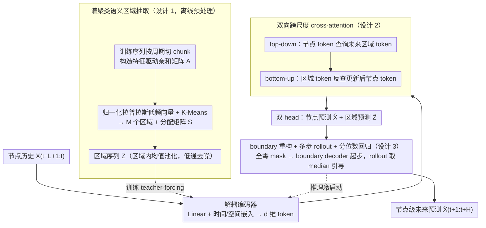

# Nested Spatio-Temporal Time Series Forecasting

**会议**: ICML 2026  
**arXiv**: [2605.16447](https://arxiv.org/abs/2605.16447)  
**代码**: 未公开  
**领域**: 时间序列
**关键词**: 时空预测、谱聚类、宏观引导、跨尺度注意力、自回归 rollout  

## 一句话总结
NeST 把"未来的宏观区域趋势"作为自顶向下引导，配合谱聚类构造的语义区域和双向跨尺度 cross-attention，让节点级时空预测在大规模交通网络上同时取得精度、长程稳定性与近线性复杂度的全面提升。

## 研究背景与动机
**领域现状**：时空预测（STF）是多变量时间序列预测的一个分支，主流做法是把传感器组织成图，用 GNN/注意力建模空间相关，用 RNN/TCN 建模时间相关。从早期的 DCRNN/STGCN 用固定拓扑，到 GraphWaveNet/MTGNN/AGCRN 学自适应邻接，再到 DSTAGNN/STAEFormer/PatchSTG 引入动态时变图与注意力。

**现有痛点**：随着图规模扩大（数千个传感器），细粒度全图建模极易学到伪相关 (spurious correlations)，对局部噪声、缺失值、短时异常非常敏感；自回归长程预测会累积误差。已有分层方法（HGCN/HiSTGNN/HSDGNN 等）虽然引入区域抽象，但只把粗粒度信号当作历史辅助输入，没有真正解决"未来不确定性如何被宏观结构约束"这件事。

**核心矛盾**：单一尺度的微观历史建模在高维含噪场景下既低效又不稳定；现有分层框架又只用历史宏观信息，无法为未来轨迹提供结构性锚点。

**本文目标**：(i) 如何从原始数据无监督地构造与未来语义一致的区域表征；(ii) 如何让区域级"未来趋势"显式地反向引导节点级预测；(iii) 如何让这种引导在自回归 rollout 中保持稳定且复杂度可控。

**切入角度**：作者观察到——若把"未来的宏观状态"先预测出来，再让它指导细粒度节点预测，就能把抽象未来上下文当作一种自顶向下的正则化，类似 "先画轮廓再填细节"。关键问题转成：宏观表征必须既保真又能与微观结构在拓扑/语义上对齐。

**核心 idea**：用谱聚类构造语义一致的区域，预测未来区域级轨迹作为 macro guidance，通过双向 cross-attention 反过来约束节点级预测，形成 nested coarse-to-fine 自回归框架。

## 方法详解

### 整体框架
NeST 处理 $N$ 个传感器、历史窗口长度 $L$、目标 horizon $H$、patch 长度 $P$ 的 patch-wise 自回归预测任务。流程分三步：

1. **离线预处理**：从训练序列构造特征驱动的亲和矩阵 $\mathbf{A}\in\mathbb{R}^{N\times N}$，做谱聚类得到 $M$ 个区域（$M<N$，实验取 $M=0.2N$）以及分配矩阵 $\mathbf{S}\in\{0,1\}^{N\times M}$，区域级序列 $\mathbf{Z}_{t,m}$ 通过 region 内 average pooling 得到。
2. **训练阶段**：节点历史 $\mathbf{X}_{t-L+1:t}$ 与区域未来 $\mathbf{Z}_{t+1:t+P}$ 通过解耦的 Linear+TE+SE 投影到 $d$ 维 token；双向 cross-attention 让节点 token 查询未来区域 token（top-down），再让区域 token 查询更新后的节点 token（bottom-up）；两个 head 同时输出 $\hat{\mathbf{X}}_{t+1:t+P}$ 和 $\hat{\mathbf{Z}}_{t+P+1:t+2P}$。
3. **推理阶段**：未来 $\mathbf{Z}$ 不可见，先用全零 mask token 经一个 boundary decoder 重构 $\hat{\mathbf{Z}}_{t+1:t+P}$ 作为初始引导，再做多步 rollout。

### 关键设计

**1. 基于谱聚类的语义区域抽取与 SNR 理论保证：把含噪节点压成可信的结构锚点**

数千个传感器的细粒度全图建模极易学到伪相关，对局部噪声和短时异常非常敏感，所以系统需要一组稳定的宏观锚点。NeST 不用物理距离也不用静态拓扑，而是特征驱动地构造区域：把训练序列按周期切成 $\tilde{T}$ 个非重叠 chunk、对每个 chunk 内节点取平均后算亲和矩阵 $\mathbf{A}_{ij}=\exp(-\frac{1}{2\sigma^2\tilde{T}}\sum_k \|\mathbf{X}_i^{(k)}-\mathbf{X}_j^{(k)}\|_2^2)$，让相似性强调长期演化而非瞬时波动；再用归一化拉普拉斯 $\mathbf{L}_{\text{sym}}=\mathbf{I}-\mathbf{D}^{-1/2}\mathbf{A}\mathbf{D}^{-1/2}$ 取低频特征向量做 K-Means 得到分配矩阵 $\mathbf{S}$，区域表征 $\mathbf{Z}_{t,m}=\sum_i S_{i,m}\mathbf{X}_{t,i}/\sum_i S_{i,m}$。为什么这样有效，作者给了 Theorem 1：若 cluster 内真信号相关系数为 $\rho_m$，则 $\text{SNR}(\mathbf{Z}_m)\ge[1+(|\mathcal{C}_m|-1)\rho_m]\cdot\overline{\text{SNR}}_m$——同向聚合天然是一个低通滤波器，把局部高频噪声压掉、只留区域级趋势，这就把谱聚类从经验选择提升成有数学保证的去噪手段。

**2. 双向跨尺度 cross-attention：让未来宏观趋势反过来正则节点预测**

历史细粒度动态和未来粗粒度趋势必须耦合起来，单向自顶向下会让区域 token 与历史脱节、单向自底向上又退化成普通分层方法。NeST 做两步双向交互：先 top-down，节点 token 查询未来区域 token，$\tilde{\mathbf{H}}_x=\text{Attn}(\mathbf{H}_x^{\text{past}},\mathbf{H}_z^{\text{fut}},\mathbf{H}_z^{\text{fut}})$，让节点表征吸收宏观演化趋势；再 bottom-up，更新后的节点反过来 refine 区域 token，$\tilde{\mathbf{H}}_z=\text{Attn}(\mathbf{H}_z^{\text{fut}},\tilde{\mathbf{H}}_x,\tilde{\mathbf{H}}_x)$，把宏观引导锚回最新的细粒度上下文，二者互相校准。同时由于查询对象是 $M$ 个区域而非 $N$ 个节点，复杂度从全自注意力的 $\mathcal{O}(lN^2 d)$ 降到 $\mathcal{O}(lNMd)$，被 cluster 数 $M<N$ 卡成近线性——这正是大规模图能跑得动的根本原因。

**3. Boundary 重构 + 多步 rollout + 分位数回归：填平训练-推理鸿沟并对引导误差鲁棒**

训练时未来区域 token 可见（teacher forcing），推理时却不可见，纯 teacher forcing 会让模型在推理遇到分布外输入、纯 rollout 又前期不稳。NeST 用三件事接住这个 exposure bias：训练按概率 $P_{\text{tf}}$ 用 ground-truth 区域 token、按 $1-P_{\text{tf}}$ 用自己 rollout 出的 $\hat{\mathbf{Z}}$ 做 scheduled sampling；同时显式训练一个 boundary decoder $\hat{\mathbf{Z}}_{t+1:t+P}=\text{Proj}_{\text{bd}}(\text{Attn}(\mathbf{H}_z^{\text{zeros}},\tilde{\mathbf{H}}_x,\tilde{\mathbf{H}}_x))$，让模型在没有未来观测时也能从节点历史 prior 出一个宏观起点当冷启动锚点，rollout 之后宏观稳定性接管；区域 head 再用 quantile regression 估计 $\{\tau_q\}_{q=1}^Q$ 多个条件分位数、推理只取 median $\tau=0.5$ 作引导，把宏观引导从点估计变成分布估计，对引导误差更鲁棒，这在 12 小时长 horizon 上尤其关键。

### 损失函数 / 训练策略
端到端多任务训练，整体 loss 为 $\mathcal{L}=\mathcal{L}_x+\lambda_1\mathcal{L}_z+\lambda_2\mathcal{L}_{\text{bd}}$：节点级预测损失 $\mathcal{L}_x$、区域级多分位数 pinball 损失 $\mathcal{L}_z$、boundary 重构损失 $\mathcal{L}_{\text{bd}}$。Lookback $L=12$、horizon $H=12$，按 $P$ 长度 patch 自回归生成；$\tilde{T}$ 与数据内在周期对齐，$M=0.2N$ 取最优。

## 实验关键数据

### 主实验
LargeST benchmark 的 GBA / GLA / CA 三个大规模交通数据集（节点数从数千到上万），与 11 个 SOTA baseline 对比。

| 数据集 | 指标 | NeST | PatchSTG (前 SOTA) | 相对提升 |
|--------|------|------|---------------------|----------|
| GBA (平均 horizon 12) | MAE | 18.73 | 19.50 | 3.95% |
| GBA | MAPE | 12.90% | 14.64% | 11.88% |
| GLA (平均) | MAE | 17.89 | 18.96 | 5.65% |
| GLA | MAPE | 10.74% | 11.44% | 6.14% |
| CA (平均) | MAE | 16.54 | 17.35 | 4.69% |
| CA | MAPE | 11.28% | 12.79% | 11.78% |

跨三个数据集平均：MAE +4.71%、RMSE +4.41%、MAPE +9.34%。Long-horizon（48 步 / 12 小时 autoregressive rollout）在 GLA 上 NeST vs PatchSTG 的 MAE gap 从 step 16 的 2.0 扩大到 step 48 的 2.4，证明宏观引导对长程稳定性是有效的。在 KnowAir / UrbanEV / Electricity / Solar-Energy 等非交通领域同样优于 MAGE / iTransformer / Air-DualODE。

### 消融实验

| 配置 | GBA MAE | GBA RMSE | GLA MAE | 说明 |
|------|---------|----------|---------|------|
| NeST (Full) | **18.73** | **31.85** | **17.89** | 完整模型 |
| w/o CA | 19.76 | 34.11 | 19.00 | 去掉 cross-attention，掉点最严重（+1.04 MAE） |
| w/o FG | 19.64 | 32.89 | 18.85 | 把未来 Z 换成历史 Z，掉 +0.91 MAE |
| w/ KM | 18.93 | 32.33 | 18.39 | 用原始特征 K-Means 代替谱聚类 |
| w/ RP | 19.07 | 32.47 | 18.46 | 随机分区（MAPE 在 GBA 上恶化 13%） |
| w/ DA | 18.93 | 32.22 | 18.34 | 用静态地理距离做亲和 |

### 关键发现
- **cross-attention 是核心**：去掉后模型退化成纯局部预测器，掉点最多，证明宏观自顶向下正则不是锦上添花而是关键支柱。
- **"未来"二字至关重要**：w/o FG（只用历史区域）依然显著掉点，说明把宏观信号从"历史辅助"升级为"未来引导"是这篇论文的真正 delta，而不仅是分层结构本身。
- **语义聚类 > 地理聚类**：w/ DA 用物理邻近反而比 w/ KM 还好一点点，但都不如谱聚类——说明大规模交通网络里的功能相似性确实和地理位置正交（论文 case study 中 Region 547 跨越多个不连续路段但共享演化模式）。
- **$M=0.2N$ 是 U 型最优**：太少（$0.1N$）过聚合损失局部 pattern，太多（$0.3N$）又被结构噪声淹没。
- **效率显著**：GBA 上训练时间 185s→75s/epoch（-59.5%），推理 32s→20s（-37.5%）；亲和矩阵预处理（91s）是一次性开销。

## 亮点与洞察
- **"预测未来宏观、反过来引导微观"是一个真正新的范式**：以前的分层方法基本都把粗粒度当历史辅助，把它放到未来侧并配上 boundary 重构机制，才把宏观真正变成可用的 top-down prior。这个 idea 可以迁移到任何 hierarchical sequence modeling 任务（视频预测、轨迹预测、分子动力学）。
- **SNR 理论与结构设计耦合得很漂亮**：Theorem 1 直接告诉你"为什么 cluster 内 average pooling 是个 low-pass filter"，把谱聚类的工程选择从"经验"提升到"有数学保证"，这种"理论解释经验"的写法非常值得学。
- **复杂度从 $\mathcal{O}(N^2)$ 降到 $\mathcal{O}(NM)$ 是大规模图的关键**：cross-attention 把 N×N 自注意力变成 N×M cross-attention，结构上就把 quadratic 卡住，配 PatchSTG 等 patch 化方法是大规模交通预测的两条主线。
- **boundary decoder + scheduled sampling 是 exposure bias 的实用解法**：训练用 mask 重构、推理用 mask 起步，训练-推理分布对齐做得相当干净，可以直接搬到任何 teacher-forcing + autoregressive 场景。

## 局限与展望
- 作者承认的局限：(i) 亲和矩阵构造是 $\mathcal{O}(N^2)$ 预处理，节点上到十万级会成为瓶颈；(ii) 全局聚类假设时不变空间相关，对突发拓扑变化（事故、临时管制）适应性差；(iii) teacher-forcing 仍残留 exposure bias；(iv) 自回归 rollout 顺序生成比直接多步预测慢。
- 自己发现的局限：(i) $M=0.2N$ 看似 robust 但其实需要每个数据集调；(ii) 没和 channel-independent 的 PatchTST/iTransformer 直接比效率/精度的 Pareto；(iii) quantile head 只用了 median，分位数预测的不确定性并没有真正反馈到节点预测的 loss/置信度估计上，浪费了一部分信息。
- 改进思路：动态聚类（让 $\mathbf{S}$ 随时间窗口更新）、把 boundary decoder 用 diffusion prior 替换、把 quantile uncertainty 反传到节点 head 做 risk-aware decoding。

## 相关工作与启发
- **vs PatchSTG**：PatchSTG 走 patch 化+空间数据管理的路线降复杂度，NeST 走聚类+宏观引导的路线，复杂度都做到近线性但归因不同——NeST 的关键 delta 是引入"未来宏观"，二者结合是天然的下一步。
- **vs HiSTGNN / HIEST / HSDGNN**：传统分层方法只把宏观当历史辅助输入，缺少"预测未来宏观再反向引导"这一闭环；NeST 用 boundary 重构 + rollout 把这个闭环跑通。
- **vs Jiang et al. 2025（neural operator with future info）**：那篇先证明"用未来信息能稳长程预测"，但要求规则网格；NeST 把这个思想适配到不规则、含噪、有缺失的图结构数据上。
- **vs iTransformer / MAGE**：channel-independent 的纯时间序列模型在 non-traffic 数据上是 NeST 的最强对手；NeST 的优势在于显式利用空间结构，未来若把 channel mixing 和宏观引导融合可能再下一城。

## 评分
- 新颖性: ⭐⭐⭐⭐ 把"未来宏观预测"作为 top-down 引导是真正的范式 delta，不是简单的模块堆叠
- 实验充分度: ⭐⭐⭐⭐ 三个 LargeST 大规模数据集 + 4 个非交通领域 + 完整消融 + 长 horizon + 运行时间，覆盖很全
- 写作质量: ⭐⭐⭐⭐ 理论 (SNR) + 直觉 (low-pass filter) + 工程 (boundary decoder) 三层叙事衔接顺畅，图 2 case study 把机制讲得很直观
- 价值: ⭐⭐⭐⭐ 在大规模交通预测这条卷得很厉害的赛道上仍有 4-6% MAE / 10%+ MAPE 提升，且训练快 2 倍以上，工业落地价值高

<!-- RELATED:START -->

## 相关论文

- [\[ICML 2026\] Learning Long Range Spatio-Temporal Representations over Continuous Time Dynamic Graphs with State Space Models](learning_long_range_spatio-temporal_representations_over_continuous_time_dynamic.md)
- [\[NeurIPS 2025\] Learning with Calibration: Exploring Test-Time Computing of Spatio-Temporal Forecasting](../../NeurIPS2025/time_series/learning_with_calibration_exploring_test-time_computing_of_spatio-temporal_forec.md)
- [\[ACL 2026\] STReasoner: Empowering LLMs for Spatio-Temporal Reasoning in Time Series via Spatial-Aware Reinforcement Learning](../../ACL2026/time_series/streasoner_empowering_llms_for_spatio-temporal_reasoning_in_time_series_via_spat.md)
- [\[ICML 2026\] Ellipsoidal Time Series Forecasting](ellipsoidal_time_series_forecasting.md)
- [\[NeurIPS 2025\] StRap: Spatio-Temporal Pattern Retrieval for Out-of-Distribution Generalization](../../NeurIPS2025/time_series/strap_spatio-temporal_pattern_retrieval_for_out-of-distribution_generalization.md)

<!-- RELATED:END -->
