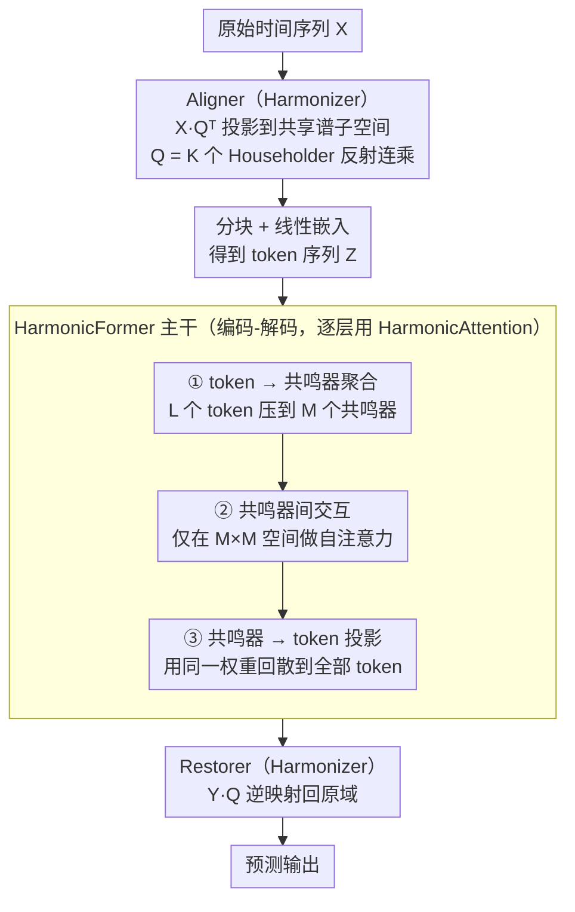

# OLIVIA: Harmonizing Time Series Foundation Models with Power Spectral Density

**会议**: ICML 2026  
**arXiv**: [2605.17340](https://arxiv.org/abs/2605.17340)  
**代码**: 待确认  
**领域**: 时间序列 / 基础模型  
**关键词**: 功率谱密度, 时间序列基础模型, 域适应, 注意力机制

## 一句话总结
OLIVIA 通过引入功率谱密度（PSD）驱动的协调机制——Harmonizer（基于 Householder 反射的正交二阶协调）和 HarmonicAttention（共鸣器低维交互）——显著改进了时间序列基础模型在异质数据上的预训练，在 TSLib 零样本 + GIFT-Eval + GluonTS 多基准上实现 SOTA。

## 研究背景与动机

**领域现状**：时间序列基础模型通过多领域大规模数据集合上的预训练学习统一通用表示——这个范式在 NLP 和 CV 已被证明有效。然而现有模型在处理异质时间序列时面临严峻挑战。

**现有痛点**：不同领域的时间序列展现显著不同的时间模式（周期结构、长期依赖）。这种多样性虽然是学习广泛适用时间知识的前提，但也为预训练带来困难——（1）优化层面：联合训练具有不同时间特征的数据通常导致收敛缓慢和次优；（2）表示学习层面：模型需要同时适应不兼容的时间结构，难以形成统一可转移的表示。

**核心矛盾**：现有基础模型通过架构模块化或容量专业化（混合专家、频率感知分块）实现域适应，但**没有显式解决时间分布中的根本差异**——即用信号处理中的 PSD 概念诊断和调和跨域谱差异。

**本文目标**：（1）以原则性方式理解和量化跨域时间异质性；（2）在大规模预训练中高效实现 PSD 一致性而不陷入直接的、不稳定的发散度最小化。

**切入角度**：normalized PSD 是数据集级描述符，通过捕捉频率方向上的时间变化分布反映底层二阶时间相关性结构；PSD 对全局时间平移不变、对局部时间错位相对鲁棒，是比较异质条件下采集信号的理想表示。

**核心 idea**：通过谱域中协调各数据集的 PSD 减少不匹配——从不可实现的直接发散度最小化重新表述为基于**二阶时间相关性共享重参数化**的结构性协调方法。

## 方法详解

### 整体框架
OLIVIA 要解决的核心问题是：预训练时把周期、长依赖各不相同的多领域时间序列混在一起，模型既收敛慢又学不出统一表示。它的破题点是把这种异质性量化为各数据集的归一化功率谱密度（PSD）差异，再在谱域里把它们「调和」到一致。整条 pipeline 是一个编码器-解码器：原始时间序列先经 **Harmonizer** 的 Aligner 投影到共享谱空间，让所有数据集的二阶相关结构对齐；对齐后的表示送入 **HarmonicFormer** 主干做编码-解码，其中每层注意力都换成 HarmonicAttention；最后 Harmonizer 的 Restorer 把结果逆映射回原域得到预测。Harmonizer 负责「调和」、HarmonicFormer 负责「高效建模」，两者由同一套 PSD 一致性的理论串起来。

### 关键设计

**1. Harmonizer：用 Householder 反射做正交的二阶协调，绕开不稳定的发散度最小化**

最直觉的做法是直接最小化各数据集 PSD 之间的 JS 散度，但在大规模预训练里这条路梯度噪声大、训练极不稳定，根本跑不动。作者改从命题 1 切入：存在一个共享正交矩阵 $Q$，其前 $r$ 列张成的子空间对所有数据集的二阶矩矩阵都不变，等价于把各自的协方差矩阵块对角化——也就是说，PSD 协调可以重写成「共享重参数化二阶相关性」这个结构性问题，而不必直接碰发散度。Aligner 据此把输入投影为 $\mathcal{X} = X Q^\top$，其中 $Q$ 写成 $K$ 个 Householder 反射的连乘 $Q = \prod_k H_k$、$H_k = I - 2 V_k V_k^\top$，这样不管参数怎么更新 $Q$ 都恒在正交群上；解码后 Restorer 做逆映射 $Y = \mathcal{Y} Q$ 把信号还原回原域。正交约束保证能量守恒、信号不失真，逐个反射叠乘又让梯度流平稳，于是把「无法直接优化的 PSD 对齐」变成了「可稳定训练的子空间投影」。

**2. HarmonicAttention：让一小撮「共鸣器」当瓶颈，把稠密注意力降到线性**

标准 Transformer 的 token 两两交互是 $\mathcal{O}(L^2 P)$，序列一长就吃不消。这里的依据是命题 2：经 Harmonizer 对齐后，二阶矩矩阵呈块对角结构 $\Sigma_\mathcal{X} = \text{diag}(\Lambda, \Phi)$，token 的 Gram 矩阵能分解成一个主导的低秩项加上有界余差——意味着稠密依赖完全可以用少数几个紧凑谐波模式来近似。HarmonicAttention 引入 $M$ 个共鸣器（$M \ll L$）当中间体，分三步走：先把 token 聚合到共鸣器 $R^{(h)} = (A^{(h)})^\top \tilde{Z}^{(h)}$，再让共鸣器之间互相交互 $\text{ResAct}(R^{(h)}) = \text{Softmax}_{\text{res}}\big(R^{(h)} (R^{(h)})^\top / \sqrt{P}\big) R^{(h)}$，最后投影回所有 token $\text{Head}^{(h)} = A^{(h)} \text{ResAct}(R^{(h)})$。所有全局依赖都被压过这道共鸣器瓶颈传导，复杂度从稠密注意力的 $\mathcal{O}(L^2 P)$ 降到 $\mathcal{O}(L M P + M^2 P)$（$M \ll L$ 时近似线性），而且因为共鸣器恰好对应共享子空间里的主导能量模式，这种近似不是通用的低秩压缩，而是和 PSD 对齐后的结构天然契合——消融里把它换成 Full / Linear / Nyström Attention 性能都下降，说明收益来自这种结构匹配而非注意力容量本身。主干 **HarmonicFormer** 就是把 HarmonicAttention 逐层堆成 Transformer 式的编码-解码器，全程替换标准多头自注意力；它本身没有额外花哨设计，作用是给前面两个理论模块一个足够深、可扩展的载体，让 Harmonizer 改善的表示质量和 HarmonicAttention 压低的计算开销在同一主干里相互成全。为适配不同下游任务，预训练阶段与微调阶段各自配置不同的输出头与优化目标（具体损失见原文附录）。

## 实验关键数据

### 主实验（TSLib 零样本）

| 基准 | 指标 | Olivia | SEMPO | Time-MoE_B | Time-MoE_L | Moirai_B |
|------|------|--------|-------|-----------|-----------|---------|
| ETTh1 | MSE | **0.399** | 0.410 | 0.445 | 0.435 | 0.433 |
| ETTh1 | MAE | **0.421** | 0.430 | 0.449 | 0.449 | 0.431 |
| Weather | MSE | **0.247** | 0.248 | 0.279 | 0.318 | 0.312 |
| Electricity | MSE | **0.188** | 0.196 | — | — | 0.207 |

### 消融与效率

| 配置 | ETTh1 MSE | 推理 (s) | 模型大小 (M) |
|------|----------|---------|------------|
| **HarmonicAttention** | **0.399** | 43.051 | **5.1** |
| w/o Harmonizer | 0.472 | — | — |
| Full Attention | 0.472 | — | — |
| Linear Attention | 0.412 | — | — |
| Nyström Attention | 0.488 | — | — |

### 关键发现
- Olivia 在 TSLib 零样本相比 SEMPO 实现平均 MSE 降低 2.7%，相比 Time-MoE 系列平均 MSE 降低 26.3%。
- GluonTS 上对 SEMPO 11.6-32% NRMSE 改进，对 Time-MoE 86%+ 改进。
- Harmonizer 消融移除后 MSE 显著恶化（0.399 → 0.472），验证 PSD 协调的核心价值。
- HarmonicAttention 性能收益源于与 PSD 一致表示的结构匹配，而非单纯注意力容量。
- Olivia 参数最小（5.1M vs SEMPO 6.5M、Time-MoE_B 113M）。

## 亮点与洞察
- **PSD 作为根本诊断工具**：把功率谱密度系统引入时间序列基础模型的异质性诊断，相比泛泛而谈的"域适应"更具操作意义。
- **二阶矩结构协调的优雅转化**：通过命题 1 / 2 的双重理论，把看似无法直接优化的 PSD 发散度问题巧妙转化为二阶统计量的块对角化问题——展示了深度理论思考如何指导模型设计。
- **可复用的低维交互范式**：HarmonicAttention 通过"共鸣器瓶颈"实现高效全局依赖建模，对任何需要在长序列上应用自注意力的领域都有潜在价值。
- **表示学习与计算效率的统一**：通过 PSD 协调同时优化两者——Harmonizer 改善表示学习，HarmonicAttention 改善计算效率，相辅相成而非 trade-off。

## 局限与展望
- 推理延迟略高（Householder 反射构造正交矩阵引入额外开销，43s vs SEMPO 8s）；可探索更高效的正交参数化（QR 分解、Cayley 变换）。
- 共鸣器数量超参数 $M$ 与信号真实秩 $r$ 的关系理论上有界，但实践中如何对齐、如何在不同数据集间变化未充分讨论。
- 对异质下游任务（分类、异常检测）的适用性仍待验证。

## 相关工作与启发
- **vs SEMPO / Time-MoE / Moirai**：通过架构模块化实现域泛化但缺乏对跨域根本性谱差异的显式处理；Olivia 通过 PSD 一致性约束显式对齐。
- **vs ROSE**：ROSE 用谱掩蔽和自适应寄存器隔离域特定特征；Olivia 相反——通过协调使域特定变化聚集在正交补子空间。
- **vs 一般低秩注意力**：Linear / Nyström 是通用的低秩近似；HarmonicAttention 的共鸣器由 PSD 对齐结构原则上推导，对时间序列特定结构更敏感。

## 评分
- 新颖性: ⭐⭐⭐⭐⭐  把 PSD 作为诊断工具系统引入基础模型设计；HarmonicAttention 与 Harmonizer 的整合原理深刻。
- 实验充分度: ⭐⭐⭐⭐⭐  覆盖两个大规模基准 + 额外 6 个 GluonTS 数据集 + 全面消融 + 效率分析，结果一致显著。
- 写作质量: ⭐⭐⭐⭐  论文架构清晰，两个命题与方法设计对应关系论证充分；偶有细节略过。
- 价值: ⭐⭐⭐⭐⭐  在时间序列基础模型这一前沿方向上提供理论驱动的突破；PSD 协调思想可迁移到其他多源异质数据场景。

<!-- RELATED:START -->

## 相关论文

- [\[NeurIPS 2025\] Frequency Matters: When Time Series Foundation Models Fail Under Spectral Shift](../../NeurIPS2025/time_series/frequency_matters_when_time_series_foundation_models_fail_under_spectral_shift.md)
- [\[ICML 2026\] FactoryNet: A Large-Scale Dataset toward Industrial Time-Series Foundation Models](factorynet_a_large-scale_dataset_toward_industrial_time-series_foundation_models.md)
- [\[NeurIPS 2025\] How Foundational are Foundation Models for Time Series Forecasting?](../../NeurIPS2025/time_series/how_foundational_are_foundation_models_for_time_series_forecasting.md)
- [\[NeurIPS 2025\] SEMPO: Lightweight Foundation Models for Time Series Forecasting](../../NeurIPS2025/time_series/sempo_lightweight_foundation_models_for_time_series_forecasting.md)
- [\[ICLR 2026\] Adapt Data to Model: Adaptive Transformation Optimization for Domain-shared Time Series Foundation Models](../../ICLR2026/time_series/adapt_data_to_model_adaptive_transformation_optimization_for_domain-shared_time_.md)

<!-- RELATED:END -->
