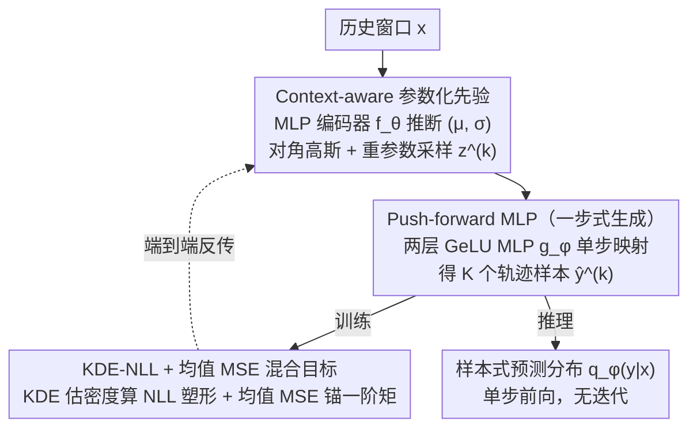

# Parametric Prior Mapping Framework for Non-stationary Probabilistic Time Series Forecasting

**会议**: ICML 2026  
**arXiv**: [2605.23402](https://arxiv.org/abs/2605.23402)  
**代码**: https://github.com/ljl8336/PPM (有)  
**领域**: 时间序列
**关键词**: 概率时序预测、非平稳性、参数化先验、push-forward 映射、KDE-NLL

## 一句话总结
PPM 用一个轻量编码器从历史序列里推断出 context-aware 高斯先验，再用一个两层 MLP 把这个先验"推前"成完整的预测分布，用 KDE-NLL + 均值 MSE 联合训练，在七个时序基准上同时打过 DeepAR 和 NsDiff 等扩散模型，推理还快 2× 到 100×。

## 研究背景与动机
**领域现状**：多元时间序列的概率预测主要走两条路。一是参数化路线，如 DeepAR 假设固定高斯似然、BetterDeepAR 学时变协方差，强归纳偏置带来稳定性和效率；二是深度生成路线，如 TimeGrad、TMDM、NsDiff 等扩散模型，把噪声逐步去噪成未来轨迹，灵活但慢、且需要大量数据。

**现有痛点**：扩散模型理论上能用任意先验逼近任何分布，但有限样本和有限算力下，**先验形态会严重影响轨迹可达性**。TMDM 用 $\mathcal{N}(f(\bm{x}),\mathbf{I})$ 当端点，方差被强行固定成单位阵；NsDiff 改进为用滑窗算方差当先验，但滑窗长度是固定超参，无法跟随快变的 aleatoric 不确定性。论文用 Traffic 数据说明了这一点：交通量在凌晨 5–6 点（低谷）和傍晚 5–6 点（高峰）的方差天差地别，而 TMDM/NsDiff 的先验方差和真实方差几乎对不上。

**核心矛盾**：参数化方法有强归纳偏置但表达能力弱，生成模型有表达能力但缺乏结构性先验、推理还慢。两者的优势是互补的，却一直被当成对立路线。

**本文目标**：（1）造一个数据自适应、跟着输入而变的先验；（2）保留生成模型的表达力，能拟合复杂的非高斯条件分布；（3）推理时不要扩散那种 T 步迭代。

**切入角度**：与其让生成模型从无信息的噪声出发去学传输映射，不如先用一个参数化估计器（MLP）从历史窗口里"白嫖"出一个 context-aware 的高斯先验，再用一个学得到的非线性映射把这个有结构的先验"推前"成最终的预测分布——这样传输映射的负担会小很多，单步前向就能完成。

**核心 idea**：用参数化估计造**自适应先验**，再用 push-forward MLP 做**一步式**条件分布生成，KDE 估密度 + 均值 MSE 锚定一阶矩做混合训练。

## 方法详解

### 整体框架
输入历史窗口 $\bm{x}\in\mathbb{R}^{H\times C}$，输出预测水平 $\bm{y}\in\mathbb{R}^{L\times C}$ 上的样本式预测分布。整条 pipeline 拆成三个阶段：

1. **参数化先验诱导**：MLP 编码器 $f_\theta(\bm{x})$ 输出每个 channel 的潜变量 $(\bm{\mu}, \bm{\sigma})\in\mathbb{R}^{C\times D}$，定义对角高斯条件先验 $p_\theta(\bm{z}|\bm{x})=\mathcal{N}(\bm{z};\bm{\mu},\text{diag}(\bm{\sigma}^2))$。
2. **分布 push-forward**：用重参数化采样 $\bm{z}^{(k)}=\bm{\mu}+\bm{\sigma}\odot\bm{\epsilon}^{(k)}$，再过一个 channel-independent 两层 GeLU MLP 映射 $g_\phi:\mathbb{R}^{C\times D}\to\mathbb{R}^{L\times C}$，得到 K 个轨迹样本 $\hat{\bm{y}}^{(k)}=g_\phi(\bm{z}^{(k)})$。预测分布形式化为 push-forward 测度 $q_\phi(\bm{y}|\bm{x})=(g_\phi)_\# p_\theta(\bm{z}|\bm{x})$。
3. **混合目标优化**：对 K 个样本做 Gaussian KDE 估边缘密度 $\hat{q}_h(y_{c,t}|\bm{x})$，用 log-sum-exp 算 NLL；再加一项基于样本均值的 MSE 锚定一阶矩。推理时只需要走一遍 $f_\theta$ 再做 K 次 $g_\phi$，不需要 KDE。

### 关键设计

**1. Context-aware 参数化先验：让先验跟着输入走，治住扩散模型"先验方差死板"的病**

扩散类概率预测理论上能用任意先验逼近任何分布，但有限样本 + 有限算力下，先验形态会严重影响轨迹可达性——TMDM 把端点方差冻成单位阵 $\mathcal{N}(f(\bm{x}),\mathbf{I})$，NsDiff 改用滑窗算方差但窗口长度是死超参，遇到 Traffic 这种凌晨低谷和傍晚高峰方差天差地别的数据就跟不上。PPM 用一个轻量 MLP $f_\theta$ 把历史窗口 $\bm{x}$ 直接映成潜空间的 $(\bm{\mu},\bm{\sigma})$，定义对角高斯条件先验 $p_\theta(\bm{z}|\bm{x}) = \mathcal{N}(\bm{z};\bm{\mu},\text{diag}(\bm{\sigma}^2))$，采样 $\bm{z}^{(k)} = \bm{\mu} + \bm{\sigma}\odot\bm{\epsilon}^{(k)}$ 保留可导性；潜维度 $D$ 设得偏"过完备"好让先验编码丰富上下文。让先验"听 $\bm{x}$ 的话"，时变 aleatoric 不确定性才有人管，而且框架对 backbone 无关，换 Transformer/RNN 同样能用。

**2. Push-forward MLP（一步式生成）：把结构化高斯先验一步映成复杂分布，省掉扩散的 T 步迭代**

扩散的 $T$ 步去噪是为了在 generic 噪声和复杂数据之间架桥，但既然先验已经被参数化估计"塞进"了上下文，传输映射就不必再迭代细化。PPM 用一个两层 channel-independent 的 GeLU MLP $g_\phi:\mathbb{R}^{C\times D}\to\mathbb{R}^{L\times C}$ 把潜码一步投到预测窗口，得到 $\hat{\bm{y}}^{(k)} = g_\phi(\bm{z}^{(k)})$，预测分布就是 push-forward 测度 $q_\phi(\bm{y}|\bm{x}) = (g_\phi)_\# p_\theta(\bm{z}|\bm{x})$。Theorem 5.2 保证这个测度在 $W_1$ 意义下对任何有限一阶矩的条件分布稠密——也就是单步也够表达复杂、非高斯、多模态的分布。因为先验承担了上下文建模，映射负担小、一个轻量 MLP 就够，推理复杂度从 $O(BKT)$ 直接降到 $O(B+BK)$。

**3. KDE-NLL + 均值 MSE 混合目标：一个塑分布形状、一个锚点预测精度，互相补盲区**

模型只能出样本、不能直接给密度，纯 KDE-NLL 又在训练早期样本离真值远时梯度消失（Gaussian kernel 几乎为零）。PPM 对每个 $(c,t)$ 用 Gaussian KDE 估边缘密度 $\hat{q}_h(y_{c,t}|\bm{x}) = \frac{1}{Kh}\sum_k\mathcal{K}(\tfrac{y_{c,t}-\hat{y}_{c,t}^{(k)}}{h})$ 再求 NLL 塑形分布，同时加一项 $\mathcal{L}_{\text{MM}} = \|\bm{y}-\frac{1}{K}\sum_k\hat{\bm{y}}^{(k)}\|^2$ 锚定一阶矩，总损失 $\mathcal{L}_{\text{total}} = \alpha\mathcal{L}_{\text{NLL}} + \mathcal{L}_{\text{MM}}$（$\alpha=0.1$，$h=0.3$）。Theorem 5.1 把 KDE 估计的 bias（$O(h^2/\varepsilon)$）和方差（$O(1/(\varepsilon h\sqrt{K})）$）写成 $h,K$ 的函数，说明两者必须协同调。分工很清楚：MSE 锚提供稠密稳定的"往均值拉"的梯度（公式 16），KDE-NLL 用 responsibility 加权的残差（公式 15）塑分布形状——这种"稠密锚 + 稀疏塑形"的组合在所有 sample-based 似然学习里都通用。

### 损失函数 / 训练策略
- 训练时每个样本采 $K=100$ 个轨迹；KDE bandwidth $h=0.3$；权重 $\alpha=0.1$。
- 编码器 $f_\theta$ 和映射 $g_\phi$ 都用 MLP，端到端反传。
- 推理时同样采 100 个样本近似预测分布；只跑一次 $f_\theta$ + 单步 $g_\phi$，无迭代。

## 实验关键数据

### 主实验
七个真实数据集（ETTh1/h2/m1/m2、Weather、Electricity、Traffic），对比 6 个 SOTA baseline（DeepAR、TimeGrad、TimeDiff、D3VAE、DiffusionTS、TMDM、NsDiff），重复 5 次取均值。

| 数据集 | 指标 | PPM | 第二名 (NsDiff) | 相对提升 |
|--------|------|------|----------|------|
| Electricity | CRPS | 0.206 | 0.286 | **-28.0%** |
| Electricity | QICE | 2.435 | 7.595 | **-67.9%** |
| Traffic | CRPS | 0.252 | 0.367 | **-31.3%** |
| Traffic | QICE | 2.744 | 8.366 | **-67.2%** |
| ETTh1 | CRPS | 0.337 | 0.417 | -19.2% |
| ETTh2 | MSE | 0.376 | 0.448 | -16.1% |
| Weather | CRPS | 0.215 | 0.240 (TMDM) | -10.4% |

CRPS 全部 7 个数据集 SOTA，QICE 在 6/7 个数据集 SOTA（ETTh2 略输 NsDiff 第二）。MSE/MAE 在所有 7 个数据集都是 SOTA。在 dynamics 越复杂（Variance 越大）的数据集如 Traffic（Variance=14.225），PPM 提升越显著。

### 消融实验

| 配置 | ETTm1 MSE | ETTm1 CRPS | ETTm1 QICE | Elec MSE | Elec CRPS | Elec QICE |
|------|-----------|------------|------------|----------|-----------|-----------|
| Full PPM | **0.381** | **0.314** | **1.782** | **0.182** | **0.206** | **2.435** |
| w/o NLL | 0.371 | 0.345 | 6.342 | 0.182 | 0.257 | 8.317 |
| w/o MM (均值MSE) | 0.407 | 0.324 | 1.912 | 0.191 | 0.213 | 5.697 |

先验形式消融（Table 4，Traffic）：直接用 Gaussian/Uniform 当预测分布的 QICE 是 2.414/3.715，加上 push-forward 之后 Gaussian → 2.744（CRPS 从 0.266 → 0.252）、Uniform → 2.616（CRPS 从 0.271 → 0.251），说明 push-forward 对**先验形式不敏感**。

### 关键发现
- **MM loss 主要稳点预测**：去掉 MM 后 MSE 显著上升（ETTm1: 0.381 → 0.407），印证 KDE-NLL 早期梯度不稳的理论分析。
- **NLL loss 主要塑分布**：去掉 NLL 后 QICE 严重恶化（ETTm1: 1.782 → 6.342, Electricity: 2.435 → 8.317），CRPS 也变差，说明分布 calibration 主要靠 NLL。
- **推理速度 2×–100×**：相比 TimeGrad/TMDM/NsDiff 等扩散模型，PPM 把 $O(BKT)$ 的 $T$ 步去噪压缩成单步映射，理论复杂度 $\Theta(T)$ 倍降。
- **越非平稳越显优**：Traffic 这种 Fourier 方差最大（14.225）的数据集上，相对 NsDiff 提升最大（CRPS -31.3%，QICE -67.2%），印证 context-aware 先验对非平稳的关键作用。
- **MI 下界更高更稳**：Figure 4 显示 PPM 的潜变量 $\bm{z}$ 和输入 $\bm{x}$ 的互信息下界普遍高于 baseline，证明先验确实"吸收"了上下文。

## 亮点与洞察
- **把"先验"从死板的高斯/滑窗升级成可学的 context-aware 分布**：这是对扩散类时序预测的一个简单却深刻的改造——他们都意识到先验形态影响结果，但仍把"形态"当成超参；PPM 直接让 $\bm{x}$ 决定先验参数，从根上修掉了非平稳场景的失配。
- **"少做一点"反而更快更准**：把 T 步去噪折叠成单步 push-forward，这是经典的"用归纳偏置换迭代次数"的范式——只要先验承担了一部分上下文建模，传输映射就不需要那么多次微调。这套思路完全可以迁移到其他生成任务（例如条件图像生成）：先用一个轻量分支算 condition-aware prior，再让小 decoder 做单步映射。
- **KDE-NLL + 均值 MSE 的互补**：作者用公式 15 和 16 漂亮地解释了两个梯度信号的"分工"——KDE-NLL 的梯度被 responsibility 权重稀疏化（winner-take-all），早期方差大；MM 的梯度稠密、永远把均值往真值拉。这种"稠密锚 + 稀疏塑形"组合在所有 sample-based 似然学习里都通用。
- **理论给得很到位**：Theorem 5.1 直接把 KDE 估计的 bias 和 variance 写成 $h$ 和 $K$ 的函数，给训练超参 co-tuning 提供了原则性指导，不像很多 paper 把超参当玄学。

## 局限与展望
- **KDE bandwidth 敏感性**：作者承认在极端/快变 regime 下，单一固定 $h$ 会放大估计误差。可学 bandwidth 或局部多带宽 KDE 是明显延伸。
- **只学边缘分布**：当前 NLL 是逐 $(c,t)$ 算的边缘密度，没显式建模跨时间 / 跨变量的联合依赖；如果下游任务需要 path-dependent 决策（如风险管理、能量调度），可能不够。作者也提到能量得分（energy score）或 variogram score 是替代方向。
- **校准评估有限**：主要靠 CRPS / QICE 报告 calibration，但没有给可靠图（reliability diagram）或分位数覆盖率随时间的细粒度评估，对真正的非平稳 calibration 检查不够。
- **理论假设较强**：Theorem 5.2 的稠密性是"对每个固定 $\bm{x}$"的，没给一致逼近率；条件分布的 sample complexity 还是开放问题。
- **backbone 比较单一**：正文只用了 MLP，更复杂 backbone（Transformer）放在附录。Transformer 上能不能保持速度优势是个实操问题。

## 相关工作与启发
- **vs TMDM (NeurIPS'24)**: 都把"先验"作为可学对象，但 TMDM 用 $\mathcal{N}(f(\bm{x}),\mathbf{I})$ 仍把方差冻成单位阵，且骨架是 diffusion；PPM 让方差也跟着 $\bm{x}$ 动，且把 T 步去噪压缩成单步映射，推理快 2–100×。
- **vs NsDiff (ICLR'25)**: NsDiff 用固定滑窗算方差作为 prior，对**短期**非平稳有效，但窗口长度是死的，跟不上 Traffic 这种快变 dynamics；PPM 用端到端学的 $\bm{\sigma}(\bm{x})$ 自适应跟踪。Table 2 中 Traffic 上 PPM 把 QICE 从 8.366 砍到 2.744。
- **vs Flow-based / Normalizing Flow**: 都用 push-forward 视角看生成；NF 通常要求映射可逆 + Jacobian 易算，限制架构；PPM 不要求可逆，靠 KDE 估密度绕开 likelihood 计算，架构更自由。
- **vs DeepAR**: DeepAR 是纯参数化（autoregressive RNN + 固定高斯）；PPM 保留了"参数化先验"的效率，但把输出端打开成 sample-based，因此能拟合非高斯分布。可以理解为"把 DeepAR 的高斯输出端换成 push-forward MLP"。
- **启发**：condition-aware prior + 轻量 push-forward 的范式可以迁到任何"扩散太慢"的领域——比如条件图像生成、视频生成、神经渲染——只要能造一个 cheap parametric estimator 就行。

## 评分
- 新颖性: ⭐⭐⭐⭐ 概念上把参数化和生成两条路线优雅地接起来，push-forward+context-aware prior 的组合是首次在概率时序预测里清晰提出，但底层每个组件（reparameterization、KDE-NLL、push-forward）都不新。
- 实验充分度: ⭐⭐⭐⭐ 7 个数据集、6 个强 baseline、CRPS/QICE/MSE/MAE 四个指标都报；目标函数、先验形式、互信息分析都有消融；少 reliability diagram、long-horizon、不同 backbone 主表分析。
- 写作质量: ⭐⭐⭐⭐ Figure 1 motivation 直击痛点；Theorem 5.1/5.2 与方法呼应到位；记号一致；不足是有少量公式打字问题（"triaining"）和 Figure 2 描述偏紧。
- 价值: ⭐⭐⭐⭐ 实用性极强——精度全面 SOTA + 推理 2–100× 加速，对生产环境的概率预测（能源、交通、金融）有直接价值；代码开源；"用 condition-aware prior 加速生成"的方法论对生成模型社区有迁移价值。

<!-- RELATED:START -->

## 相关论文

- [\[ICML 2026\] Dynamic-TMoE: A Drift-Aware Dynamic Mixture of Experts Framework for Non-Stationary Time Series](dynamic_tmoe_a_drift-aware_dynamic_mixture_of_experts_framework_for_non-stationa.md)
- [\[AAAI 2026\] Towards Non-Stationary Time Series Forecasting with Temporal Stabilization and Frequency Differencing](../../AAAI2026/time_series/towards_non-stationary_time_series_forecasting_with_temporal_stabilization_and_f.md)
- [\[ICML 2026\] CombinationTS: A Modular Framework for Understanding Time-Series Forecasting Models](combinationts_a_modular_framework_for_understanding_time-series_forecasting_mode.md)
- [\[ICML 2026\] U-Cast: A Surprisingly Simple and Efficient Frontier Probabilistic AI Weather Forecasting](u-cast_a_surprisingly_simple_and_efficient_frontier_probabilistic_ai_weather_for.md)
- [\[NeurIPS 2025\] Neural MJD: Neural Non-Stationary Merton Jump Diffusion for Time Series Prediction](../../NeurIPS2025/time_series/neural_mjd_neural_non-stationary_merton_jump_diffusion_for_time_series_predictio.md)

<!-- RELATED:END -->
