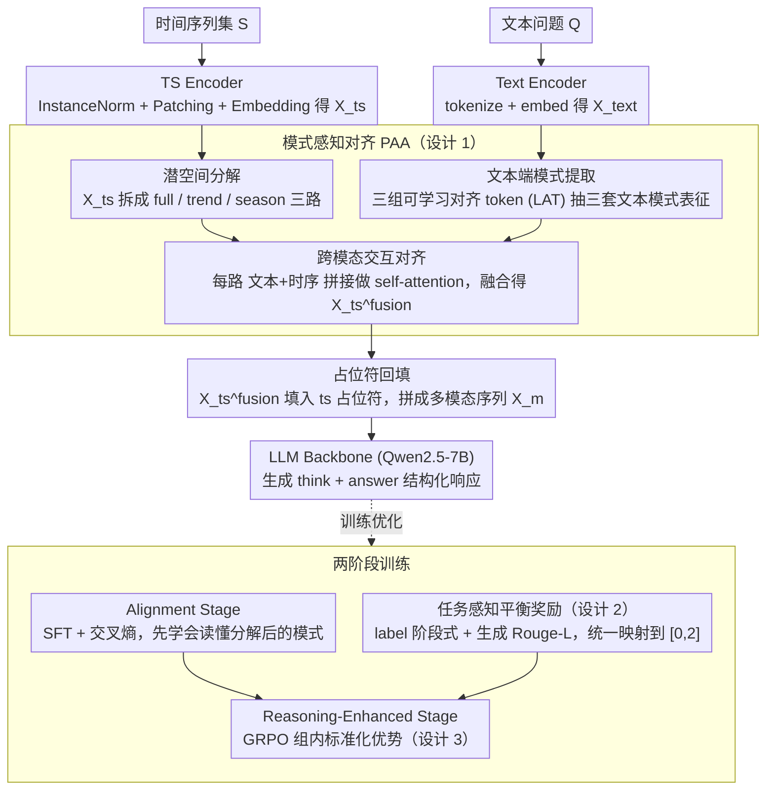

# PATRA: Pattern-Aware Alignment and Balanced Reasoning for Time Series Question Answering

**会议**: ICML 2026  
**arXiv**: [2602.23161](https://arxiv.org/abs/2602.23161)  
**代码**: [github.com/decisionintelligence/PATRA](https://github.com/decisionintelligence/PATRA)  
**领域**: 时间序列 / 多模态 / 强化学习  
**关键词**: 时间序列问答, 模式感知对齐, GRPO, 平衡奖励, 跨模态推理

## 一句话总结
针对时间序列问答 (TSQA)，PATRA 在表征端把序列显式拆成 full / trend / season 三类模式，并通过三组可学习对齐 token 与文本做深度交叉对齐；在训练端用 SFT + GRPO 两阶段强化学习，把判别式与生成式任务的奖励统一映射到 $[0,2]$ 解决难度失衡，从而在四类 TSQA 任务上全面超越文本 LLM、ChatTS 等多模态时序 LLM。

## 研究背景与动机

**领域现状**：时间序列问答 (TSQA) 是当下时序基础模型最被关注的应用形态，已经形成两条主流路线：(a) 单模态推理，把数值串直接 tokenize 成文本喂给 LLM (LLMTime, DeepSeek-R1 风格)；(b) 多模态浅对齐，模仿 VLM 把序列切 patch 做投影后与文本 embedding 拼接 (ChatTS, ITFormer 风格)。

**现有痛点**：第一类做法忽略了时间序列与文本在信息密度、连续性上的根本差异，模型很难基于"趋势 / 季节性"等结构化模式做精确判断；第二类做法只是简单的"图像-文本式拼接"，没有针对时序的多层动态显式建模，所谓"深度对齐"流于形式。更隐蔽的痛点是训练目标：TSQA 任务集合横跨从二分类判别到开放式生成的整个谱系，简单任务奖励容易达到饱和，复杂推理任务奖励稀疏，naive SFT/RL 会让模型疯狂"刷简单题"，导致 reward hacking 和深度推理能力萎缩。

**核心矛盾**：跨模态对齐的"深度"被 patch-concat 范式天花板封死；多任务训练的"平衡"被奖励量纲与梯度幅度差异破坏。这两件事都不能靠堆数据解决。

**本文目标**：(1) 显式抽取时序中的不同语义层级（整体 / 趋势 / 季节性），并让文本侧也学到对应粒度的查询表征，做真正的"模式级"对齐；(2) 设计一个对任务难度不敏感的奖励体系，让 GRPO 能在异质任务上稳定优化。

**切入角度**：作者观察到时序的"可解释行为"几乎都建立在 trend / seasonality 之上，金融决策、能源调度无不依赖周期回撤——这给"按模式分解、按模式对齐"提供了天然的归纳偏置。同时，强化学习里只要把不同奖励分布映射到同一量纲，就可以缓解多任务下的优化不平衡。

**核心 idea**：在表征层用"潜空间模式分解 + 可学习对齐 token (LAT) 的多路交叉注意力"做深度对齐；在训练层用"两阶段 SFT→GRPO + Stage-wise label reward + Rouge-L generation reward + $[0,2]$ 标准化"做平衡推理。

## 方法详解

### 整体框架
PATRA 整体由一个 Text Encoder（直接用 LLM 自带 tokenizer 与 embedding）、一个 TS Encoder（Instance Norm + Patching + Embedding）、一个 Pattern-Aware Alignment 模块、和一个 LLM Backbone (Qwen2.5-7B) 组成。文本与时序各自编码后送入对齐模块，对齐后的时序 token 通过 `<ts>...</ts>` 占位符回填到文本 token 序列里，再整体送给 LLM 生成 `<think>...</think><answer>...</answer>` 形式的响应。训练分两阶段：先在大规模 TSQA 数据上做 SFT (Alignment Stage)，再用 GRPO + 复合奖励做 Reasoning-Enhanced Stage。

### 关键设计

**1. 模式感知对齐模块（PAA）：把时序-文本对齐从"浅层拼接"升级成"模式级深度对齐"**

ChatTS、ITFormer 那类做法只是模仿 VLM 把序列切 patch 投影后跟文本拼起来，所谓"深度对齐"流于形式，LLM 推理时很难精确引用"趋势"或"季节性"这种结构化概念。PAA 分三步把分解直觉嵌进注意力。第一步潜空间分解：完整成分直接用 $X_{ts}^f$，趋势成分用移动平均 $X_{ts}^t = \text{Avgpool}(\text{padding}(X_{ts}))$，季节成分取残差 $X_{ts}^s = X_{ts} - X_{ts}^t$——分解放在潜空间而非原始数值层，保住语义信息。第二步文本端模式提取：定义三组可学习对齐 token（LAT）$Q_{full},Q_{trend},Q_{sea}$ 当 query，对文本 embedding 做多头注意力 $X_k^{text} = \text{Attention}(Q_k,K,V)$，得到三套模式特化的文本表征；用可学 LAT 而不是固定 prompt，让文本侧的模式表达也能学。第三步跨模态交互对齐：把每对 $(X_k^{text},X_{ts}^j)$ 拼成新 query 做 self-attention，让时序 token 吸收对应模式下的文本语义，最后三路融合成 $X_{ts}^{fusion}$。三路同时对齐而非单一全局对齐，避免了"模式信息纠缠"，于是 LLM 能真正区分"趋势在涨"和"季节性周期回撤"。

**2. 任务感知平衡奖励：把异质任务的奖励统一到同一量纲，治住 reward hacking**

TSQA 横跨从二分类判别到开放式生成的整个谱系，简单题奖励容易饱和、复杂推理题奖励稀疏，naive SFT/RL 会让模型疯狂刷简单题、深度推理萎缩。PATRA 把任务分两类分别给奖励：带标签任务（selection/judgment）用阶段式奖励 $r_{label} = \sum_{k=1}^K \lambda_k r_k(\text{answer})$，逐级验证"是否在候选范围内 → 选项是否正确"，避免端到端只给二元奖励导致早期梯度噪声大；生成任务用 Rouge-L 作连续奖励 $r_{generation} = \text{TextScore}(\text{answer},y^\star)$，奖励序列级对齐而非关键词碰撞。最关键的一招是把所有任务奖励**线性映射到 $[0,2]$ 区间**，再叠加 format reward，得到 GRPO 总奖励 $r(\tau) = r_{format}(\tau) + r_{task}(\tau)$。$[0,2]$ 归一化消除了奖励量纲差异——消融里去掉它，Prescience Acc 直接从 52.78 掉到 35.18，证明跨任务量纲对 GRPO 稳定性是决定性的。

**3. GRPO + 复合奖励的优化范式：在 SFT 之上逼出思维链和跨任务通用推理**

光靠 SFT 模型只会"模仿答案"，产生不了 `<think>...</think>` 那种推理结构（消融里只做 SFT 时 Reasoning Acc 仅 13.51%）。PATRA 用 Group Relative Policy Optimization：对每个 prompt 采一组响应，用组内标准化优势 $\hat A_{group}(\tau) = (r(\tau) - \mu)/(\sigma + \epsilon)$ 替代 PPO 的值函数，最大化 $L(\theta) = \mathbb{E}_{\tau\sim\pi_{\theta_{old}}}[\frac{\pi_\theta(\tau)}{\pi_{\theta_{old}}(\tau)}\hat A_{group}(\tau)]$，并加 KL 项约束远离参考模型。组内标准化和上一步的奖励 $[0,2]$ 归一化形成双重稳定，对 TSQA 里稀疏的正例尤其友好——既省掉训 critic 的开销，又靠相对排序压住奖励波动。

### 损失函数 / 训练策略
Alignment Stage 用标准交叉熵 SFT，让模型先学会"看懂"分解后的时序模式；Reasoning-Enhanced Stage 切换成 GRPO，所有奖励通过上文映射到 $[0,2]$ 再加权求和。推理时模型按 `<think>...</think><answer>...</answer>` 结构生成，answer 区段被规则化抽取后送入评测。训练用 4 张 A800、Qwen2.5-7B 为 backbone。

## 实验关键数据

### 主实验
TSQA (Kong et al., 2025) 数据集共 ~200k 样本、12+ 域、四类任务 (Comprehension / Recognition / Reasoning / Prescience)；评估指标对带标签任务用 Accuracy，对生成任务用 Rouge-L。

| 模型 | Comp. Acc / Rou. | Recog. Acc / Rou. | Reason. Acc / Rou. | Presc. Acc / Rou. |
|---|---|---|---|---|
| GPT-4o (上界) | 50.86 / 11.99 | 69.65 / 4.75 | 50.00 / 7.75 | 66.66 / 6.78 |
| Qwen2.5-7B | 42.24 / 18.77 | 45.51 / 10.32 | 36.48 / 18.72 | 26.85 / 10.67 |
| ChatTS-7B | 44.83 / 13.30 | 36.00 / 13.23 | 22.97 / 15.84 | 25.92 / 13.99 |
| ITFormer-7B | 40.52 / 14.24 | 45.24 / 14.61 | 30.40 / 15.58 | 44.44 / 15.25 |
| **PATRA-7B** | **56.03 / 25.67** | **64.69 / 25.46** | **44.59 / 27.36** | **52.78 / 27.06** |

PATRA 在所有 4 个任务的 Accuracy 与 Rouge-L 上同时夺冠（开源模型范围），Recognition 比最强文本模型 +19.18%，Prescience 比 ChatTS +26.86%，已经在多数指标上接近 GPT-4o 上界。Out-of-Domain 实验（Weather/Finance 全部从训练中剔除）显示 PATRA 在 MTBench 的 6 个 Finance 指标和 2 个 Weather 指标上全 SOTA，包括 Finance 30 天 5-way 趋势预测 43.70% (vs GPT-5.2 36.05%)。

### 消融实验

| 配置 | Reason. Acc / Rou. | Presc. Acc / Rou. | 说明 |
|---|---|---|---|
| Full PATRA | 44.59 / 27.36 | 52.78 / 27.06 | 完整模型 |
| w/ Single-Pattern Alignment | 35.81 / 26.19 | 37.03 / 24.03 | 只对齐单一模式，掉 8.78 / 15.75 Acc |
| w/o Pattern-Aware Alignment | 28.37 / 16.81 | 30.55 / 16.94 | 完全去掉 PAA 模块 |
| w/o Reasoning-Enhanced Stage | 13.51 / 2.92 | 16.66 / 13.06 | 只 SFT，下降最大，验证 RL 关键性 |
| Original (unscaled) Reward | 37.84 / 21.64 (Reason.) | 35.18 / 16.88 (Presc.) | 不做 $[0,2]$ 归一化，Prescience 掉 17.6 Acc |
| Balanced Reward | 44.59 / 27.36 | 52.78 / 27.06 | 完整奖励归一化 |

### 关键发现
- Reasoning-Enhanced Stage 贡献最大：仅做 SFT 时 Reasoning Acc 仅 13.51%，加入 GRPO + 复合奖励后跃升到 44.59%，提升 31 个点，说明 RL 阶段是从"模仿答案"到"产生思维链"的关键转变。
- Pattern-Aware Alignment 的影响在生成型任务上尤为显著：去掉 PAA 后 Reasoning Rouge 从 27.36 跌到 16.81，说明深度对齐让生成段落能真正"引用"时序模式而非空泛复述。
- 奖励 $[0,2]$ 归一化把 Prescience Acc 从 35.18 → 52.78，证明跨任务奖励量纲对 GRPO 稳定性是决定性因素，原始未归一化版会让模型偏向简单任务获取高 reward。
- 案例分析显示 PATRA 在非平稳、强波动序列上仍能识别周期回撤，而 ChatTS / Qwen2.5 只能输出"逐渐增加"等空泛描述。

## 亮点与洞察
- 把"时序分解"从预处理阶段搬到嵌入空间内做，并配以可学的文本端 LAT，是把信号处理直觉嵌入 LLM 框架最自然的方式之一——既保留了趋势/季节性的可解释性，又不需要额外的频谱编码器。
- 奖励的 $[0,2]$ 归一化看似简单，却对 GRPO 在异质任务上的稳定性贡献巨大；这一招可以迁移到任何"多任务 RLHF"的场景，比如代码 + 对话 + 数学的同步 RL。
- Stage-wise label reward 提供了"早期密集信号"，本质上是把奖励里加入了课程结构，对 sparse-reward 的 RL 训练有可复用价值。
- `<ts>...</ts>` 占位符回填策略保留了原始 NL 结构，避免对齐 token 引入分布偏移，是处理多模态 token 序列时一个值得借鉴的小技巧。

## 局限与展望
- 当前模式分解只用 trend / season 二分（加上 full 共三个），对包含 regime change、突变事件的序列（如金融崩盘）解释力有限；案例分析中作者也承认非平稳信号上分解效果欠佳。
- Pattern-Aware Alignment 的计算量随序列长度和 LAT 数量 $T$ 增长较快，长序列推理成本未给出。
- 评估主要在 TSQA + MTBench 两个数据集，跨任务泛化已展示，但 zero-shot 对真实世界生产数据流的鲁棒性还有待考察。
- $[0,2]$ 归一化的边界值选择有些 ad-hoc，对极难任务的奖励信号是否会被压缩得过小未讨论。
- GRPO 仅使用规则化奖励，缺乏过程奖励 (PRM)；对长链推理能否进一步用 process supervision 提升是值得探索的方向。

## 相关工作与启发
- **vs ChatTS / ITFormer**：它们做的是"shallow alignment"——patch 投影 + concat；PATRA 显式分解模式并多路对齐，Recognition 提升 28.69%。
- **vs Time-MQA**：Time-MQA 采用统一 QA 框架但仍是 SFT 主导；PATRA 加入 RL 与 task balancing，跨任务表现更稳。
- **vs TimeOmni-1**：TimeOmni 强调可解释推理链但缺乏深度对齐；PATRA 把"模式"显式编进表征里，实现的可解释性更基于数据本身。
- **vs DeepSeek-R1 (在 TSQA 上)**：纯文本 RL 模型在 Recognition 上仅 12.41% Acc，说明没有时序专门表征，RL 优势难以释放。

## 评分
- 新颖性: ⭐⭐⭐⭐ Pattern-Aware Alignment 把分解直觉嵌入跨模态注意力，是 TSQA 路线下的清晰新组合。
- 实验充分度: ⭐⭐⭐⭐ 4 任务 + OOD MTBench + 充分消融，Stage-wise / Balanced Reward 都有单独验证。
- 写作质量: ⭐⭐⭐⭐ 动机—方法—消融逻辑严密，框图清楚。
- 价值: ⭐⭐⭐⭐ 为时序-语言模型设定了新的 SOTA，奖励平衡技术对其他多任务 RL 有直接借鉴价值。

<!-- RELATED:START -->

## 相关论文

- [\[ACL 2026\] ODTQA-FoRe: An Open-Domain Tabular Question Answering Dataset for Future Data Forecasting and Reasoning](../../ACL2026/time_series/odtqa-fore_an_open-domain_tabular_question_answering_dataset_for_future_data_for.md)
- [\[ICML 2026\] Adaptive Time Series Reasoning via Segment Selection](adaptive_time_series_reasoning_via_segment_selection.md)
- [\[ACL 2025\] Time-MQA: Time Series Multi-Task Question Answering with Context Enhancement](../../ACL2025/time_series/time-mqa_time_series_multi-task_question_answering_with_context_enhancement.md)
- [\[ICML 2026\] Interpretability in Deep Time Series Models Demands Semantic Alignment](interpretability_in_deep_time_series_models_demands_semantic_alignment.md)
- [\[ICLR 2026\] Unlocking the Value of Text: Event-Driven Reasoning and Multi-Level Alignment for Time Series Forecasting](../../ICLR2026/time_series/unlocking_the_value_of_text_event-driven_reasoning_and_multi-level_alignment_for.md)

<!-- RELATED:END -->
