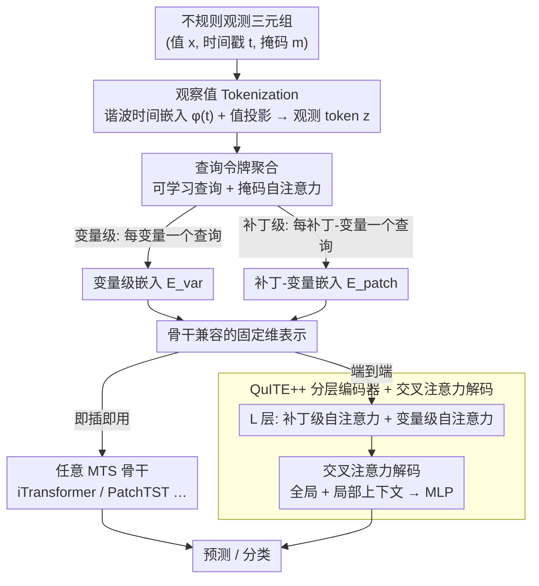

# QuITE: Query-based Irregular Time Series Embedding

**会议**: ICML 2026  
**arXiv**: [2605.28166](https://arxiv.org/abs/2605.28166)  
**代码**: 待确认  
**领域**: 时间序列 / 不规则采样  
**关键词**: 不规则时间序列, 嵌入, 多变量预测, 查询令牌

## 一句话总结
QuITE 是一个**即插即用的嵌入模块**——使用可学习的查询令牌通过自注意力直接聚合不规则观测，将任意 MTS 模型适配到不规则多变量时间序列（IMTS），无需改动架构或生成人工值；在 iTransformer + QuITE 上预测平均相对提升 54.7%。

## 研究背景与动机

**领域现状**：不规则多变量时间序列（IMTS）在医疗 / 气候 / 工业监测等领域普遍存在。现有方法分两类——架构设计类（GRU-D、Latent ODE、GNN 等）针对不规则性设计专门架构；数据适配类（mTAND、IP-Nets）通过插值将 IMTS 映射到规则时间网格。

**现有痛点**：架构设计方法虽处理不规则性但无法复用已充分验证的强大 MTS 模型（PatchTST、iTransformer 等）；插值方法虽允许模型复用但通过生成人工值破坏真实时间动态，最终性能下降。两类方法都有 trade-off。

**核心矛盾**：问题的真正瓶颈**不在骨干网络的架构设计，而在输入嵌入层**——现有嵌入方案假设均匀采样，对不规则输入天然不适配。简单的融合策略（时间嵌入 + 值嵌入相加或拼接）仍然受限于均匀采样的设计范式。虽然注意力机制可以捕捉不规则观测间的交互，但其观测级输出需要额外池化才能匹配现代 MTS 模型期望的变量级或补丁级表示，而这种池化会稀释细粒度时间信息。

**本文目标**：在输入嵌入层设计简单高效的适配机制，使现有 MTS 模型无需改动架构即可直接处理 IMTS。

**切入角度**：直接在嵌入层而非架构级或数据预处理级处理不规则性。关键观察是可以用可学习查询令牌作为**结构化聚合锚点**，通过单层自注意力将不规则观测转化为骨干网络兼容的固定维表示。

**核心 idea**：用可学习的**查询令牌**通过自注意力机制直接从不规则观测中提取结构化嵌入表示，绕过有损池化和人工值生成，使输出可直接作为骨干模型的输入。

## 方法详解

### 整体框架
QuITE 是即插即用（plug-and-play）的嵌入模块——（1）观察值 Tokenization：将每个观测 $(x_{n, i}, t_{n, i}, m_{n, i})$ 编码为 token；（2）查询令牌聚合：用可学习查询令牌通过掩码自注意力聚合变量或补丁级别观测，输出骨干兼容的固定维表示。聚合可灵活配置为**变量级**（每变量一个查询令牌）或**补丁级**（每补丁-变量对一个查询令牌）。得到的表示既能即插即用喂给任意现有 MTS 骨干（iTransformer、PatchTST 等），也能进入（3）QuITE++ 分层编码器 + 交叉注意力解码器做端到端预测。

### 关键设计

**1. 观察值 Tokenization：把不规则三元组观测变成统一可比的 token**

IMTS 的每条观测是 $(x_{n, i}, t_{n, i}, m_{n, i})$ 三元组——值、连续时间戳、掩码，时间戳还不对齐，没法直接喂给假设均匀采样的嵌入层。QuITE 先把它们各自编码再合成 token：连续时间戳用谐波时间嵌入 $\phi(t)[k] = \omega_0 t + \alpha_0$（$k=0$）或 $\sin(\omega_k t + \alpha_k)$（$k>0$）编码，频率和相位都可学，这样任意时间跨度都能被周期性地表示；值经线性投影 $f_{\text{val}}$ 映到隐空间，最终 token 为 $z_{n, i} = f_{\text{val}}(x_{n, i}) + \phi(t_{n, i})$。掩码 $m_{n, i}$ 则标出缺失或填充观测，留给后面的注意力直接跳过。这一步既不重网格化也不造人工值，原始采样模式被完整保留下来。

**2. 查询令牌聚合：用可学习锚点直接产出骨干要的表示形状，绕开有损池化**

注意力虽能捕捉不规则观测间的交互，但它的输出是观测级的，要再池化才能凑成骨干网络期望的变量级或补丁级表示，而池化会稀释细粒度时间信息。QuITE 的破解点是引入可学习查询令牌当结构化聚合锚点：变量级时，给每个变量配一个查询令牌 $q_n$，与该变量的全部观测 $Z_n$ 做掩码自注意力 $H_n = \text{SelfAttn}([q_n; Z_n], A_n = [1 | m_n])$，查询令牌的更新输出 $e_n = H_n[0]$ 就是变量级嵌入；补丁级同理，给每个 (补丁, 变量) 对一个查询令牌，得到补丁-变量矩阵 $E_{\text{patch}} \in \mathbb{R}^{M \times N \times D}$。这思路类似 BERT 的 [CLS] token，但这里的查询不是去语义化的通用 token，而是直接把不规则观测聚合成骨干兼容的固定维表示——掩码让它天然跳过缺失值，又不必额外池化，信息损失因此最小。

**3. QuITE++ 分层编码器：把嵌入模块扩成显式建模时间与变量依赖的完整架构**

QuITE 本身只是嵌入层，要做端到端预测还得有主干。QuITE++ 在它之上堆 $L$ 层分层编码器，每层含两个注意力块：补丁级自注意力把变量令牌前置到补丁序列上、建模时间依赖；变量级自注意力则在所有变量令牌间建模跨变量交互。解码器用交叉注意力同时抽取全局和局部上下文。这种分层结构既能抓补丁内的局部时间模式，又能借变量令牌捕捉全局与跨变量依赖，而交叉注意力解码避免了对补丁拉平或额外设计的限制。

## 实验关键数据

### 主实验：不同方法在多种骨干上的预测性能提升

| 骨干类型 | 数据集 | 模型 | 无 QuITE MSE | 加 QuITE MSE | 相对提升 |
|--------|--------|------|-------------|------------|---------|
| 补丁级 | Human Activity | PatchTST | 3.10 | 2.76 | +10.97% |
| 补丁级 | USHCN | PatchMixer | 5.31 | 5.02 | +5.46% |
| 变量级 | PhysioNet | iTransformer | 16.48 | 4.99 | +69.72% |
| 变量级 | MIMIC-III | iTransformer | 6.05 | 1.56 | +74.19% |
| 混合 | Human Activity | TimeXer | 2.99 | 2.53 | +15.52% |
| **平均** | **各数据集** | **iTransformer+QuITE** | 8.37 | 3.79 | **+54.70%** |

### 分类性能

| 数据集 | 指标 | 无 QuITE | PatchMixer+QuITE | iTransformer+QuITE |
|--------|------|---------|-----------------|-------------------|
| P12 | AUROC | 78.2 | 83.9 | 85.3 |
| P19 | AUPRC | 26.4 | 55.8 | 51.7 |
| PAM | F1 | 75.7 | 83.7 | 91.5 |

### 消融实验（不同嵌入策略对比）

| 嵌入策略 | PatchTST | iTransformer | QuITE++ | 说明 |
|--------|---------|------------|---------|------|
| Add（时间 + 值） | 4.00 | 4.98 | 3.44 | 直接相加 |
| Concat | 3.90 | 5.77 | 3.35 | 拼接 |
| mTAND（隐空间插值） | 3.74 | 3.50 | 3.34 | 数据级插值 |
| Mean Pooling | 3.75 | 3.59 | 3.31 | 注意力后平均 |
| **QuITE（可学习查询）** | **3.69** | **3.31** | **3.18** | **最佳** |

### 关键发现
- **骨干无关性**：QuITE 对 6 种 MTS 骨干都有一致提升，平均 5.1%-54.7%。
- **差异化受益**：变量级模型（iTransformer、S-Mamba）因对不规则采样更敏感而获益最多（25%-74%）；补丁级模型因独立建模变量而受益较少（5%-11%）。
- **数据集差异**：医疗数据（MIMIC-III、PhysioNet）提升最显著（30%-74%），气候数据（USHCN）保守（1%-33%）。
- **鲁棒性**：即使随机移除 50% 观测，QuITE++ 性能保持稳定；移除 75% 后性能大幅下降，实际可用稀疏极限约 50%。

## 亮点与洞察
- **问题定位精准**：识别出瓶颈不在架构而在嵌入层，避免大规模改造既有强力模型——只需替换输入模块即可获得显著收益。
- **查询令牌的通用性**：虽借鉴 BERT [CLS] token，但创意在于用可学习查询作为**结构化锚点**而非去语义化的通用 token，直接聚合不规则观测无需额外池化。
- **即插即用**：QuITE 完全解耦于骨干架构，可无缝插入任意 MTS 模型前端，大幅降低应用门槛；6 种不同类型骨干都受益，证明通用性和鲁棒性。
- **消融设计**：通过对比 Add / Concat / Mean Pooling / mTAND 逐步验证每个设计选择都有数据支撑。
- **迁移可能**：分层编码结构可推广到其他序列模型（语言模型处理不同长度、多率制文本）；可学习令牌聚合范式可推广到其他不规则采样数据（点云、动态图）。

## 局限与展望
- 补丁级 MTS 模型在 PhysioNet / MIMIC-III 等需要变量交互的医疗数据上性能较弱（补丁级模型本身的局限）。
- 实际运行时间取决于骨干实现细节，未必总是快。
- 鲁棒性测试表明观测缺失率超 75% 后性能快速下降，超高稀疏场景可能无解。
- 改进：扩展为多头分层架构细化变量和补丁间依赖；引入稀疏注意力降低计算复杂度；跨数据集预训练实现零样本迁移。

## 相关工作与启发
- **vs GRU-D / P-LSTM**：RNN 方法通过衰减或门控处理缺失值，但受 RNN 架构制约；QuITE 优势在于能复用现代 Transformer 等强大骨干。
- **vs 连续时间 ODE（Latent-ODE、ContiFormer）**：ODE 方法在观测间学习连续动态，表达能力强但计算复杂；QuITE 通过注意力直接聚合计算更高效。
- **vs GNN 方法（GraFITi、tPatchGNN）**：图神经网络能建模变量-时间二部图关系但引入了图构造的设计复杂性；QuITE 的自注意力更简洁。
- **vs 插值方法（mTAND、IP-Nets）**：mTAND 在隐空间插值规避了显式人工值但仍改变了真实采样模式；QuITE 直接处理原始观测保持完整性。

## 评分
- 新颖性: ⭐⭐⭐⭐  查询令牌聚合思路简洁但有效；在不规则序列适配问题上形成了新视角——从架构 / 数据层面转向嵌入层。
- 实验充分度: ⭐⭐⭐⭐⭐  7 个数据集 + 6 大类骨干 + 17 个 baseline + 4 种消融对比 + 鲁棒性分析，实验设计细致全面。
- 写作质量: ⭐⭐⭐⭐  逻辑清晰，问题动机表述深入，方法设计说理充分；某些实验细节（补丁划分策略）未充分讨论。
- 价值: ⭐⭐⭐⭐⭐  即插即用特性显著降低实践应用门槛；在医疗 / 气候等高稀疏场景的巨大提升（50%-75%）具有重要应用价值。

<!-- RELATED:START -->

## 相关论文

- [\[ICML 2026\] Latent Laplace Diffusion for Irregular Multivariate Time Series](latent_laplace_diffusion_for_irregular_multivariate_time_series.md)
- [\[ICLR 2026\] Learning Recursive Multi-Scale Representations for Irregular Multivariate Time Series Forecasting](../../ICLR2026/time_series/learning_recursive_multi-scale_representations_for_irregular_multivariate_time_s.md)
- [\[ACL 2025\] LETS-C: Leveraging Text Embedding for Time Series Classification](../../ACL2025/time_series/lets-c_leveraging_text_embedding_for_time_series_classification.md)
- [\[AAAI 2026\] Revitalizing Canonical Pre-Alignment for Irregular Multivariate Time Series Forecasting](../../AAAI2026/time_series/revitalizing_canonical_pre-alignment_for_irregular_multivariate_time_series_fore.md)
- [\[ICML 2025\] TQNet: Temporal Query Network for Efficient Multivariate Time Series Forecasting](../../ICML2025/time_series/temporal_query_network_for_efficient_multivariate_time_series_forecasting.md)

<!-- RELATED:END -->
