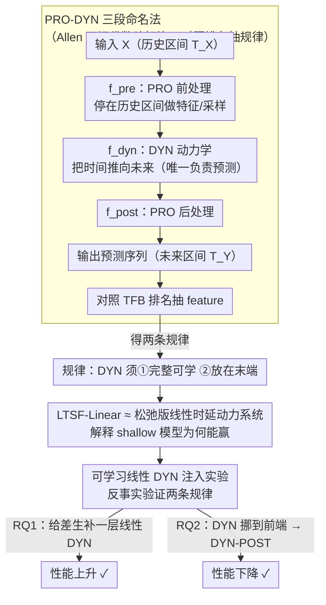

# Time-series Forecasting Through the Lens of Dynamics

**会议**: ICML 2026  
**arXiv**: [2507.15774](https://arxiv.org/abs/2507.15774)  
**代码**: 无  
**领域**: 时间序列预测 / 模型分析  
**关键词**: 动力系统视角, PRO-DYN 命名法, LTSF-Linear, 预测器位置, 时序模型设计原则

## 一句话总结
作者用 Allen 时间区间代数提出 PRO-DYN 命名法，把任意时序预测模型拆成"前处理 PRO → 动力学 DYN → 后处理 PRO"三段，发现两条经验规律：(i) DYN 必须**可学习且完整**才能打过 LTSF-Linear，(ii) DYN 必须放在**整个流程末端**（PRE-DYN 配置）才能吃到长 lookback 的红利；并通过给 Informer/FEDformer/MICN/FiLM 加一个线性 DYN 层让性能稳定提升，给 iTransformer/PatchTST/Crossformer 把 DYN 挪到前端则性能下降，用实验验证两条规律。

## 研究背景与动机
**领域现状**：时序预测被 Transformer 类模型（Informer、FEDformer、PatchTST、iTransformer 等）主导，但 2023 年起 LTSF-Linear、FITS 这种几乎只有一层线性映射的"shallow"基线反而能打赢一大票复杂 deep model；最近顶级模型 iTransformer / PatchTST 又重新超过 NLinear，复杂度与性能的关系扑朔迷离。

**现有痛点**：缺乏一个统一的视角解释"为什么有的 Transformer 不行、有的行"。Zeng 等人 (2023) 把锅甩给 attention 机制，但 PatchTST、iTransformer 也用 attention 却表现良好；Ke 等人 (2025) 只分析 attention，没解释成功案例。每篇论文都各自论证自己的小改动，整个领域缺一个"模型解剖学"。

**核心矛盾**：时序生成的本质是**动力系统**——数据按某个演化律 $x(t_n) = F(x(t_{n-1}), \dots, x(t_{n-K}))$ 推进。文本模型直接搬过来后，关键问题是：模型有没有真正去学这个 $F$？如果模型预测靠零填充或非可学习函数（Informer/FEDformer 的 decoder 初始化），就不是在"学动力学"，自然打不过明确学线性映射的 LTSF-Linear。

**本文目标**：(i) 给"模型如何处理时间"建立一套语言，让任意 TSF 模型可以被结构化分析；(ii) 用这套语言抓出区分好坏模型的关键 feature；(iii) 通过最小手术（不改原架构超参，只加一层线性 DYN）实验验证这些 feature 的因果作用；(iv) 给未来 TSF 模型设计提供 plug-and-play 的指导原则。

**切入角度**：从时间区间的代数关系出发——Allen (1983) 把两个时间区间 $T_E, T_F$ 之间的关系分为 13 种基本关系。把一个函数 $f$ 按它的输入区间和输出区间的关系分类：如果输出区间还停在输入区间内（contains/equals 等），$f$ 是 PRO（前/后处理）；如果输出区间向未来移动（starts/overlaps/meets/before），$f$ 是 DYN（动力学）。这给了一把统一的"剖刀"。

**核心 idea**：把"模型预测能力"形式化为"DYN 函数的完整性 + DYN 在 pipeline 中的位置"两个因素，并用 LTSF-Linear 作为"线性时延动力系统的松弛版"的理论解释来锚定。

## 方法详解

### 整体框架
对任意 TSF 模型 $M_\theta$，输入 $X \in \mathbb R^{L\times D}$ 在历史区间 $T_X$，输出 $\hat Y \in \mathbb R^{H\times D}$ 在未来区间 $T_Y$，可以分解为：
$$M_\theta: X \xrightarrow{f^{\text{pre}}_{\theta_{\text{pre}}}} X_{\text{pre}} \xrightarrow{f^{\text{dyn}}_{\theta_{\text{dyn}}}} \tilde Y \xrightarrow{f^{\text{post}}_{\theta_{\text{post}}}} \hat Y$$
其中 $f^{\text{dyn}}$ 是把时间从 $T_X$ 推向 $T_Y$ 的 DYN 函数（橙色，唯一负责"未来预测"），$f^{\text{pre}}, f^{\text{post}}$ 是 PRO 函数（蓝色，停在输入时间区间内做特征提取/上下采样）。可逆归一化等不进入命名法。作者按"DYN 是否完整可学 + PRO 配置形态"对 16 个模型分类，对照 TFB benchmark 多元 TSF 排名抽出两条规律，再用反事实手术验证。整条研究链路如下：

### 关键设计

**1. PRO-DYN 三段命名法：给「模型怎么处理时间」一把统一剖刀**

领域里每篇论文都在为自己的小改动辩护，却没人能说清「为什么这个 Transformer 行、那个不行」。作者借来 Allen (1983) 的时间区间代数把这件事变成可量化的 feature：看一个函数 $f$ 的输入区间 $T_E$ 和输出区间 $T_F$ 的关系——若输出还停在输入区间内（contains / started by / finished by / equals 等），$f$ 就是 PRO（前后处理，只做特征提取、上下采样）；若输出向未来推进（starts / overlaps / meets / before），$f$ 就是 DYN（动力学，唯一真正负责预测）。据此每个模型被贴上一个标签：PRE-DYN（前处理 + 末端动力学，如 iTransformer / PatchTST）、DYN-POST（首端动力学 + 后处理）、PRE-DYN-POST（前后都有处理、DYN 夹中间，如 Informer / FEDformer）或纯 DYN（只一层动力学，如 NLinear）。把这套标签和 TFB benchmark 排名一对照，规律立刻浮现：打赢 NLinear 的「↑」组几乎全是 PRE-DYN + 完整可学 DYN，输给 NLinear 的「↓」组大多是 PRE-DYN-POST + 部分非可学 DYN（如 FEDformer 拿 mean+0-padding 初始化 decoder）。两条结构 feature 就把性能分组预测出来了。

**2. 把 LTSF-Linear 解读成「松弛版线性时延动力系统」，给 shallow 模型为何能赢一个物理解释**

承接上一点的观察——既然「学不学动力学」是分水岭，那为什么一层线性映射的 LTSF-Linear 能打赢复杂 Transformer？作者假设真实动力学满足 $[x(t_n), \dots, x(t_{n-L+1})]^T = M[x(t_{n-1}), \dots, x(t_{n-L})]^T$，于是 $H$ 步预测就是 $Y = (M^H)_{-H:,:} X$。而 LTSF-Linear 的预测层 $\hat Y = W_\theta X_g + b_\theta$ 与 $(M^H)_{-H:,:}$ 维度完全一致，可以看成「不对系数加约束的松弛动力系统辨识」。换句话说，LTSF-Linear 之所以赢，是因为它确实在学一个线性动力学，而 Informer / FEDformer 却让 decoder 从零填充开始硬推未来。这条解读把深度学习的经验现象重新接回了五十年的系统辨识理论，也直接给出了工程暗示：给那些「假装在预测」的模型补一层真正的线性 DYN，就该能补 buff。

**3. 可学习线性 DYN 注入实验：用反事实手术因果地验证两条规律**

光看相关性不够，命名法的两条规律必须经得起反事实检验。作者设计两组最小侵入手术：RQ1（补 DYN）给 Informer、FEDformer、MICN、FiLM 这些动力学不完整或非可学的模型加一层线性 DYN，替换掉原来的零填充 / mean 初始化，其余超参一概不动，看性能是否上升；RQ2（搬位置）把 iTransformer、PatchTST、Crossformer 这些 PRE-DYN 模型在前端再插一层线性 DYN，使它退化成 DYN-POST 配置（原末端线性沦为 PRO），看性能是否下降。为了把「性能变化」和「参数量增加」剥离开，还专门加了 PRO 对照组——用同样参数量但只做 feed-forward、不向前推进时间的层。整套实验在 25 个数据集 × 4 个 horizon × 7 个模型上跑出约 200 组分数，再用单边 Wilcoxon 检验（$p<0.05$）判显著性，这才让「DYN 必须完整且在末端」这条规律真正可信。

### 损失函数 / 训练策略
全部沿用 TFB benchmark 的训练协议，只手动调 learning rate / epoch / patience，架构超参完全不变（确保改动是"加一层 DYN"而非"换一组超参"）。评估用 MSE 与 MAE。统计显著性用单边 Wilcoxon 检验（$p < 0.05$）。

## 实验关键数据

### 主实验
对 16 个 TSF 模型按 PRO-DYN 命名法分类（节选）：

| 模型 | TFB 排名 | 完整可学 DYN | PRO-DYN 配置 | DYN 函数 |
|---|---|---|---|---|
| iTransformer | ↑（赢 NLinear） | ✓ | PRE-DYN | Linear |
| PatchTST | ↑ | ✓ | PRE-DYN | Linear |
| Crossformer | ↑ | ✓ | PRE-DYN | Linear |
| NLinear | 基线 | ✓ | DYN | Linear |
| FITS | ↓（输 NLinear） | ✗ | PRE-DYN | Linear+0-pad |
| FEDformer | ↓ | ✗ | PRE-DYN-POST | Mean+0-pad |
| MICN | ↓ | ✗ | PRE-DYN-POST | Linear+0-pad |
| FiLM | ↓ | ✗ | PRE-DYN-POST | Legendre disc. |
| Informer | ↓ | ✗ | PRE-DYN-POST | 0-padding |

RQ1 实验：给四个"差生"加一层线性 DYN 后，与 NLinear 的归一化 MSE/MAE 平均得分（越接近 0 越好）：

| 模型 | DYN added | Vanilla |
|---|---|---|
| Informer | **−0.228** | −0.333 |
| FiLM | **0.006** | −0.036 |
| MICN | **−0.164** | −0.176 |
| FEDformer | **−0.360** | −0.398 |

FiLM DYN 甚至略胜 NLinear；Informer 提升幅度最大（动力学几乎从无到有）。

### 消融实验

| 配置 | 关键发现 | 含义 |
|---|---|---|
| RQ1 vanilla → +DYN | 4 个模型 80%+ 场景里持平或更好，统计显著 | 补完整可学 DYN 确实提性能 |
| RQ1 +DYN vs +PRO（同参数量但非时间映射） | +DYN 显著优于 +PRO | 增益来自"学动力学"而非"加参数" |
| RQ2 PatchTST/Crossformer PRE-DYN → DYN-POST | 两者统计显著变差 | PRE-DYN 末端位置不可替代 |
| RQ2 iTransformer PRE-DYN → DYN-POST | 仅一个指标显著变差，51% 场景持平 | iTransformer 把时间当 latent，对位置不敏感 |
| 数据长度场景分析（$H>L$ vs $H<L$） | DYN 加持在长 horizon 场景增益更大 | 完整动力学帮助模型吃满长 lookback |

### 关键发现
- 性能分组与 PRO-DYN feature 几乎完全重合（仅 Triformer 例外），说明这套命名法捕捉到了主导因素。
- DYN 必须放末端：因为 PRE 块的作用是把历史变量"线性化"，让最终的线性 DYN 能直接做系统辨识；如果 DYN 放前端，PRE 还没学好就要做预测，再被后续非线性 PRO 扰动。
- 加 DYN 的增益不来自参数，PRO 对照组没增益，说明"时间向前推进"这个动作本身是关键。

## 亮点与洞察
- **范式级的"剖刀"**：把 Allen 区间代数引入 TSF 模型分析是个非常优雅的跨学科借力，比单纯讨论 "attention 是否需要" 高一个抽象层次。这套命名法可以直接拿来分析未来的任何 TSF 模型，是 lasting contribution。
- **"shallow 模型为什么能赢"的物理解释**：LTSF-Linear ≈ 线性时延动力系统这个观察非常深刻，把 deep learning 的经验现象重新接回 50 年的系统辨识理论。
- **可迁移的工程指导**：对任何新设计的 TSF 模型，先问两个问题：(i) DYN 是否完整可学？(ii) DYN 是否在末端？这两条几乎免费就能给设计加分。对多模态/视频预测、神经 ODE 类工作也有启发。

## 局限与展望
- 命名法只覆盖 family 1（pattern-recognition 模型），foundation 模型 (Chronos/Toto) 和 dynamics-based 模型 (Koopa/Attraos) 留给附录与未来工作，结论不能直接外推。
- 只研究**线性** DYN；非线性动力学（Koopman、Neural ODE、神经算子）是否有同样的位置敏感性还未知。
- 评估指标局限于 MSE/MAE；对长期分布偏移、概率预测等没分析。
- 改进方向：把命名法扩展到 family 2/3，研究"线性 DYN + 非线性 PRO"和"非线性 DYN + 线性 PRO"哪种组合更鲁棒；用 PRO-DYN 设计新一代轻量 TSF 模型，把端到端 DYN 当作 inductive bias。

## 相关工作与启发
- **vs Zeng et al. (2023) "Are Transformers Effective?"**：他们把 deep TSF 模型失败归咎于 attention 机制；本文证明问题不在 attention 本身（PatchTST/iTransformer 都用 attention 却很好），而在 DYN 是否完整可学且在末端。
- **vs Ke et al. (2025)**：那篇只分析 attention 失败，本文给出了正向构造——加什么 DYN 才能让 attention 模型变好。
- **vs Koopa/Attraos (family 3)**：那些是显式建模动力学（Koopman 算子等）；本文不要求物理意义上的动力学辨识，只要求"线性 DYN 块在末端"这个结构特征，更轻量更通用。
- **vs FITS/LTSF-Linear**：LTSF-Linear 直接当 DYN 用；本文把它升级为"任意 PRE-DYN 模型都该末端有这样一层"，把单一基线泛化为设计原则。

## 评分
- 新颖性: ⭐⭐⭐⭐ 用 Allen 区间代数 + LTSF-Linear 等价于松弛动力系统的视角，给整个领域提供了一把新剖刀。
- 实验充分度: ⭐⭐⭐⭐ 16 模型分类 + 7 模型修改 + 25 数据集 × 4 horizon × 多种统计检验，覆盖度高；缺非线性 DYN 和 family 2/3 的扩展实验。
- 写作质量: ⭐⭐⭐⭐ 概念清晰、可视化丰富，定义—观察—假设—验证的逻辑链堪称模范。
- 价值: ⭐⭐⭐⭐ 给整个领域提供了"模型解剖学"语言，未来设计 TSF 模型的人都会受益。

<!-- RELATED:START -->

## 相关论文

- [\[ICLR 2026\] Towards Generalizable PDE Dynamics Forecasting via Physics-Guided Invariant Learning](../../ICLR2026/time_series/towards_generalizable_pde_dynamics_forecasting_via_physics-guided_invariant_lear.md)
- [\[ICML 2026\] Ellipsoidal Time Series Forecasting](ellipsoidal_time_series_forecasting.md)
- [\[NeurIPS 2025\] IonCast: A Deep Learning Framework for Forecasting Ionospheric Dynamics](../../NeurIPS2025/time_series/ioncast_a_deep_learning_framework_for_forecasting_ionospheric_total_electron_con.md)
- [\[ICML 2026\] From Observations to States: Latent Time Series Forecasting](from_observations_to_states_latent_time_series_forecasting.md)
- [\[ICML 2026\] Nested Spatio-Temporal Time Series Forecasting](nested_spatio-temporal_time_series_forecasting.md)

<!-- RELATED:END -->
