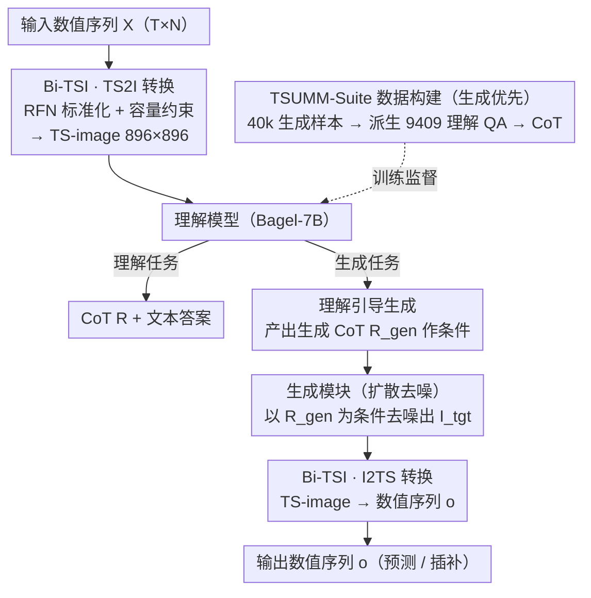

# TimeOmni-VL: Unified Models for Time Series Understanding and Generation

**会议**: ICML 2026  
**arXiv**: [2602.17149](https://arxiv.org/abs/2602.17149)  
**代码**: 待确认  
**领域**: 时间序列 / 多模态统一模型  
**关键词**: 时间序列预测, 时间序列插补, 统一多模态, 视觉表示, 理解-生成

## 一句话总结
TimeOmni-VL 通过把时间序列转换为**高保真图像**（Bi-TSI）+ 引入**理解引导的生成机制**（CoT 作为扩散条件），首次实现在统一多模态框架中同时达成时间序列**理解与生成**任务，预测和插补均达业界最优。

## 研究背景与动机

**领域现状**：时间序列建模长期分为两个分支——**生成模型**（基础模型 TSFM）主要追求数值精度，专注预测和插补；**理解模型**借助 LLM，提供人可读的时间动态解释。然而这两条线路各自为政。

**现有痛点**：生成模型往往缺乏结构性理解，仅依赖浅层模式匹配；理解模型则在数值保真度上困顿——文本分词器会把"123"拆成"1""2""3"三个 token 破坏数值连续性。VisionTS 等基于视觉的方法虽在预测有竞争力但本质上依赖纯像素纹理模式匹配，对周期性、季节性等内在属性视而不见；纯文本 LLM 受计数能力限制，无法可靠生成数百-数千步长的序列。

**核心矛盾**：视觉领域已通过统一多模态模型（UMM）实现理解与生成融合，核心洞察是"强理解是优质生成的基础"。但这一范式在时间序列尚未充分探索，主因是缺少**保真度的双向映射**和**理解引导生成的机制**。

**本文目标**：实现时间序列在统一视觉框架中的理解与生成，使模型在学习语义的同时保持数值精度。

**切入角度**：受视觉基础模型成功启发——能否用视觉表示时间序列，进而让 UMM 原生支持时间序列的理解与生成？

**核心 idea**：把时间序列编码为高保真图像（Bi-TSI），再用理解任务的 CoT 显式约束生成过程——将时间语义转化为生成的控制信号。

## 方法详解

### 整体框架
三层架构：
1. **转换层**：通过 Bi-TSI 转为 TS-image（896 × 896）。
2. **理解层**：基于 Bagel-7B UMM 的理解分支，对 TS-image 进行 6 类任务生成 CoT。
3. **生成层**：以 CoT 为条件的扩散解码模块，输出目标 TS-image，再逆向转为数值序列。

关键创新在**理解与生成的互联**——理解的 CoT 直接成为生成时扩散过程的条件变量。

### 关键设计

**1. Bi-TSI：保真度双向映射，让时间序列与图像之间几乎无损往返**

VisionTS 那类方法只是把序列简单渲染成纹理图，纯靠像素模式匹配，对周期性、季节性这些内在属性视而不见，而且渲染过程容易隐式下采样、丢信息。Bi-TSI 的关键是显式管理周期网格的折叠：给定时间序列 $X \in \mathbb{R}^{T \times N}$ 和周期 $f$，把每个变量折叠成 $f \times N_p$ 的周期网格（$N_p = T/f$），分变量渲染成竖条形区域后再垂直堆叠成整图，并强制「一像素一时间步」的容量约束 $H/N \geq f$ 且 $W \geq L/f$ 来杜绝下采样。数值缩放上，单用 Std 对尖峰敏感、单用 MAD 对平坦段失效，于是引入健壮保真度标准化（RFN）把两者混合 $\sigma = \alpha \frac{\text{Median}(|X - \mu|)}{c_{\text{MAD}}} + (1 - \alpha) \text{Std}(X)$，再经 $\tanh$ 有界映射 $X_{\text{norm}} = \tanh\big(\frac{X - \mu}{\kappa \sigma}\big)$ 在抑制极端值的同时保住细节。配合 896 × 896 的超高分辨率（比 VisionTS++ 的 224 × 224 多 16 倍面积），才让图像真正成为序列的可逆载体而非粗糙缩略图。

**2. 理解引导生成：把理解任务的 CoT 当成扩散的条件信号**

纯生成模型容易只盯着局部数值拟合，却看不出「这段时间应该持续下降」这种全局趋势。TimeOmni-VL 借鉴视觉统一多模态模型「强理解是优质生成的基础」的洞察，让生成显式吃理解的结果：对一个预测任务，模型先以理解指令读入 TS-image，产出含「第 $t$ 步趋势上升」「季节周期 7 天」等语义的理解型 CoT $R = (r_1, \ldots, r_K)$；再把 $R$ 作为扩散过程的条件，指导生成模块逐步去噪出目标 TS-image，最后逆映射回数值序列。训练用联合目标 $\mathcal{L} = \lambda_{\text{und}} \mathcal{L}_{\text{und}} + \lambda_{\text{gen}} \mathcal{L}_{\text{gen}}$，其中理解损失是文本 token 预测、生成损失是扩散 MSE。这条「先理解再生成」的链路把时间语义变成可控信号，实验里带来 8.2% 的生成质量提升。

**3. TSUMM-Suite：用「生成优先」管道配出理解与生成成对的数据**

要让模型真的学到时间属性，光有生成样本不够，得有配套的理解监督——而一般 VLM（如 Gemini-2.5-Flash）在 TS-image 的信号级任务上准确率几乎为零，说明这种理解能力必须专门教。TSUMM-Suite 采用「生成优先」策略：先定义 40k 预测 + 40k 插补样本，再在同一批实例上派生 9409 个理解 QA 对，最后用规则加 LLM 生成详细 CoT。理解任务按难度分两级——布局级（变量位置定位、周期识别）和信号级（周期内/间模式对比、异常检测），逼着模型从「定位变量在图上哪」一步步爬到「识别非线性动态」，从而把表面识别升级成对时间结构的深层理解。

## 实验关键数据

### 主实验

| 任务 | 方法 | 短期 | 中期 | 长期 |
|------|------|------|------|------|
| **预测** | Gemini-2.5-Flash | 1.295 | 1.201 | 1.279 |
| | VisionTS++ | 0.915 | 0.682 | 0.690 |
| | **TimeOmni-VL** | **0.878** | **0.816** | **0.784** |
| **插补** | Moment-large | 1.220 | 1.400 | 1.630 |
| | Bagel（无微调） | 17.411 | 12.239 | 11.849 |
| | **TimeOmni-VL** | **0.713** | **0.757** | **0.842** |

### 消融实验

| 配置 | 预测 nMASE | 插补 nMASE | 说明 |
|------|---------|---------|------|
| 无理解 CoT | +8.2% 恶化 | +8.2% 恶化 | CoT 条件明显掉点 |
| 用 Heatmap 代替 Bi-TSI | > 1.0 | > 1.0 | TS2I 策略对生成至关重要 |
| 不用 RFN | 信号饱和 | — | 鲁棒性标准化必要 |

### 关键发现
- **理解任务有效性**：基础 Bagel-7B 在布局级 QA1-QA4 准确率为 0%，经 TimeOmni-VL 微调后接近 1.0。
- **CoT 的 8.2% 增益**：禁用 CoT 后生成质量一致性下降 8.2% nMASE。
- **TS2I 设计关键性**：用 Heatmap 代替 Bi-TSI 导致 nMASE > 1.0。
- **长期预测突破**：相比纯文本模型（如 Time-R1 在 480+ 步失败），TimeOmni-VL 即使在 900 步长地平线上仍保持 0.784 nMASE。

## 亮点与洞察
- **概念创新**：首次系统将"理解为生成控制信号"这一视觉范式迁移到时间序列，打破生成与理解的僵化分界；理论上可推广到其他多模态任务。
- **工程扎实**：Bi-TSI 看似简单的周期折叠却精妙解决三个未被妥善处理的问题——极值敏感性（RFN 混合）、隐式下采样（显式容量约束）、高分辨率需求（896 × 896 是质的飞跃）。
- **数据集价值**：TSUMM-Suite 的"布局 → 信号"两级递进设计强制模型从表面识别升级到深层理解。
- **实用性突破**：插补达 SOTA（0.713 nMASE）意味着该方法在真实缺数值补全场景中已可投入生产。

## 局限与展望
- LLM 计数能力在 500+ 步时仍有偶发失败。
- 仅在 GIFT-Eval 上表现优异，对完全不同领域（金融高频、地球物理信号）泛化未测试。
- 896 × 896 图像产生 3000 个视觉 token，推理时延可能是纯 LLM 的数倍，生产部署成本较高。
- 方法依赖序列具有明确周期性，对无周期或周期不规则数据（突发事件序列）适应能力有限。
- 改进：融合 RL 纠正长序列计数偏差；探索动态 TS-image 分辨率自适应；为非平稳序列增加自适应周期检测模块。

## 相关工作与启发
- **vs VisionTS / VisionTS++**：都用图像承载时序，但 TimeOmni-VL 在保真度上通过 RFN 和容量约束质量更优；引入理解任务的显式约束。
- **vs Time-LLM / Time-R1**：纯文本方法的瓶颈是 token 分词破坏数值连续性；TimeOmni-VL 通过像素级表示绕过此限制。
- **vs Chronos-2 / MOMENT**：专用时序基础模型是统计 + 浅层回归，无法提供语义理解；TimeOmni-VL 统一了理解与生成，带来 LLM 时代的"多任务协同学习"范式。

## 评分
- 新颖性: ⭐⭐⭐⭐⭐  首次系统性地在时间序列领域落地"理解引导生成"范式。
- 实验充分度: ⭐⭐⭐⭐⭐  涵盖预测 / 插补 / 理解 / 推理四大任务族，消融深入，数据集规模 11k+ QA 对。
- 写作质量: ⭐⭐⭐⭐  结构清晰、动机铺垫充分；个别细节（RFN 的 MAD 一致性常数选择）略仓促。
- 价值: ⭐⭐⭐⭐⭐  既为时序社区引入多模态统一范式，又为视觉 VLM 社区验证了该范式的可迁移性。

<!-- RELATED:START -->

## 相关论文

- [\[ICLR 2026\] SciTS: Scientific Time Series Understanding and Generation with LLMs](../../ICLR2026/time_series/scits_scientific_time_series_understanding_and_generation_with_llms.md)
- [\[ICML 2026\] CombinationTS: A Modular Framework for Understanding Time-Series Forecasting Models](combinationts_a_modular_framework_for_understanding_time-series_forecasting_mode.md)
- [\[ICML 2026\] It's TIME: Towards the Next Generation of Time Series Forecasting Benchmarks](its_time_towards_the_next_generation_of_time_series_forecasting_benchmarks.md)
- [\[ICLR 2026\] TimeOmni-1: Incentivizing Complex Reasoning with Time Series in Large Language Models](../../ICLR2026/time_series/timeomni-1_incentivizing_complex_reasoning_with_time_series_in_large_language_mo.md)
- [\[ICML 2026\] Interpretability in Deep Time Series Models Demands Semantic Alignment](interpretability_in_deep_time_series_models_demands_semantic_alignment.md)

<!-- RELATED:END -->
