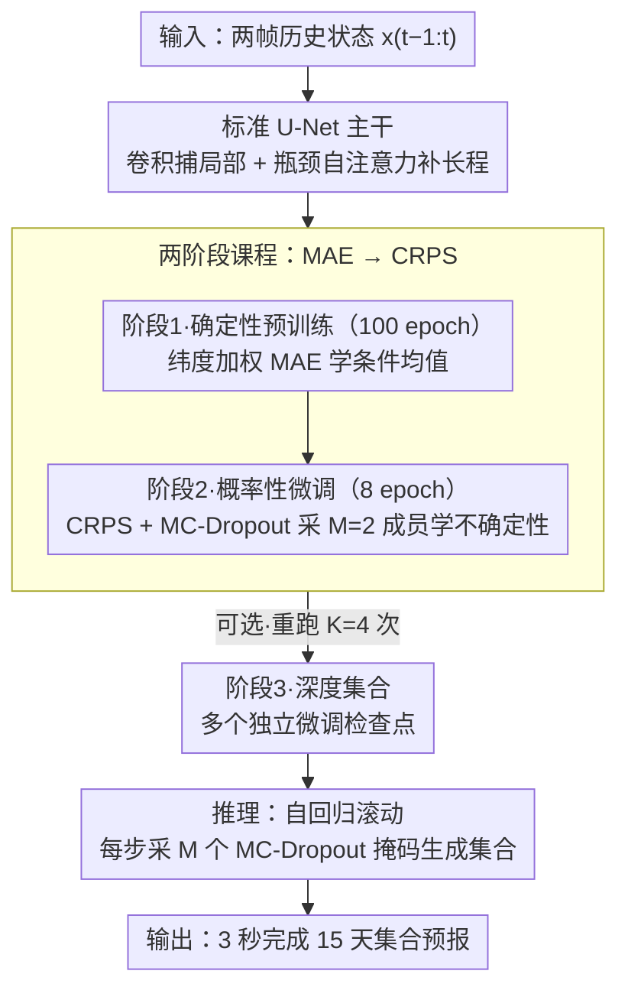

# U-Cast: A Surprisingly Simple and Efficient Frontier Probabilistic AI Weather Forecasting

**会议**: ICML 2026  
**arXiv**: [2604.09041](https://arxiv.org/abs/2604.09041)  
**代码**: 待确认  
**领域**: 时间序列 / 气象预测 / 概率预报  
**关键词**: 天气预报, 概率集合预报, U-Net, CRPS 损失, MC-Dropout

## 一句话总结
U-Cast 用**简单的 U-Net 主干** + **两阶段训练课程**（MAE 预训练 → CRPS 微调） + **MC-Dropout** 实现了与复杂专业模型（GenCast）相当的概率性天气预报能力，同时减少 10× 训练计算和推理延迟——颠覆"前沿性能必须复杂"的行业刻板印象。

## 研究背景与动机

**领域现状**：AI 天气预报已成熟到可与传统物理模式相当。早期确定性模型（GraphCast、Pangu）快速发展但有"模糊预报"问题——模型输出条件均值，丧失物理真实性。领域转向概率集合预报（GenCast、FGN）已超越 ECMWF 操作性集合（IFS ENS）成为新金牌标准。

**现有痛点**：最新 SOTA 采用复杂的专业架构（图神经网络、球面神经算子、3D-Swin 变换器）+ 昂贵的训练策略。GenCast 和 FGN 需要数百 TPU/GPU 天计算预算，即使在 1° 分辨率上也是如此。这创造了高进入壁垒——只有工业和国家实验室能参与前沿开发，学术界和欠资源地区被排斥。

**核心矛盾**：是否前沿性能必然需要这种复杂性？图神经网络和迭代扩散过程真的必不可少吗？还是效率问题源于训练策略设计不当？

**本文目标**：证明用最小化的通用设计加上高效训练课程，也能达到前沿预报质量。

**切入角度**：从"苦难教训"观点出发——复杂性陷阱常由优化不当导致，而非任务内在需求。假设：（1）大气短期动力学具有强局部性适合卷积；（2）学物理（确定性）和学不确定性可解耦以加速训练；（3）MC-Dropout 比复杂噪声注入更高效。

**核心 idea**：用标准 U-Net + MAE 预训练 + CRPS 微调 + MC-Dropout + Muon 优化器替代复杂架构和训练方案，保持前沿性能同时大幅降成本。

## 方法详解

### 整体框架
三阶段管道：（1）**确定性预训练**（100 epoch）：MAE 损失学大气动力学，输出条件均值；（2）**概率性微调**（8 epoch）：在预训练主干上继续微调，启动 MC-Dropout，用 CRPS 损失学预报不确定性；（3）**深度集合**（可选）：从同一阶段 1 检查点出发重复阶段 2 共 $K=4$ 次。推理时对输入状态 $x_{t-1:t}$ 自回归滚动，每次生成 $M$ 个 MC-Dropout 采样，3 秒完成 15 天集合预报。

### 关键设计

**1. 标准 U-Net 主干，最小化改造：用卷积的局部归纳偏置替掉图网络和球面算子**

SOTA 普遍认定前沿天气预报得靠图神经网络、球面算子、3D-Swin 这类复杂架构，门槛高到只有工业和国家实验室玩得起。U-Cast 反过来赌一把「苦难教训」式的简单：大气短期动力学本就有强局部性，正好对上卷积的归纳偏置，长程相互作用交给瓶颈处的自注意力即可。它直接拿一个 896M 参数的标准 U-Net，只做四处最小改造——初始层宽度提到 320 通道、沿经度方向循环填充以尊重地球的周期拓扑、栅格非 2 的整数倍时自动插值、移除原 DiffusionUNet 里没用的 adaLN 时步调节。全部改动不到 300 行代码，对比图网络动辄 3000 行，维护和复现成本都大幅降低，却仍能在精度上与复杂模型平分秋色。

**2. 两阶段课程（MAE → CRPS）：把学物理和学不确定性解耦**

把确定性和概率性混在一个 CRPS 目标里端到端训，收敛慢、成本高。U-Cast 利用「单个确定性预报的 MAE 恰好等于 CRPS」这个性质，把训练拆成两段且让两段损失景观平滑对齐。阶段 1 用纬度加权的 L1 损失 $\mathcal{L}_{\text{det}} = \frac{1}{HW} \sum_{h, w} a_h \|f_\theta(x_{t-1:t})_{h, w} - x_{t+1, h, w}\|_1$ 学条件均值，成本低（单前向）所以能跑满 100 轮把大气物理学扎实；阶段 2 在收敛好的主干上继续微调、开启 MC-Dropout，只生成 $M=2$ 个成员、用 CRPS 损失 $\mathcal{L}_{\text{prob}} = \frac{1}{HW} \sum a_h (\text{Skill} - \frac{1}{2} \text{Spread})$ 学不确定性（Skill 是平均 MAE、Spread 是集合离散度）。因为主干已经收敛，概率阶段只需 8 轮即达最优，仅占总成本约 15%，使得每个深度集合成员的增量成本压到 1.2 H200 天，比 FGN 直接低两个数量级。

**3. MC-Dropout：用最朴素的随机性替掉专业噪声注入**

要出集合预报就得有随机性来源，专业做法是加噪声投影层或 adaLN 调制，又重又多参数。U-Cast 干脆把 Dropout 一直开到推理：采样 $M$ 个不同掩码 $\xi^{(m)}$ 生成 $M$ 个预报 $\hat{x}^{(m)} = f_\theta(x_{t-1:t}; \xi^{(m)})$，既不需要额外噪声层也不需要 adaLN，参数还少 5–10%。早期工作嫌 MC-Dropout 给的集合过度自信、离散不足，但作者指出真凶不是 Dropout 本身，而是 MSE 目标根本没显式奖励集合离散；换成 CRPS 后，同时优化 Skill 和 Spread，模型自然学会利用 Dropout 掩码差异制造合理离散度，这个老技术就被「正名」了。

## 实验关键数据

### 主实验（WeatherBench 2，1.5° 分辨率）

| 模型 | z500_1d | z500_3d | z500_10d | 10u_1d | vs IFS ENS 平均 | vs GenCast 平均 |
|------|---------|---------|----------|--------|----------------|----------------|
| U-Cast | 20.3 | 55.2 | 256 | 0.349 | +5.0% | +0.21% |
| U-Cast (DE) | 19.6 | 53.5 | 253 | 0.345 | ~+6% | +0.3% |
| IFS ENS | 22.4 | 58.3 | 262 | 0.406 | baseline | -3.5% |
| GenCast | 20.2 | 54.3 | 254 | 0.332 | +7.3% | baseline |

U-Cast 在 92.9% 的变量-铅时间组合上改进 IFS ENS（平均 CRPS 增益 5.0%）；与 GenCast 持平甚至在 z500 短期领先 3%。

### 消融实验与效率对比

| 设计选择 | CRPS 变化 (z500_1d) | 说明 |
|--------|--------|------|
| 完整 U-Cast | baseline | Muon + MC-Dropout + 两阶段 |
| 用 AdamW 替换 Muon | -15% | 优化器选择关键 |
| 用 adaLN 替代 MC-Dropout | -1.5% | 离散度稍好但 CRPS 恶化 |
| 从头训练 CRPS（不预训） | -3~5% | 课程策略比端对端重要 |

### 训练 / 推理成本对比

| 模型 | 训练天数 | 推理延迟 | 加速倍数 |
|------|--------|--------|--------|
| U-Cast | 8.2 (H200) | 2 sec (H100) | 基准 |
| GenCast (1.5°) | ~100+ (TPUv5) | ~5 min | 150× 训练 / 75× 推理 |
| FGN (1.5°) | 300 (TPUv5p) | 不详 | 37× 训练 |

U-Cast 占据帕累托前沿——训练仅需 3 天 4 块 H200，推理 3 秒。

### 关键发现
- 在所有非平稳模式下 U-Cast 显著优于基线。
- Muon vs AdamW 导致 15% 性能差异，但业界多未研究——优化器选择被忽视。
- 课程学习相对端对端 CRPS 快收敛 3 倍多。
- MC-Dropout 长期被认为离散不足，论文发现真凶是优化目标（MSE 不鼓励散度）——CRPS 后自然解决。

## 亮点与洞察
- **模型设计的"奥卡姆剃刀"**：颠覆行业刻板印象——证明图网络 / 球面算子并非前沿性能必需品，只要优化得当。标准 U-Net < 300 行代码却能与 > 3000 行图网络平分秋色，对可复现性和民主化意义深远。
- **课程学习的威力**：MAE → CRPS 两阶段比端对端 CRPS 快 3 倍多收敛；启示后续工作可复用预训主干高效迭代新的概率机制。
- **优化器选择的重要性**：Muon vs AdamW 导致 15% 性能差异，对其他 ML 天气工作有借鉴价值。
- **MC-Dropout 的正名**：长期以来 MC-Dropout 在天气中被认为离散不足，论文发现真凶是优化目标——对通用不确定性量化社区很重要。
- **推理民主化的潜力**：3 秒生成 15 天集合预报，相比 IFS ENS 的 11 小时（96 个 CPU），打开极端事件检测、区域微调等新应用空间。

## 局限与展望
- 极地区伪影——2D U-Net 无法充分捕捉球面拓扑；未来可用轻量级球面 U-Net 变体（如基于 HEALPix 网格）改进。
- 略微离散不足——参数共享导致 dropout 成员相关，深度集合（K = 4）缓解此问题。
- 长期不稳定——超 20 天预报会变不稳定；可能因缺乏自回归训练，未来可加自回归微调阶段。
- 初始条件扰动缺失——可通过加初始条件扰动进一步提升校准度。

## 相关工作与启发
- **vs GraphCast / 图网络路线**：U-Net 用卷积 + 自注意本地 + 全局权衡，代码行数少 3 倍却性能齐平。
- **vs GenCast / 扩散路线**：GenCast 生成逼真集合但推理需 30+ 次迭代；U-Cast 单次前向 + MC-Dropout 推理 3 秒。
- **vs CRPS-from-scratch 方案**：AIFS-CRPS、FGN 直接 CRPS 训练需 300+ GPU 天；U-Cast 通过课程摊销成本到 15% 概率阶段。
- **启发**：课程学习在其他生成模型（视频、分子）中的应用；优化器选择在不同时间尺度预报的系统研究。

## 评分
- 新颖性: ⭐⭐⭐⭐  虽为现存技术组合，但在天气领域的系统性探索和实证优越性是新贡献；挑战了行业复杂性执念。
- 实验充分度: ⭐⭐⭐⭐⭐  WeatherBench 2 基准（732 初始条件）+ 多变量多铅时间 + 深入消融 + 详细成本分析。
- 写作质量: ⭐⭐⭐⭐⭐  清晰鲜明（标题即观点），逻辑流畅，公式规范，图表有力（帕累托图）。
- 价值: ⭐⭐⭐⭐⭐  降成本 10 倍开放前沿天气 AI 研发；示范 ML 系统应从"必要复杂性"而非"流行复杂性"出发。

<!-- RELATED:START -->

## 相关论文

- [\[NeurIPS 2025\] Simple and Efficient Heterogeneous Temporal Graph Neural Network](../../NeurIPS2025/time_series/simple_and_efficient_heterogeneous_temporal_graph_neural_network.md)
- [\[ICML 2026\] Parametric Prior Mapping Framework for Non-stationary Probabilistic Time Series Forecasting](parametric_prior_mapping_framework_for_non-stationary_probabilistic_time_series_.md)
- [\[CVPR 2026\] STCast: Adaptive Boundary Alignment for Global and Regional Weather Forecasting](../../CVPR2026/time_series/stcast_adaptive_boundary_alignment_for_global_and_regional_weather_forecasting.md)
- [\[NeurIPS 2025\] Graph-based Neural Space Weather Forecasting](../../NeurIPS2025/time_series/graph-based_neural_space_weather_forecasting.md)
- [\[ICCV 2025\] VA-MoE: Variables-Adaptive Mixture of Experts for Incremental Weather Forecasting](../../ICCV2025/time_series/va-moe_variables-adaptive_mixture_of_experts_for_incremental_weather_forecasting.md)

<!-- RELATED:END -->
