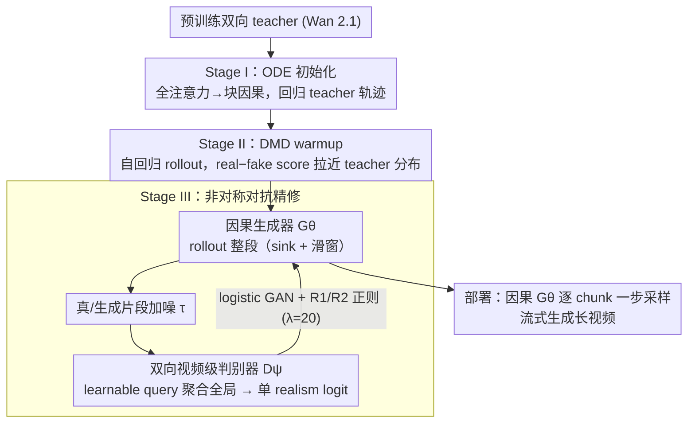

# AAD-1: Asymmetric Adversarial Distillation for One-Step Autoregressive Video Generation

**会议**: ICML 2026  
**arXiv**: [2606.03972](https://arxiv.org/abs/2606.03972)  
**代码**: https://aad-1.github.io/  
**领域**: 视频生成  
**关键词**: 视频生成、自回归扩散、一步蒸馏、对抗蒸馏、长视频一致性  

## 一句话总结
AAD-1 用“因果生成器 + 双向视频级判别器”的非对称对抗蒸馏和 DMD warmup，把自回归 image-to-video 生成压缩到每个 chunk 只需一步采样，同时缓解 motion collapse 和长程漂移。

## 研究背景与动机
**领域现状**：视频扩散模型通常能生成短片段，但固定长度和多步采样限制了实时流式应用。自回归视频扩散通过逐块生成、复用上下文和 KV cache 支持更长视频，适合游戏、世界模型和在线生成。

**现有痛点**：把自回归模型再压缩到少步甚至一步非常困难。已有方法常同时做因果适配、自回归 rollout 和采样步数蒸馏，优化负担很重；对抗蒸馏虽然适合一步生成，却容易让视频静止在初始帧附近，出现 motion collapse。

**核心矛盾**：部署时生成器必须严格因果，不能看未来帧；但训练时如果判别器也只能看过去，就很难发现跨整段视频逐渐积累的漂移和静态复制。生成侧需要因果性，监督侧却需要全局时序视野。

**本文目标**：作者希望训练一个 one-step autoregressive I2V 模型，在保持流式生成能力的同时，让训练信号能惩罚长程漂移和全局运动失败。

**切入角度**：论文打破 generator 和 discriminator 的结构对称：生成器保持因果结构，判别器在训练时使用双向时空上下文，并输出整段视频级真实度分数。

**核心 idea**：用非对称对抗蒸馏让判别器看全局、生成器仍因果，再用 ODE 初始化和 DMD warmup 把一步生成器先带到稳定分布附近。

## 方法详解
AAD-1 的方法可以理解为三段式训练配方。第一段把预训练双向视频模型改造成因果学生；第二段用 distribution matching 让 one-step 学生先靠近 teacher；第三段才进行 adversarial refinement，用双向视频级判别器提供全局时序监督。

### 整体框架
部署时，生成器 $G_\theta$ 逐 chunk 生成视频。每次只看开头的 sink frames 和最近的 sliding-window 上下文，输出当前 chunk。训练时，模型会自回归 rollout 出完整片段，再把完整生成片段送入判别器。判别器由 Wan 2.1 T2V backbone 初始化，在若干 transformer 层插入 cross-attention heads，用 learnable query tokens 聚合完整 spatiotemporal features，输出单个 video-level logit。

训练有三步。Stage I 使用 Diffusion Forcing 和 ODE teacher trajectory，把双向模型的全注意力替换为 block-wise causal attention，并学习 downstream few-step 目标时间步。Stage II 用 Self-Forcing DMD 在自回归上下文下匹配 teacher 和 student 的分布，让一步输出先不偏离数据流形。Stage III 才进对抗：自回归 rollout 出整段视频，加噪后送入双向视频级判别器，用 logistic GAN loss 和近似 R1/R2 正则做非对称对抗精修。

### 关键设计

**1. 三阶段分离训练（ODE 初始化 → DMD warmup → 对抗精修）：先把一步生成器稳到 teacher 附近，再做对抗精修**

AAD-1 把"因果适配、一步分布匹配、感知精修"拆成三个串行阶段，而不是揉进一个联合目标。Stage I 用 Diffusion Forcing 在 teacher 的 ODE 去噪轨迹上回归，把双向全注意力换成块因果注意力，且只在下游真正用到的少数离散时间步上监督，给后续一步蒸馏一个稳定起点；Stage II 用 Self-Forcing DMD 在自回归 rollout 的上下文里，用 real score 与 fake score 之差把一步学生分布拉到 teacher 附近。为什么必须分阶段、不能把 DMD 和 GAN 写进一个 joint loss？因为 teacher 分布与真实数据分布本就不对齐：DMD 把生成器往 teacher 拉、GAN 往真实数据拉，两个方向冲突会让训练震荡（DMD2 式联合损失正是栽在这里）。串行分阶段恰好回避了这种互相拉扯，消融也显示去掉 DMD warmup 后冷启动对抗会让一步生成器迅速退化。

**2. 非对称生成器-判别器结构：生成器因果、判别器双向看全局**

部署时生成器必须严格因果（只能看过去帧才能流式 rollout），但训练时判别器并没有这个约束——AAD-1 正是打破了二者结构上的对称。$G_\theta$ 只访问开头的 sink frames 与最近的 sliding-window 历史帧，保证自回归推理和 KV-cache 复用；而判别器 $D_\psi$ 在训练时用双向注意力扫完整 spatiotemporal volume，再用一组 learnable query tokens 把全局特征聚合成单个 video-level realism logit。为什么要这样拆？motion collapse 是一种全局时序失败——逐帧看每帧都"像真的"（复制上一帧的静态画面也像真图），只有把整段拿来比对、看到"整段几乎没动"或"逐渐漂移"才抓得住。消融进一步表明，判别器的"可见性"比 logit 粒度更关键：因果 backbone 即便配 video-level logit，仍会因单向注意力累积错误而退化成静态视频；只有双向 backbone 能用未来帧反过来审视过去帧，提供 future-anchored 的批评信号。

**3. 噪声化判别输入与 R1/R2 正则：稳住 14B 规模的非对称对抗**

非对称的 $G_\theta$/$D_\psi$ 配对在一步、14B 规模下极易训崩。AAD-1 不像 APT 那样给判别器喂干净输入，而是把真实片段和生成片段都按随机 timestep $\tau$ 加 Gaussian noise 后再送进判别器，并用近似 R1/R2 正则惩罚判别器对小扰动过敏，正则权重取 $\lambda=20$。为什么需要这层稳定化？消融显示这个权重有很窄的窗口：$\lambda=0$ 会直接 collapse、$\lambda=50$ 又会带来网格伪影，只有适中的噪声 + 正则能让判别器给出平滑梯度，避免生成器被过强或过抖的判别信号迅速带崩。

### 损失函数 / 训练策略
Stage I 使用 ODE trajectory regression，目标形如 $\|G_\theta(z_t,\tilde{x}_{ctx,t},c)-S^{ODE}_\phi(z_t,\tilde{x}_{ctx,t},c)\|_2^2$。Stage II 使用 DMD 梯度，核心是 real score 与 fake score 的差异乘以生成序列对参数的梯度。Stage III 使用标准 logistic GAN：判别器最大化真实片段得分、降低生成片段得分；生成器最大化判别器对生成片段的真实度判断。实现上使用 Wan 2.1 14B backbone，Stage I 训练 2,000 steps，Stage II DMD generator 训练约 100 steps 并 early stop，Stage III generator 训练 200 steps。

## 实验关键数据

### 主实验
主实验在 VBench-I2V 上比较 one-step AAD-1 与多步自回归 baseline，并以 Wan 2.1 I2V 100 NFE 作为双向参考。

| 方法 | NFE | Subject Cons.↑ | Background Cons.↑ | Dynamic Degree↑ | Imaging Quality↑ | I2V Subject↑ | I2V Background↑ |
|--------|------|------|------|------|------|------|------|
| Wan 2.1 I2V | 100 | 93.88 | 94.86 | 51.09 | 70.12 | 96.80 | 98.59 |
| CausVid | 4 | 83.45 | 89.37 | 33.80 | 70.60 | 92.91 | 83.34 |
| Self Forcing | 4 | 91.77 | 93.41 | 34.93 | 71.50 | 95.79 | 91.18 |
| AAD-1 Stage-II | 1 | 92.14 | 92.13 | 50.30 | 69.37 | 96.56 | 95.12 |
| AAD-1 Stage-III | 1 | 94.34 | 95.08 | 41.46 | 71.49 | 98.65 | 97.83 |

### 消融实验
| 配置 | 关键指标 | 说明 |
|------|---------|------|
| w/o DMD warmup | Aesthetic 53.63, Imaging 62.81 | 初始一步生成分布太远，GAN refinement 不稳定 |
| w/ DMD warmup | Aesthetic 58.64, Imaging 69.37 | warmup 明显提升进入对抗阶段前的基础质量 |
| Causal DiT + frame-wise logit | Dynamic Degree 1.08 | 退化成静态视频，典型 motion collapse |
| Causal DiT + video-wise logit | Drift 7.10, Dynamics 42.07 | 有运动但长程漂移严重 |
| Bidirectional DiT + frame-wise logit | Drift 4.38, Dynamics 39.04 | 双向上下文显著减少漂移 |
| Bidirectional DiT + video-wise logit | Drift 4.02, Dynamics 39.29 | 最佳漂移控制，本文默认配置 |
| 14B 1 NFE inference | Latency 1.134s, Throughput 14.33 FPS | 比 4 NFE 的 2.822s / 5.71 FPS 快很多 |

### 关键发现
- Stage-III adversarial refinement 提高 subject/background consistency 和 I2V faithfulness，但会牺牲一部分 motion magnitude；Stage-II 的 Dynamic Degree 更高。
- 判别器的可见性比 logit granularity 更关键：causal backbone 会累积错误，bidirectional backbone 才能提供 future-anchored critique。
- DMD warmup 不是小技巧，而是 one-step GAN 训练的稳定前提；没有它，生成器太早进入对抗阶段会退化。
- 正则系数有窄窗口：$\lambda=0$ 会 collapse，$\lambda=50$ 会带来网格伪影，$\lambda=20$ 取得较好平衡。

## 亮点与洞察
- 最巧妙的是非对称性：推理约束只要求生成器因果，训练判别器完全可以利用未来帧。这个拆分把“部署结构”和“监督结构”从不必要的绑定中解放出来。
- Video-level logit 直指 motion collapse 的根因。逐帧判别只看边际图像分布，复制上一帧也像真图；整段判别才会惩罚没有运动的序列。
- 三阶段训练把难问题拆开：先学因果化，再学一步分布，再做感知 refinement。比把所有目标揉进一个 joint loss 更稳。

## 局限与展望
- 一步 chunk-wise 生成在 fast motion 场景仍容易模糊或结构变形，因为大位移被压缩到单次 denoising 中。
- 人脸、手等复杂局部结构对 chunk 内多帧同步生成要求很高，细节保持仍弱于多步或单帧精修。
- 对抗 refinement 主要训练 5 秒片段，长视频 extrapolation 仍会随自回归 rollout 累积误差。
- 训练成本很高：完整训练约 3.5 天、64 张 H20，Stage III 总显存峰值约 1040GB，说明方法虽快推理，但训练门槛不低。

## 相关工作与启发
- **vs Self Forcing / Diffusion Forcing**: 它们解决自回归 train-test gap，AAD-1 继承 self-rollout 思路并进一步压到 one-step。
- **vs APT2**: APT2 使用因果 frame-wise 判别器，AAD-1 改为双向 video-level 判别器，并提供大规模受控消融证明其必要性。
- **vs Wan 2.1 I2V**: Wan 是强双向多步 teacher/reference，AAD-1 用其 backbone 和分布知识获得实时友好的自回归模型。
- **启发**: 许多生成任务中，训练时的 critic 不必服从推理时的因果约束；只要生成器保持部署约束，critic 可以承担更全局、更昂贵的质量审查。

## 评分
- 新颖性: ⭐⭐⭐⭐⭐ 因果生成器与双向视频级判别器的非对称设计抓住了 one-step 自回归视频的关键矛盾。
- 实验充分度: ⭐⭐⭐⭐☆ VBench、用户偏好、warmup、判别器和效率都有覆盖；更长真实视频 benchmark 还可加强。
- 写作质量: ⭐⭐⭐⭐☆ 方法脉络清晰，公式和训练细节充分；部分实现成本信息放在附录。
- 价值: ⭐⭐⭐⭐⭐ 对实时视频生成和世界模型流式推理很有参考价值，尤其是 critic 设计思路。

<!-- RELATED:START -->

## 相关论文

- [\[AAAI 2026\] Phased One-Step Adversarial Equilibrium for Video Diffusion Models](../../AAAI2026/video_generation/phased_one-step_adversarial_equilibrium_for_video_diffusion_models.md)
- [\[ICML 2026\] SGMD: Score Gradient Matching Distillation for Few-Step Video Diffusion](sgmd_score_gradient_matching_distillation_for_few-step_video_diffusion_distillat.md)
- [\[ICML 2025\] Diffusion Adversarial Post-Training for One-Step Video Generation](../../ICML2025/video_generation/diffusion_adversarial_post-training_for_one-step_video_generation.md)
- [\[ICLR 2026\] Streaming Autoregressive Video Generation via Diagonal Distillation](../../ICLR2026/video_generation/streaming_autoregressive_video_generation_via_diagonal_distillation.md)
- [\[ICML 2026\] Light Forcing: Accelerating Autoregressive Video Diffusion via Sparse Attention](light_forcing_accelerating_autoregressive_video_diffusion_via_sparse_attention.md)

<!-- RELATED:END -->
