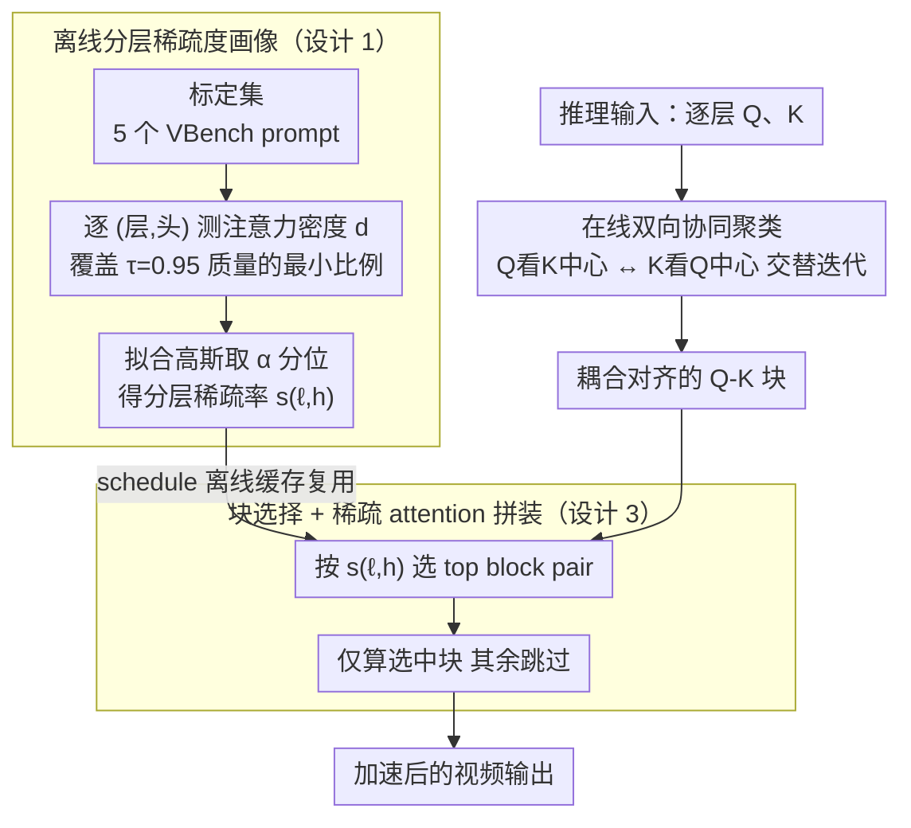

# Attention Sparsity is Input-Stable: Training-Free Sparse Attention for Video Generation via Offline Sparsity Profiling and Online QK Co-Clustering

**会议**: ICML 2026  
**arXiv**: [2603.18636](https://arxiv.org/abs/2603.18636)  
**代码**: https://github.com/Mutual-Luo/SVOO  
**领域**: 视频生成 / 扩散模型 / 模型效率  
**关键词**: 稀疏注意力, DiT, 视频生成加速, Co-Clustering, 层级稀疏性

## 一句话总结
SVOO 发现视频 DiT 每一层的注意力稀疏度是「层内输入无关、层间显著异质」的内在属性，据此先做离线分层稀疏度标定、再做在线 QK 双向协同聚类划块，免训练地在 Wan/HunyuanVideo 等 7 个模型上把 PSNR 维持 29 dB 的同时实现最高 1.93× 加速。

## 研究背景与动机

**领域现状**：3D DiT 已经是高保真视频生成的主流骨架（Wan、HunyuanVideo、Sora 同构），但稠密 3D self-attention 的代价随 token 数平方增长，单卡 H200 跑一段 720p×81 帧的 Wan2.1-1.3B 都要 417s。主流加速路线是「稀疏注意力」，分训练式（VMoBA、VSA、DSV、BSA）和训练免费式（SVG、SVG2、STA、Radial、SpargeAttn、XAttention、DraftAttention 等）两条线。后者无需重训，落地友好，但效果普遍逊于前者。

**现有痛点**：作者把训练免费稀疏注意力的瓶颈精确归纳为两条：(L1) **忽略层级异质性**——所有 transformer 层共用同一稀疏率，等于无视每层的功能差异；(L2) **忽略 Q-K 耦合**——块划分时把 query 和 key 独立 k-means，但块级显著模式来自 Q-K 联合，独立划块会把同一高质量注意力区切碎。

**核心矛盾**：「稀疏度选多少」需要分层考虑层结构异质性，「块怎么划」又必须把 Q 和 K 当成耦合系统而非独立项。现有方法在两个维度上都用了均匀/独立这种最朴素的假设，造成同样的算力预算下质量上限被限死。

**本文目标**：在不重训 DiT 的前提下，把上面两个限制同时打掉，得到更高的质量–速度 trade-off。

**切入角度**：作者做了一个关键观察并提供理论支撑——「层级稀疏度其实是该层 $\mathbf{W}_Q\mathbf{W}_K^\top$ 决定的内在属性，对输入几乎不敏感」，因此可以「离线 calibrate 一次，在线全程复用」。这条性质让分层稀疏率的代价摊销到几乎为零。

**核心 idea**：用 **「离线分层稀疏度画像 + 在线双向 QK 协同聚类」** 替代「均匀稀疏率 + 独立 Q/K 划块」，把每层各自的 sparsity budget 喂给一个真正考虑 Q-K 耦合的块划分算法。

## 方法详解

### 整体框架
SVOO 是两阶段 pipeline：(i) 离线阶段——拿一个小规模 calibration set（VBench 随机几 prompt 就够），在原模型上跑一遍 forward，统计每个 (layer, head) 的 attention density，取保守高分位作为该层稀疏率 $s_{\ell,h}$。(ii) 在线阶段——推理时对每层每个 head，用双向协同聚类同时给 query 和 key 分块，再依据离线 schedule 选 top block pair 做稠密计算，其余 block 直接跳过。两个阶段彼此独立，schedule 只是一组系数，sub-1MB 即可缓存。

### 关键设计

**1. 离线分层稀疏度画像：稀疏度是层的内在属性，标定一次就够**

既有训练免费方法让所有 transformer 层共用同一稀疏率，等于无视每层功能差异（作者称之为 L1 缺陷）。SVOO 的关键观察是：每层的稀疏度其实由该层的 $\mathbf{W}_Q\mathbf{W}_K^\top$ 决定、对输入几乎不敏感，所以可以离线标定一次、在线全程复用。具体做法是对一个 prompt $x^k$，把 head $h$ 的注意力矩阵每行按值降序排，取覆盖累计质量 $\tau{=}0.95$ 的最小元素比例 $d_{\ell,h}^{(k)}$；在 $m$ 个 calibration 输入上拟合单变量高斯 $\mathcal{N}(\mu_{\ell,h},\sigma_{\ell,h}^2)$，用上 $\alpha{=}0.95$ 分位 $\hat d_{\ell,h}=\mu+z_\alpha\sigma$ 作保守密度估计，最终稀疏率 $s_{\ell,h}=1-\hat d_{\ell,h}$。这条"画像一次、终生复用"在理论上是合法的——Theorem 4.2 证明在 Bounded Token Representation 下，$|V(\mathbf{X})-V(\hat{\mathbf{X}})|$ 同时被 $\|\mathbf{M}\|_2^2$ 和 $1/\sqrt n$ 控制，而视频场景 token 数 $n$ 极大，同层稀疏度天然稳定，换 prompt 不必重标定。

**2. 在线双向协同聚类：把 Q 和 K 当成耦合系统一起分块**

传统方法（如 SVG2）对 query 和 key 各自独立做 k-means，背后假设"最优 key 划分与 query 无关"（L2 缺陷），可块级显著模式本就来自 Q-K 联合，独立划块会把同一片高质量注意力区切碎。SVOO 改用交替迭代的双向协同聚类：Step A 拿上一轮 query 中心 $\mathbf{C}_q^{(i-1)}$ 当锚点，算每个 key 与各 query 中心的亲和向量 $\mathbf{P}_k=\mathcal{K}(\mathbf{C}_q)^\top$，再把 key 分配到亲和向量最接近的 key-block 中心 $\bar{\mathbf{P}}_k[j]$；Step B 对称地用刚更新的 key 中心 $\mathbf{C}_k^{(i)}$ 给 query 重新分块。判定两个 key 该不该归同块的真条件是 $\mathbf{q}^\top(\mathbf{k}_1-\mathbf{k}_2)\approx 0$，显然 query-dependent，所以用 cross-affinity 取代欧式距离才对——这样同块内 token 才真正共享"相似 cross-attention 偏好"。整个过程只需 token 数 × 块数级的矩阵乘，远小于 $n\times n$ 注意力。

**3. 块选择 + 稀疏 attention 拼装：把算力压进少量 block pair**

有了每层稀疏率 $s_{\ell,h}$ 和耦合块划分，最后一步是决定哪些 block pair 真去算稠密注意力。SVOO 用块中心做粗粒度估计 $\hat A_{ij}=\mathbf{C}_q[i]\mathbf{C}_k[j]^\top$，对每个 query block 按 $\hat A$ 选 top-$\lceil(1-s_{\ell,h})K_k\rceil$ 个 key block，只对这些 block pair 做精确 attention、其余块当作 0，softmax 在剩余 logit 上归一化。因为前一步协同聚类已经把高质量注意力对齐进了少量 block pair，即便保留比例很低也能守住 PSNR——这恰好把 L1（分层稀疏率）和 L2（耦合分块）两个出发点闭环到一起。

### 损失函数 / 训练策略
完全免训练。所有改动只发生在推理路径上：calibration 用 5 个 VBench prompt 一次性跑完得到 $s_{\ell,h}$，推理时每个 transformer 层先做 $I_{\max}$ 轮 co-clustering（实验中只需个位数迭代），再做稀疏 attention。schedule 文件大小可忽略，可与原 checkpoint 一起分发。

## 实验关键数据

### 主实验
在 7 个主流视频 DiT（Wan2.1-T2V 1.3B/14B、Wan2.1-I2V-14B、Wan2.2-T2V-A14B、Wan2.2-I2V-A14B、HunyuanVideo-T2V/I2V）上对比 SpargeAttn、SVG1、SVG2、Radial，统一在 H200、720p、81 帧设定下评测。

| 模型 | 方法 | PSNR↑ | LPIPS↓ | ImgQual↑ | 延迟 | 加速 |
|------|------|-------|--------|----------|------|------|
| Wan2.1-1.3B-T2V | Origin | — | — | 66.58 | 417s | 1.00× |
| Wan2.1-1.3B-T2V | SVG2 | 29.27 | 0.127 | 61.83 | 241s | 1.73× |
| Wan2.1-1.3B-T2V | **SVOO** | **29.99** | **0.125** | **66.57** | **216s** | **1.93×** |
| Wan2.1-14B-T2V | SVG2 | 27.34 | 0.111 | 68.29 | 1261s | 1.57× |
| Wan2.1-14B-T2V | **SVOO** | **27.79** | 0.111 | **68.92** | **1203s** | **1.64×** |
| Wan2.2-14B-T2V | SVG2 | 24.48 | 0.142 | 71.51 | 1061s | 1.52× |
| Wan2.2-14B-T2V | **SVOO** | **24.85** | 0.144 | **72.92** | **984s** | **1.63×** |

亮点：SVOO 几乎所有指标都同时最高（质量）+ 最快（速度），ImageQuality 维持在与原模型相当的水准（66.57% vs 66.58%），而 SVG2 这种 cluster-based 方法在 ImgQual 上掉了 4.7 个点。

### 消融实验

| 配置 | 关键指标 | 说明 |
|------|---------|------|
| Full SVOO | PSNR 29.99 / 1.93× | 同时启用画像 + 协同聚类 |
| w/o 离线画像（均匀稀疏率） | 显著 PSNR 下降 | 退化为忽略层级异质性的 baseline，复现 L1 缺陷 |
| w/o 协同聚类（独立 Q/K 分块） | 接近 SVG2 表现 | 复现 L2 缺陷，质量–速度 trade-off 明显劣化 |
| 不同 $\tau$、$\alpha$ | 稳定 | calibration 阈值在合理范围内对最终质量不敏感，验证 schedule 输入无关性 |

### 关键发现
- 「层稀疏度近乎输入无关」这条经验观察被 Theorem 4.2 直接证明：$\mathbf{M}=\mathbf{W}_Q\mathbf{W}_K^\top$ 决定层间差异、$1/\sqrt n$ 项压住层内方差；对视频这种 $n$ 极大的场景几乎免费。
- 协同聚类的收益在 cluster-based baseline（SVG2）上最明显——同样用聚类做稀疏，加上「Q 看 K 中心、K 看 Q 中心」之后选块准确率显著提升。
- 速度增益在 1.3B 小模型上比 14B 大模型更明显（1.93× vs 1.64×），因为大模型 FFN 占比上升，attention 部分加速回报递减。

## 亮点与洞察
- 把「稀疏度选多少」转化为一个**一次性离线 calibration** 问题，既避开训练，又避开了在线动态搜索的开销，是免训练加速里少见的「理论 + 工程」双闭环设计。
- 协同聚类把 Q-K 解耦这个常被忽视的细节挑出来，用一个 cross-affinity 迭代而非更重的注意力近似就解决了，工程量极小但收益清晰，非常有迁移价值。
- Theorem 4.2 把「为什么 calibration 只要 5 个 prompt 就够」从经验性 trick 升格为可证明的结论，避免了「换 prompt 域就要重新 calibrate」的隐忧。

## 局限与展望
- 实验只覆盖 720p×81 帧，更高分辨率/更长序列下 co-clustering 迭代次数是否仍可保持个位数有待验证。
- $\tau{=}0.95$、$\alpha{=}0.95$ 是经验值，对极端激进/保守稀疏需求需要重新调；缺少 schedule 与下游 quality metric 的可微优化通道。
- 加速比受限于 attention 占总开销的比例，在 FFN 重的模型（HunyuanVideo-13B）上获益弱于 attention 重的 Wan2.1-1.3B；与 FFN 加速方法的正交叠加未展开。

## 相关工作与启发
- **vs SVG2**: 都用聚类做块划分，但 SVG2 独立聚 Q 与 K；SVOO 用双向 cross-affinity 让块对齐，并把均匀稀疏率换成分层 schedule，是 SVG2 思路的直接升级。
- **vs XAttention / SpargeAttn**: 它们用 antidiagonal/aggregated activation 估计块重要性，仍是「先估再选」；SVOO 强调「先正确分块再选」，把质量从 partition 阶段就拉满。
- **vs 训练式 BSA/DSV**: BSA 训练时联合稀疏 Q 与 KV，思想与协同聚类同源但需要重训；SVOO 把同样的耦合思想塞回 inference-time 算法，验证了 train-free 路线在 DiT 上还有较大空间。

## 评分
- 新颖性: ⭐⭐⭐⭐ 「层稀疏度内在性」的实证 + 理论组合刷新了 train-free 稀疏 attention 的设计直觉
- 实验充分度: ⭐⭐⭐⭐⭐ 7 个开源 DiT 全覆盖、T2V/I2V 都做，对比 5 个主流 baseline
- 写作质量: ⭐⭐⭐⭐ Sec 3 motivation→Sec 4 method 推导逻辑清晰，Theorem 4.2 与 method 紧贴
- 价值: ⭐⭐⭐⭐⭐ 落地极简、与训练式方法正交，部署到现有视频 DiT 推理服务几乎零成本

<!-- RELATED:START -->

## 相关论文

- [\[ICML 2026\] DFSAttn: Dynamic Fine-Grained Sparse Attention for Efficient Video Generation](dfsattn_dynamic_fine-grained_sparse_attention_for_efficient_video_generation.md)
- [\[ICML 2026\] VEDA: Scalable Video Diffusion via Distilled Sparse Attention](veda_scalable_video_diffusion_via_distilled_sparse_attention.md)
- [\[CVPR 2026\] RAPID: Reusing Attention Sparsity with Inter-step Adaptation for Efficient Video Diffusion](../../CVPR2026/video_generation/rapid_reusing_attention_sparsity_with_inter-step_adaptation_for_efficient_video_.md)
- [\[ICML 2026\] Light Forcing: Accelerating Autoregressive Video Diffusion via Sparse Attention](light_forcing_accelerating_autoregressive_video_diffusion_via_sparse_attention.md)
- [\[CVPR 2026\] AdaCluster: Adaptive Query-Key Clustering for Sparse Attention in Video Generation](../../CVPR2026/video_generation/adacluster_adaptive_query-key_clustering_for_sparse_attention_in_video_generatio.md)

<!-- RELATED:END -->
