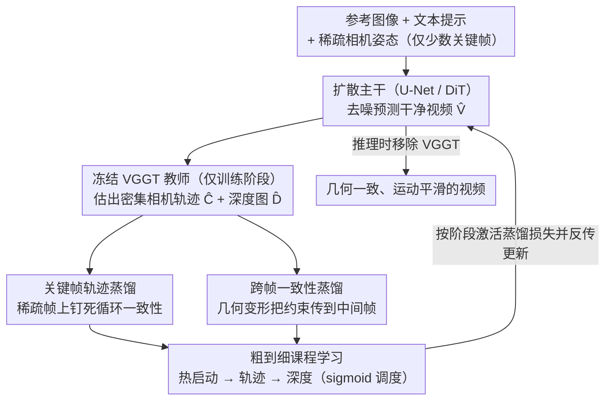

# CamGeo: Sparse Camera-Conditioned Image-to-Video Generation with 3D Geometry Prior

**会议**: ICML 2026  
**arXiv**: [2605.30895](https://arxiv.org/abs/2605.30895)  
**代码**: 待确认  
**领域**: 视频生成 / 3D 视觉 / 知识蒸馏  
**关键词**: 图像到视频生成, 稀疏相机条件, 3D 几何先验, 训练专用蒸馏

## 一句话总结
CamGeo 通过**训练专用蒸馏**（training-only distillation）从预训练 3D 视频模型（VGGT）蒸馏 3D 几何知识——仅在训练阶段提供监督信号使扩散模型能在**稀疏相机输入**条件下生成几何一致且运动平滑的高质量视频，推理时完全移除 VGGT 以保持效率。

## 研究背景与动机

**领域现状**：相机条件下的可控图像到视频生成已成为重要研究方向。现有方法（CameraCtrl、CamI2V、CPA 等）在视频生成和相机对齐上取得不错效果，但都依赖**密集的逐帧相机姿态标注**。

**现有痛点**：实践中获取密集相机姿态标注非常困难——传统 3D 重建流程（如 COLMAP）在处理快速运动或复杂非刚体动态时容易产生时间不一致的姿态。能否训练模型直接在**稀疏相机条件**下工作？

**核心矛盾**：直接从稀疏输入进行简单插值存在两个根本问题——首先模型在缺乏显式约束的帧处容易发生**姿态漂移**，产生违反物理规律的内容；其次刚性数学插值（SLERP）无法捕捉真实相机运动的非线性动态（手抖），导致生成的运动生硬不连贯。根源在于模型被迫"幻觉"3D 几何而**缺乏反馈**。

**本文目标**：在稀疏相机条件下实现高质量、几何一致的图像到视频生成。

**切入角度**：从已有强大 3D 理解模型（VGGT）中**蒸馏几何先验**到扩散模型。

**核心 idea**：**训练专用蒸馏**——仅在训练阶段利用 VGGT 提供监督，推理时完全移除，既获得几何约束的益处又保持运行效率。

## 方法详解

### 整体框架
建立在预训练文本引导图像到视频扩散模型之上。给定参考图像、文本提示、**稀疏相机姿态**（仅在少数关键帧提供），模型需要合成高保真视频 $V = \{I_f\}_{f=1}^F$，其中稀疏集合 $\mathcal{S} \subset \{1, \ldots, F\}$ 满足 $|\mathcal{S}| \ll F$。训练时冻结的 VGGT 教师处理生成的视频预测 $\hat{V}$，提取**密集相机轨迹** $\hat{C}$ 和深度图 $\hat{D}$，通过两种蒸馏机制为学生提供多级几何监督，再由粗到细课程学习控制这两种监督何时介入。推理时完全移除 VGGT，学生独立生成、零额外开销。

### 关键设计

**1. 关键帧轨迹蒸馏：在有标注的稀疏帧上钉死循环一致性**

稀疏相机条件下，模型在没有显式约束的帧处最容易姿态漂移、生成违反物理的内容。CamGeo 先在有标注的关键帧建立一个自监督闭环：对每个 $s \in \mathcal{S}$，把 VGGT 从生成视频里估出的相机参数 $(\hat{R}_s, \hat{T}_s, \hat{K}_s)$ 与真实值比对，用 L1 蒸馏损失 $\mathcal{L}_{\text{traj}} = \sum_{s \in \mathcal{S}}(\|\phi(\hat{R}_s) - \phi(R_s)\|_1 + \|\hat{T}_s - T_s\|_1 + \|\hat{K}_s - K_s\|_1)$ 拉齐，旋转用四元数 $\phi(\cdot)$ 表示以避开矩阵参数化的奇异性。这层约束保证生成视频在有条件的帧处严格对齐用户输入、防止灾难性漂移，而 L1 范数提供更鲁棒的优化景观，削弱 VGGT 教师本身估计误差的影响。

**2. 跨帧一致性蒸馏：把几何约束从关键帧传播到没标注的中间帧**

光钉住关键帧不够，中间那些没监督的帧也得保持几何连贯。CamGeo 对无标注帧用几何感知的变形：把帧 $f$ 的深度按相对姿态投影到参考帧 $f+k$ 做透视变换，同时套尺度不变深度变换来处理单眼深度的固有歧义，损失同时约束深度一致和轨迹平滑 $\mathcal{L}_{\text{geo}} = \sum_{f, k} \lambda^{(k)} w_{f, f+k}(\|\hat{D}_{f+k} - \mathcal{W}(\hat{D}_f, \Delta\hat{E}_{f, f+k}, \hat{K})\|_1 + \|\Delta(\hat{C}_{f+k}, \hat{C}_f)\|_1)$。两处设计是关键：跨度选择器 $\lambda^{(k)}$ 优先处理较大时间间隔，把关键帧的锚定向远处传、防止轨迹漂移；动态权重 $w_{f, f+k} = \exp(\gamma \cdot k) \cdot \exp(-\eta \|\nabla \hat{I}_f\|_1)$ 里的内容自适应项会在高梯度/遮挡区域降低惩罚，缓解变形伪影，在约束和视觉质量之间找平衡。

**3. 粗到细课程学习：让几何约束一阶段一阶段地进来**

早期就硬上几何约束会出问题——此时生成质量还低，VGGT 在低质量输入上给出的估计不可靠，反而把优化搅乱。CamGeo 分三段课程逐步引入：第一阶段热启动，关掉所有蒸馏损失、只用标准扩散损失学基本的视觉连贯和时间连续；第二阶段粗粒度，开启轨迹蒸馏、先让全局结构服从相机运动约束；第三阶段细粒度，再逐步引入基于深度的变形一致性损失。激活时机和"从轨迹到深度"的转换进度由平滑 sigmoid 调度 $\alpha$、$\beta$ 控制——这种递进既稳住了收敛，也和扩散模型从全局到细节的生成本质对齐。消融里 sigmoid 调度比线性调度把 RotError 从 1.33 压到 1.27。

### 损失函数
$\mathcal{L}_{\text{total}} = \mathcal{L}_{\text{diff}} + \alpha \cdot [(1 - \beta) \mathcal{L}_{\text{traj}} + \mathcal{L}_{\text{geo}}]$。关键创新在**训练专用蒸馏**——VGGT 教师和辅助损失仅在训练阶段使用，推理时完全移除。

## 实验关键数据

### 主实验（RealEstate10K）

| 稀疏比 | 方法 | 架构 | RotError ↓ | TransError ↓ | CamMC ↓ | FVD-StyleGAN ↓ | FVD-VideoGPT ↓ |
|--------|------|------|----------|------------|--------|---------------|-----------------|
| 1/2 | SVD-Full | U-Net | 1.46 | 6.26 | 6.83 | 122.5 | 131.9 |
| 1/2 | **SVD-CamGeo** | U-Net | **1.34** | **4.89** | **5.49** | **95.9** | **111.0** |
| 1/2 | CogVideoX-Full | DiT | 1.39 | 5.12 | 5.76 | 94.6 | 102.8 |
| 1/2 | **CogVideoX-CamGeo** | DiT | **1.27** | **4.72** | **5.38** | **83.4** | **97.6** |
| 1/4 | SVD-Full | U-Net | 1.55 | 5.82 | 6.47 | 108.8 | 125.9 |
| 1/4 | **SVD-CamGeo** | U-Net | **1.38** | **4.57** | **5.23** | **94.3** | **106.1** |

线性插值方法甚至不如直接从稀疏输入推理——刚性几何插值与学到的扩散先验冲突。

### 消融实验

| 组件 | 配置 | RotError ↓ | CamMC ↓ | 说明 |
|------|------|-----------|--------|------|
| 跨帧平滑 | w/o Smoothness | 1.45 | 5.71 | 1/2 稀疏 |
| | Ours | **1.34** | **5.49** | |
| 热启动 | w/o Warm-up | 1.48 | 5.83 | 1/3 稀疏 |
| | Ours | **1.35** | **5.40** | |
| 课程调度 | Linear | 1.33 | 5.53 | 1/2 稀疏 |
| | Ours (Sigmoid) | **1.27** | **5.38** | |

### 关键发现
- 跨帧平滑机制必要——移除导致所有相机指标显著下降。
- 热启动起稳定作用——缺乏导致全面恶化。
- 用户研究验证（73 名参与者 × 50 比较组）CamGeo 71.2% 偏好率。
- 架构无关性——在 U-Net 和 DiT 两种架构上都一致改进。

## 亮点与洞察
- **训练专用蒸馏的创新设计**：打破"使用教师模型必须承担推理成本"的常规认知，仅在训练阶段借用 VGGT 提供几何监督，推理时零开销——可广泛应用的范式。
- **对刚性插值的深层洞察**：揭示反直觉现象——线性插值相机轨迹反而比稀疏条件推理更差，因为刚性几何约束与模型学到的自然运动先验冲突。
- **粗到细课程与扩散特性的结合**：递进式优化是对多目标优化问题的优雅解决。
- **几何感知变形的权重设计**：动态权重平衡长距离锚定（防止漂移）和内容自适应性（缓解伪影），在约束与视觉质量间找到巧妙平衡。

## 局限与展望
- VGGT 作为教师模型的估计误差会传播到学生模型，尤其在复杂场景下可能产生不准确的深度和轨迹估计。
- 当稀疏比过低时模型的外推能力仍存在上限。
- 方法依赖初始参考图像质量和文本提示清晰度。
- 改进：探索更轻量的几何教师模型或层级式蒸馏加速训练；研究模型对关键帧位置的敏感性；扩展到更复杂的几何变换（非刚体运动）。

## 相关工作与启发
- **vs CameraCtrl / CamI2V**：依赖密集相机监督或简单插值，在稀疏设置下性能显著下降；本文通过几何先验蒸馏直接在稀疏条件下训练。
- **vs SparseCtrl**：处理稀疏结构线索（草图、深度）但不支持显式相机控制；本文首次系统解决稀疏相机条件下的 I2V 问题。
- **vs 其他蒸馏方法**：常见知识蒸馏多用于压缩模型或提升精度；本文开创"训练专用蒸馏"范式——教师仅在训练提供信号，推理时移除，可广泛应用于需要外部知识增强但不容忍推理开销的场景。

## 评分
- 新颖性: ⭐⭐⭐⭐⭐  训练专用蒸馏策略和粗到细课程的结合在 3D 条件生成中是创新的。
- 实验充分度: ⭐⭐⭐⭐⭐  主数据集 + 3 个域外数据集 + 两种架构 + 三种稀疏比 + 详细消融 + 用户研究。
- 写作质量: ⭐⭐⭐⭐  逻辑清晰，问题表述精准，方法阐述详尽。
- 价值: ⭐⭐⭐⭐⭐  解决稀疏相机条件 I2V 是实际应用中的常见需求；训练专用蒸馏范式具有广泛迁移潜力。

<!-- RELATED:START -->

## 相关论文

- [\[CVPR 2026\] Geometry-as-context: Modulating Explicit 3D in Scene-consistent Video Generation to Geometry Context](../../CVPR2026/video_generation/geometry-as-context_modulating_explicit_3d_in_scene-consistent_video_generation_.md)
- [\[ICML 2026\] DFSAttn: Dynamic Fine-Grained Sparse Attention for Efficient Video Generation](dfsattn_dynamic_fine-grained_sparse_attention_for_efficient_video_generation.md)
- [\[ICCV 2025\] STiV: Scalable Text and Image Conditioned Video Generation](../../ICCV2025/video_generation/stiv_scalable_text_and_image_conditioned_video_generation.md)
- [\[ICML 2026\] VEDA: Scalable Video Diffusion via Distilled Sparse Attention](veda_scalable_video_diffusion_via_distilled_sparse_attention.md)
- [\[ICML 2026\] Light Forcing: Accelerating Autoregressive Video Diffusion via Sparse Attention](light_forcing_accelerating_autoregressive_video_diffusion_via_sparse_attention.md)

<!-- RELATED:END -->
