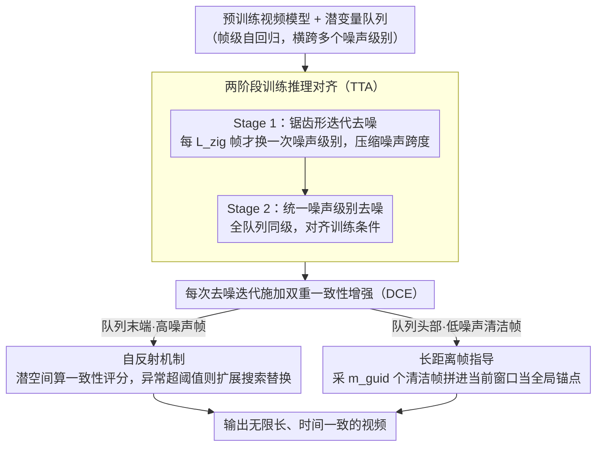

# Enhancing Train-Free Infinite-Frame Generation for Consistent Long Videos

**会议**: ICML 2026  
**arXiv**: [2605.18233](https://arxiv.org/abs/2605.18233)  
**代码**: 待确认  
**领域**: 视频生成 / 长视频  
**关键词**: 长视频生成, 无训练扩展, 时间一致性, 自回归生成

## 一句话总结
MIGA 通过**两阶段训练推理对齐**（TTA）和**双重一致性增强**（DCE：自反射 + 长距离帧指导）两个核心机制——在无需训练的前提下使基础视频模型能够生成**无限长**且**高度时间一致**的视频，VBench 综合评分相比 FIFO-Diffusion 提升 2.8%（97.82 vs 95.02）。

## 研究背景与动机

**领域现状**：当前视频生成模型在短视频上表现出色但受训练长度约束。为应对电影制作 / 游戏开发等长视频需求，研究者探索两类方向——专门训练长视频模型（Self-Forcing）需大规模计算；无训练扩展（FreeNoise、FreeLong、FreePCA、FIFO-Diffusion）直接在预训练基础模型上操作。

**现有痛点**：（1）固定长度扩展方法内存消耗随生成帧数线性增长，分钟级视频难以实现；（2）FIFO-Diffusion 通过帧级自回归实现了固定内存消耗和无限帧生成，但训练时模型处理单一噪声级别的潜在变量、推理时却要处理多个不同噪声级别——**训练推理失配**导致内容漂移和视觉伪影，且缺乏对长期时间一致性的显式建模。

**核心矛盾**：如何在保留自回归框架优势（固定内存、无限帧）的同时，既缩小训练推理的噪声空间差异，又显式增强整个生成过程的时间一致性？

**本文目标**：（1）以轻量级方式主动降低推理时的噪声跨度，更接近训练条件；（2）在不引入外部评估器的情况下高效检测和修正早期高噪声帧的一致性异常；（3）让远距帧之间产生交互，改进生成的全局时间一致性。

**切入角度**：（1）自回归框架中维护的噪声队列必然覆盖多个噪声级别，可通过降低噪声变化速率缩小跨度；（2）VAE 潜在空间相似度可直接反映帧间差异，无需外部模型；（3）队列结构天然区分早期和后期帧，可针对性应用不同的一致性增强策略。

**核心 idea**：通过两阶段设计同时解决两大问题——Stage 1 用锯齿形队列结构缓减噪声变化速率（降低训练推理失配），Stage 2 统一噪声级别进行标准去噪；结合自反射（检测并修正异常）和长距离帧指导（利用已生成的清洁帧）形成双管齐下的一致性增强。

## 方法详解

### 整体框架
MIGA 建在帧级自回归生成之上：标准流程维护一个长度 $L$ 的潜在变量队列，里面装着 $T$ 个去噪时步对应的帧，从而做到固定内存、无限帧。但 FIFO-Diffusion 这类方法有个根本毛病——训练时模型只处理单一噪声级别的潜变量，推理时队列里却同时存在多个不同噪声级别，这种训练推理失配会引发内容漂移和伪影，而且全程没有显式的长期一致性建模。MIGA 在不重训的前提下叠两套机制：两阶段训练推理对齐（TTA）把推理时的噪声跨度压回接近训练条件，双重一致性增强（自反射 + 长距离帧指导）则一个管早期异常的及时修正、一个管全局时序的流畅。

### 关键设计

**1. 两阶段训练推理对齐（TTA）：把队列里五花八门的噪声级别先抹平**

自回归框架里维护的噪声队列必然横跨多个噪声级别，而模型是在单一噪声级别下训练的，二者一错位就漂。直接对抗这种失配理论上很难，MIGA 改用渐进平滑的迂回打法。Stage 1 把队列做成锯齿形——每隔 $L_{\text{zig}}$ 个帧才改一次噪声级别，而非每帧都变，于是输入模型的 $f_0$ 个帧里噪声跨度从 $f_0$ 个级别降到约 $\lceil f_0 / L_{\text{zig}} \rceil$ 个；$n$ 次迭代后会有 $n L_{\text{zig}}$ 个帧落到同一噪声级别 $\tau_{e-1}$。Stage 2 就在这个统一级别下做标准去噪，条件与训练一致。这套锯齿结构不改变总去噪步数、只改变模型看到的噪声多样性，计算代价几乎为零，却把失配这个主瓶颈直接削平——消融里它单独就贡献约 2% 的综合提升。

**2. 自反射机制（Self-Reflection）：在高噪声阶段就提前抓异常并补救**

异常帧发现得越早、对后续生成的污染越小。MIGA 不引外部评估器，直接在潜空间算一致性评分 $C_{\text{score}} = \text{mean}_1(\text{mean}_2(q'_{\text{eval}} (q'_{\text{ref}})^\top))$，即待评估帧与参考帧的余弦相似度矩阵的均值。关键观察是高噪声帧与最终清洁帧的一致性评分仍保持相关性，所以可以在队列末端的高噪声阶段就提前检测：一旦评分跌幅超过阈值 $\delta_{\text{adju}}$，就触发扩展搜索——从队列末端再采 $n_{\text{samp}}$ 个高斯初始化候选帧、用已验证的前导帧做指导逐步去噪，最后挑一致性最高的候选替换原帧。整套判定和修正都在潜空间完成，避开了 DINO 这类外部模型和反复 VAE 解码的开销。

**3. 长距离帧指导（Long-Range Frame Guidance）：让远帧也能彼此约束**

标准滑动窗口 $q_{\text{input}} = [z^l, \ldots, z^{l + f_0 - 1}]$ 只看局部相邻帧，内存省了但容易品质漂移，因为时间一致性本质上需要全局信息。MIGA 在每次去噪时从队列头部（已生成的低噪声清洁帧）均匀采 $m_{\text{guid}}$ 个帧拼到当前窗口前面，扩成 $q_{\text{input}} = [z^1, \ldots, z^{m_{\text{guid}}}, z^l, \ldots, z^{l + f_0 - m_{\text{guid}} - 1}]$（$l > m_{\text{guid}}$ 时）。已验证的清洁帧前缀作为全局锚点参与每一窗去噪，既维持固定内存又给生成加上全局视角的约束。它和自反射正好互补——一个做局部的早期纠错、一个做全局的时序贯通，合起来的提升超过两者之和。

## 实验关键数据

### 主实验（VBench 基准）

| 方法 | 无限帧 | 主体一致性 | 背景一致性 | 运动平滑度 | 时间闪烁 | 综合评分 |
|------|--------|--------|--------|--------|--------|--------|
| VideoCrafter2-FreePCA | ✗ | 93.57 | 95.24 | 93.73 | 91.27 | 93.45 |
| VideoCrafter2-FreeLong | ✗ | 95.72 | 96.42 | 98.38 | 97.28 | 96.95 |
| VideoCrafter2-FIFO-Diffusion | ✓ | 92.92 | 95.01 | 97.19 | 94.94 | 95.02 |
| VideoCrafter2-ScalingNoise | ✓ | 94.29 | 95.52 | 97.86 | 96.12 | 95.95 |
| **VideoCrafter2-MIGA** | ✓ | **97.66** | **96.99** | **98.60** | **98.03** | **97.82** |
| Wan2.1-FIFO-Diffusion | ✓ | 92.67 | 93.37 | 98.03 | 97.09 | 95.29 |
| **Wan2.1-MIGA** | ✓ | **96.46** | **95.50** | **98.85** | **98.14** | **97.24** |

相对于 FIFO-Diffusion，MIGA 在 VideoCrafter2 上实现主体一致性 +4.74%。

### 消融实验

| TTA | DCE | S.C. | B.C. | M.S. | T.F. | O.S. |
|---------|---------|-------|-------|-------|-------|-------|
| ✗ | ✗ | 92.92 | 95.01 | 97.19 | 94.94 | 95.02 |
| ✓ | ✗ | 96.74 | 96.75 | 97.57 | 97.12 | 97.05 |
| ✗ | ✓ | 96.10 | 96.47 | 97.88 | 96.56 | 96.75 |
| ✓ | ✓ | 97.66 | 96.99 | 98.60 | 98.03 | 97.82 |

两个核心机制独立贡献约 2% 的综合评分提升（TTA +2.03%，DCE +1.73%）。

### 关键发现
- TTA 单独效益最大——两阶段对齐机制是最重要的贡献，单独就能将基线提升 2%，说明训练推理失配确实是自回归框架的主要瓶颈。
- DCE 互补性强——与 TTA 结合能产生协同效应，总提升超过两者之和（4.8% > 2.0% + 1.7%）。
- 模型间一致性——两个不同基础模型（animation vs realistic）都能从 MIGA 获益。
- NarrLV 性能优势明显——在复杂叙事任务上（场景变化、物体属性转换），MIGA 对 FIFO-Diffusion 的优势更大（+2.3-12.5%）。

## 亮点与洞察
- **噪声空间的渐进式平滑化思路巧妙**：既不改变计算图，也不需要重新训练，仅通过改变输入队列的结构就能缓解训练推理失配——"轻量级调适"思路对其他自回归生成任务（文本、图像）可能也有启发。
- **自洽性评分的设计避免了计算陷阱**：利用潜在空间的高噪声帧与清洁帧间的相关性，避免频繁的 VAE 解码和外部评估器调用，是一个值得复用的工程技巧。
- **双机制的互补性设计**：自反射关注早期异常的及时修正（局部约束），长距离指导保证全局时间流畅性（全局约束）——这种局部-全局结合的思路可迁移到需要维持长期相关性的其他任务（多模态生成、长文本翻译）。

## 局限与展望
- 两个模型使用不同超参数，通用的超参推荐规则仍待探索。
- 自反射机制通过比较相邻帧检测一致性，对快速的内容变化（剧烈动作或场景切换）处理可能不够灵敏。
- 长距离指导中 $m_{\text{guid}}$ 选择缺乏原则性的设计，目前是经验值。
- 改进：自适应超参数策略；自反射扩展到多尺度异常检测；研究动态确定 $m_{\text{guid}}$ 的机制。

## 相关工作与启发
- **vs FIFO-Diffusion**：都采用帧级自回归 + 固定内存架构，但 MIGA 在两个关键方面改进——通过两阶段主动缩小训练推理失配的噪声跨度，并引入显式的时间一致性建模。
- **vs ScalingNoise**：都尝试在推理时进行搜索优化，但 ScalingNoise 为每个时步都执行一致性评估和搜索计算开销大；MIGA 的自反射仅在检测到异常时触发扩展搜索；且 ScalingNoise 依赖外部 DINO 模型而 MIGA 完全在潜在空间内工作。
- **vs FreeLong / FreePCA**：这两者属于有限帧扩展，无法生成分钟级视频；MIGA 作为无限帧方法优势在于内存恒定、帧数无上限。

## 评分
- 新颖性: ⭐⭐⭐⭐  两阶段对齐的设计相对直观，但自反射的潜在空间一致性评分和长距离指导的组合方式具有创意。
- 实验充分度: ⭐⭐⭐⭐⭐  涵盖两个主流基础模型 + 两个权威基准（VBench + NarrLV）+ 详细的消融研究。
- 写作质量: ⭐⭐⭐⭐  论文结构清晰，方法阐述细致，插图对比直观。
- 价值: ⭐⭐⭐⭐⭐  解决了实用的问题（无训练长视频生成），方法轻量且易于集成到不同模型，对社区的实用价值高。

<!-- RELATED:START -->

## 相关论文

- [\[ICML 2026\] Explainable Forensics of Manipulated Segments in Untrimmed Long Videos](explainable_forensics_of_manipulated_segments_in_untrimmed_long_videos.md)
- [\[CVPR 2026\] Free-Lunch Long Video Generation via Layer-Adaptive O.O.D Correction](../../CVPR2026/video_generation/free-lunch_long_video_generation_via_layer-adaptive_ood_correction.md)
- [\[ICLR 2026\] Frame Guidance: Training-Free Guidance for Frame-Level Control in Video Diffusion Models](../../ICLR2026/video_generation/frame_guidance_training-free_guidance_for_frame-level_control_in_video_diffusion.md)
- [\[AAAI 2026\] FilmWeaver: Weaving Consistent Multi-Shot Videos with Cache-Guided Autoregressive Diffusion](../../AAAI2026/video_generation/filmweaver_weaving_consistent_multi-shot_videos_with_cache-guided_autoregressive.md)
- [\[CVPR 2025\] StreamingT2V: Consistent, Dynamic, and Extendable Long Video Generation from Text](../../CVPR2025/video_generation/streamingt2v_consistent_dynamic_and_extendable_long_video_generation_from_text.md)

<!-- RELATED:END -->
