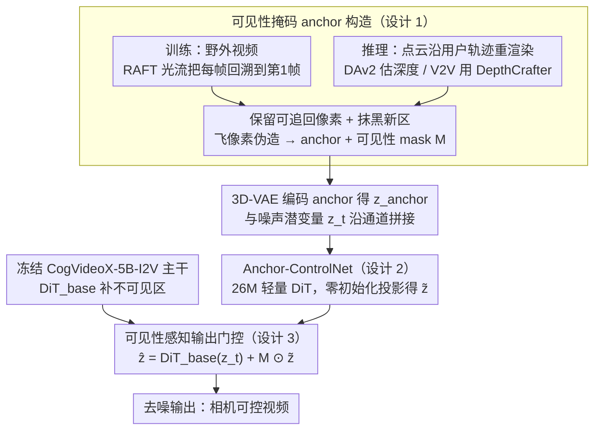

# EPiC: Efficient Video Camera Control Learning with Precise Anchor-Video Guidance

**会议**: ICML 2026  
**arXiv**: [2505.21876](https://arxiv.org/abs/2505.21876)  
**代码**: https://zunwang1.github.io/Epic (项目主页)  
**领域**: 视频生成
**关键词**: anchor video、可见性掩码、Anchor-ControlNet、I2V/V2V 相机控制、轻量化适配

## 一句话总结
EPiC 用"基于第一帧可见性掩码"的方式从任意 in-the-wild 视频直接构造像素级对齐的 anchor 视频，再配一个仅 26M 参数（<1% backbone）、且只在可见区域生效的 Anchor-ControlNet，在冻结 CogVideoX-5B-I2V 主干、5K 视频、500 步训练的条件下，把 I2V 相机控制误差刷到 SoTA，并零样本泛化到 V2V。

## 研究背景与动机
**领域现状**：可控视频生成的主流相机控制路线分两派：一派把相机参数（Plücker embedding、外参矩阵）直接喂进 VDM 做条件（CameraCtrl、AC3D），另一派则把单张图升成点云、按目标轨迹重渲染出一段"anchor 视频"，再把它作为结构化先验喂给 diffusion 模型（ViewCrafter、Gen3C、TrajectoryCrafter、Uni3C）。后者因为有显式几何指引，相机精度通常更好。

**现有痛点**：anchor video 路线有两大痛点。第一，anchor 是从估计的点云（DAv2、MoGe）+ 估计的相机轨迹（COLMAP）渲染出来的，估计误差直接体现为 anchor 和源视频在可见区域的像素级错位（论文实测 anchor-source PSNR 只有 16 dB），模型既要修错位、又要补不可见区域，学习目标被搅成一锅粥。第二，为了对齐误差，现有方法不得不大改 backbone（全量微调或注入重量级模块），且只能用 RealEstate10K 这种带精确相机标注的静态多视图数据，泛化到动态野外视频很差。

**核心矛盾**：anchor 视频的"3D 信息丰富度"和"与源视频像素对齐度"之间存在 trade-off——越想让 anchor 携带完整的点云重渲染信息，错位就越严重；想要对齐就得放弃显式 3D。已有方法都站在前者一边，把代价丢给模型。

**本文目标**：(1) 让训练 anchor 在可见区域对源视频做到像素级对齐，且不依赖任何相机/点云估计；(2) 用尽量小的可学习参数把 anchor 信号注入冻结的 VDM；(3) 让推理时仍能享受 3D 点云的精确轨迹控制。

**切入角度**：作者的关键观察是——anchor 视频的"几何特性"只需要"哪些像素相对第一帧仍可见、哪些已经被遮挡或移出视野"这一信息，根本不需要真的去做 3D 重建。只要用密集光流把每帧像素回溯到第一帧、保留能追上的、抹掉追不上的，就能伪造出一段几何性质和点云渲染等价、但和源视频完美对齐的 anchor。

**核心 idea**：把 anchor 构造从"难对齐的 3D 重渲染"换成"易对齐的可见性掩码"，并让 ControlNet 只负责拷贝可见区域、不可见区域整个交回给被冻结的 base model——把 ControlNet 的任务从"修错位 + 补遮挡"压缩到只剩"拷贝"。

## 方法详解

### 整体框架
EPiC 基于 CogVideoX-5B-I2V（DiT 风格、3D 全自注意力）。训练管线分两步：(1) 从任意 in-the-wild 视频用可见性掩码合成训练 anchor（不需要相机/点云）；(2) 把 anchor 经 3D-VAE 编码后和噪声潜变量沿通道拼接，送入 26M 的 Anchor-ControlNet，输出再用可见性掩码 $M$ 做空间门控、加到 base DiT 的对应层，整个 backbone 全程冻结。推理时反过来——用真实点云沿用户给定轨迹渲染 anchor，靠 Anchor-ControlNet 的可见性门控隔离掉 3D 重建的错位与飞像素，并且通过对前景做点云 mask 来切换"静态相机控制"和"前景可动"两种模式，V2V 模式则换成 DepthCrafter 估计的动态点云。

### 关键设计

**1. 可见性掩码 anchor 构造：用光流可见性伪造一段与源视频逐像素对齐的 anchor**

anchor 视频路线的最大痛点是：anchor 由估计的点云加估计的相机轨迹重渲染而来，估计误差直接体现为 anchor 和源视频在可见区的像素错位（实测 PSNR 只有 16 dB），模型既要修错位又要补遮挡，学习目标被搅成一锅粥。EPiC 的破法是发现 anchor 真正需要的几何信息只有一条——"哪些像素相对第一帧仍可见、哪些已被遮挡或移出视野"，根本不必做 3D 重建。于是用 RAFT 估稠密光流，把第 $t$ 帧每个像素回溯到第 1 帧，只保留能稳定追回的、其余涂黑，得到二值可见性 mask $M_t$。这样合成的 anchor 在可见区与源视频逐像素一致（PSNR 从 16.01 跳到 40.12 dB），而"新出现区域全黑"这一关键性质又与点云重渲染等价。视角大幅变化导致可见区过小时，把 mask 冻结在当前帧防退化；训练时还做"飞像素伪造"——在可见区随机画淡色虚线射线、颜色从第一帧采，模拟点云在物体边缘渲出的 flying-pixel 伪影，缩小训练-推理 gap。这一步直接砍掉了错位这个最大学习负担，还顺手绕开"必须有相机标注"的数据瓶颈，让训练集能扩到 Panda-70M 这种野外动态视频。

**2. Anchor-ControlNet：anchor 越对齐，适配器越能瘦身**

把 anchor 信号注入冻结主干，EPiC 只用一个 26M（<1% backbone）的轻量 DiT 适配器：单个 DiT block，hidden dim 从主干的 3072 砍到 256（约 8%），只接到前 25% 的层上。anchor 视频 $\mathbf{A}$ 经主干的 3D-VAE 编码得 $\mathbf{z}_{\text{anchor}}$，与噪声潜变量 $\mathbf{z}_t$ 沿通道拼接、patchify 后送进 DiT-ctrl，输出再零初始化投影回 3072 维 $\tilde{\mathbf{z}} = \text{Proj}(\text{DiT}_{\text{ctrl}}([\mathbf{z}_t, \mathbf{z}_{\text{anchor}}]))$，训练只更新这 26M 参数、主干全程冻结。相比 ViewCrafter / Gen3C / TrajectoryCrafter 动辄全量微调主干，这种"轻+浅+窄"的配置之所以负担得起，正是因为前一步把 anchor 对齐做到位了——anchor 越对齐，ControlNet 要做的事越少、所需容量越小，这是个"上游对齐换下游容量"的联动。

**3. 可见性感知输出门控：ControlNet 只拷可见区，不可见区整个交回冻结主干**

为了把职责分离推到极致，EPiC 把可见性 mask $M \in \{0,1\}^{T'\times h\times w}$ 下采到 latent 分辨率，做潜变量级硬门控融合 $\hat{\mathbf{z}} = \text{DiT}_{\text{base}}(\mathbf{z}_t) + M \odot \tilde{\mathbf{z}}$，训练推理同一公式。对比之下，ViewCrafter 直接喂整段 anchor 不带可见性、TrajectoryCrafter 把 mask 也编码进 latent 让模型自己学三者关系，都把"修错位+补遮挡"压在 ControlNet 一身。EPiC 让 ControlNet 拷可见、base model 补不可见，互不串扰，好处有三：不可见区的点云飞像素/撕裂伪影被门控直接掐掉、不污染输出；训练目标变成纯"复制"、收敛快又省数据；推理时只要把 anchor 上的某些前景区域额外 mask 掉（用 GroundedSAM 分割人/动物），那些区域就不受相机轨迹约束、能自由运动，从而免训练支持"相机移动+前景动作"——一个为对齐而生的 mask，到推理端顺手长出了可控性红利。

### 损失函数 / 训练策略
标准 latent diffusion 去噪损失 $\mathcal{L}_{\text{denoise}} = \mathbb{E}_{\mathbf{z}_0, t, \boldsymbol{\epsilon}, c}[\|\boldsymbol{\epsilon}_\theta(\mathbf{z}_t, t, c) - \boldsymbol{\epsilon}\|_2^2]$，条件 $c$ 包含文本和 anchor。只更新 26M 的 Anchor-ControlNet，主干冻结。Panda-70M 取 5,000 段视频，batch=16，8×A100-40G，500 步，约 3 小时（合 15 GPU 小时）；AdamW，lr=$2\times 10^{-4}$。推理 CFG 文本尺度 6.0；I2V 推理用 DAv2 估深度构点云，可选用 GroundedSAM 抠掉动态前景；V2V 推理换成 DepthCrafter 在每帧相机系下估动态点云、把用户轨迹解释为相对变换。

## 实验关键数据

### 主实验
RealCam-Vid 测试集，分别从 RealEstate10K 和 MiraData 各采 500 段视频，每条样本固定 5 个种子。相机指标 RotErr / TransErr / CamMC（越小越好，单位 $10^{-2}$ 量级），质量分用 VBench 子项的均值。

| 数据集 | 方法 | RotErr ↓ | TransErr ↓ | CamMC ↓ | Total Quality ↑ |
|--------|------|----------|------------|---------|-----------------|
| RE10K | CameraCtrl | 1.12±0.44 | 1.78±0.93 | 2.36±1.01 | 78.35 |
| RE10K | AC3D† | 0.86±0.37 | 1.50±0.82 | 1.97±0.86 | 82.63 |
| RE10K | ViewCrafter | 0.50±0.16 | 1.05±0.32 | 1.35±0.40 | 81.18 |
| RE10K | Gen3C | 0.45±0.13 | 0.99±0.22 | 1.35±0.30 | 82.27 |
| RE10K | **EPiC** | **0.40±0.11** | **0.86±0.18** | **1.17±0.23** | **82.63** |
| MIRA | ViewCrafter | 1.16±0.34 | 2.95±0.98 | 3.42±1.04 | 79.87 |
| MIRA | Gen3C | 0.81±0.24 | 2.05±0.77 | 2.75±0.72 | 80.50 |
| MIRA | **EPiC** | **0.66±0.22** | **1.78±0.67** | **2.10±0.60** | **82.89** |

EPiC 在 6 项相机/总质量指标上全部第一，且标准差最小（多种子最稳）。Kubric-4D 上的 V2V 零样本评估 PSNR 19.65 / SSIM 0.60，与专门为 V2V 训练的 GCD（19.72/0.59）、TrajCrafter（19.61/0.62）、Gen3C（19.69/0.61）齐平。效率上，5K 视频 + 500 步训练，相比 ViewCrafter（800K 视频）和 Gen3C 训练数据 / 算力均下降一个数量级以上，可训练参数 26M（其他方法多为 1–5B）。

### 消融实验

| 配置 | Anchor PSNR ↑ | RotErr ↓ | TransErr ↓ | CamMC ↓ |
|------|---------------|----------|------------|---------|
| 点云 anchor（1500 iters） | 16.01 | 0.60±0.20 | 1.07±0.39 | 1.45±0.62 |
| 50% PC + 50% Mask（1000 iters） | 28.07 | 0.48±0.15 | 0.95±0.28 | 1.29±0.40 |
| **Masking anchor（500 iters）** | **40.12** | **0.40±0.11** | **0.86±0.18** | **1.17±0.23** |

### 关键发现
- anchor-source PSNR 与下游相机精度高度正相关：anchor 从 16→28→40 dB 单调上升，所有相机指标随之单调改善，作者据此把"anchor 对齐质量"确立为决定相机控制上限的关键变量，而不是 3D 信息本身。
- 移除飞像素伪造，模型推理时会照搬点云带来的边缘飞像素；去掉可见性输出门控（退化到 ViewCrafter 设置），点云的撕裂伪影会把不可见区域内容带偏，输出模糊乱码，定性图（Fig. 5c）非常明显。
- 训练全用 I2V 数据，V2V 仍能在 Kubric-4D 上对齐专门训练的方法，说明"先把 anchor 对齐做干净 + 让 ControlNet 只管可见区"这一抽象适用于任何能算可见性的视频任务。
- I2V 推理时给前景目标加 mask（mode c）能让相机继续按轨迹推、人物自然行走；不加 mask（mode b）则人物被强 3D 约束钉在原地——这是"可见性门控"在推理端额外送的可控性红利。

## 亮点与洞察
- **任务再定义**：把"学相机控制"重新切成"拷可见 + 补不可见"两个非耦合子任务，再用 mask 强制把它们交给两个不同的模块（ControlNet 和 base model），是这篇论文真正巧妙的地方——不是又设计了一个新模块，而是把训练目标本身拆干净了。
- **数据-架构联动**：通常 ControlNet 越轻越要靠数据撑，这里反过来——anchor 越对齐，ControlNet 越能瘦身、越能少训。这种"上游对齐换下游容量"的 trade-off 思路可以迁移到任何 conditioning-heavy 的生成任务（语义图→图、深度→图、姿态→视频）。
- **光流当作几何信号**：用光流可追溯性来近似"第一帧可见性"，作为点云重渲染的廉价替代——只要任务真正需要的是几何性质（哪里看得见）而不是几何本身（深度数值），这条路就走得通，值得在 4D 生成、occlusion-aware inpainting 等任务里复用。
- **推理侧 mask 化的副产物**：训练时为对齐而引入的可见性 mask，到推理时直接成了"前景可动 / 静态"的开关，几乎零成本支持动态前景，这种"训练约束顺手长出推理能力"的设计很优雅。

## 局限与展望
- 作者承认依赖第一帧可见性，当相机做大幅度环绕或纯旋转时，可见区域迅速缩小直至 mask 被冻结，剩余 anchor 信号变弱，落到 base model 自由发挥，长程一致性可能下降。
- 训练用光流追溯本质上假设光流可靠，对于强遮挡、快速变形、纹理稀疏场景，RAFT 误差会污染 mask，进而让模型在错位区域被错误监督。
- 推理 V2V 时把用户轨迹解释为相对变换（DepthCrafter 在每帧相机系下估深度），不能直接指定全局世界坐标系下的目标位姿，应用到长时多镜头 storytelling 时会显得别扭。
- 整个框架严格依赖 base I2V 模型的生成能力补不可见区——一旦 base model 对该域分布外（如卡通、医学、远红外），ControlNet 即使可见区对齐到位，不可见区也会出现内容崩坏；可考虑引入轻量的不可见区补全 prior。

## 相关工作与启发
- **vs ViewCrafter / Gen3C / TrajectoryCrafter（同样用 anchor 视频）**：它们用点云重渲染做 anchor，强行让模型同时学错位修复和遮挡补全，因此必须全量微调主干；EPiC 在 anchor 构造阶段就把错位消灭，ControlNet 只剩拷贝任务，于是可以冻结主干、用 26M 参数训完。
- **vs CameraCtrl / AC3D（相机参数直接条件）**：它们靠 Plücker 嵌入注入相机信息，没有显式 3D 引导，OOD 场景的相机精度差很多；EPiC 推理时仍走点云重渲染拿到精确轨迹信息，再用可见性门控隔掉点云错误，兼顾"显式 3D"和"训练易学性"。
- **vs FloVD（光流图作引导）**：FloVD 把光流当条件，引导信号比 anchor 视频间接、精度差一档；EPiC 也用了光流，但仅作为构造可见性 mask 的工具，最终给模型的还是像素对齐的 anchor 视频——光流被用在"如何造数据"而不是"怎么做条件"。
- **vs ReCamMaster / SynCamMaster（V2V 专门方法）**：它们靠 Unreal Engine 等模拟器构造大规模 4D 数据训练，EPiC 完全没碰 V2V 训练数据，靠 anchor 对齐和可见性门控的良好归纳偏置就在 Kubric-4D 上跟上，这给"用 I2V 数据零成本拿 V2V 能力"提供了样板。

## 评分
- 新颖性: ⭐⭐⭐⭐ "用光流可见性 mask 伪造 anchor + 可见性门控的输出融合"是个简单到一句话说完、但据我所知没人这么干过的组合，把任务难度结构性降低。
- 实验充分度: ⭐⭐⭐⭐ I2V 两个数据集 6 项指标全 SoTA，3 个核心组件都有干净的消融，零样本 V2V 也验证了，唯一遗憾是 V2V 仅 Kubric-4D 一项定量。
- 写作质量: ⭐⭐⭐⭐ 动机和方法解释非常清楚，Fig. 1 的"效率气泡图"一图胜千言，公式和符号都规范。
- 价值: ⭐⭐⭐⭐⭐ 15 GPU 小时复现 SoTA 相机控制 + backbone 完全冻结 + 可扩到任何野外视频，对工业界部署和后续研究都很有吸引力。

<!-- RELATED:START -->

## 相关论文

- [\[ICML 2026\] Rays as Pixels: Learning A Joint Distribution of Videos and Camera Trajectories](rays_as_pixels_learning_a_joint_distribution_of_videos_and_camera_trajectories.md)
- [\[CVPR 2025\] GEN3C: 3D-Informed World-Consistent Video Generation with Precise Camera Control](../../CVPR2025/video_generation/gen3c_3d-informed_world-consistent_video_generation_with_precise_camera_control.md)
- [\[ICLR 2026\] Frame Guidance: Training-Free Guidance for Frame-Level Control in Video Diffusion Models](../../ICLR2026/video_generation/frame_guidance_training-free_guidance_for_frame-level_control_in_video_diffusion.md)
- [\[ICML 2026\] iTryOn: Mastering Interactive Video Virtual Try-On with Spatial-Semantic Guidance](itryon_mastering_interactive_video_virtual_try-on_with_spatial-semantic_guidance.md)
- [\[CVPR 2026\] BulletTime: Decoupled Control of Time and Camera Pose for Video Generation](../../CVPR2026/video_generation/bullettime_decoupled_control_of_time_and_camera_pose_for_video_generation.md)

<!-- RELATED:END -->
