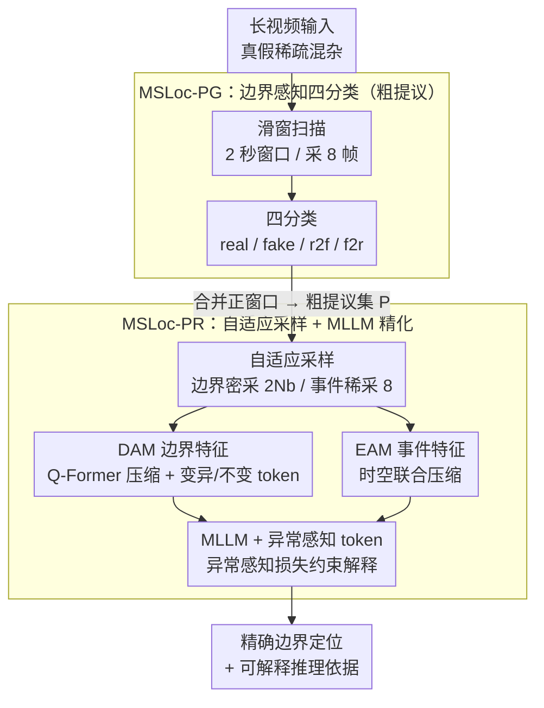

# Explainable Forensics of Manipulated Segments in Untrimmed Long Videos

**会议**: ICML 2026  
**arXiv**: [2606.02402](https://arxiv.org/abs/2606.02402)  
**代码**: 待确认  
**领域**: AIGC 检测 / AI 安全 / 视频取证  
**关键词**: AI 生成视频检测, 时序定位, 可解释性, 长视频取证, 边界感知

## 一句话总结
本文提出了**长视频中 AI 生成片段的时序定位与可解释分析**任务，引入 **TASLE 大规模数据集**和**两阶段 MSLoc 基线方法**——通过边界感知提议生成和 MLLM 精化实现对混合真伪视频中篡改片段的精确定位和可解释推理。

## 研究背景与动机

**领域现状**：当前 AI 生成视频检测方法主要聚焦于短视频片段的二分类（真/假），代表工作如 DeMamba、BusterX++ 都是在数秒时长的独立视频片段上进行训练与评估。同时现有 AIGC 检测数据集（GenVideo、GenVidBench）几乎全部为短视频或全生成视频，**缺乏混合场景**（真实和生成内容混杂）的标注。

**现有痛点**：现实世界中视频篡改通常呈现为"**稀疏嵌入**"模式——少量 AI 生成内容混杂在大量真实视频中而非整段都是伪造。这种设定下现有短视频检测器面临两大挑战——（1）**边界信息丧失**：模型对真假交界处的细微异常不敏感，无法捕捉从真实到生成内容的平稳过渡；（2）**长尾干扰**：大量无关的真实内容引入噪声，若直接用滑窗推断于整个长视频计算成本爆炸，但均匀采样又会稀释关键边界线索。

**核心矛盾**：短视频检测器设计假设是"每个输入片段要么完全真要么完全假"，这个假设在长视频混合场景中彻底崩溃。现有 MLLM 时序定位模型（如 Trace）虽然拥有推理能力，但对几十秒的长视频进行端到端处理时会因均匀采样而淹没在大量无关帧中。

**本文目标**：建立"长视频中 AI 生成片段的时序定位与可解释性分析"这一新任务，并以此为中心构建对应的大规模数据集与基线方法。

**切入角度**：核心观察是篡改片段在长视频中往往以"**边界**"形式出现——真实与生成内容交界处的细微不一致是最强的判别线索。作者提出用"多分类"而非"二分类"来捕捉这些边界信息，并设计两阶段 pipeline：先用轻量级模型做粗提议（聚焦边界），再用 MLLM 做精细定位与解释（理解语义）。

**核心 idea**：将长视频取证从单阶段的片段级二分类转变为两阶段的边界感知提议 + MLLM 精化框架，通过边界分类和自适应采样显式地对真假交界处的异常进行建模。

## 方法详解

### 整体框架
MSLoc 要在一段几十秒、真假混杂的长视频里把 AI 生成的片段精确定位出来并给出可解释的判断依据。它走经典的"粗到精"两阶段，但每一步都是围绕"边界"重新设计的。第一阶段 MSLoc-PG 用滑窗（2 秒窗口、采 8 帧）高效扫一遍长视频，把检测重新表述成四分类、快速圈出可疑区域；第二阶段 MSLoc-PR 接过这些粗提议，按"边界区域密采、事件区域稀采"的自适应策略，先经 DAM（边界）和 EAM（事件）压缩特征，再交给 MLLM 做精细定位与解释。关键在于：四分类让模型学会盯住真伪交界、自适应采样把算力压在信息密度最高的过渡区、异常感知损失再把 MLLM 的解释绑到真实伪迹上。

### 关键设计

**1. 边界感知四分类：把"整段真假"换成"盯住交界"**

真正的篡改往往是少量生成内容稀疏嵌进大段真实视频，最强的判别线索就藏在真假交界处的细微不连贯（运动突变、光照不匹配）。可传统短视频检测器只做真/假二分类，假设"每个片段要么全真要么全假"，根本捕捉不到过渡。MSLoc 把标签空间扩成四类 $\mathcal{Y} = \{y_{\text{real}}, y_{\text{fake}}, y_{\text{r2f}}, y_{\text{f2r}}\}$，其中 $y_{\text{r2f}}$、$y_{\text{f2r}}$ 显式标出真→伪和伪→真两种边界。每个 2 秒窗口均匀采 8 帧，用交叉熵 $\mathcal{L}_{\text{ce}} = -\frac{1}{N_b} \sum_{i=1}^{N_b} \log(p_{i, t_i})$ 优化。这个目标直接逼着模型对连续帧间的过渡信号敏感，而不是只判一个整体真假——消融里 F1Loc 从 54.0 涨到 64.8。

**2. 自适应采样 + 边界/事件特征建模（DAM + EAM）：把算力花在边界上**

长视频里真假交界往往只占提议的一小段，却是信息密度最高的地方；而提议内部的"事件区域"主要是给解释提供语义上下文，不需要逐帧抠。MSLoc 据此对每个粗提议 $P_i$ 分而治之：两端 φ% 的边界区域做密集采样（$2 \times N_b$ 帧，$N_b=16$ 时即 32 帧）以捕捉细微帧间异常，内部事件区域只稀疏采 8 帧拿高层语义。边界特征经 Q-Former 压缩，并利用相邻帧对应像素的相似性先验，分别算出"帧间变异"和"帧间不变"的 token；事件特征则做时空联合压缩。这种不对称采样既把边界定位精度抬上去（相比均匀采样提升 2-3%），又靠压缩减轻 MLLM 负担，跨域 F1Loc 提升达 17.6%。

**3. 异常感知损失：逼 MLLM 把解释落到具体伪迹上**

TASLE 里的 AI 生成内容受参考帧约束、与真实帧极其相似，MLLM 很容易"幻觉"出一套听起来合理却没根据的解释。本文在 MLLM 输入里注入三个特殊的"异常感知 token"，编码成 LLM 能读的格式，再让它们的输出 embedding 经分类头去预测异常类别（如"边界开始解释""对象异常"），用交叉熵 $\mathcal{L}_{\text{AA}}$ 优化。这相当于给推理过程系上一根绳——模型必须把每段解释和具体的异常类别绑定，而不能泛泛而谈，从而提高解释的真实性：加上该损失后可解释性评分 RQ 从 3.79 升到 3.99。

## 实验关键数据

### 主实验

| 方法 | 数据 | F1Det | F1Loc | RQ |
|------|------|-------|-------|-----|
| D3 | 见 AIGC 类型 | 34.6 | 31.1 | ✗ |
| BusterX++* (微调) | TASLE | 33.6 | 36.4 | ✗ |
| DeMamba* (二分类) | TASLE | 54.9 | 54.0 | ✗ |
| MSLoc-PG (四分类) | TASLE | 67.5 | 64.8 | ✗ |
| Trace* + DeMamba | TASLE | 55.7 | 59.1 | 3.45 |
| Trace* + MSLoc-PG | TASLE | 69.0 | 70.9 | 3.91 |
| **MSLoc (完整)** | **TASLE** | **70.1** | **72.2** | **4.05** |

### 泛化性评估（Out-of-Domain）

| 设定 | MSLoc-PG | MSLoc | 提升 |
|------|----------|-------|------|
| 见过的生成类型 | 62.7 F1Det | 67.0 F1Det | +4.3% |
| 未见过的生成类型 | 50.0 F1Loc | 62.8 F1Loc | +25.6% |
| Out-of-Domain (TVSum) | 38.7 F1Loc | 56.3 F1Loc | +45.5% |

### 关键发现
- 四分类相比二分类获得显著收益：MSLoc-PG (67.5 F1Det) vs DeMamba (54.9)，证明显式边界建模的效果。
- 两阶段设计在泛化上优势明显——MSLoc 在 unseen AIGC 类型上提升 25.6%。
- 边界采样至关重要——表 4 显示边界采样帧数从 8 减少到 16 时 RQ 从 4.01 降到 3.80。
- 计算效率可控：相比 Trace (9 分钟)，MSLoc (12 分钟) 仅增加 33% 推理开销但 F1Loc 从 37.3 提升到 63.8。

## 亮点与洞察
- **边界分类范式转换**：从"短视频二分类"到"长视频四分类"是一个简洁而有力的改进；传统 AIGC 检测忽视了真假交界处的时序线索；可迁移到其他时序异常检测任务（深伪检测、行为异常识别）。
- **两阶段架构的渐进式细化**：MSLoc 的设计虽然是经典 coarse-to-fine，但创新在于第一阶段不仅是"候选生成"而是"边界感知的粗定位"；第二阶段则通过自适应采样和多模态推理实现边界精化与可解释性；对长尾问题特别有效。
- **自适应采样的启示**：边界区域密集采样、事件区域稀疏采样的思路体现了对"问题结构"的深刻理解；可借鉴于其他长序列处理任务（长文档阅读理解、视频事件定位）。

## 局限与展望
- **级联架构的误差传播**：MSLoc 采用级联两阶段设计，第一阶段的漏检会直接导致后续无法恢复；未来计划探索 end-to-end 联合训练。
- **生成伪迹的快速演进**：当前模型检测能力依赖于 AI 生成内容的视觉伪迹可见性；随着视频生成技术进步，新型生成器的伪迹会变得更隐蔽——作者承诺持续更新 TASLE 数据集。
- **多模态线索的融合**：当前仅利用视觉信息，未来可探索音视频同步性、说话人唇形、背景一致性等多模态线索。

## 相关工作与启发
- **vs 短视频 AIGC 检测**（DeMamba、BusterX++）：现有工作聚焦二分类，假设输入片段独立；本文扩展到混合长视频场景，引入四分类和边界建模。
- **vs 视频时序定位**（Trace、TimeChat）：这些模型原本为语义事件定位设计，直接用于生成伪迹检测效果不佳（Trace 单独跑只有 37.5 F1Loc）；MSLoc 通过两阶段设计和自适应采样解决了这一痛点。
- **vs 可解释性方法**（FakeShield、IVY-FAKE）：这些方法提供自然语言解释但基于短视频；TASLE 提供的边界级和对象级双层次解释注解粒度更细。

## 评分
- 新颖性: ⭐⭐⭐⭐⭐  系统性地提出了长视频 AIGC 定位与可解释分析的新任务，通过四分类和两阶段设计实现了对传统短视频方法的完整升级。
- 实验充分度: ⭐⭐⭐⭐⭐  引入 12.5K 大规模数据集 + 完善的消融分析 + 多种泛化评估场景，对比基线充分。
- 写作质量: ⭐⭐⭐⭐  问题陈述清晰，技术方案逻辑严密，方法章节层次分明。
- 价值: ⭐⭐⭐⭐⭐  数据集和方法都具有高实用价值，直指真实世界中的视频取证需求；应用前景包括内容审核、司法取证、自动驾驶安全等多个领域。

<!-- RELATED:START -->

## 相关论文

- [\[ICML 2026\] Enhancing Train-Free Infinite-Frame Generation for Consistent Long Videos](enhancing_train-free_infinite-frame_generation_for_consistent_long_videos.md)
- [\[CVPR 2026\] ActivityForensics: A Comprehensive Benchmark for Localizing Manipulated Activity in Videos](../../CVPR2026/video_generation/activityforensics_a_comprehensive_benchmark_for_localizing_manipulated_activity_.md)
- [\[NeurIPS 2025\] Scaling RL to Long Videos](../../NeurIPS2025/video_generation/scaling_rl_to_long_videos.md)
- [\[ICML 2026\] Rays as Pixels: Learning A Joint Distribution of Videos and Camera Trajectories](rays_as_pixels_learning_a_joint_distribution_of_videos_and_camera_trajectories.md)
- [\[ICML 2026\] LocoT2V-Bench: Benchmarking Long-form and Complex Text-to-Video Generation](locot2v-bench_benchmarking_long-form_and_complex_text-to-video_generation.md)

<!-- RELATED:END -->
