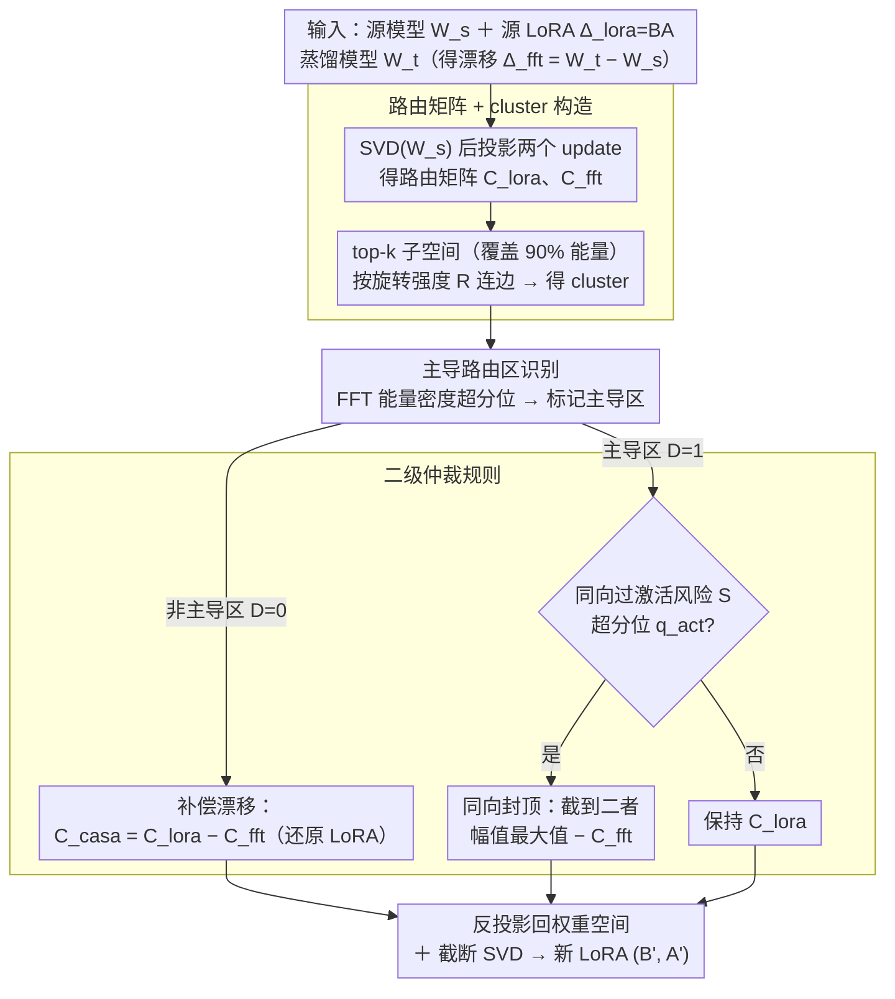

# Exploring Data-Free LoRA Transferability for Video Diffusion Models

**会议**: ICML 2026  
**arXiv**: [2605.01929](https://arxiv.org/abs/2605.01929)  
**代码**: https://github.com/Noahwangyuchen/CASA  
**领域**: 视频扩散模型 / LoRA / 参数高效迁移  
**关键词**: Video Diffusion、LoRA 迁移、SVD 奇异子空间、Spectral Routing、Data-Free

## 一句话总结
本文首次对视频扩散模型（VDM）的 full fine-tune (FFT) 和 LoRA 做权重空间分析，发现两者都"保留奇异谱、只旋转奇异子空间"，但在 head clusters 上路由方向冲突；据此提出 CASA——一个 data-free 的"按聚类做谱仲裁"的 LoRA 迁移方法，把基座 Wan2.1 上训的 LoRA 直接迁到 FastWan 等蒸馏后变体，无需任何用户数据/重训。

## 研究背景与动机

**领域现状**：Wan2.1、HunyuanVideo、Sora 等 VDM 已经能生成高保真视频，但推理巨慢；社区于是流行各种 distillation——**step distillation**（Zhang 2025 等把 50 步压到 4 步）和 **causal distillation**（把双向 attention 改成因果，让流式生成成为可能）。这些 distillation 几乎都用 full fine-tune 实现，导致 VDM 生态里出现"同根同源但权重各异"的家族。同时，LoRA 已经是社区上传/分享风格/角色控制的事实标准（HuggingFace 上有大量 Wan2.1 LoRA）。

**现有痛点**：基座上训的 LoRA 直接拿来贴到蒸馏变体上，**几乎必然炸**——要么风格丢失、要么结构崩坏（图 1）。重训成本高且需要用户数据，对真实场景（用户只有 LoRA 权重、没有训练集）不可行。已有 LoRA 迁移工作（X-Adapter、Trans-LoRA、LoRA-X、ProLoRA）要么需要数据、要么只在 LLM/图像扩散模型上验证，VDM 上几乎是空白。

**核心矛盾**：FFT 和 LoRA 都"温柔"修改基座（奇异值几乎不变），但它们在共享的奇异子空间里**走的是不同路由**；当 FFT 已经强烈调制了某条 head cluster 的功能通路后，再把 LoRA 的更新塞进去，要么"过度激活"（同向叠加爆掉），要么"互相抵消"（反向抵消失效）。

**本文目标**：(1) 给出 VDM 权重空间的"显微镜"，理解 FFT 和 LoRA 到底改了什么；(2) 解释 LoRA 直接迁移失败的根因；(3) 设计 data-free 的迁移算法把 LoRA 救回来。

**切入角度**：受 Shuttleworth 2025（LLM 上发现 LoRA 引入 intruder dimension）启发，作者也用 SVD 分析 VDM 权重，但发现 VDM 行为和 LLM 完全不同——VDM 上 head 奇异向量几乎不变、middle 出现 block-wise mixing、tail 弥散，且 LoRA **不**引入 intruder dimension，反而严格保持谱形状。这种"谱刚性"启发把更新放到 $\mathbf{C}=\mathbf{U}^\top\Delta\mathbf{V}$ 的路由矩阵视角下分析。

**核心 idea**：把 LoRA 迁移看作"在奇异子空间里做路由仲裁"——非主导区直接补偿 FFT drift 恢复 LoRA，主导区按"超阈值就截断到二者最大值"防止过激活，从而 data-free 完成迁移。

## 方法详解

### 整体框架
CASA 的输入：源模型 $\mathbf{W}_s$、源上训的 LoRA $\Delta_{\text{lora}}=\mathbf{BA}$、蒸馏目标模型 $\mathbf{W}_t$（由此得 $\Delta_{\text{fft}}=\mathbf{W}_t-\mathbf{W}_s$）。输出：可贴在目标模型上的新 LoRA $(\mathbf{B}',\mathbf{A}')$。流程逐层独立做：
(1) 对 $\mathbf{W}_s$ 做 SVD 得 $\mathbf{U}_s,\mathbf{S}_s,\mathbf{V}_s$；
(2) 把两个 update 投影到源奇异基拿到路由矩阵 $\mathbf{C}_{\text{lora}}, \mathbf{C}_{\text{fft}}$；
(3) 在 top-k（覆盖 90% 能量）子空间里建聚类；
(4) 按"是否落在主导路由区"分两种规则更新 $\mathbf{C}_{\text{casa}}$；
(5) 反投影回权重空间，低秩分解得新 LoRA。

### 关键设计

**1. 路由矩阵 + cluster 构造：把"权重 update"翻译成奇异方向之间的信息流**

要理解 LoRA 和 FFT 到底改了什么，先得把 update 放到一个能看清"哪条方向推给哪条方向"的视角。CASA 定义路由矩阵 $\mathbf{C}=\mathbf{U}_s^\top\Delta\mathbf{V}_s$，行是 receiver、列是 sender，$\mathbf{C}(i,j)$ 大就表示第 $j$ 个 sender 强烈推向第 $i$ 个 receiver。然后选最小的 $k$ 使 top-$k$ 子空间覆盖 90% 能量 $\sum_{i=1}^k\sigma_i^2/\sum_i\sigma_i^2\ge 0.9$，在其中按预测旋转强度 $\mathbf{R}(i,j)=|\mathbf{C}_{\text{lora}}(i,j)|/(|\sigma_i-\sigma_j|+\epsilon)$ 超阈值 $\tau$ 连边，连通分量即 cluster。之所以要按 $\sigma_i-\sigma_j$ 归一化，是因为作者实测 middle spectrum 出现 block-wise 混合、且与奇异值的 step-like plateau 对齐，恰好吻合 Davis-Kahan 微扰理论——奇异值差越小越容易混。这样归一化正好抓住这些"局部退化区"，让 cluster 稳定地框住真正的功能单元。

**2. 主导路由区识别：只盯 FFT 的"生成主干道"**

并非所有 cluster 的冲突都致命。作者实证发现 FFT 把路由能量高度集中在少数 head clusters（生成的主干道），而 LoRA 的能量铺得很均匀——真正会破坏生成质量的，只是这些主干道上的冲突。于是对每个 cluster $\mathcal{G}_m$ 算 FFT 的发送/接收能量密度 $\rho_m^{\text{send}}=\frac{1}{|\mathcal{G}_m|}\sum_{i\in\mathcal{G}_m}\|\mathbf{C}_{\text{fft}}(:,i)\|_2$ 与 $\rho_m^{\text{recv}}$，超过分位阈值 $q_{\text{dom}}$ 的 cluster 标为主导；路由位 $(i,j)$ 只要 $i$ 落在 receiver 主导集或 $j$ 落在 sender 主导集，就记 $\mathcal{D}(i,j)=1$。非主导区的 LoRA 注入风险小、可以放心还原，主导区才需要小心仲裁——这个划分正是后面差异化处理的前提。

**3. 二级仲裁规则（CASA 核心）：非主导区补偿漂移，主导区同向封顶**

为什么不能无差别还原 LoRA？因为作者发现 head clusters 上 LoRA 与 FFT 的方向有时强同向（叠加爆掉、过激活）、有时强反向（互相抵消、失效），没有统一方向。CASA 据此分两套规则。非主导区 $\mathcal{D}=0$ 直接补偿 FFT 漂移：$\mathbf{C}_{\text{casa}}(i,j)=\mathbf{C}_{\text{lora}}(i,j)-\mathbf{C}_{\text{fft}}(i,j)$，使最终路由 $\mathbf{C}_{\text{fft}}+\mathbf{C}_{\text{casa}}=\mathbf{C}_{\text{lora}}$ 完美恢复 LoRA。主导区 $\mathcal{D}=1$ 则先算过激活风险 $\mathbf{S}(i,j)=\mathbf{E}(i,j)\cdot\text{Context}(i,j)$，其中 $\mathbf{E}=\max(0,\mathbf{C}_{\text{lora}}\mathbf{C}_{\text{fft}})$ 只在同向时非零、$\text{Context}$ 是该 cluster 对的 cosine 相似度提供集体方向证据；风险 $\mathbf{S}$ 超分位 $q_{\text{act}}$ 就用 $\mathbf{C}_{\text{casa}}(i,j)=\max(|\mathbf{C}_{\text{lora}}|,|\mathbf{C}_{\text{fft}}|)\cdot\text{sign}(\mathbf{C}_{\text{lora}})-\mathbf{C}_{\text{fft}}$ 把恢复后的强度封顶到二者最大值，否则保持 $\mathbf{C}_{\text{lora}}$。精髓就是"只在同向高风险位封顶、其余位老老实实补 FFT 漂移"——既不冲掉生成主干道，又最大限度恢复 LoRA 风格。值得注意的是这套仲裁必须在 cluster 这一级做：把粒度降到单 entry 性能掉很多，因为 plateau 内奇异方向可互换、分开处理会破坏 cluster 内协同。

### 损失函数 / 训练策略
**无任何训练、无任何数据**。整个 CASA 是闭式权重操作：SVD → 路由投影 → cluster → 阈值仲裁 → 反投影 → 截断 SVD 回低秩 $(\mathbf{B}',\mathbf{A}')$。超参只有 $\tau,q_{\text{dom}},q_{\text{act}}$ 三个分位阈值，按 cluster/路由分布自适应取，无需调。

## 实验关键数据

### 主实验

Wan2.1-T2V-1.3B → 蒸馏变体（FastWan-1.3B / Rolling Forcing），LoRA：Steamboat-Willie & Jinx-v2：

| LoRA | Target Model | 方法 | Quality Score↑ | CSD (%)↑ |
|------|-------------|------|---------------|----------|
| Steamboat-Willie-1.3B | FastWan2.1-T2V-1.3B | Direct Reuse | 1.27 | 78.35 |
| Steamboat-Willie-1.3B | FastWan2.1-T2V-1.3B | **CASA** | **1.58** | **81.49** |
| Steamboat-Willie-1.3B | Rolling Forcing | Direct Reuse | 2.31 | 71.03 |
| Steamboat-Willie-1.3B | Rolling Forcing | **CASA** | **2.45** | — |

14B 规模（FastWan-14B、Krea Realtime）+ Film-Noir/Steamboat-Willie-14B LoRA 趋势一致，CASA 在 Quality + 风格相似度上稳定超过 Direct Reuse。

### 消融实验

| 配置 | 关键指标 | 说明 |
|------|---------|------|
| Full CASA | 最优 | 路由+主导识别+仲裁三模块齐全 |
| w/o cluster (单 entry 处理) | Quality 下降 | 失去 block-wise 协同 |
| w/o 主导识别 (统一仲裁) | 风格 CSD 暴跌 | 把 LoRA 都截断了 |
| w/o 仲裁 (主导区也直接还原) | 出 artifact | 同向叠加 → 过激活 |
| 阈值 $q_{\text{dom}}$ 改高 | 风格更强但易崩 | 越少主导区越激进 |

### 关键发现
- **VDM 谱刚性极强**：FFT 和 LoRA 的奇异值相对变化都 $\le 0.3\%$，比 LLM 上观察到的"LoRA 显著抬升 leading singular value"完全不同——这意味着 VDM 适配几乎纯靠**子空间旋转**而非能量重分配。
- **LoRA 在 VDM 上不引入 intruder dimension**：head 奇异向量保持几乎完美对角对齐，与 LLM 上 Shuttleworth 2025 报告的"低 cos 相似异常方向"形成鲜明对比；这是 VDM-LoRA 行为的关键差异点，对未来 PEFT 设计有启发。
- **FFT 和 LoRA 路由结构截然不同**：FFT 把能量集中在少数 head cluster（生成主干道），LoRA 把能量铺得很均匀；冲突只发生在 head clusters 的交集，这恰好是 CASA "选择性仲裁"成立的基础。
- **必须 cluster-level 仲裁，单 entry 不行**：作者实测把仲裁粒度从 cluster 降到 single entry，性能掉很多——因为奇异方向在 plateau 内是可互换的，分开处理会破坏 cluster 内的协同。

## 亮点与洞察
- **"谱刚性 + 子空间旋转" 框架** 是对 VDM PEFT 的一个很干净的刻画，可能成为未来 VDM 适配方法的标准分析工具；尤其是把 $\mathbf{C}=\mathbf{U}^\top\Delta\mathbf{V}$ 当成"路由矩阵"的视角，非常 portable。
- **完全 data-free** 是这篇文章最大的实用价值：从业者拿到一个 LoRA 文件 + 蒸馏模型权重就能直接转换，不需要原训练数据、不需要 GPU 训练时间，这对开源社区分发 LoRA 极有意义。
- **同向是冲突 / 反向也是冲突** 这个反直觉发现很有意思——直觉上反向才坏，但实际上 head clusters 的同向叠加同样致命（生成主干道被推过头）；CASA 把"风险"分成 magnitude × direction 两层算，逻辑清晰。

## 局限与展望
- 只验证了两类蒸馏（step / causal）+ 两个 Wan 规模（1.3B/14B），对 HunyuanVideo、CogVideoX、Sora-style 大模型未测；不同 backbone（DiT vs U-Net）下谱刚性是否仍成立未知。
- 评测指标只用 VideoAlign 的 Quality Score + CSD 风格相似度，缺乏更细粒度的 motion consistency / temporal coherence 评测；对"风格保但运动崩"的失败模式不敏感。
- 三个分位阈值虽然不需要调，但跨模型规模可能漂移；论文没给跨规模的鲁棒性曲线。
- 假设 LoRA 是低秩 BA 结构，对 DoRA / LoRA-FA / Adapter 等非纯低秩变体的兼容性未讨论。

## 相关工作与启发
- **vs ProLoRA**：ProLoRA 也是 data-free，把 LoRA 投到目标权重子空间；但 ProLoRA 没考虑路由能量分布，本质上对所有奇异方向一视同仁。CASA 引入主导区/非主导区的差异化处理，在 VDM 上明显更强。
- **vs LoRA-X**：LoRA-X 约束更新只在选定奇异方向，是"训练时"约束；CASA 是"转换时"重塑路由，无需重训，定位互补。
- **vs Shuttleworth 2025 (LLM intruder dim)**：本文恰好反例——VDM 上 LoRA **不**引入 intruder dim，说明"LoRA 行为是否引入新方向"取决于模态/架构，不是 LoRA 本身的固有性质。

## 评分
- 新颖性: ⭐⭐⭐⭐ 首次对 VDM 做完整谱+路由分析，CASA 仲裁规则设计独到
- 实验充分度: ⭐⭐⭐⭐ 两规模 × 两蒸馏类型 × 多 LoRA 已经够说服力，但缺更细粒度评测
- 写作质量: ⭐⭐⭐⭐ 分析章节循序渐进（谱刚性 → 子空间 → 路由 → 干扰），逻辑漂亮
- 价值: ⭐⭐⭐⭐⭐ data-free 真的很重要，工业部署 + 开源社区都直接受益

<!-- RELATED:START -->

## 相关论文

- [\[ICML 2026\] WorldCache: Accelerating World Models for Free via Heterogeneous Token Caching](worldcache_accelerating_world_models_for_free_via_heterogeneous_token_caching.md)
- [\[ICLR 2026\] LoRA-Edit: Controllable First-Frame-Guided Video Editing via Mask-Aware LoRA Fine-Tuning](../../ICLR2026/video_generation/lora-edit_controllable_first-frame-guided_video_editing_via_mask-aware_lora_fine.md)
- [\[ECCV 2024\] Exploring Pre-trained Text-to-Video Diffusion Models for Referring Video Object Segmentation](../../ECCV2024/video_generation/exploring_pre-trained_text-to-video_diffusion_models_for_referring_video_object_.md)
- [\[ICLR 2026\] Frame Guidance: Training-Free Guidance for Frame-Level Control in Video Diffusion Models](../../ICLR2026/video_generation/frame_guidance_training-free_guidance_for_frame-level_control_in_video_diffusion.md)
- [\[ICML 2026\] Where Concept Erasure Should Occur: Concept-Layer Alignment in Text-to-Video Diffusion Models](where_concept_erasure_should_occur_concept-layer_alignment_in_text-to-video_diff.md)

<!-- RELATED:END -->
