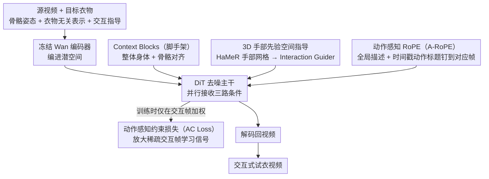

# iTryOn: Mastering Interactive Video Virtual Try-On with Spatial-Semantic Guidance

**会议**: ICML 2026  
**arXiv**: [2605.21431](https://arxiv.org/abs/2605.21431)  
**代码**: 待确认  
**领域**: 视频生成 / 虚拟试衣  
**关键词**: 交互式虚拟试衣, 视频生成, 扩散模型, 多模态条件

## 一句话总结
iTryOn 首次定义"交互式视频虚拟试衣"任务——让人在视频里**主动操作衣物**（拉拉链、提衣角、拉伸衣物）而非仅被动展示。通过**3D 手部先验**解决空间歧义、**动作感知 RoPE（A-RoPE）** 把时间戳动作标题与对应帧严格对齐、**动作感知约束损失（AC Loss）** 放大稀疏交互帧的学习信号，在自建 VVT-Interact 上 ISR（交互成功率）从基线 0.397 → 0.610（+54%）。

## 研究背景与动机

**领域现状**：虚拟试衣已从静态图像演化到视频虚拟试衣（VVT），近期方法基于扩散 Transformer（DiT）实现高保真时空一致性，能保留衣物纹理和随体动作的自然流动。

**现有痛点**：现有 VVT 方法只处理**被动穿衣场景**（人静立或自然走动展示衣物），完全忽略电商直播中的**真实交互场景**——主动拉拉链、提衣角、拉伸衣物展示弹性。这些交互承载关键消费信息但没法生成。

**核心矛盾**：两层矛盾难以调和：
- **空间矛盾**：2D 骨骼姿态缺 Z 轴深度，无法区分"手向胸口靠近以扣纽扣"（交互）vs"手放在胸口"（非交互），手部形状与方向信息丢失。
- **学习矛盾**：交互帧极稀疏（通常仅 5-10%），简单非交互帧的梯度容易压过复杂动作学习信号，模型倾向忽视物理变形。

**本文目标**：定义并解决 Interactive VVT 任务，使模型能理解"做什么交互""什么时候交互""如何物理接触"。

**切入角度**：观察到现有 VVT 缺**空间精度**（无明确手部几何）与**语义精度**（无明确动作意图与时间边界）。3D 手部先验解决"空间歧义"，时间戳动作标题解决"语义歧义"，AC Loss 放大交互帧权重。

**核心 idea**：Multi-level Interaction Injection——空间层注入 3D 手部几何、语义层注入同步动作标题、损失层放大稀疏交互帧学习。

## 方法详解

### 整体框架
iTryOn 要让视频里的人不只是被动展示衣服，而是真去拉拉链、提衣角、拉伸面料。输入是源视频 $V_{\text{src}}$、目标衣物 $G$、骨骼姿态 $V_{\text{pose}}$、衣物无关表示 $V_{\text{agn}}$ 和交互指导 $\mathcal{C}$，输出试衣视频 $\hat{V}$。整条管线先用冻结的 Wan 编码器把源视频和各类条件编进潜空间，再让 DiT 主干在去噪时**并行**接收三路条件——Context Blocks（脚手架，管整体身体与骨骼）、Interaction Guider 管 3D 手部的精细接触，语义侧注入全局描述加带时间戳的动作标题，去噪完再解码回视频。三个关键设计分别堵住三个洞：3D 手部先验补空间深度、A-RoPE 把动作标题钉到对应帧、AC Loss 把稀疏交互帧的学习信号顶起来。

### 关键设计

**1. 3D 手部先验空间指导：给 2D 骨骼补回丢失的深度**

2D 关键点投影分不清"手向胸口靠近去扣扣子"和"手只是放在胸口"，也分不清"拿捏"和"按压"这种手形差异——Z 轴深度和手指几何全丢了。iTryOn 改用 HaMeR 抽出 3D 手部网格 $V_{\text{hand}}$（点云/网格顶点），投影到特征空间后交给一个轻量的 Interaction Guider（卷积 + 自注意）处理，输出再与 DiT tokens 加性融合。之所以用 3D 网格而非深度图，是因为它完全衣物无关，不会把源视频里的衣服纹理顺带泄露进来，等于把"手怎么动"和"穿什么"这两件事干净地分开。

**2. 动作感知 RoPE（A-RoPE）：把动作标题钉死在它该出现的帧上**

一句全局 caption 太泛，描述不出"在第几秒拉了拉链"；可如果直接喂带时间戳的动作标题，描述又容易"泄漏"到没交互的帧上去。A-RoPE 的办法是在时间交叉注意里造出"虚拟时间通道"：对每个视频片段 $i$ 的 query 都施加缩放后的 1D RoPE（$\hat{Q}_i = \text{1D-RoPE}(Q_i, i \cdot k)$，保持全局时序），但只对**交互片段**对应的 action caption 的 key 施加同样的旋转（$\hat{K}_i = \text{1D-RoPE}(K_i, i \cdot k)$，$k=4$），非交互片段用空标题、不编码位置。这样注意力只在位置编码对得上的 $(i, i)$ 对上产生高权重，每个动作标题就只对它该负责的那段视频可见，描述与帧严格对齐、互不串台。

**3. 动作感知约束损失（AC Loss）：告诉模型这 10% 的帧最金贵**

交互帧通常只占 5-10%，在剩下 90% 的简单非交互帧上，优化器很容易被那些稳定好学的梯度吸走，复杂褶皱变形的稀有信号被淹没，模型干脆忽略物理交互。AC Loss 直接给损失重新加权：构造二值掩码 $\mathbb{M}_{\text{action}}$（交互帧 1、其余 0），总损失 $\mathcal{L} = \mathcal{L}_{\text{std}} + \lambda \mathbb{E}[\|\mathbb{M}_{\text{action}} \odot (\hat{v}_\theta - v)\|_2^2]$，$\lambda = 0.5$，第二项只在交互帧上惩罚。等于在标准扩散损失之外，额外给稀疏关键帧叠一道监督，把欠拟合的交互事件硬拉回学习重心。这套思路本质上把"稀疏不平衡数据"问题转成了"采样权重"问题，通用到任何含稀疏关键帧的任务。

### 训练策略
总损失为标准扩散损失加上 AC Loss 的交互帧加权项（$\lambda = 0.5$）；Wan 编码器冻结，主要训练 DiT 主干与 Interaction Guider。

## 实验关键数据

### 主实验（VVT-Interact 5292 视频，5160 训 / 132 测）

| 方法 | VFID$_I^p$ ↓ | VFID$_R^p$ ↓ | SSIM ↑ | LPIPS ↓ | FVD$^p$ ↓ | ISR$^p$ ↑ |
|------|-----------|-----------|--------|---------|---------|----------|
| ViViD | 29.83 | 1.27 | 0.726 | 0.164 | 468.5 | 0.397 |
| CatV2TON | 26.99 | 2.27 | 0.776 | 0.143 | 533.2 | 0.484 |
| MagicTryOn | 27.67 | 2.60 | 0.765 | 0.170 | 431.8 | 0.435 |
| **iTryOn** | **22.46** | **0.60** | **0.785** | **0.122** | **380.6** | **0.610** |

iTryOn 建立压倒性优势，ISR 提升 26%。

### 消融实验

| 配置 | VFID$_I^p$ ↓ | ISR$^p$ ↑ | 关键观察 |
|------|-----------|----------|---------|
| (a) 基线 | 27.12 | 0.477 | 完全无法生成交互 |
| (b) +数据 | 26.65 | 0.478 | 数据本身不够 |
| (c) +(b)+空间指导 | 24.85 | 0.517 | 3D 手部指导 |
| (d) +(c)+语义指导 | 22.76 | 0.599 | A-RoPE 动作标题 |
| (e) +(d)+AC Loss | **22.46** | **0.610** | 完整 |

### 关键发现
- 三个模块缺一不可——仅数据 / 单一 guidance 都无法显著改进。
- ISR 指标用 VLM 做"语义验证"而非仅视觉质量，承认"物理正确 vs 语义正确"的双重要求。
- ISR 0.610 表明 61% 的交互被模型正确执行（vs 基线 39.7%）。

## 亮点与洞察
- **A-RoPE 同步机制**：通过位置编码旋转区分交互 / 非交互片段，既保持全局时序连贯，又隔离局部动作描述；可迁移到其他需要时间标签精确对齐的任务。
- **3D 手部先验的几何-语义分离**：用 3D 网格避免深度图泄露源衣物几何，这种分离设计思想可推广到手 - 物体操控、人 - 工具交互等。
- **稀疏事件学习的通用框架**：AC Loss 把稀疏不平衡数据学习化为标准的采样权重问题，方法通用可应用于任何有稀疏关键帧的任务。
- **ISR 指标的创新性**：首次用 VLM 做语义验证而非仅视觉质量，对虚拟试衣评估标准升级有示范意义。

## 局限与展望
- 模型缺乏衣物语义理解（如"这件衣服有拉链"），有时对不可行的交互"哑剧"生成。
- ISR 指标能评估交互语义成功率，但难以量化细粒度物理准确性（褶皱物理、变形角度）。
- 数据集交互类别有限（仅 6 类），泛化到未见交互类型未知。
- 3D 手部先验依赖 HaMeR 抽取，对遮挡敏感；可考虑从视频直接学隐式手部表示。

## 相关工作与启发
- **vs ViViD / CatV2TON / MagicTryOn**：这些方法在非交互 VVT 上优化（时空一致性、衣物细节），但无法捕捉交互意图；iTryOn 通过多模态条件融合 + 稀疏监督重加权跨越了交互理解的根本鸿沟。
- **vs 视频编辑方向（ControlNet 等）**：编辑方法用粗粒度空间条件（边界框、骨骼）操控内容，缺时间信息与物理约束；iTryOn 的 A-RoPE + AC Loss 可启发编辑框架。
- **vs 人-物交互识别 / 理解工作**：当前 HOI 多聚焦于识别，本文首次将此问题重新框架化为**生成式问题**，为交互合成开辟新方向。

## 评分
- 新颖性: ⭐⭐⭐⭐⭐  首次定义 Interactive VVT 任务，A-RoPE 与 AC Loss 都是针对性创新。
- 实验充分度: ⭐⭐⭐⭐⭐  VVT-Interact 大规模数据集 + 3 个 baseline 对比 + 完整消融 + 定量定性并行 + ISR 新指标。
- 写作质量: ⭐⭐⭐⭐  逻辑清晰、Figure 3 对比有说服力；ISR 评估依赖 VLM，可信性需更多验证。
- 价值: ⭐⭐⭐⭐⭐  电商直播 / 内容创作前景广阔；开源数据 + 基准 + 技术组件（A-RoPE、AC Loss）可迁移。

<!-- RELATED:START -->

## 相关论文

- [\[CVPR 2026\] Vanast: Virtual Try-On with Human Image Animation via Synthetic Triplet Supervision](../../CVPR2026/video_generation/vanast_virtual_try-on_with_human_image_animation_via_synthetic_triplet_supervisi.md)
- [\[CVPR 2026\] The Devil is in the Details: Enhancing Video Virtual Try-On via Keyframe-Driven Details Injection](../../CVPR2026/video_generation/the_devil_is_in_the_details_enhancing_video_virtual_try-on_via_keyframe-driven_d.md)
- [\[ICCV 2025\] SweetTok: Semantic-Aware Spatial-Temporal Tokenizer for Compact Video Discretization](../../ICCV2025/video_generation/sweettok_semantic-aware_spatial-temporal_tokenizer_for_compact_video_discretizat.md)
- [\[CVPR 2026\] SemVideo: Reconstructs What You Watch from Brain Activity via Hierarchical Semantic Guidance](../../CVPR2026/video_generation/semvideo_reconstructs_what_you_watch_from_brain_activity_via_hierarchical_semant.md)
- [\[ICML 2026\] EPiC: Efficient Video Camera Control Learning with Precise Anchor-Video Guidance](epic_efficient_video_camera_control_learning_with_precise_anchor-video_guidance.md)

<!-- RELATED:END -->
